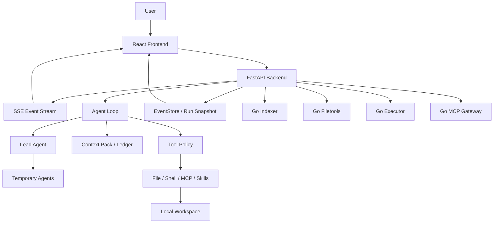

# nanoCursor

一个本地运行的 AI 编程工作台实验项目。

nanoCursor 不是 Cursor、Claude Code 或 Codex 的替代品。它更像是我把 AI 编程工具拆开以后，重新实现的一套轻量 Agent Runtime：从用户请求开始，经过意图判断、上下文选择、工具调用、失败恢复、事件追踪和交付报告，观察一个 AI 编程系统到底需要哪些工程能力。

这个项目最关心的不是“多放几个 Agent”，而是：

- 简单问题能不能由 Lead 直接回答，而不是每次都跑完整开发流程。
- 复杂任务能不能按需创建临时 Agent，并在任务结束后归档。
- 意图判断能不能结合 LLM 语义理解和确定性安全边界，而不是只靠关键词或完全相信模型。
- 上下文能不能被选择、预算、压缩和审计，而不是把完整项目和完整历史塞给模型。
- 工具调用能不能有权限、审批、证据和恢复。
- Go sidecar 能不能只放在边界清楚的确定性模块里，而不是为了技术栈占比强行重构。

<p>
  
  
  
  
  
</p>

## 目录

- [项目定位](#项目定位)
- [界面预览](#界面预览)
- [核心能力](#核心能力)
- [快速开始](#快速开始)
- [常用命令](#常用命令)
- [系统架构](#系统架构)
- [关键设计](#关键设计)
- [Benchmark](#benchmark)
- [学习站](#学习站)
- [项目边界](#项目边界)

## 项目定位

nanoCursor 打开一个本地目录后，会围绕一次代码任务完成一条可观测的运行链路：

```text
用户请求
  -> 意图判断
  -> Lead Agent 直接回答或进入 Agent Loop
  -> 选择上下文与工具策略
  -> 按需创建临时 Agent
  -> 调用文件 / Shell / MCP / Skills 工具
  -> 记录事件、Diff、测试、恢复证据
  -> 输出交付说明
```

它适合用来学习和展示 AI 编程工具背后的工程系统：Agent Loop、上下文管理、工具治理、事件流、失败恢复、MCP/Skills 和 Go sidecar。

## 界面预览

<p align="center">
  
</p>

<table>
  <tr>
    <td width="50%">
      
      <br>
      <sub>运行中：聊天区展示 Agent 动态，右侧展示任务进度和运行环境。</sub>
    </td>
    <td width="50%">
      
      <br>
      <sub>完成后：Lead 收束交付说明，避免把工具日志直接塞给用户。</sub>
    </td>
  </tr>
  <tr>
    <td width="50%">
      
      <br>
      <sub>交付物：报告、测试、风险、恢复信息可以在底部查看。</sub>
    </td>
    <td width="50%">
      
      <br>
      <sub>Diff：检查本轮任务产生的文件变更。</sub>
    </td>
  </tr>
</table>

上面的截图来自一次真实任务：用 Python 完成 LeetCode 接雨水题目的多种解法和完整测试。运行结束后，任务板 11 / 11 完成，生成 4 个文件变更，Go Indexer / Filetools / Executor / MCP Gateway 都处于已连接状态。

## 核心能力

| 模块 | 当前实现 |
|---|---|
| Agent Loop | 默认只有 Lead，复杂任务再动态创建 Planner / Coder / Tester / Reviewer 等临时 Agent |
| 意图路由 | 默认启用 LLM 语义判断，结合 hard guard 和 normalizer 区分问候、解释、只读分析、小改动、完整开发、高风险操作 |
| 上下文管理 | Project Index + Context Pack + Context Ledger，按任务选择相关文件、摘要、记忆、Skills 和 MCP 能力 |
| 上下文压缩 | 监控上下文窗口占用，支持 deterministic、summary、LLM summary 和 LLM fallback |
| 工具治理 | read-only / safe-write / risky-write / shell-safe / shell-risky 分级，高风险动作进入 approval |
| 失败恢复 | 提取失败证据、分类、生成恢复计划、创建 recovery task，并重跑验证命令 |
| 实时观测 | FastAPI + SSE 推送 Agent 活动、工具调用、任务进度、错误和交付状态 |
| Go sidecars | Indexer / Filetools / Executor / MCP Gateway 可选启用，失败时回退 Python |
| MCP / Skills | 支持预设 MCP、用户导入 Skills，并把能力注入 Agent 上下文 |
| 组件评测 | 支持 benchmark、ablation matrix 和组件必要性报告 |
| 学习站 | 独立 React 学习站，整理项目架构、源码地图、学习路径和面试表达 |

## 快速开始

### 环境要求

- Python 3.10+
- Node.js 18+
- Go 1.21+，可选，只有启用 Go sidecars 时需要
- 一个可用的 LLM Provider，或本地 Ollama

### 安装依赖

```bash
python -m venv .venv
source .venv/bin/activate
pip install -r requirements.txt

cd frontend
npm install
cd ..
```

### 配置模型

```bash
cp .env.example .env
```

按你的模型服务填写 `.env`。常见配置如下：

```bash
# OpenAI compatible
OPENAI_API_KEY=...
OPENAI_BASE_URL=https://api.openai.com/v1
OPENAI_MODEL=...

# DeepSeek
DEEPSEEK_API_KEY=...
DEEPSEEK_MODEL=deepseek-chat
DEEPSEEK_BASE_URL=https://api.deepseek.com

# Ollama
OLLAMA_BASE_URL=http://127.0.0.1:11434
OLLAMA_MODEL=qwen2.5-coder
```

意图路由默认启用 LLM 语义判断。如果你想在离线环境或调试场景退回确定性路由，可以设置：

```bash
NANOCURSOR_SEMANTIC_INTENT_MODE=disabled
# 或兼容旧开关
NANOCURSOR_SEMANTIC_INTENT_ENABLED=false
```

### 启动项目

推荐使用统一脚本：

```bash
python scripts/dev.py
```

脚本会询问是否启用 Go sidecars：

```text
Start integrated Go sidecars? Indexer/Filetools/Executor/MCP [y/N]:
```

也可以显式指定：

```bash
# Python-only
python scripts/dev.py --no-go

# 启动已接入主链路的 Go sidecars
python scripts/dev.py --with-go

# 只查看启动计划
python scripts/dev.py --with-go --dry-run
```

默认地址：

| 服务 | 地址 |
|---|---|
| Frontend | http://127.0.0.1:5173 |
| Backend | http://127.0.0.1:8100 |
| Learning Site | http://127.0.0.1:5174 |

## 常用命令

```bash
# 后端测试
pytest

# 前端状态测试 + 构建
npm --prefix frontend run check

# 学习站构建
npm --prefix learning-site run build

# 学习资料完整性检查
python learning-site/src/content/handbook/scripts/check_learning_package.py

# Go 服务 benchmark
python scripts/benchmark_go_services.py --iterations 3 --files 220

# 上下文窗口压缩 benchmark
curl -X POST http://127.0.0.1:8100/api/benchmarks/context-window/run

# 全量检查
python scripts/check_all.py
```

运行时状态接口：

```bash
curl http://127.0.0.1:8100/api/runtime/indexer/status
curl http://127.0.0.1:8100/api/runtime/filetools/status
curl http://127.0.0.1:8100/api/runtime/executor/status
curl http://127.0.0.1:8100/api/runtime/mcp/status
```

## 系统架构



一句话概括现在的分工：

```text
Python 负责 Agent 决策、上下文、策略、事件和 API。
Go 负责边界清楚、需要稳定 I/O 或进程治理的 sidecar。
```

## 关键设计

### 语义意图路由，不是纯关键词

早期版本大量依赖关键词规则，容易出现两个问题：用户说“哈喽”却生成一堆任务卡，或者用户讨论“Python 和 Java 谁更好”被误判成代码任务。现在的路由链路改成了四层：

```text
deterministic fallback -> hard guard -> LLM semantic classifier -> normalizer
```

LLM 负责理解用户真正想做什么；hard guard 负责空输入、问候、高风险、no-write 等强边界；normalizer 负责把模型输出收口成稳定的 `IntentDecision`。如果模型把明确的代码任务误判成闲聊，后端会用 deterministic hints 阻止降级；如果用户明确说“不要改代码”，模型再想写文件也会被收住。

这不是为了证明模型判断永远正确，而是让系统同时具备两种能力：语义上更自然，工程上可回退、可审计、可测试。

### Agent Loop，不是固定 DAG

nanoCursor 没有把任务写成死板的图，而是按 loop 推进：

```text
observe -> decide -> check policy -> execute or reply -> record evidence -> continue or finish
```

简单问答由 Lead 直接回答。代码修改、调试、测试和高风险操作才会进入多步执行，并按需创建临时 Agent。

### Context Pack 与 Context Ledger

每次运行不会注入完整历史，而是组装一个任务级上下文包：

- 当前用户请求
- 会话摘要和执行摘要
- Project Index 选出的相关文件
- 最近变更和 Diff
- 用户偏好和记忆
- Skills / MCP 能力
- 当前任务计划与验收标准

Context Ledger 会继续记录各部分 token 占用、优先级、是否可压缩，以及当前模型窗口使用率。目标不是“上下文越多越好”，而是让模型看到足够相关的信息，并且知道什么时候该压缩。

### Context Window Budget

长会话和复杂任务里，真正麻烦的不是“能不能多塞一点上下文”，而是系统是否知道自己快塞爆了。

nanoCursor 会在运行前生成 Context Ledger。达到阈值后，运行时会自动压缩低优先级历史和工具输出，同时保留当前用户请求、当前计划和工具策略。

压缩路径：

| 策略 | 说明 |
|---|---|
| deterministic | 不调用模型，适合 CI、离线和兜底 |
| summary | 把低优先级 section 合并成 `compacted_summary` |
| LLM summary | 调用当前 LLM provider 生成更自然的摘要 |
| LLM fallback | LLM 不可用时自动降级，不中断当前任务 |

### Tool Policy

工具调用会先过权限分级：

| 级别 | 例子 |
|---|---|
| `read_only` | 读文件、列目录、项目索引 |
| `safe_write` | 工作区内写文件、局部编辑 |
| `risky_write` | 删除、移动、大范围替换 |
| `shell_safe` | pytest、lint、ls、cat |
| `shell_risky` | 安装依赖、网络请求、Git 写操作 |
| `mcp_read` / `mcp_write` | MCP 工具读写外部系统 |

高风险动作进入 approval。文件写入会留下备份、Diff、evidence 和恢复入口。

### Failure Recovery

失败恢复不是简单“再试一次”：

```text
失败命令 / 工具事件
  -> 结构化证据
  -> 失败分类
  -> 恢复计划
  -> 受控 Coder recovery task
  -> 重跑验证命令
  -> 成功则推进原始失败任务
```

验证失败时会生成下一轮恢复计划，但不会无限自动修复。

### Go sidecars

当前推荐启用的 Go sidecars：

| Service | 作用 | 策略 |
|---|---|---|
| `indexer` | 项目扫描、入口文件、测试、配置和源码摘要 | 可启用，失败回退 Python |
| `filetools` | 文件读取、写入、编辑、备份、回滚 | 可启用，失败回退 Python |
| `executor` | 命令执行、取消、超时、事件治理 | 可启用，智能分流 |
| `mcp` | MCP server 生命周期、工具发现、stdio 调用边界 | 可启用，失败回退 Python |

仓库里还有 eventstore、policy、taskboard、cron 等 Go 实验服务。它们暂时不默认启用，因为还没有进入当前收益最高、风险最低的主链路。

## Benchmark

### Context Window Pressure

这个 benchmark 构造一个超长上下文，验证压缩策略是否能降低 token 并保留关键锚点。

```bash
curl -X POST http://127.0.0.1:8100/api/benchmarks/context-window/run
```

一组本地结果：

| Variant | Tokens | Reduction | Status | Anchor preserved |
|---|---:|---:|---|---:|
| 无压缩 | 10500 | 0% | emergency | 100% |
| deterministic | 6480 | 38% | watch | 100% |
| summary | 3618 | 66% | ok | 100% |
| LLM summary | 3613 | 66% | ok | 100% |
| LLM fallback | 3618 | 66% | ok | 100% |

这组数字不是为了证明 nanoCursor 比成熟工具强，而是说明系统已经能回答一个关键工程问题：当上下文快溢出时，哪些内容被压缩、哪些内容被保留、压缩后是否还能继续执行。

### Component Ablation

消融评测用于回答“这个模块是不是真的有用”。

```bash
curl http://127.0.0.1:8100/api/evals/ablation/components

curl -X POST http://127.0.0.1:8100/api/evals/ablation/suites \
  -H "Content-Type: application/json" \
  -d '{
    "eval_ids": [
      "context_pack_target_file",
      "failure_recovery_pytest_repair",
      "go_sidecar_filetools_batch"
    ],
    "components": ["context_pack", "project_index", "failure_recovery", "go_sidecars"],
    "mode": "agent"
  }'
```

当前轻量消融可以覆盖上下文命中、失败恢复和 Go sidecar 三类能力。报告会展示 baseline 与单组件关闭后的分数差异；没有证据的组件不会被包装成“有效”。

## 学习站

如果你想真正吃透这个项目，可以打开学习站：

```bash
cd learning-site
npm install
npm run dev
```

学习资料在：

```text
learning-site/src/content/handbook/
```

它不是普通说明书，而是按学习路线整理的项目手册：请求生命周期、Agent Loop、上下文管理、记忆机制、工具治理、MCP/Skills、Go sidecar、测试质量、启动配置和面试表达。

## 项目结构

```text
nanoCursor/
  frontend/                     主产品前端
  learning-site/                学习站和 Markdown 学习资料
  src/
    api/                        FastAPI routes 和服务层
    agent/                      Agent 工具和运行入口
    runtime/                    task board、command runner、运行边界
    tools/                      文件、shell、git、memory 等工具
    infra/                      配置、日志、路径防护、LLM 配置
  go-services/
    indexer/                    Go 项目索引 sidecar
    filetools/                  Go 文件工具 sidecar
    executor/                   Go 命令执行 sidecar
    mcp/                        Go MCP Gateway
  scripts/                      启动、检查、benchmark 脚本
  tests/                        Python 后端测试
  images/                       README 截图
```

## 为什么这个项目值得看

如果只看“能不能写代码”，它当然比不过 Codex、Claude Code、Cursor 这些成熟工具。

但作为个人项目，它有几个值得讲的点：

- 它不是只做聊天框，而是在做一个可观察、可恢复、可评估的 Agent Runtime。
- 它没有把多 Agent 当噱头，而是把“该少的时候少，该分工的时候分工”做进了路由和任务板。
- 它把上下文管理、工具治理、失败恢复、MCP/Skills、Go sidecars 这些工程问题都落到了代码里。
- 它保留了 benchmark 和消融入口，能开始回答“这个模块是不是真的有用”。
- 它有独立学习站，方便把项目从“我让模型写了很多代码”变成“我能理解并讲清楚每个模块”。

## 项目边界

这个项目已经不是简单 demo，但也还不是商业级产品：

- 真实代码能力仍依赖底层模型。
- 前端体验能支撑演示和使用，但细节仍然比成熟工具粗糙。
- MCP / Skills 已有框架，但生态兼容性还没有成熟工具完整。
- Go sidecars 要坚持“适合才迁移”，不能为了占比把系统变重。
- 消融评测已经能覆盖核心组件，但还不是完整评测平台。
- 当前安全模型主要面向单机本地工具，不是多用户 SaaS。

## License

MIT
