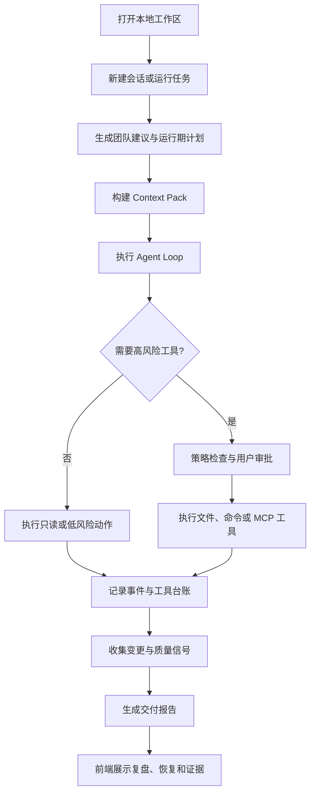

# nanoCursor

> 本地优先的 AI Coding Agent 工作台原型，用来探索多 Agent 编排、工具审批审计、工作区隔离、MCP/Skill 扩展和可恢复运行机制。

nanoCursor 不是 Claude Code、Codex 或 Cursor 的替代品。它更适合作为一个完整的个人工程作品：把 AI Coding Agent 背后的运行状态、工具安全、交付证据、恢复机制和前后端工作台做成一个可运行、可测试、可展示的系统原型。

## 项目定位

nanoCursor 关注的问题不是“再造一个代码生成聊天框”，而是：

- 用户打开一个本地项目目录后，运行数据如何和源码目录隔离。
- 一次 AI 编程任务如何拆成计划、执行、验证、交付和复盘。
- 文件写入、命令执行、MCP 调用等高风险动作如何审批、审计和回滚。
- Run 事件、工具调用、变更集、交付报告、失败恢复如何形成可追踪证据。
- MCP server、Skills、自定义 Agent 能力如何接入一个本地工作台。
- 一个个人项目如何通过 pytest、API smoke、backend audit 和前端检查保持可维护。

## 当前状态

项目处于作品化收束阶段。核心后端能力、前端工作台、MCP/Skill 配置、工具审批、交付报告、恢复中心和接口检查已经具备雏形；后续重点是稳定性、文档、演示流程和 GitHub 展示。

建议用下面的命令确认当前本地状态：

```bash
python scripts/check_all.py
```

`check_all.py` 会依次运行：

- Python 编译检查
- pytest 后端测试
- 后端路由审计
- API smoke 测试
- 前端语法检查

GitHub Actions 已配置同样的检查链路，推送或提交 PR 时会自动运行。

## 快速开始

### 1. 安装依赖

```bash
# Python，建议 3.10+
pip install -r requirements.txt

# 前端
cd frontend
npm install
```

### 2. 配置环境变量

```bash
cp .env.example .env
```

按需配置任一模型供应商：

| 供应商 | 环境变量 |
| --- | --- |
| Anthropic | `ANTHROPIC_API_KEY` |
| DeepSeek | `DEEPSEEK_API_KEY` |
| MiniMax | `MINIMAX_API_KEY` |
| OpenAI | `OPENAI_API_KEY` |
| Ollama | `OLLAMA_BASE_URL` |

### 3. 环境诊断

```bash
python scripts/doctor.py
# 或检查指定工作区
python scripts/doctor.py --workspace-dir /path/to/your/project
```

该脚本会检查 Python、Node、npm、依赖、`.env`、LLM 配置、Git、端口、Playwright、工作区可写性和工作区内的 MCP 配置。

### 4. 启动开发环境

```bash
python scripts/dev.py
```

也可以分别启动：

```bash
# 后端: http://127.0.0.1:8100
python scripts/dev_backend.py

# 前端: http://127.0.0.1:5173
python scripts/dev_frontend.py
```

打开 `http://127.0.0.1:5173` 使用前端工作台。

## 核心能力

- **工作区隔离**：用户项目、运行数据、checkpoint、trash、eval workspace 和配置文件按 workspace 隔离。
- **多 Agent 编排原型**：支持团队推荐、运行期计划事件、临时子 Agent 建议和会话级团队配置。
- **工具审批与审计**：`write_file`、`delete_file`、`run_command`、`mcp_call` 等高风险动作走统一 check、approve、execute、audit 流程。
- **可恢复运行记录**：Run session、events、tool ledger、changeset、delivery、failures、audit 和 artifacts 持久化到 `.nanocursor/`。
- **MCP/Skill 扩展**：扫描 MCP 配置，支持 stdio MCP tools/list 与 tools/call，提供工具缓存、失败熔断和 Skill 导入。
- **交付证据链**：交付报告、质量分、traceability、diff、任务卡和恢复建议能在前端工作台查看。
- **工程检查**：通过 pytest、API smoke、backend audit、frontend check 降低接口漂移和回归风险。

## 系统流程



## 数据目录

用户打开的项目目录下会生成 `.nanocursor/`：

```text
<workspace>/.nanocursor/
  workspace.json
  settings.json
  runs/<thread_id>/
    session.json
    events.jsonl
    tools.jsonl
    steps.json
    approvals/
    changes.json
    delivery.json
    delivery.md
    failures.json
    audit.jsonl
    ephemeral_agents.json
    ephemeral_agent_events.jsonl
  checkpoints/
  trash/
  skills/
  evals/
```

## 项目结构

```text
nanoCursor/
  api_server.py                 # FastAPI 后端入口和兼容路由
  cli.py                        # CLI 入口
  frontend/                     # Vanilla JS 前端工作台
  src/
    agent/                      # Agent loop、prompt、策略
    api/
      app.py                    # FastAPI 应用工厂
      models.py                 # Pydantic 请求/响应模型
      routes/                   # 模块化 API 路由
      services/                 # 工作区、MCP、运行、审批等服务层
    infra/                      # 配置、日志、路径 guard
    runtime/                    # 状态机、事件、台账、变更、交付、审计
    tools/                      # 文件、bash、git、memory、project、todo 工具
  tests/                        # pytest 测试
  evals/                        # 评测任务和 fixture workspace
  scripts/                      # doctor、dev、check_all、backend_audit、api_smoke
  docs/                         # 面向 GitHub 的核心文档
```

## 常用命令

```bash
# 全量检查
python scripts/check_all.py

# 后端测试
pytest -q

# 后端路由审计
python scripts/backend_audit.py

# API smoke
python scripts/api_smoke.py

# 前端检查
cd frontend && npm run check
```

## 文档

- [长期开发路线](docs/nanoCursor个人项目长期开发路线.md)
- [架构说明](docs/architecture.md)
- [安全与审计设计](docs/security-and-audit.md)
- [演示脚本](docs/demo-script.md)
- [API 契约](docs/api-contract.md)
- [事件契约](docs/event-contract.md)
- [运行状态契约](docs/run-state-contract.md)

## 当前边界

- 单机单用户，没有认证和多租户设计。
- 不是成熟 AI 编程工具，不承诺替代 Claude Code、Codex 或 Cursor。
- 前端使用 Vanilla JS，适合展示工作台原型，不追求大型前端工程复杂度。
- 真实 Agent 执行能力仍以安全可控和可展示为优先，不追求长期自治。
- Windows 路径做了兼容性修正，但仍建议在 macOS/Linux 下优先开发和演示。

## License

MIT
