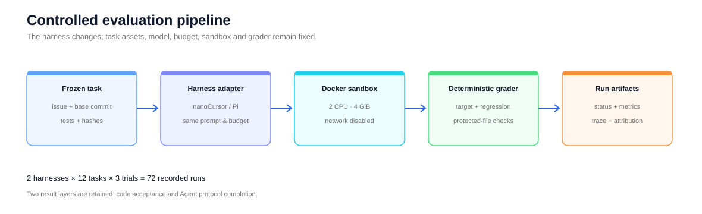
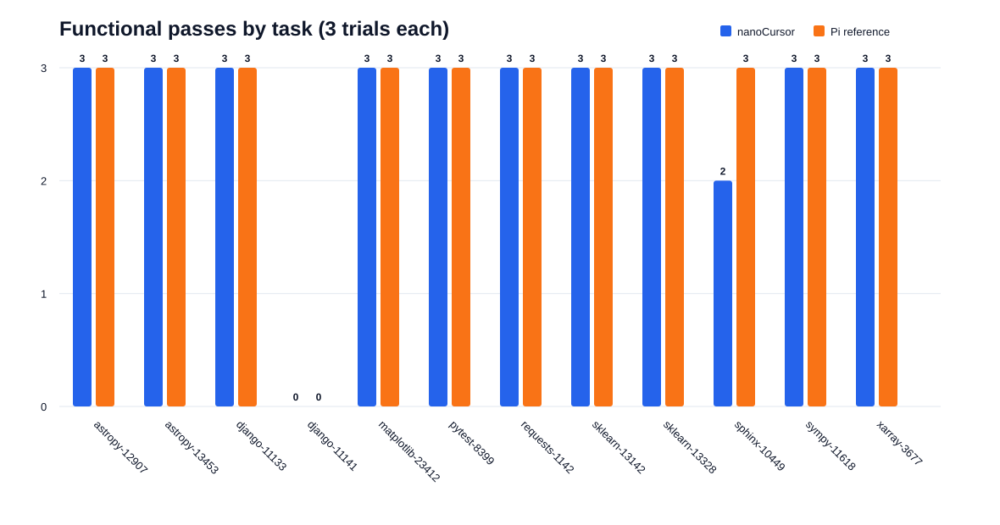
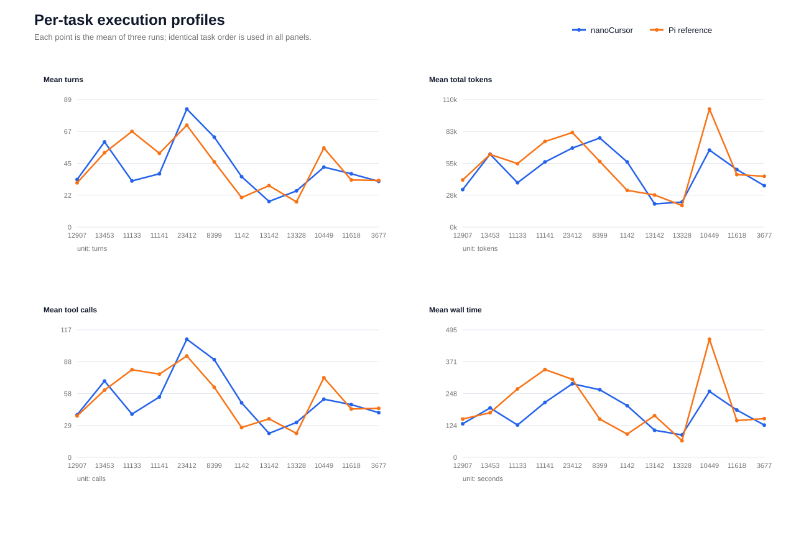
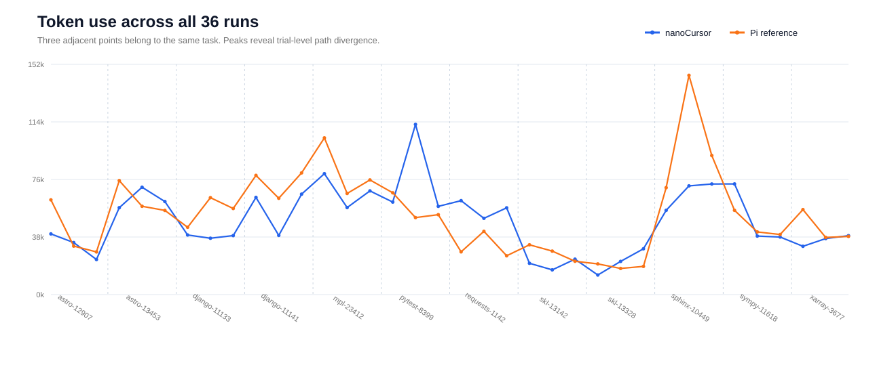

# nanoCursor

这是我写的一个终端 Coding Agent。把它放进一个代码仓库后，它可以自己查找文件、阅读代码、修改实现、运行测试，并根据报错继续调整。项目使用 Python 开发，包含流式模型调用、工具执行、上下文压缩、会话恢复、权限控制和多 Agent 协作。

项目最开始只有 Agent 本体。真正拿它跑代码任务以后，我遇到了一个很现实的问题：Agent 说“已经完成”，不代表代码真的修好了。有时测试没跑全，有时改好了代码却没来得及正常结束，还有时失败来自环境或判分脚本，而不是 Agent 本身。

所以后来又做了 AgentEval。它把代码任务放进 Docker 中运行，在 Agent 结束后单独检查目标测试、回归测试和受保护文件，同时记录每次运行的 Turns、Token、工具调用和耗时。这样既能看最后有没有修好，也能回头分析中间发生了什么。

## 现在包含哪些内容

- 一个可以直接在终端使用的 Coding Agent；
- Bash、搜索、文件读写和代码编辑等工具；
- 会话恢复、上下文压缩、Hook、权限检查和多 Agent 协作；
- 用 TypeScript 编写的 AgentEval，包括任务清单、Docker 沙箱、运行记录和自动验收；
- 72 次脱敏实验记录、Bad Case 分析和可以重新生成的图表。

仓库里的 Agent 和评测工具是两套独立的代码。Agent 负责做题，评测工具负责准备环境和判分，Agent 看不到隐藏的验收结果。



## 我是怎么测的

我从 SWE-bench 里选了 12 个 Python 仓库的真实 Issue，涉及 Astropy、Django、Matplotlib、pytest、Requests、scikit-learn、Sphinx、SymPy 和 Xarray。

nanoCursor 和 Pi 使用同一个 DeepSeek 模型，拿到相同的任务描述、system prompt、工具和运行预算，也在相同的 Docker 环境里接受同一套测试。每个任务各跑 3 次：

```text
12 个任务 × 2 套 Agent harness × 3 次 = 72 次运行
```

我分别记录了两种结果。第一种是代码有没有通过测试，第二种是 Agent 有没有在限制内正常结束。之所以分开，是因为有一次 nanoCursor 已经通过所有代码测试，却在第 96 turn 用完预算，没有输出最后的总结。它的代码是对的，但运行流程没有完整结束。

## 跑出来的结果

| 指标 | nanoCursor | Pi 参考组 |
|---|---:|---:|
| 内容验收通过 | 32/36（88.9%） | 33/36（91.7%） |
| 正常完成协议 | 31/36（86.1%） | 33/36（91.7%） |
| 总 Token | 1,760,888 | 1,926,021 |
| 工具调用 | 1,946 | 1,982 |
| 运行总耗时 | 6,499.2 s | 7,341.7 s |

从代码结果看，nanoCursor 通过了 32/36 次，Pi 通过了 33/36 次。按照同一任务和第几次运行进行对照，两边有 35/36 次的结果相同。

这不能证明两套 Agent 完全一样，但至少在这批任务里，没有看到 nanoCursor 大面积落后的情况。下面这张图把每道题的三次结果展开了。Django `11141` 是双方都没有通过，Sphinx `10449` 是唯一出现通过次数差异的任务。



## 比通过率更值得看的现象

首先，两边最后的通过率很接近，走过的过程却不一定接近。按题目计算，nanoCursor 相对 Pi 的 Token 差异从 `-34.8%` 到 `+77.5%`，说明只看一个总平均数会掩盖很多东西。

其次，同一个任务连续跑三次，消耗也可能差很多。nanoCursor 在 sklearn `13328` 上，最高一次 Token 是最低一次的 `2.34` 倍；Pi 在 astropy `12907` 上也达到了 `2.22` 倍。因此这里没有拿某一道题的单次结果代表 Agent 水平。

最稳定的失败出现在 Django `11141`。nanoCursor、Pi 以及另一组模型实验都漏掉了同一个空 namespace 边界，9 次实验得到同一种失败。这更像是模型对任务语义的理解出了偏差，而不是某一套 harness 的工具坏了。

最后，总体上 nanoCursor 比 Pi 少用了 `8.6%` Token、少花了 `11.5%` 时间，但不同题目的方向并不一致，所以我不把它写成“nanoCursor 更高效”。目前能确定的，只是两套 Agent 的执行过程确实存在差异。





完整的 12 张图、72 条运行记录和复算方法在[实验结果](evaluation/results/README.md)中；几个失败案例具体错在什么地方，单独写在 [Bad Case 分析](evaluation/results/CAUSAL_ANALYSIS.md)里。这里的数字不是 SWE-bench 官方榜单成绩，也不能代表其他模型或更多任务上的表现。

## 快速开始

要求 Python 3.11 或更高版本，推荐使用 [uv](https://docs.astral.sh/uv/)。

```bash
git clone git@github.com:MagicalLiHua/nanoCursor.git
cd nanoCursor
uv sync
mkdir -p .nanocursor
cp .nanocursor/config.yaml.example .nanocursor/config.yaml
```

通过环境变量提供模型密钥，不要把密钥写入仓库：

```bash
export OPENAI_API_KEY="your-api-key"
uv run nanocursor
```

配置样例使用 OpenAI 兼容接口，可在 `.nanocursor/config.yaml` 中调整 `base_url`、模型名称和上下文参数。

## 运行测试

```bash
uv run pytest -q
```

当前 Python 测试基线为 573 passed、1 skipped。测试覆盖核心 Agent 循环、工具执行、Hook、权限、团队协作、MCP、Skills、上下文和评测适配器。

## AgentEval

AgentEval 位于 `evaluation/agent-eval-lab/`，使用 TypeScript 实现任务清单冻结、Docker 沙箱、运行编排、轨迹记录和确定性验收。

```bash
cd evaluation/agent-eval-lab
npm install
npm run check
npm test
npm run cli -- issue-list
```

真实模型实验需要自行提供模型 API 和可用 Docker 环境。公开仓库不包含完整模型对话、原始轨迹或密钥，只提供核验统计结论所需的脱敏字段。

## 仓库结构

```text
nanocursor/                         Python Coding Agent
tests/                              Agent 单元与集成测试
evaluation/agent-eval-lab/          TypeScript 评测工具
evaluation/results/data/            脱敏逐次结果与审计证据
evaluation/results/manifests/       冻结任务清单
evaluation/results/figures/         可复算 SVG 图表
evaluation/analysis/                数据导出与绘图脚本
```

## 版本说明

`v3.0.0` 是当前 Agent + Evaluation 版本。旧版工程保留在 `legacy-v2.0.0` 标签中，主分支不再维护旧版架构。

## License

项目代码使用 [MIT License](LICENSE)。第三方组件及其许可证见 [THIRD_PARTY_NOTICES.md](THIRD_PARTY_NOTICES.md)。
