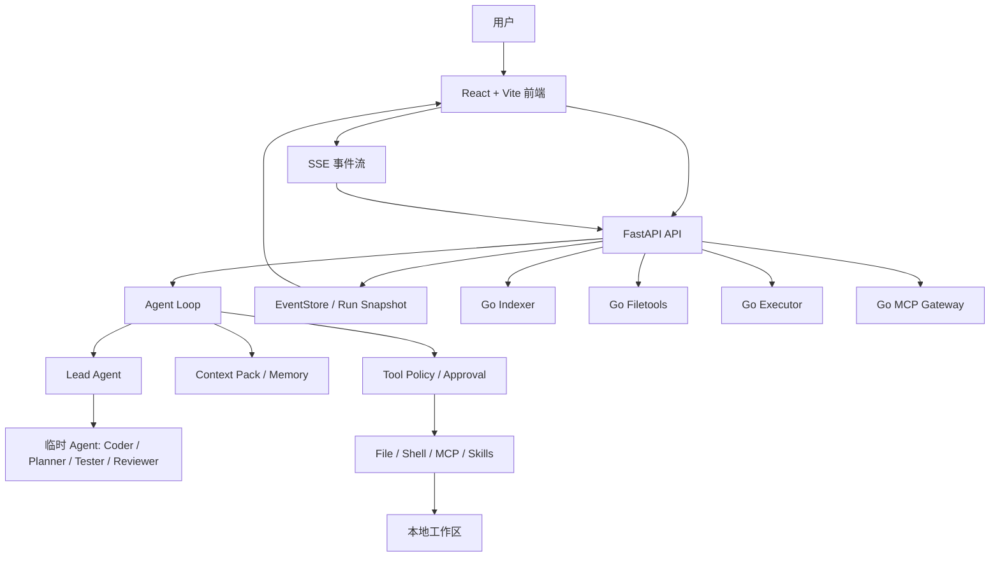

# nanoCursor

一个本地运行的 AI 编程工作台原型。

我做它不是想替代 Codex、Cursor 或 Claude Code，而是想把 AI 编程工具背后那些平时看不见的东西拆开：Agent 怎么决定下一步，工具调用怎么管，文件修改怎么留证据，上下文怎么选，失败以后怎么恢复。

现在它已经能打开一个本地项目目录，围绕一次代码任务完成读取、修改、测试、Diff、报告和运行追踪。它还不是商业级产品，但已经不是简单 Demo。


## 现在能做什么

- 打开一个本地工作目录，并把会话、任务和运行记录绑定到这个目录。
- 默认只启动 Lead Agent，由 Lead 判断任务复杂度，再决定是否创建临时 Coder、Planner、Tester、Reviewer。
- 用 FastAPI + SSE 把 Agent 活动、工具调用、审批、Diff、测试和报告实时推到前端。
- 为工作区建立项目索引，给模型注入更小、更相关的 Context Pack。
- 对工具调用做权限分级：读文件、安全写入、高风险写入、安全 shell、高风险 shell、MCP 调用。
- 文件修改带路径防护、备份、回滚、Diff 和 evidence。
- 支持 MCP presets、自定义 Skills 和 Go sidecar 状态展示。
- 对 Go/Python 重叠模块做 benchmark，不把 Go 包装成万能加速器。

## 一次真实任务

下面这组图来自一次真实前端运行，不是静态 mock。

任务是：

```text
用python完成leetcode题目接雨水，用多种解法实现并做完整测试
```

运行中可以看到右侧任务进度和四个 Go sidecar 的状态：


完成后，聊天区保留 Lead 和子 Agent 的过程，右侧展示任务、环境和质量状态：


底部面板可以查看报告和 Diff：


这次真实任务跑出来的结果：

- run 状态：completed
- 任务进度：11 / 11 完成
- 文件变更：4 个文件
- Go sidecar：Indexer / Filetools / Executor / MCP Gateway 均已连接
- 前端控制台：未发现 error / warning

也暴露了一个真实问题：模型最终回复还有过程碎片，报告的表达不够干净。这个项目后续更值得打磨的是运行质量和收束表达，而不是继续堆功能。

## 架构思路

nanoCursor 的核心不是“多 Agent 越多越好”，而是让 Agent 少的时候能少，多的时候有边界。



我现在比较认可的边界是：

```text
Python 决定做什么。
Go 负责确定性执行边界。
```

Python 适合做 Agent Loop、上下文、记忆、策略和业务编排。Go 更适合做项目索引、进程管理、命令执行边界、MCP stdio 管理、文件工具的安全封装。

## 关键模块

### Agent Loop

一次运行不是固定 DAG，而是一轮一轮地观察、决策、执行和收束。

大致过程是：

```text
observe -> decide -> check policy -> execute tool or reply -> record evidence -> continue or finish
```

简单问答可以只由 Lead 直接回答。代码任务才会进入文件读取、修改、测试、报告这些阶段。

### Context Pack

系统不会把完整历史一股脑塞给模型，而是围绕当前任务选择：

- 用户当前请求
- 会话摘要
- 当前执行计划和任务状态
- 项目索引结果
- 相关文件片段
- 最近变更
- 用户偏好和 Skills
- MCP 可用工具

目标是让模型看到足够的信息，但不要被无关历史淹没。

### Tool Policy

工具调用按风险分级：

| Level | Examples |
|---|---|
| `read_only` | 读文件、列目录、项目索引 |
| `safe_write` | 工作区内写文件、局部编辑 |
| `risky_write` | 删除、移动、大范围替换 |
| `shell_safe` | pytest、lint、ls、cat |
| `shell_risky` | 安装依赖、网络请求、Git 写操作、删除文件 |
| `mcp_read` / `mcp_write` | MCP 工具读取或产生外部副作用 |

高风险动作会进入 approval。文件写入会留下备份、Diff 和 evidence，方便回看和回滚。

### Go Sidecars

当前真正接入主链路的 Go 服务有四个：

| Service | Status | Role |
|---|---|---|
| `go-services/indexer` | 默认启用，失败回退 Python | 项目扫描、符号索引、入口/测试/配置摘要 |
| `go-services/filetools` | 默认启用，失败回退 Python | 文件读写、编辑、备份、回滚、evidence |
| `go-services/executor` | 可选启用，智能分流 | 长命令、测试命令、可取消命令、命令事件治理 |
| `go-services/mcp` | 可选启用，失败回退 Python stdio | MCP Server 生命周期、工具发现、调用边界 |

没有默认启用的 Go 服务：

- `eventstore`：状态核心，迁移风险大。
- `policy`：和 Agent 决策、审批、上下文耦合深。
- `taskboard`：和前端/Agent Loop 状态耦合深。
- `cron`：功能独立，不是 AI 编程主链路瓶颈。


## Go/Python Benchmark

最近一次基准测试：

```bash
python scripts/benchmark_go_services.py \
  --iterations 3 \
  --files 220 \
  --output-json docs/benchmarks/go-python-latest.json \
  --output-markdown docs/benchmarks/go-python-latest.md
```

结果如下：

| Service | Case | Python avg | Go avg | Python/Go ratio |
|---|---:|---:|---:|---:|
| indexer | full project scan | 38.19 ms | 11.81 ms | 3.23x |
| executor | short_command | 12.84 ms | 45.54 ms | 0.28x |
| executor | test_command | 182.23 ms | 185.28 ms | 0.98x |
| executor | long_running | 223.76 ms | 274.33 ms | 0.82x |
| filetools | small_ops | 4.24 ms | 9.44 ms | 0.45x |
| filetools | large_read_write | 1.96 ms | 13.0 ms | 0.15x |


我的结论是：

- Go indexer 值得默认接入，项目扫描这种任务收益明显。
- Go executor 不适合替代所有短命令，更适合测试、构建、取消、事件流和隔离。
- Go filetools 的价值不是小文件性能，而是路径安全、备份回滚、跨进程边界和 evidence。
- Go MCP gateway 的价值是管理外部 MCP 进程和 stdio，而不是让 Python 完全退出。

## 快速开始

### 环境要求

- Python 3.10+
- Node.js 18+
- Go 1.21+
- 一个可用的 LLM Provider，或者本地 Ollama

### 安装依赖

```bash
python -m venv .venv
source .venv/bin/activate
pip install -r requirements.txt

cd frontend
npm install
cd ..
```

### 配置模型

```bash
cp .env.example .env
```

按需配置一种模型：

```bash
# OpenAI compatible
OPENAI_API_KEY=...
OPENAI_BASE_URL=https://api.openai.com/v1
OPENAI_MODEL=...

# Anthropic
ANTHROPIC_API_KEY=...
ANTHROPIC_MODEL=...

# DeepSeek
DEEPSEEK_API_KEY=...
DEEPSEEK_MODEL=...

# Ollama
OLLAMA_BASE_URL=http://127.0.0.1:11434
OLLAMA_MODEL=qwen2.5-coder
```

字段以 `.env.example` 和 `src/infra/llm_config.py` 为准。

### 启动前后端

只启动 Python 后端和前端：

```bash
python scripts/dev.py
```

启动前后端，并拉起当前推荐接入的 Go sidecars：

```bash
python scripts/dev.py --with-go-indexer --with-go-filetools --with-go-runtime
```

`--with-go-runtime` 目前会启动：

- Go executor: `127.0.0.1:50055`
- Go MCP gateway: `127.0.0.1:50056`

默认地址：

- Frontend: `http://127.0.0.1:5173`
- Backend: `http://127.0.0.1:8100`

### 检查运行状态

```bash
curl http://127.0.0.1:8100/api/runtime/indexer/status
curl http://127.0.0.1:8100/api/runtime/filetools/status
curl http://127.0.0.1:8100/api/runtime/executor/status
curl http://127.0.0.1:8100/api/runtime/mcp/status
```

如果 Go 服务没启动，indexer/filetools 会回退 Python。executor 和 MCP gateway 默认也是可回退设计。

## 开发命令

```bash
# 后端重点测试
pytest tests/test_command_runner.py tests/test_executor_routing.py tests/test_go_executor_status.py tests/test_go_mcp_gateway_status.py -q

# 前端状态测试和构建
npm --prefix frontend run check

# Go/Python benchmark
python scripts/benchmark_go_services.py --iterations 3 --files 220

# 完整检查
python scripts/check_all.py
```

## 项目结构

```text
nanoCursor/
  frontend/                  React + Vite 前端
  src/
    api/                     FastAPI routes 和服务层
    agent/                   Agent runtime、上下文、skills
    indexer/                 Python 项目索引与 Go indexer client
    memory/                  会话记忆和偏好
    runtime/                 command runner、executor/MCP client、feature flags
    tasks/                   run-scoped task board
    tools/                   文件、shell、恢复、MCP 等工具
  go-services/
    indexer/                 Go 项目索引 sidecar
    filetools/               Go 文件工具 sidecar
    executor/                Go 命令执行 sidecar
    mcp/                     Go MCP gateway
    eventstore/ policy/ taskboard/ cron/
                              实验服务，暂不作为主链路默认能力
  scripts/                   启动、benchmark、smoke test
  tests/                     后端测试
  docs/                      设计文档、benchmark、学习资料
  images/                    README 截图
```

## 关于我给它的介绍

更准确的说法是：

> nanoCursor 是一个本地 AI 编程工作台原型。它重点探索 Agent Loop、上下文管理、工具权限治理、运行可观测和 Go sidecar 执行边界，而不是简单套一个聊天 UI。

它的亮点不是“我也做了一个 Cursor”，而是：

- 能讲清楚 Agent 为什么需要少量动态协作，而不是固定多角色流水线。
- 能讲清楚上下文不是越多越好，而是要选择、压缩、记录取舍。
- 能讲清楚工具调用必须有权限、审批、证据和恢复。
- 能讲清楚 Python 和 Go 在 Agent 系统里的合理分工。
- 能拿真实 benchmark 说明哪些 Go 服务值得接，哪些不应该为了占比硬迁移。

## 当前不足

这个项目还在个人原型阶段，目前最明显的不足是：

- 最终报告有时会夹带过程碎片，需要更好的收束和摘要。
- Agent Loop 在复杂任务里仍可能过度尝试，需要更强的停止条件和失败归因。
- MCP/Skills 已有配置和状态入口，但距离成熟工具生态还有距离。
- 前端已经能用，但部分细节还不如成熟 AI 编程工具自然。

我会继续优先修真实任务暴露的问题。

## License

MIT
