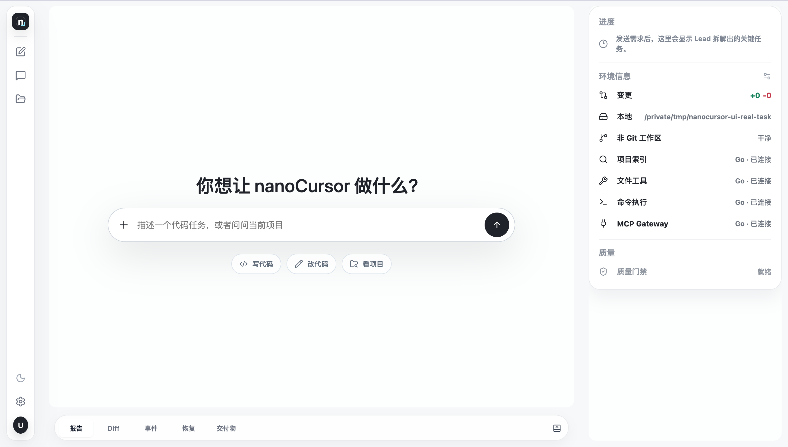
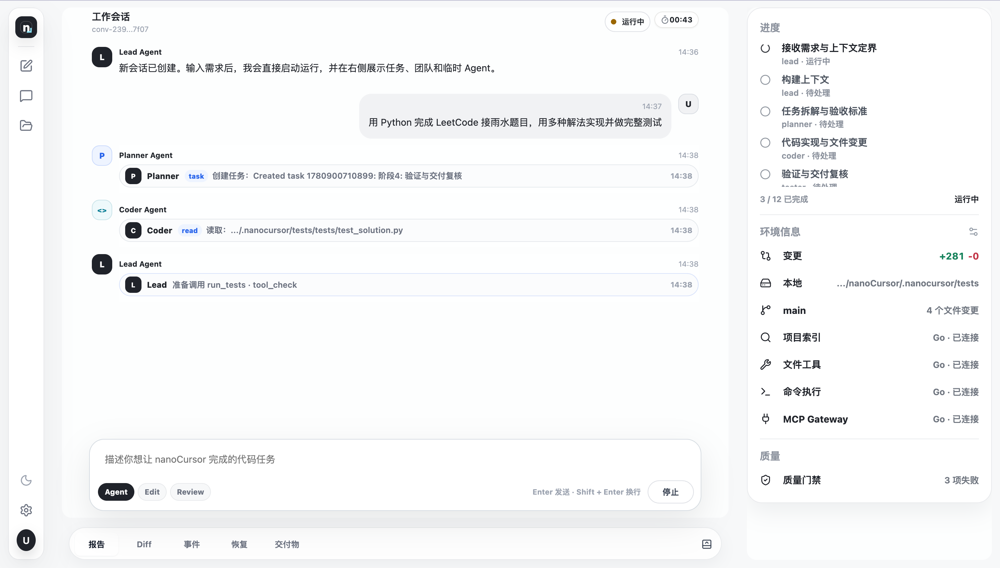
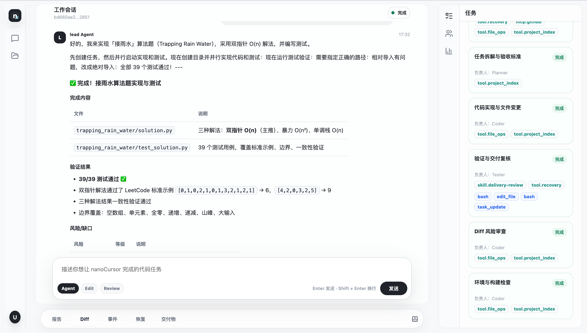
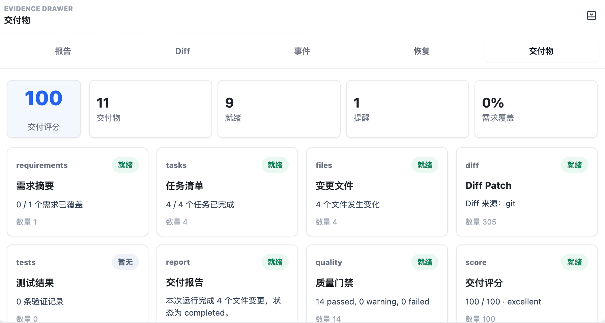
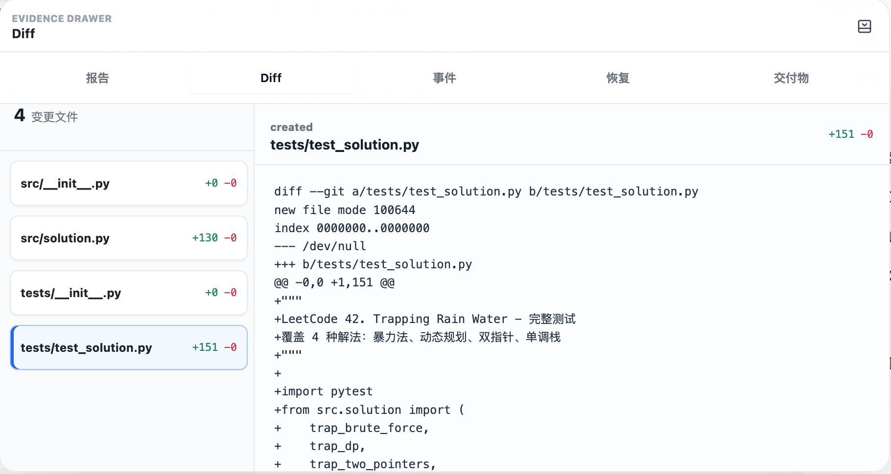
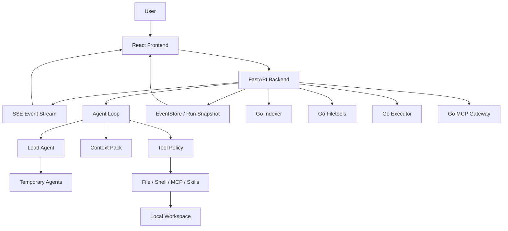

# nanoCursor

nanoCursor 是一个本地运行的 AI 编程工作台。它不是 Cursor 或 Codex 的替代品，更像是一个把 AI 编程工具拆开来研究、实现和验证的个人项目。

我做它主要想回答几个问题：

- Agent 什么时候应该直接回答，什么时候才需要读文件、改代码、跑测试？
- 上下文到底应该怎么选，而不是把整个项目和所有历史都塞给模型？
- 工具调用怎么做到有权限、有证据、有审批、有恢复？
- 多 Agent 什么时候真的有价值，什么时候只是在制造噪声？
- Python 后端和 Go sidecar 应该怎么分工，才不是为了“显得高级”而引入复杂度？



## 你可以把它理解成什么

nanoCursor 打开一个本地目录后，会围绕一次代码任务完成一条比较完整的链路：

```text
用户请求
  -> 意图判断
  -> Lead Agent 决定直接回答或进入执行循环
  -> 动态创建临时 Agent
  -> 选择上下文
  -> 调用文件 / shell / MCP / Skills 工具
  -> 生成 Diff、事件、报告和恢复证据
```

它现在更适合作为个人展示项目、学习项目和 AI Agent 工程实验台，而不是日常替代成熟商业编程工具。

## 核心能力

| 模块 | 现在做到了什么 |
|---|---|
| Agent Loop | 默认只有 Lead，复杂任务再动态创建 Planner / Coder / Tester / Reviewer 等临时 Agent |
| 上下文管理 | Project Index + Context Pack，按任务选择相关文件、摘要、偏好、记忆和 Skills |
| 工具治理 | read-only / safe-write / risky-write / shell-safe / shell-risky 分级，高风险动作进入 approval |
| 失败恢复 | 命令或测试失败后提取证据、分类、生成恢复计划、创建 Coder recovery task，并重跑验证 |
| 实时观测 | FastAPI + SSE 推送 Agent 活动、工具调用、任务进度、错误和交付状态 |
| Go sidecars | Indexer / Filetools / Executor / MCP Gateway 可选启用，失败时回退 Python |
| MCP / Skills | 支持预设 MCP、用户导入 Skills，并把能力注入 Agent 上下文 |
| 组件评测 | 支持 ablation matrix、component lift 和组件必要性报告的基础框架 |
| 学习站 | 独立 React 学习站，整理项目架构、源码地图、面试表达和学习路径 |

## 一次真实运行

下面这组图来自一次真实任务：

```text
用 Python 完成 LeetCode 接雨水题目，用多种解法实现并做完整测试。
```

运行中，聊天区展示 Agent 正在做什么，右侧展示进度和环境状态。



完成后，Lead 会给出收束后的交付说明，而不是把所有工具日志都塞给用户。



底部可以查看报告、事件、恢复信息和交付物。



Diff 面板用于检查每个文件的具体变更。



这次运行里，任务板 11 / 11 完成，生成 4 个文件变更，Go Indexer / Filetools / Executor / MCP Gateway 都处于已连接状态。

## 快速开始

### 环境要求

- Python 3.10+
- Node.js 18+
- Go 1.21+，可选，只有启用 Go sidecars 时需要
- 一个可用的 LLM Provider，或本地 Ollama

### 安装

```bash
python -m venv .venv
source .venv/bin/activate
pip install -r requirements.txt

cd frontend
npm install
cd ..
```

### 配置模型

```bash
cp .env.example .env
```

填入你使用的模型配置即可。具体字段以 `.env.example` 和 `src/infra/llm_config.py` 为准。

```bash
# OpenAI compatible
OPENAI_API_KEY=...
OPENAI_BASE_URL=https://api.openai.com/v1
OPENAI_MODEL=...

# DeepSeek
DEEPSEEK_API_KEY=...
DEEPSEEK_MODEL=...

# Ollama
OLLAMA_BASE_URL=http://127.0.0.1:11434
OLLAMA_MODEL=qwen2.5-coder
```

### 启动

推荐用统一脚本：

```bash
python scripts/dev.py
```

启动时会询问是否启用 Go sidecars：

```text
Start integrated Go sidecars? Indexer/Filetools/Executor/MCP [y/N]:
```

也可以显式指定：

```bash
# Python-only
python scripts/dev.py --no-go

# 启动已接入主链路的 Go sidecars
python scripts/dev.py --with-go

# 只查看启动计划
python scripts/dev.py --with-go --dry-run
```

默认地址：

- Frontend: <http://127.0.0.1:5173>
- Backend: <http://127.0.0.1:8100>
- Learning Site: <http://127.0.0.1:5174>

## 学习站

如果你想真正吃透这个项目，可以打开学习站：

```bash
cd learning-site
npm install
npm run dev
```

学习资料在：

```text
learning-site/src/content/handbook/
```

里面不是普通说明书，而是按学习路线整理的项目手册：请求生命周期、Agent Loop、上下文管理、记忆机制、工具治理、MCP/Skills、Go sidecar、测试质量、启动配置和面试表达。

## 架构



一句话概括现在的分工：

```text
Python 负责 Agent 决策、上下文、策略和 API。
Go 负责边界清楚、需要稳定 I/O 或进程治理的 sidecar。
```

## 设计重点

### Agent Loop，不是固定 DAG

nanoCursor 没有把任务写成死板的图，而是按 loop 推进：

```text
observe -> decide -> check policy -> execute or reply -> record evidence -> continue or finish
```

简单问答由 Lead 直接回答。只有代码任务、调试任务、测试任务才会进入多步执行，并按需创建临时 Agent。

### Context Pack

每次运行不会注入完整历史，而是组装一个任务级上下文包：

- 当前用户请求
- 会话摘要和执行摘要
- Project Index 选出的相关文件
- 最近变更和 Diff
- 用户偏好和记忆
- Skills / MCP 能力
- 当前任务计划与验收标准

目标不是“上下文越多越好”，而是让模型看到足够相关的信息。

### Tool Policy

工具调用会先过权限分级：

| 级别 | 例子 |
|---|---|
| `read_only` | 读文件、列目录、项目索引 |
| `safe_write` | 工作区内写文件、局部编辑 |
| `risky_write` | 删除、移动、大范围替换 |
| `shell_safe` | pytest、lint、ls、cat |
| `shell_risky` | 安装依赖、网络请求、Git 写操作 |
| `mcp_read` / `mcp_write` | MCP 工具读写外部系统 |

高风险动作进入 approval。文件写入会留下备份、Diff、evidence 和恢复入口。

### Failure Recovery

失败恢复不是简单“再试一次”。现在的链路是：

```text
失败命令 / 工具事件
  -> 结构化证据
  -> 失败分类
  -> 恢复计划
  -> 受控 Coder recovery task
  -> 重跑验证命令
  -> 成功则推进原始失败任务
```

验证失败时会生成下一轮恢复计划，但不会无限自动修复。

### Go sidecars

当前推荐启用的 Go sidecars：

| Service | 作用 | 策略 |
|---|---|---|
| `indexer` | 项目扫描、入口文件、测试、配置和源码摘要 | 可启用，失败回退 Python |
| `filetools` | 文件读取、写入、编辑、备份、回滚 | 可启用，失败回退 Python |
| `executor` | 命令执行、取消、超时、事件治理 | 可启用，智能分流 |
| `mcp` | MCP server 生命周期、工具发现、stdio 调用边界 | 可启用，失败回退 Python |

仓库里还有 eventstore、policy、taskboard、cron 等 Go 实验服务。它们暂时不默认启用，因为还没有进入当前收益最高、风险最低的主链路。

## 常用命令

```bash
# 后端测试
pytest

# 前端状态测试 + 构建
npm --prefix frontend run check

# 学习站构建
npm --prefix learning-site run build

# 学习资料完整性检查
python learning-site/src/content/handbook/scripts/check_learning_package.py

# Go 服务 benchmark
python scripts/benchmark_go_services.py --iterations 3 --files 220

# 全量检查
python scripts/check_all.py
```

运行时状态接口：

```bash
curl http://127.0.0.1:8100/api/runtime/indexer/status
curl http://127.0.0.1:8100/api/runtime/filetools/status
curl http://127.0.0.1:8100/api/runtime/executor/status
curl http://127.0.0.1:8100/api/runtime/mcp/status
```

消融评测基础接口：

```bash
curl http://127.0.0.1:8100/api/evals/ablation/components
```

## 项目结构

```text
nanoCursor/
  frontend/                     主产品前端
  learning-site/                学习站和 Markdown 学习资料
  src/
    api/                        FastAPI routes 和服务层
    agent/                      Agent 工具和运行入口
    runtime/                    task board、command runner、feature flags
    tools/                      文件、shell、git、memory 等工具
    infra/                      配置、日志、路径防护、LLM 配置
  go-services/
    indexer/                    Go 项目索引 sidecar
    filetools/                  Go 文件工具 sidecar
    executor/                   Go 命令执行 sidecar
    mcp/                        Go MCP Gateway
  scripts/                      启动、检查、benchmark 脚本
  tests/                        Python 后端测试
  images/                       README 截图
```

## 为什么这个项目值得看

如果只看“能不能写代码”，它当然比不过 Codex、Claude Code、Cursor 这些成熟工具。

但作为个人项目，它有几个比较值得讲的点：

- 它不是只做聊天框，而是在做一个可观察、可恢复、可评估的 Agent Runtime。
- 它没有把多 Agent 当噱头，而是把“该少的时候少，该分工的时候分工”做进了路由和任务板。
- 它把上下文管理、工具治理、失败恢复、MCP/Skills、Go sidecars 这些工程问题都落到了代码里。
- 它保留了评测和消融的入口，能开始回答“这个模块是不是真的有用”。
- 它有独立学习站，方便把项目从“我让模型写了很多代码”变成“我能理解并讲清楚每个模块”。

## 当前边界

这个项目已经不是简单 demo，但也还不是商业级产品：

- 复杂任务的停止条件、失败归因和重试策略还可以继续打磨。
- MCP / Skills 已有框架，但生态兼容性还没有成熟工具完整。
- Go sidecars 要坚持“适合才迁移”，不能为了占比把系统变重。
- 消融评测已经有基础框架，但多数组件开关还没真正接入 runtime 行为。
- 前端体验能支撑演示和使用，但细节仍然比成熟产品粗糙。

## License

MIT
