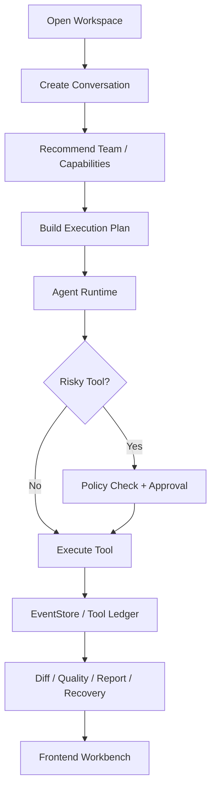

# nanoCursor

> Local-first AI coding agent workbench. 用一个可运行的前后端系统，把 AI Coding Agent 背后的工作区隔离、Agent 编排、工具审批、事件追踪、MCP/Skills、交付证据和恢复机制显式展示出来。

nanoCursor 不是 Claude Code、Codex 或 Cursor 的替代品。它更像一个面向工程能力展示的个人项目：我把“AI 帮我改代码”这件事拆成可观察、可审批、可恢复、可复盘的产品化流程。


## 为什么做它

普通 AI 编程 Demo 很容易停留在“聊天框 + 代码生成”。nanoCursor 更关心真实工具会遇到的问题：

- 用户打开一个本地目录后，运行数据不能污染项目根目录。
- 一次任务不应该只有一段回答，还需要计划、执行、验证、报告和恢复入口。
- 文件写入、命令执行、MCP 调用这类高风险动作需要策略检查和审批记录。
- 前端要能实时看到事件流、任务状态、工具证据、Diff、报告和失败诊断。
- MCP Server、Skills、自定义 Agent 能力应该能作为工作台能力中心管理。

## 真实任务验证

我用 nanoCursor 跑过一个真实小任务，而不是只放静态 Demo：

```text
工作区: demo-workspaces/readme-showcase
任务: 在当前 JavaScript 小项目中新增 completionRate(summary) 函数；
      更新 test.mjs 覆盖 2/3 -> 67%、0/0 -> 0%、3/3 -> 100%、1/4 -> 25%；
      运行 npm test 验证。
Run: 5083a639-ed64-458e-b04c-2f9d2b544fb5
结果: completed
事件: 71 条
质量门禁: passed
交付评分: 100
验证命令: npm test -> tests passed
```

实际修改了：

- `app.js`: 新增 `completionRate(summary)`。
- `test.mjs`: 新增 4 个边界和常规测试。
- `package.json`: 添加 `"type": "module"`，消除 ESM warning。


运行过程中的 SSE 事件流会被保留下来，前端可以重放和复盘：


交付报告会汇总质量门禁、变更文件、风险和原始 Markdown 报告：


## 核心能力

- **工作区隔离**：用户项目目录、运行记录、checkpoint、trash、eval workspace、MCP 配置和 Skills 按 workspace 隔离。
- **多 Agent 工作台**：支持 Lead / Planner / Coder / Tester / Reviewer 等角色，运行前可推荐团队，运行中可沉淀任务和证据。
- **Execution Plan**：把用户需求拆成阶段、负责人、能力约束、验收标准和工具证据。
- **实时事件流**：FastAPI + SSE 输出运行状态、阶段变化、工具调用、审批、文件变更、报告生成和错误事件。
- **工具审批与审计**：`bash`、文件写入、删除、MCP 调用等高风险动作走策略检查、用户审批、台账记录和恢复建议。
- **Project Index**：扫描入口文件、源码目录、配置、测试和最近修改文件，为 Agent 构造更靠谱的上下文。
- **MCP / Skills 能力中心**：提供 MCP 预设、自定义 MCP Server 配置、自定义 Skill 导入和能力推荐。
- **交付证据链**：报告、Diff、traceability、quality gate、delivery contract、recovery center 统一展示。
- **前后端分离**：后端 FastAPI，前端 Vanilla JS 模块化工作台，便于快速迭代和演示。

## 架构



## 快速开始

### 1. 安装依赖

```bash
pip install -r requirements.txt

cd frontend
npm install
```

建议使用 Python 3.10+ 和 Node.js 18+。

### 2. 配置模型

```bash
cp .env.example .env
```

按需配置其中一种供应商：

```bash
OPENAI_API_KEY=...
ANTHROPIC_API_KEY=...
DEEPSEEK_API_KEY=...
MINIMAX_API_KEY=...
OLLAMA_BASE_URL=http://127.0.0.1:11434
```

不要把 `.env` 提交到 GitHub。

### 3. 启动

一键启动：

```bash
python scripts/dev.py
```

或者前后端分开启动：

```bash
python scripts/dev_backend.py
python scripts/dev_frontend.py
```

默认地址：

- Frontend: `http://127.0.0.1:5173`
- Backend: `http://127.0.0.1:8100`

### 4. 打开项目并运行任务

1. 在顶部 Project 入口打开一个本地项目目录。
2. 点击「新会话」。
3. 输入任务，例如：

```text
请在当前 JavaScript 小项目中新增 completionRate(summary) 函数，返回完成比例的百分数字符串；
同时更新测试，并运行 npm test 验证。
```

4. 如果出现工具审批，确认命令和工作区后再批准。
5. 在底部 Evidence Drawer 查看报告、Diff、事件、恢复和交付物。

## 常用检查

```bash
# 全量检查
python scripts/check_all.py

# 后端测试
pytest -q

# 后端路由审计
python scripts/backend_audit.py

# API smoke
python scripts/api_smoke.py

# 前端语法检查
npm --prefix frontend run check
```

本次 README 更新前已验证：

```bash
pytest tests/test_agenthub_services.py -q
npm --prefix frontend run check
cd demo-workspaces/readme-showcase && npm test
```

## 项目结构

```text
nanoCursor/
  api_server.py                 # FastAPI 兼容入口和主要 API
  frontend/                     # 前端工作台
    src/actions/                # API action 层
    src/controllers/            # 会话、运行、能力、布局等控制器
    src/events/                 # DOM 事件绑定
    src/render/                 # UI 渲染模块
    src/services/               # 前端领域服务
  src/
    agent/                      # Agent loop、prompt、策略
    api/
      app.py                    # FastAPI app
      routes/                   # 模块化路由
      services/                 # workspace、run、MCP、report、quality 等服务
    infra/                      # 配置、日志、路径 guard
    runtime/                    # 运行状态、工具台账、交付契约
    tools/                      # 文件、bash、git、memory、project、todo 工具
  tests/                        # pytest 测试
  evals/                        # 评测任务
  scripts/                      # dev、doctor、check_all、api_smoke、backend_audit
  docs/                         # 架构、契约、演示和截图
```

## 运行数据

每个用户工作区下会生成 `.nanocursor/`：

```text
<workspace>/.nanocursor/
  workspace.json
  settings.json
  runs/<thread_id>/
    session.json
    events.jsonl
    tools.jsonl
    approvals/
    changes.json
    delivery.json
    delivery.md
    failures.json
    audit.jsonl
  checkpoints/
  trash/
  skills/
  evals/
```

这些是本地运行数据，通常不应该提交到业务项目仓库。

## 文档

- [架构说明](docs/architecture.md)
- [API 契约](docs/api-contract.md)
- [事件契约](docs/event-contract.md)
- [运行状态契约](docs/run-state-contract.md)
- [安全与审计设计](docs/security-and-audit.md)
- [演示脚本](docs/demo-script.md)
- [前端进化计划](docs/frontend-evolution-plan.md)

## 当前边界

- 单机单用户，没有做账号、多租户和权限系统。
- 不是成熟商业 AI IDE，不承诺替代 Claude Code、Codex 或 Cursor。
- 真实 Agent 能力以安全可控和可展示为优先，长期自治能力仍有限。
- 前端是轻量 Vanilla JS 模块化工作台，不追求大型 React 应用复杂度。
- MCP 预设和 Skills 已具备入口，但不同 MCP Server 的真实可用性取决于本机环境和凭据配置。

## License

MIT
