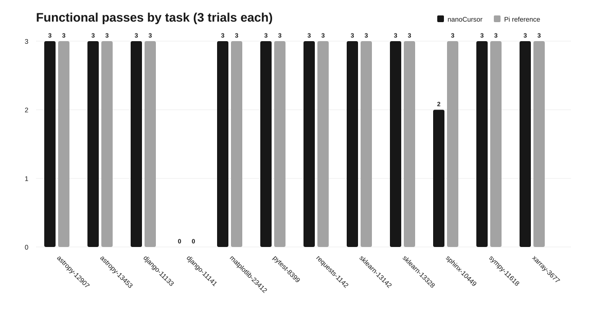

# nanoCursor

nanoCursor 是一个 Python 终端 Coding Agent，也是一套可以在真实代码仓库任务上验证 Agent 行为的实验项目。仓库包含 Agent 本体、确定性验收工具 AgentEval，以及经过脱敏的逐次实验数据、分析报告和可复算图表。

这个版本关注两个问题：

- Coding Agent 能否完成真实仓库中的缺陷修复任务；
- 在模型、任务、预算和验收规则一致时，Agent harness 会如何影响执行路径与最终结果。

## 项目结果

我们从 SWE-bench 任务中选取 12 个 Python 真实仓库 Issue，覆盖 9 个开源项目。nanoCursor 与 Pi 参考 harness 均使用同一 DeepSeek 模型、同一任务描述、96 turn 上限、20 分钟墙钟预算、相同容器限制和确定性 grader；每题分别运行 3 次，共形成 72 次对照记录。

| 指标 | nanoCursor | Pi 参考组 |
|---|---:|---:|
| 内容验收通过 | 32/36（88.9%） | 33/36（91.7%） |
| 正常完成协议 | 31/36（86.1%） | 33/36（91.7%） |
| 总 Token | 1,760,888 | 1,926,021 |
| 工具调用 | 1,946 | 1,982 |
| 运行总耗时 | 6,499.2 s | 7,341.7 s |

两套 harness 在名义 trial 上的功能结果一致 35/36（97.2%）。现有样本没有显示 nanoCursor 存在结构性的功能退化；主要 Bad Case 来自任务语义边界、模型验证范围和结束预算管理。该结果是受控实验的描述性结论，不是 SWE-bench 官方榜单成绩，也不用于声称两套 harness 等价。



详细证据见 [实验结果与复算说明](evaluation/results/README.md) 和 [Bad Case 归因报告](evaluation/results/CAUSAL_ANALYSIS.md)。

## Agent 能力

- 终端交互界面、流式模型响应和会话恢复；
- Bash、文件读写、搜索、编辑、网页内容读取等工具调用；
- 子 Agent、团队协作和共享任务状态；
- MCP 工具发现与调用、Skills 加载、Hook 与权限控制；
- 上下文压缩、缓存、工作树隔离和执行失败恢复；
- 面向外部 grader 的无侵入评测适配。

## 快速开始

要求 Python 3.11 或更高版本，推荐使用 [uv](https://docs.astral.sh/uv/)。

```bash
git clone git@github.com:MagicalLiHua/nanoCursor.git
cd nanoCursor
uv sync
mkdir -p .nanocursor
cp .nanocursor/config.yaml.example .nanocursor/config.yaml
```

通过环境变量提供模型密钥，不要把密钥写入仓库：

```bash
export OPENAI_API_KEY="your-api-key"
uv run nanocursor
```

配置样例使用 OpenAI 兼容接口，可在 `.nanocursor/config.yaml` 中调整 `base_url`、模型名称和上下文参数。

## 运行测试

```bash
uv run pytest -q
```

当前 Python 测试基线为 573 passed、1 skipped。测试覆盖核心 Agent 循环、工具执行、Hook、权限、团队协作、MCP、Skills、上下文和评测适配器。

## AgentEval

AgentEval 位于 `evaluation/agent-eval-lab/`，使用 TypeScript 实现任务清单冻结、Docker 沙箱、运行编排、轨迹记录和确定性验收。

```bash
cd evaluation/agent-eval-lab
npm install
npm run check
npm test
npm run cli -- issue-list
```

真实模型实验需要自行提供模型 API 和可用 Docker 环境。公开仓库不包含完整模型对话、原始轨迹或密钥，只提供核验统计结论所需的脱敏字段。

## 仓库结构

```text
nanocursor/                         Python Coding Agent
tests/                              Agent 单元与集成测试
evaluation/agent-eval-lab/          TypeScript 评测工具
evaluation/results/data/            脱敏逐次结果与审计证据
evaluation/results/manifests/       冻结任务清单
evaluation/results/figures/         可复算 SVG 图表
evaluation/analysis/                数据导出与绘图脚本
```

## 版本说明

`v3.0.0` 是当前 Agent + Evaluation 版本。旧版工程保留在 `legacy-v2.0.0` 标签中，主分支不再维护旧版架构。

## License

项目代码使用 [MIT License](LICENSE)。第三方组件及其许可证见 [THIRD_PARTY_NOTICES.md](THIRD_PARTY_NOTICES.md)。
