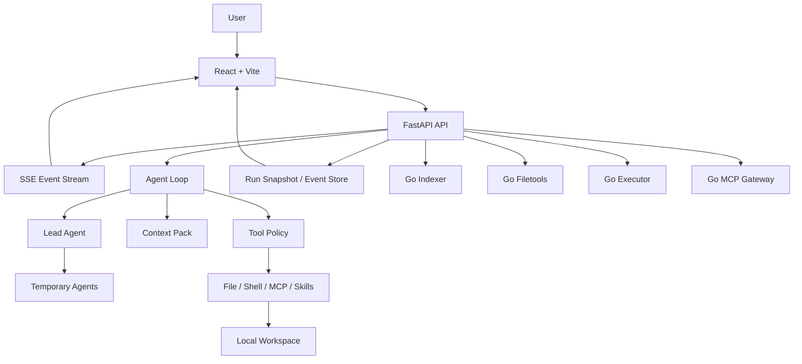

# nanoCursor

一个本地运行的 AI 编程工作台。

它不是想再造一个 Cursor，也不是把几个 Agent 名字排在一起做演示。nanoCursor 更关注 AI 编程工具背后那些真正难做、但平时不容易被看见的部分：

- Agent 怎么判断这次该直接回答，还是该读文件、改代码、跑测试。
- 上下文应该怎么选，而不是把整个项目和全部历史都塞给模型。
- 工具调用怎么分权限、留证据、可审批、可恢复。
- 多 Agent 什么时候有价值，什么时候只是制造噪声。
- Python 编排和 Go sidecar 的边界应该怎么划。


## 现在能做什么

nanoCursor 可以打开一个本地项目目录，然后围绕一次代码任务完成从理解需求到交付报告的完整闭环：

| 能力 | 说明 |
|---|---|
| 本地工作区 | 会话、任务、文件、Diff 和运行记录都绑定到当前目录 |
| Agent Loop | 默认只有 Lead，复杂任务才动态创建 Coder / Planner / Tester / Reviewer |
| 实时运行感知 | 通过 FastAPI + SSE 推送 Agent 活动、工具调用、审批、错误和完成状态 |
| 上下文管理 | Project Index + Context Pack，只注入和任务有关的文件、摘要、偏好与 Skills |
| 工具治理 | read-only / safe-write / risky-write / shell-safe / shell-risky 分级，高风险动作进入审批 |
| 安全修改 | 路径防护、文件备份、Diff、evidence、失败恢复和回滚入口 |
| Go sidecars | Indexer / Filetools / Executor / MCP Gateway 可选启用，失败时回退 Python |
| MCP / Skills | 支持预设 MCP、用户自定义 Skills，并纳入 Agent 可用能力上下文 |

## 一次真实运行

下面不是静态 mock，是一次真实任务的前端截图。

任务：

```text
用 Python 完成 LeetCode 接雨水题目，用多种解法实现并做完整测试
```

运行过程中，聊天区展示 Agent 正在做什么，右侧展示任务进度和运行环境：


完成后，Lead 会给出收束后的交付说明：


底部可以查看交付物、报告、事件和恢复信息：


也可以继续展开 Diff，检查每个文件的具体变更：


这次运行的结果：

- 状态：completed
- 任务：11 / 11 完成
- 文件变更：4 个文件
- Go sidecars：Indexer / Filetools / Executor / MCP Gateway 已连接
- 前端控制台：未发现 error / warning

## 快速开始

### 1. 准备环境

需要：

- Python 3.10+
- Node.js 18+
- Go 1.21+，可选，但推荐安装
- 一个可用的 LLM Provider，或者本地 Ollama

安装依赖：

```bash
python -m venv .venv
source .venv/bin/activate
pip install -r requirements.txt

cd frontend
npm install
cd ..
```

### 2. 配置模型

复制环境变量模板：

```bash
cp .env.example .env
```

按你使用的模型提供商填一种即可。字段以 `.env.example` 和 `src/infra/llm_config.py` 为准。

常见配置示例：

```bash
# OpenAI compatible
OPENAI_API_KEY=...
OPENAI_BASE_URL=https://api.openai.com/v1
OPENAI_MODEL=...

# DeepSeek
DEEPSEEK_API_KEY=...
DEEPSEEK_MODEL=...

# Ollama
OLLAMA_BASE_URL=http://127.0.0.1:11434
OLLAMA_MODEL=qwen2.5-coder
```

### 3. 启动开发环境

推荐直接运行：

```bash
python scripts/dev.py
```

启动时脚本会询问：

```text
Start integrated Go sidecars? Indexer/Filetools/Executor/MCP [y/N]:
```

输入 `y` 或 `yes` 时，脚本会检查当前机器是否安装 Go、服务目录是否存在，然后启动已接入主链路的 Go 微服务：

- Go Indexer: `127.0.0.1:50051`
- Go Filetools: `127.0.0.1:50054`
- Go Executor: `127.0.0.1:50055`
- Go MCP Gateway: `127.0.0.1:50056`

如果不想交互，也可以显式指定：

```bash
# Python-only
python scripts/dev.py --no-go

# 启动全部已接入的 Go sidecars
python scripts/dev.py --with-go

# 只看启动计划，不真正启动服务
python scripts/dev.py --with-go --dry-run
```

默认地址：

- Frontend: <http://127.0.0.1:5173>
- Backend: <http://127.0.0.1:8100>

## 架构



我对这个项目的边界理解是：

```text
Python 决定做什么。
Go 负责更确定、更可控的执行边界。
```

Python 适合做 Agent Loop、上下文选择、记忆、策略和业务编排。Go 更适合做项目扫描、文件工具、进程管理、MCP stdio 生命周期和可取消命令执行。

## 核心设计

### Agent Loop

nanoCursor 没有把任务固定成死板 DAG，而是按一轮一轮的 loop 运行：

```text
observe -> decide -> check policy -> execute or reply -> record evidence -> continue or finish
```

简单问答只由 Lead 直接回答。代码任务才会进入读文件、改代码、跑测试、复核和报告。

### Context Pack

系统不会把完整历史一股脑塞给模型，而是给每次运行组装一个更小的上下文包：

- 当前用户请求
- 会话摘要和执行摘要
- 相关文件片段
- 项目索引结果
- 最近变更
- 用户偏好
- Skills 和 MCP 能力
- 当前任务计划和验收标准

目标不是“上下文越多越聪明”，而是让模型看到足够相关的信息。

### Tool Policy

工具调用先过权限分级，再决定是否执行或等待用户审批：

| 权限级别 | 例子 |
|---|---|
| `read_only` | 读文件、列目录、项目索引 |
| `safe_write` | 工作区内写文件、局部编辑 |
| `risky_write` | 删除、移动、大范围替换 |
| `shell_safe` | pytest、lint、ls、cat |
| `shell_risky` | 安装依赖、网络请求、Git 写操作、删除文件 |
| `mcp_read` / `mcp_write` | MCP 工具读取或产生外部副作用 |

高风险动作会进入 approval。文件写入会留下备份、Diff 和 evidence，方便回看和回滚。

### Go Sidecars

当前推荐启用的是四个已经接入主链路的 Go sidecar：

| Service | 作用 | 默认策略 |
|---|---|---|
| `go-services/indexer` | 项目扫描、入口文件、测试、配置和源码摘要 | 可启用，失败回退 Python |
| `go-services/filetools` | 文件读取、写入、编辑、备份、回滚 | 可启用，失败回退 Python |
| `go-services/executor` | 测试/构建命令、长命令、取消和执行事件治理 | 可启用，智能分流 |
| `go-services/mcp` | MCP Server 生命周期、工具发现和 stdio 调用边界 | 可启用，失败回退 Python |

仓库里还有 `eventstore`、`policy`、`taskboard`、`cron` 等 Go 实验服务。它们暂时不随 `scripts/dev.py --with-go` 启动，因为还不是当前主链路里收益最高、风险最低的部分。

## 常用命令

```bash
# 后端测试
pytest

# 前端状态测试 + 构建
npm --prefix frontend run check

# Go 服务 benchmark
python scripts/benchmark_go_services.py --iterations 3 --files 220

# 全量检查
python scripts/check_all.py
```

查看运行时状态：

```bash
curl http://127.0.0.1:8100/api/runtime/indexer/status
curl http://127.0.0.1:8100/api/runtime/filetools/status
curl http://127.0.0.1:8100/api/runtime/executor/status
curl http://127.0.0.1:8100/api/runtime/mcp/status
```

## 项目结构

```text
nanoCursor/
  frontend/        React + Vite 前端
  src/
    api/           FastAPI routes 和服务层
    agent/         Agent Loop、上下文、Skills
    indexer/       Python indexer 与 Go indexer client
    memory/        会话记忆和用户偏好
    runtime/       command runner、feature flags、Go/MCP clients
    tasks/         run-scoped task board
    tools/         文件、shell、恢复、MCP 等工具
  go-services/
    indexer/       Go 项目索引 sidecar
    filetools/     Go 文件工具 sidecar
    executor/      Go 命令执行 sidecar
    mcp/           Go MCP gateway
  scripts/         启动、benchmark、检查脚本
  tests/           后端测试
  docs/            设计文档、benchmark、学习资料
  images/          README 截图
```

## 这个项目最值得看的地方

如果只看功能，它当然不是成熟商业工具。但作为个人项目，它比较有价值的地方在于把 AI 编程工具拆成了几个能讲清楚的工程问题：

- Agent 不是越多越好，关键是动态判断任务复杂度。
- 上下文不是越长越好，关键是选择、压缩和记忆。
- 工具调用不能裸奔，必须有权限、审批、证据和恢复。
- Go 不是为了“显得高级”而接入，而是放在文件、进程、索引、MCP 这些边界清楚的地方。
- 前端不是只做聊天框，而是让用户知道系统正在做什么、卡在哪里、改了什么。

## 当前不足

这个项目还在个人工作台阶段，不是商业级产品。比较明显的不足：

- 复杂任务的停止条件和失败归因还可以继续打磨。
- MCP / Skills 已经有入口，但生态兼容性还没有成熟工具那么完整。
- 前端体验已经能用，但和 Codex / Cursor 这类成熟产品相比仍有很多细节差距。
- Go sidecar 的接入要坚持“适合才迁移”，不能为了占比把系统变重。

## License

MIT
