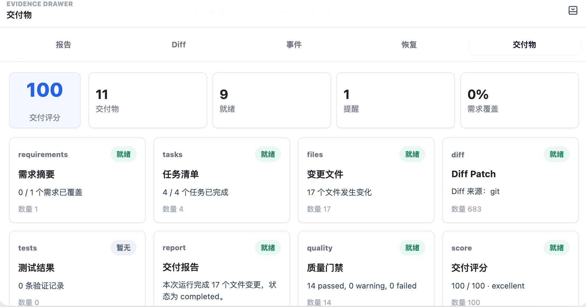
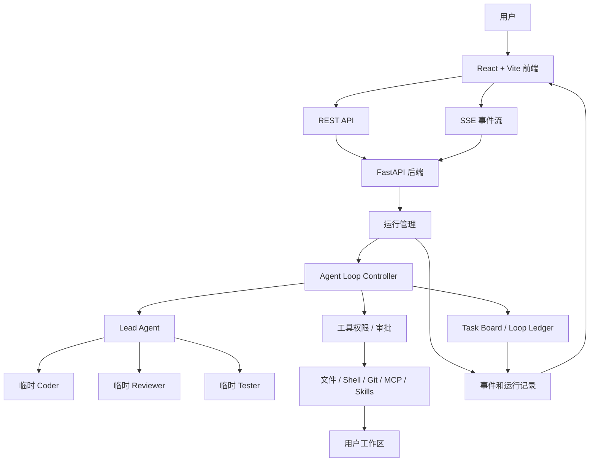

# nanoCursor

> 一个本地运行的 AI 编程工作台。  
> 我想做的不是“再包一层聊天框”，而是把 Agent 修改代码时的过程、风险和结果都摊开给用户看。

[](https://www.python.org/) [](https://fastapi.tiangolo.com/) [](https://vitejs.dev/) [](LICENSE)


## 这是什么

nanoCursor 是我用来探索 AI 编程工具的一套小系统。它可以打开一个本地目录，让 AI 在这个目录里读文件、改代码、运行测试，并把整个过程显示在前端。

这个项目最开始只是一个多 Agent Demo，后来越做越发现，真正难的不是“让模型写几行代码”，而是这些更麻烦的问题：

- 模型到底准备改什么，用户能不能提前知道？
- 它执行了哪些命令、改了哪些文件，能不能追踪？
- 高风险操作要不要先问用户？
- 一个任务失败了，能不能知道失败在哪个阶段？
- 多轮对话以后，怎么给模型合适的上下文，而不是把历史全塞进去？

所以现在的 nanoCursor 更像一个本地 AI Coding 工作台原型。它还不是成熟产品，但已经把很多真实工具里会遇到的问题拆出来做了：Agent Loop、项目索引、工具权限、SSE 事件流、Diff、交付报告、恢复记录、MCP/Skills 配置等。

## 一次真实运行

下面这组截图不是静态 Mock，是我直接用前端跑的一次任务。任务大概是：

```text
帮我在当前工作区实现一个 Python 算法题“接雨水”，并补充测试。
```

运行过程中，前端会显示当前 Agent 在做什么、工具调用结果、文件变更和最后的交付报告。




## 主要功能

### 多 Agent，但不是一上来就全开

nanoCursor 默认只有一个 Lead Agent。它会先判断任务是不是复杂，再决定要不要创建临时子 Agent。

比如：

- 普通问答：Lead 自己回复。
- 小改动：Lead 直接叫一个 Coder 处理。
- 稍微复杂的开发任务：再加 Planner、Reviewer 或 Tester。
- 高风险任务：可以引入安全检查或恢复相关的 Agent。

我不太想把它做成“角色越多越高级”的样子。很多时候一个 Agent 就够了，只有任务真的需要拆分时，子 Agent 才有意义。

### Agent Loop

后端现在的重点是 Agent Loop，而不是固定流程图。

一次运行会被拆成一轮一轮的控制步骤：

```text
observe -> propose -> check -> repair -> commit -> verify
```

简单说就是：

- 先看当前 run 的状态、任务板、最近事件和是否可以收束。
- 再提出一个 Lead action，比如直接回答、观察项目、调用工具、请求审批或结束。
- action 会先过结构化校验，不合理就拒绝或给出修复建议。
- 只有明确提交后，action 才会进入 loop ledger。
- 如果是 `call_tool`，可以继续走统一 action pipeline，仍然受路径防护、权限和审批控制。

这块是我现在最看重的部分。它让系统不只是“模型回复了一段话”，而是能解释每一步为什么发生、能不能发生、如果不该发生该怎么修。

### 执行计划和任务账本

对于复杂任务，系统会先生成一个执行计划。里面会写清楚：

- 这次任务准备分几步做
- 每一步由哪个 Agent 负责
- 预计会改哪些范围
- 用什么方式验证
- 哪些工具调用可能有风险

这一步的目的很简单：不要让模型一上来就闷头改项目。

后续运行时，执行计划不会被当成不可变 DAG，而是会落到 run-scoped Task Board 里。Lead 可以观察任务状态、更新任务、挂载工具证据，并根据任务是否完成决定继续、恢复、失败或收束。

### 实时运行状态

后端用 FastAPI + SSE 给前端推事件。用户可以在页面上看到：

- 当前 Agent 正在做什么
- 调用了什么工具
- 哪些文件发生了变化
- 是否需要用户审批
- 测试结果和质量检查
- 最后的报告、Diff 和交付物

这部分是我觉得比较重要的地方。AI 工具如果运行时完全黑盒，用户很容易觉得它卡住了，或者不敢相信它真的做了正确的事。

### 项目上下文

nanoCursor 会为当前工作区建立一个简单的项目索引，比如入口文件、源码目录、测试文件、配置文件和最近改动。

后续给模型上下文时，会尽量只放和当前任务有关的信息，比如：

- 用户这次的请求
- 最近对话摘要
- 当前执行计划
- 相关文件片段
- 最近变更
- 用户偏好和 Skills

这块还在继续打磨。我的目标是让它少做无意义搜索，也少因为上下文太乱而乱改。

### 工具权限和恢复

项目里把工具调用按风险分了几类：

- `read_only`：读文件、搜索、查看项目索引
- `safe_write`：在工作区内写文件
- `risky_write`：删除、移动、大规模替换
- `shell_safe`：测试、lint、`ls`、`cat` 这类命令
- `shell_risky`：安装依赖、网络请求、Git 操作、删除文件等

高风险操作会进入审批流程。文件修改前也会尽量留下备份和记录，方便后面查看、回滚或分析失败原因。

现在 controller 已经能把 `call_tool` 接到统一 action pipeline。也就是说，就算是 Agent Loop 触发的工具调用，也不会绕过这些规则。

### MCP / Skills

前端有一个能力配置入口，可以管理 MCP Server 和自定义 Skills。这个功能现在还比较早期，但方向是让用户把自己的工具、知识库、项目规则接进来，而不是每次都靠一段很长的 prompt。

## 架构



## 技术栈

- 后端：Python, FastAPI, Pydantic, SSE, SQLite/EventStore
- 前端：React, Vite, Zustand, lucide-react
- Agent：Lead-first runtime, Agent Loop Controller, dynamic sub-agents, tool policy, project index
- 工程工具：pytest, Ruff, Playwright
- 扩展能力：MCP Server presets, custom Skills

## 快速开始

### 环境要求

- Python 3.10+
- Node.js 18+
- 一个可用的 LLM Provider，或者本地 Ollama

### 安装依赖

```bash
python -m venv .venv
source .venv/bin/activate
pip install -r requirements.txt

cd frontend
npm install
cd ..
```

### 配置模型

```bash
cp .env.example .env
```

按需填写一种模型配置：

```bash
# OpenAI-compatible
OPENAI_API_KEY=sk-...
OPENAI_BASE_URL=https://api.openai.com/v1
OPENAI_MODEL=gpt-4.1

# Anthropic
ANTHROPIC_API_KEY=sk-ant-...
ANTHROPIC_MODEL=claude-3-5-sonnet-latest

# DeepSeek
DEEPSEEK_API_KEY=...
DEEPSEEK_MODEL=deepseek-chat

# Ollama
OLLAMA_BASE_URL=http://127.0.0.1:11434
OLLAMA_MODEL=qwen2.5-coder
```

具体字段以 `.env.example` 和 `src/infra/llm_config.py` 为准。

### 启动

一键启动前后端：

```bash
python scripts/dev.py
```

也可以分开启动：

```bash
# Terminal 1
python scripts/dev_backend.py

# Terminal 2
python scripts/dev_frontend.py
```

默认地址：

- Frontend: `http://127.0.0.1:5173`
- Backend: `http://127.0.0.1:8100`

如果需要直接启动后端 ASGI 服务：

```bash
python -m uvicorn src.api.server:app --host 127.0.0.1 --port 8100
```

## 怎么用

1. 打开前端页面。
2. 选择一个本地工作目录。
3. 新建会话。
4. 输入任务，比如“帮我给这个 Python 项目补一个 CLI 工具和测试”。
5. 运行时可以在聊天区看 Agent 动态，在底部面板看报告、Diff、事件和交付物。
6. 如果出现高风险操作，先看清楚再批准。

## 开发命令

```bash
# 前端构建检查
npm --prefix frontend run check

# 后端测试
pytest

# 基础语法检查
python -m py_compile api_server.py src/api/server.py src/agent/engine.py

# API smoke test
python scripts/api_smoke.py

# Agent/Intent/Policy 小评测
python scripts/run_agent_evals.py --workspace-dir /tmp/nanocursor-eval --no-persist
```

## 项目结构

```text
nanoCursor/
  api_server.py                 # Legacy 兼容入口，保留给旧测试和过渡期内部调用
  frontend/
    src/
      App.jsx                   # 前端主视图
      actions/                  # 前端业务动作
      core/                     # API、Markdown、Diff、格式化等基础能力
      hooks/                    # 启动和 SSE 订阅
      services/                 # 前端服务封装
      state/                    # 状态映射和选择器
      store/                    # Zustand store
      styles/                   # 分模块样式
  src/
    agent/                      # Agent Runtime、上下文压缩、技能运行
    agent/strategy/             # 意图分类、计划生成、工具策略
    api/server.py               # 正式 ASGI 后端入口
    api/routes/                 # FastAPI 路由
    api/services/               # 会话、运行、Agent Loop、审批、Diff、报告、MCP 等服务
    indexer/                    # 项目索引
    infra/                      # 配置、日志、路径防护、LLM 配置
    memory/                     # 记忆管理
    runtime/                    # 运行状态、事件、审计、交付契约
    tasks/                      # 任务管理
    tools/                      # 工具实现
  tests/                        # 后端测试
  docs/product-roadmap.md       # 后续开发唯一主计划
  docs/                         # 审计报告、面试材料和保留文档
  images/                       # README 截图
```

## 现在做到哪儿了

这个项目还是个人项目，不是成熟商业工具。它现在能跑真实小任务，也能展示比较完整的运行过程。后端已经有了比较清晰的几条主线：Intent Router、Agent Loop Controller、Task Board、Context Pack、Action Policy、EventStore 和恢复记录。

最近主要在补 Agent Loop：

- `GET /api/runs/{thread_id}/loop/observation` 可以看到当前 loop 观察到的状态。
- `POST /api/runs/{thread_id}/loop/actions/check` 可以预检一个 Lead action。
- `POST /api/runs/{thread_id}/loop/step` 可以 preview 或提交一轮 controller step。
- `execute_tools=true` 时，`call_tool` 会进入统一 action pipeline，安全操作直接执行，高风险操作进入审批。

还需要继续磨的地方也不少，比如更强的上下文选择、更系统的评测、失败恢复策略、前端交互和 MCP/Skills 的使用体验。

我做它的主要原因，是想把 AI 编程工具里那些平时看不见的东西拆开研究：Agent 怎么分工，工具怎么管，失败怎么恢复，上下文怎么组织，用户怎么知道系统不是在乱改。

## 接下来想做的事

后续开发路线已经收敛到 [docs/product-roadmap.md](docs/product-roadmap.md)。短期我更想继续打磨两件事：

- Agent Loop 和 Task Board 的闭环，让工具结果、失败、恢复动作更自然地回流到下一轮决策。
- Context Pack 2.0，让不同 Agent、不同工具调用拿到更合适的上下文，而不是靠堆 token。

## License

MIT
