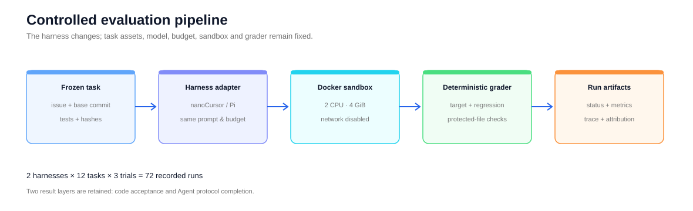
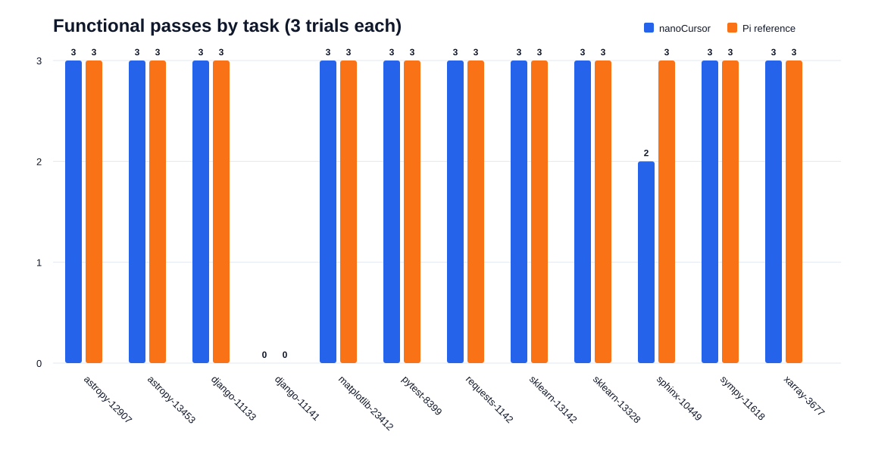
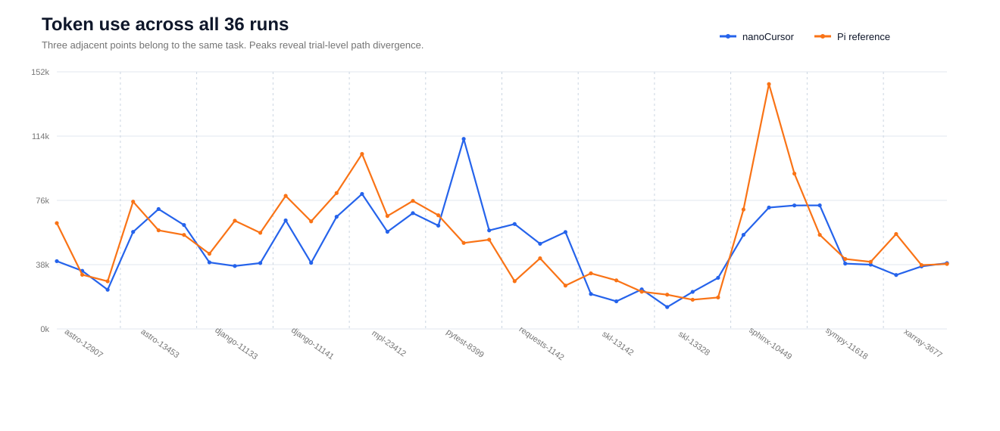
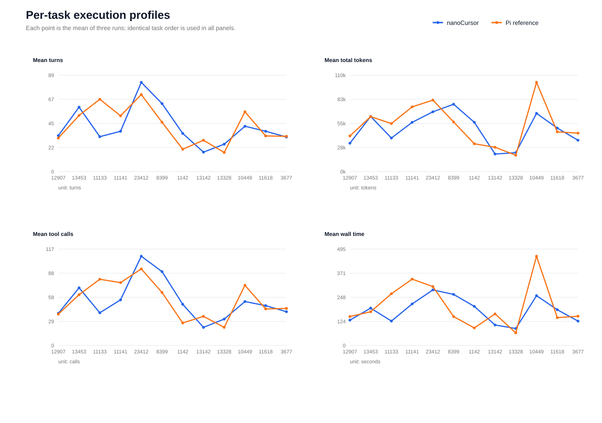

# nanoCursor

nanoCursor 是一个面向个人开发与学习的轻量终端 Coding Agent。它能够根据自然语言需求检索和阅读代码、修改文件、执行测试，并结合运行结果继续调整实现。项目使用 Python 开发，包含流式模型调用、工具执行、上下文管理、会话恢复、权限控制和多 Agent 协作等功能，关注真实代码仓库中的开发任务。

仓库同时提供独立的评测工具 AgentEval。AgentEval 使用 Docker 固定代码版本和运行环境，在 Agent 结束后执行目标测试、回归测试和受保护文件检查，并记录 Turns、Token、工具调用与耗时。Agent 负责完成代码任务，AgentEval 负责运行编排和结果验收，两者相互独立，Agent 无法读取隐藏验收结果。



## 安装与快速开始

推荐 macOS 或 Linux，Python 运行时由 [uv](https://docs.astral.sh/uv/getting-started/installation/) 管理。先安装 uv，再在下载的仓库中安装一次独立命令：

```bash
git clone https://github.com/MagicalLiHua/nanoCursor.git
cd nanoCursor
uv tool install --managed-python --python 3.12 \
  --constraints packaging/runtime-constraints.txt \
  --build-constraints packaging/build-constraints.txt .
```

如果终端找不到 `nanocursor`，执行 `uv tool update-shell` 后重新打开终端。普通用户无需激活虚拟环境或每次运行 `uv sync`。

进入你希望修改的项目目录：

```bash
cd /path/to/your-project
nanocursor
```

首次启动提供设置向导：选择服务商、Base URL、模型 ID，以及隐藏输入的 API Key。默认将凭据保存到用户级文件 `~/.nanocursor/credentials.json`，以当前用户权限限制访问；它是明文文件，不是系统钥匙串。设置之后，Bash 和 Zsh 都可直接启动，不依赖 `.bashrc`。也可以明确选择环境变量方式，或配置无需认证的本地服务。

若终端已经导出了完整的 `DEEPSEEK_API_KEY`、`DEEPSEEK_BASE_URL`、`DEEPSEEK_MODEL`，没有连接配置也可直接启动，跳过向导且不保存凭据。已有配置时用 `nanocursor --env deepseek` 明确选择这组环境变量。Anthropic/OpenAI 的同名前缀也受支持，具体选择规则见[环境变量说明](docs/usage.md#直接使用环境变量)。

常用命令：

```bash
nanocursor /path/to/your-project
nanocursor --cwd /path/to/your-project
nanocursor setup                 # 重新设置连接、凭据与默认模型
nanocursor doctor                # 本地只读检查，不调用模型
nanocursor doctor --network      # 短模型请求检查，可能产生少量 API 费用
nanocursor --version
```

启动位置默认为工作目录，Git 子目录不会自动跳回仓库根目录。若发现旧 Worktree，会先询问是否恢复，默认留在当前目录。项目设置在首次使用或变更后需要确认，之后才会启动其中配置的 Hooks/MCP 等行为。`-p` 不弹出设置向导，需要先准备好配置或完整环境变量连接。

完整的[配置、诊断与命令说明](docs/usage.md)及[开发、打包和发布说明](docs/development.md)列出兼容规则与平台限制。当前没有把 PyPI 包名作为已验证安装渠道；请从本仓库或作者发布的版本产物安装。

## 项目组成

| 模块 | 实现 | 主要功能 |
|---|---|---|
| nanoCursor | Python | 代码检索、文件编辑、命令与测试执行、多轮工具调用 |
| AgentEval | TypeScript | 任务管理、Docker 沙箱、运行编排、轨迹记录和自动验收 |

nanoCursor 目前提供以下能力：

- Bash、代码搜索、文件读写和代码编辑工具；
- 流式多轮模型调用、上下文压缩、会话恢复和当前运行内的检查点回退；
- 人工权限确认、可选的模型辅助 Bash 审批、Hook 和 OS 沙箱接入；
- MCP、Skills、子 Agent、Team 和 Worktree 协作；
- 交互式终端、用于脚本或验收的 `-p` 入口，以及独立的评测适配器。

公开仓库还包含 72 次脱敏实验记录、Bad Case 分析和可重新生成的统计图表。

## 日常使用与权限

默认模式下，文件写入和需要授权的命令会请求确认。普通文件编辑的审批框可选择“允许本次，并开启自动编辑（本次运行）”，切换到 `acceptEdits`；也可以在启动时明确选择：

```bash
nanocursor --mode acceptEdits
```

该模式允许普通文件读写，Bash 仍按命令规则检查，显式 `ask` / `deny` 和受限路径检查继续生效。界面内用 `/permission mode default` 恢复默认模式。权限规则也会传给子 Agent 和 Team；损坏的规则文件会报错，不会静默当作没有规则。

`-p` 执行一次任务后退出，适合脚本和安装验收；AgentEval 使用独立的评测入口。例如：

```bash
nanocursor -p '阅读 README，概括项目结构'
nanocursor --mode acceptEdits -p '创建 hello.py，打印 hello'
```

非交互任务遇到待审批操作会停止并提示需要授权，返回非零退出码。它不会自动替用户同意。`--output-format stream-json` 提供事件流和最终结果，便于脚本检查完成状态；详见[非交互授权说明](docs/usage.md#非交互任务的授权和退出状态)。

`/rewind` 可恢复某一轮完成时的代码、对话或两者。检查点只保留在当前运行内，文件回退覆盖主 Agent 文件工具跟踪的改动；外部修改或备份损坏会明确报错。恢复对话后，模型自动审批回退人工确认，直到新建会话。详见[检查点与回退](docs/usage.md#检查点与回退)。

Bash 大量输出采用有上限的首尾保留，文件读取和搜索也设有大小限制；界面显示处理后的预览。上下文压缩会保留落盘输出供历史引用，暂未自动清理磁盘文件，详见[输出与文件限制](docs/usage.md#大量输出与文件大小)。

历史浏览器入口 `--remote` 暂不作为推荐使用方式；其监听和鉴权问题尚未处理。

## 评测设计

评测任务选自 SWE-bench，包含 9 个 Python 开源仓库的 12 个真实 Issue，涉及 Astropy、Django、Matplotlib、pytest、Requests、scikit-learn、Sphinx、SymPy 和 Xarray。

nanoCursor 与 Pi 参考组使用相同的 DeepSeek 模型、任务描述、system prompt、工具权限和运行预算，并在相同的 Docker 环境中接受同一套验收。每个任务分别运行 3 次，共得到 72 次运行记录：

```text
12 个任务 × 2 套 Agent harness × 3 次 = 72 次运行
```

评测区分两类结果：

- **内容验收通过**：代码同时通过 Issue 目标测试和原仓库回归测试；
- **正常完成协议**：Agent 在限制内结束运行并返回最终结果。

两项指标分开记录，是为了区分代码结果与运行终止状态。例如，某次 nanoCursor 运行已经通过全部代码测试，但在第 96 turn 达到预算上限，未能输出最终总结。该次运行计为内容通过、协议未完成。

## 评测结果

| 指标 | nanoCursor | Pi 参考组 |
|---|---:|---:|
| 内容验收通过 | 32/36（88.9%） | 33/36（91.7%） |
| 正常完成协议 | 31/36（86.1%） | 33/36（91.7%） |
| 总 Token | 1,760,888 | 1,926,021 |
| 工具调用 | 1,946 | 1,982 |
| 运行总耗时 | 6,499.2 s | 7,341.7 s |

按相同任务和重复序号对齐后，两套 Agent 有 35/36 次得到相同的内容验收结果。12 个任务中，10 个任务在两套 Agent 上均为 3/3 通过；Django `11141` 均为 0/3，Sphinx `10449` 是唯一出现通过次数差异的任务，nanoCursor 为 2/3，Pi 为 3/3。



这些结果来自仓库中保存的固定实验版本与配置，后续安装、审批和可靠性改进尚未重新运行这组 72 次实验。结果仅描述该任务集合和实验配置，不构成两套 Agent 等价或具有普遍性能差异的证明。

## 结果分析

### 同一任务的运行波动

在模型、任务和预算保持一致的情况下，不同运行仍可能选择不同的搜索与验证路径。nanoCursor 在 sklearn `13328` 上三次运行的最大 Token 消耗是最小值的 `2.34` 倍；Pi 在 astropy `12907` 上的对应比例为 `2.22`。因此，项目保留每个任务的三次独立运行，没有使用单次结果代表整体表现。



### 过程成本差异

按任务统计，nanoCursor 相对 Pi 的 Token 差异范围为 `-34.8%` 至 `+77.5%`。nanoCursor 的总 Token 和总耗时分别低 `8.6%` 和 `11.5%`，但不同任务上的差异方向并不一致，因此不据此推导普遍的效率优势。



### 共同失败

Django `11141` 在 nanoCursor、Pi 及另一组模型实验中均遗漏相同的空 namespace 边界，9 次运行表现为同类失败。结合代码 Diff 和执行轨迹，该问题更接近模型对任务语义的理解偏差，而非某一套 harness 的单独工具故障。

完整统计、12 张图表和复算方法见[实验结果与复算说明](evaluation/results/README.md)，失败案例的逐项分析见 [Bad Case 分析](evaluation/results/CAUSAL_ANALYSIS.md)。

## Bash 自动审批

主 Agent 的交互界面支持独立模型审批，默认关闭。输入 `/approval on` 开启，`/approval off` 关闭，`/approval status` 查看实际模型路由、沙箱状态和最近结果。开启后默认使用当前主模型；`/approval provider <配置中的名称>` 切换独立审批模型，`/approval provider main` 恢复跟随主模型。这些命令只修改当前运行。

持久化默认值可在配置中设置：

```yaml
approval:
  mode: manual          # manual 或 smart
  provider: null        # null 跟随主模型，也可填写 providers 中的名称
  timeout_seconds: 10   # 一次审查的总期限，包含连接和响应
```

审批模型收到完整命令、真实工作目录、实际沙箱/网络权限及直接用户输入。日常开发、项目依赖安装和明确的生成物清理可由模型单次批准；推送、发布、上传、凭据访问和权限扩大等操作仍需人工授权。显式 `deny` / `ask` 和 Hook 拒绝优先，现有用户 `allow` 规则保留。模型批准不会写入白名单。

模型不认可、超时或输出异常时，界面显示命令、工作目录和简短原因，只提供“仅允许这次 / 拒绝”。可用 Escape 取消任务。命令、用户限制、权限或工作目录在审查期间变化，会使批准失效。

没有 OS 沙箱也可以开启。smart 生效时替代“沙箱自动放行”捷径，不关闭沙箱本身；`plan` / `bypassPermissions` 下暂停模型审批。子 Agent、队友、远程与无交互入口本期不接入。它是辅助判断，不能证明任意脚本安全，也不提供文件读取隔离。

直接用户限制独立于对话压缩保存；旧会话缺少来源标记或授权内容超出预算时回退人工。开始独立新任务可使用 `/clear` 或 `/session new`。审批诊断不额外保存命令或原始模型响应；直接用户输入的来源记录随本地会话保存。

内置 52 条合成样例的回放工具只审查命令，不执行它们：

```bash
# 无网络：只检查确定性规则；需要模型的条目标为 pending
uv run python -m nanocursor.eval.approval --dry-run

# 实际 API 调用：显式选择已配置的 provider，报告写入被 Git 忽略的目录
uv run python -m nanocursor.eval.approval --provider deepseek --repeat 2 \
  --output .artifacts/approval-replay.json
```

报告分别统计必须人工操作的错误放行、普通操作转人工、调用失败、重复判断差异、p50/p95 延迟和返回的 token 用量。真实回放按所选模型计费；少量样例零错误不代表任意命令都能可靠判断。

## 运行测试

```bash
uv run pytest -q
```

测试覆盖核心 Agent 循环、工具执行与取消、Hook、权限、自动审批、团队协作、MCP、Skills、上下文管理、检查点回退和评测适配器。CI 还验证独立安装、首次配置、工作目录与命令执行；以对应提交的实际测试结果为准。

## 使用 AgentEval

AgentEval 位于 `evaluation/agent-eval-lab/`：

```bash
cd evaluation/agent-eval-lab
npm install
npm run check
npm test
npm run cli -- issue-list
```

运行真实模型实验需要自行配置模型 API 和 Docker 环境。公开仓库不包含模型完整对话、原始轨迹或密钥，仅保留核验统计结果所需的脱敏字段。

## 仓库结构

```text
nanocursor/                         Python Coding Agent
tests/                              单元测试与集成测试
docs/                               使用、配置、开发与发布说明
packaging/                          运行及构建依赖约束
scripts/                            发行包检查与独立安装验收
evaluation/agent-eval-lab/          TypeScript 评测工具
evaluation/results/data/            脱敏逐次结果与审计证据
evaluation/results/manifests/       冻结任务清单
evaluation/results/figures/         可复算 SVG 图表
evaluation/analysis/                数据导出与绘图脚本
```

## 结论边界

- 任务来自 SWE-bench，但本实验不是 SWE-bench 官方提交或榜单成绩；
- 每个任务重复 3 次，结果用于描述当前样本，不进行显著性推断；
- 两套 Agent 共享任务、提示词和工具合同，共同失败不能排除共同设计因素；
- Token 与耗时结果只适用于本次模型、任务和运行环境。

## 版本说明

`v3.0.0` 为当前 Agent + Evaluation 版本。旧版工程保留在 `legacy-v2.0.0` 标签中，主分支不再维护旧版架构。

## License

项目代码使用 [MIT License](LICENSE)。第三方组件及其许可证见 [THIRD_PARTY_NOTICES.md](THIRD_PARTY_NOTICES.md)。
