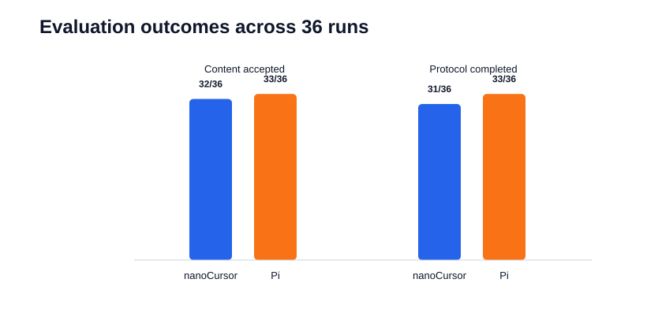
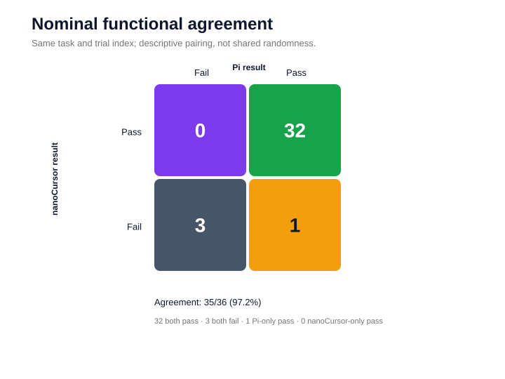
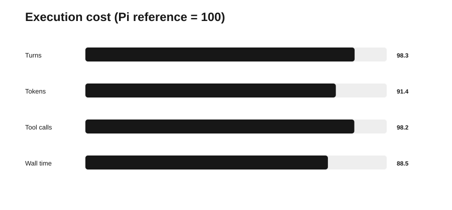
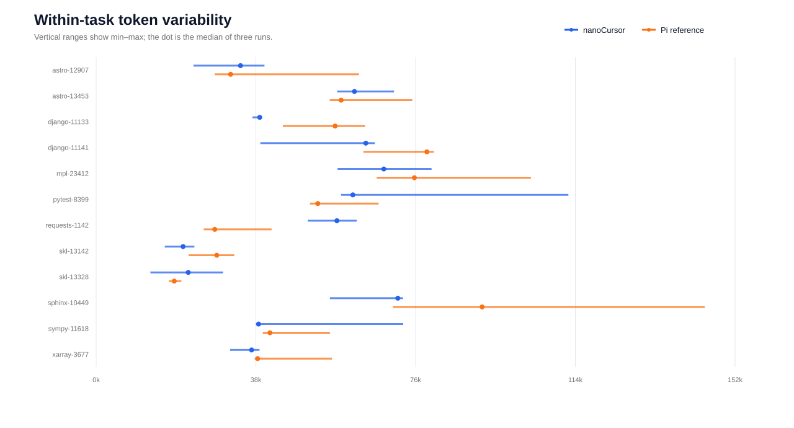
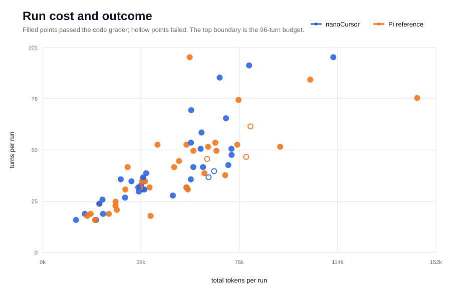
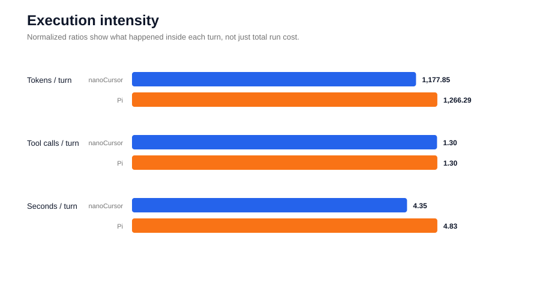
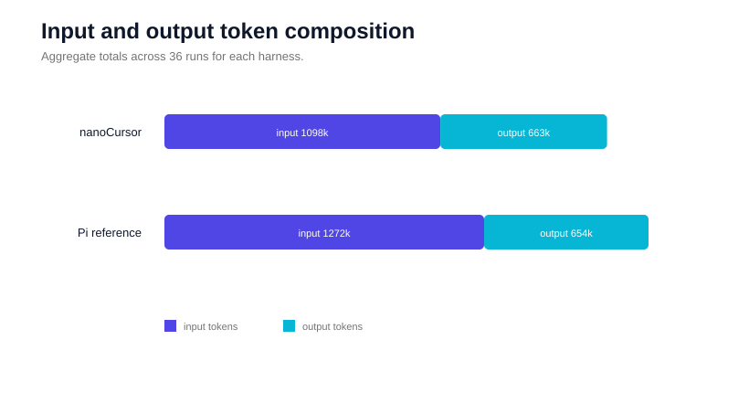
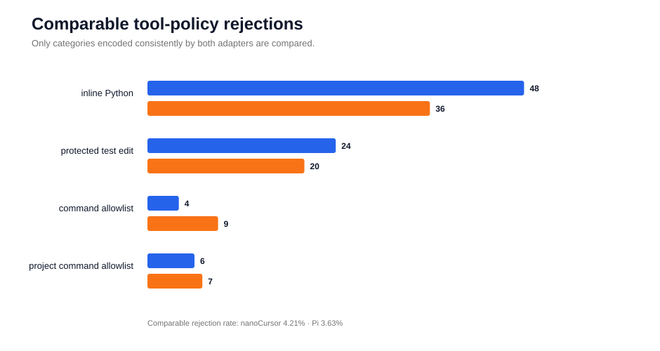

# 实验结果与复算说明

## 实验设置

- 任务：12 个 SWE-bench Python 真实仓库 Issue，覆盖 9 个开源项目；
- 重复次数：每个任务、每套 harness 各 3 次；
- 总运行数：nanoCursor 36 次，Pi 参考组 36 次；
- 公平约束：相同模型、任务文本、system prompt、最大 96 turns、20 分钟墙钟预算、容器资源限制和 grader；
- 网络：任务容器内禁网；
- 结果层次：`content_passed` 表示确定性代码验收通过，`protocol_completed` 表示 Agent 正常结束并给出最终结果。

## 结果摘要

| 指标 | nanoCursor | Pi 参考组 |
|---|---:|---:|
| 内容验收通过 | 32/36（88.9%） | 33/36（91.7%） |
| 正常完成协议 | 31/36（86.1%） | 33/36（91.7%） |
| 总 Turns | 1,495 | 1,521 |
| 总 Token | 1,760,888 | 1,926,021 |
| 工具调用 | 1,946 | 1,982 |
| 运行总耗时 | 6,499.2 s | 7,341.7 s |

两套 harness 按相同任务和名义 trial 对齐后，功能结果一致 35/36（97.2%）。这说明在当前有限样本和受控设置下，两套执行路径的最终功能结果高度接近；它不是等价性证明，也不能外推为通用效率优势。





## 逐任务结果

12 个任务中有 10 个在两套 harness 上均为 3/3 通过；Django `11141` 两边均为 0/3，Sphinx `10449` 出现唯一一组功能差异：nanoCursor 为 2/3，Pi 为 3/3。柱状图刻意保留三次重复，而不是把任务压缩成一个二值结果。


这一分布支持“当前样本没有出现 nanoCursor 的系统性功能退化”，但不能证明 harness 等价。Django 的共同失败和 Sphinx 的单次差异需要分别分析，不能用总体通过率替代 Bad Case 归因。

## 逐任务成本曲线

下面四组折线使用完全相同的任务顺序，每个点是同一题三次运行的均值。Turns、Token、工具调用和耗时大体一起变化，但两条线频繁交叉：nanoCursor 并不是每题都更省，Pi 也不是每题都更稳定。


按任务均值计算，nanoCursor 相对 Pi 的 Token 差异从 Sphinx `10449` 的 `-34.8%` 到 Requests `1142` 的 `+77.5%`；耗时差异从 Django `11133` 的 `-52.8%` 到 Requests `1142` 的 `+122.8%`。因此总量上的 `-8.6% Token` 和 `-11.5% 耗时`只能描述这 12 题，不能当作普遍效率结论。



## 三次重复的波动

36 个点按 12 个任务、每题 3 次排列。即使模型、任务和预算相同，Token 仍会因为搜索顺序、验证范围和工具调用路径不同而波动。


折线适合看运行顺序，下面的极差图则直接显示每题三次运行的最小值、中位数和最大值。nanoCursor 在 sklearn `13328` 上的最大/最小 Token 比为 `2.34`，Pi 在 astropy `12907` 上为 `2.22`。这也是实验每题重复 3 次，而不以单次运行下结论的原因。



## 单次运行的成本与结果

散点图保留 72 次运行中的离群点。横轴是 Token，纵轴是 Turns；实心点通过代码验收，空心点未通过。高成本不等于成功，低成本也不必然代表过早退出。



两套 harness 的 36 次运行分布如下。平均值容易被 96-turn 等离群点拉高，因此同时给出中位数和标准差。

| 单次运行指标 | nanoCursor 平均 / 中位数 / 标准差 | Pi 平均 / 中位数 / 标准差 |
|---|---:|---:|
| Turns | 41.5 / 36.0 / 19.8 | 42.2 / 40.5 / 19.5 |
| Token | 48,913.6 / 45,158.0 / 21,302.3 | 53,500.6 / 54,110.5 / 26,621.9 |
| 工具调用 | 54.1 / 47.0 / 26.9 | 55.1 / 50.5 / 24.8 |
| 耗时（秒） | 180.5 / 158.2 / 78.6 | 203.9 / 164.9 / 120.5 |

## 每轮内部发生了什么

总量接近不代表每轮承载的信息与动作一致。下图把总 Token、工具调用和耗时除以总 Turns，展示两套执行路径的内部强度。



公开逐次 CSV 只保留总 Token；输入/输出拆分来自汇总审计证据。nanoCursor 的输入为 1,097,756、输出为 663,132；Pi 的输入为 1,271,780、输出为 654,241。两组输出量接近，主要差异来自输入上下文累计。



## 工具约束与拒绝

为了避免两套 adapter 对普通命令失败的编码差异，只比较四类能够一致识别的策略拒绝。nanoCursor 为 82/1,946（4.21%），Pi 为 72/1,982（3.63%）；差异主要来自 inline Python 和修改受保护测试的尝试。它说明模型会反复试探工具边界，但没有形成与功能失败稳定对应的因果链。



## 图表索引

| 图表 | 回答的问题 |
|---|---|
| `evaluation-pipeline.svg` | 实验控制了哪些变量，结果如何产生 |
| `overall-outcomes.svg` | 两套 harness 的功能与协议结果分别是多少 |
| `functional-agreement.svg` | 36 组名义对照中，结果有多少一致/不一致 |
| `task-pass-counts.svg` | 差异集中在哪些任务 |
| `task-metric-profiles.svg` | Turns、Token、工具调用和耗时如何随任务变化 |
| `trial-token-lines.svg` | 72 次运行的 Token 路径如何波动 |
| `token-variability.svg` | 同题三次运行的最小值、中位数和最大值差多少 |
| `success-cost-scatter.svg` | 高成本是否必然带来通过 |
| `cost-comparison.svg` | nanoCursor 总成本相对 Pi 是多少 |
| `execution-intensity.svg` | 每个 Turn 内的 Token、调用和耗时强度是否相同 |
| `token-composition.svg` | 总 Token 差异来自输入还是输出 |
| `tool-policy-rejections.svg` | 哪些工具边界最常被模型触碰 |

## 文件说明

- `data/runs.csv`：72 次脱敏逐次记录；
- `data/summary.json`：README 表格、分布统计和逐任务均值的汇总来源；
- `data/attribution-evidence.json`：逐任务归因证据；
- `data/full-audit.json`：任务、配置与结果一致性审计；
- `manifests/`：12 个任务的冻结资产清单和哈希；
- `figures/`：由公开 CSV 重新生成的 SVG 图表；
- `CAUSAL_ANALYSIS.md`：Bad Case 逐项归因与结论边界。

`runs.csv` 不含 prompt、模型回答、源码片段和完整工具轨迹。字段含义：

| 字段 | 含义 |
|---|---|
| `harness` | nanoCursor 或 Pi 参考组 |
| `run_id` | 唯一运行标识 |
| `task_id` | 冻结任务标识 |
| `repository` | 上游仓库 |
| `trial` | 同任务的名义重复序号 |
| `status` | Agent 协议结果 |
| `protocol_completed` | 是否正常结束并生成最终回答 |
| `content_passed` | 确定性 grader 是否接受代码结果 |
| `termination` | 运行终止原因 |
| `turns` / `total_tokens` / `tool_calls` | 运行成本指标 |
| `wall_seconds` | 单次墙钟耗时 |

## 复算

图表脚本只使用 Python 标准库。基于已提交的 CSV 重建汇总和图表：

```bash
python evaluation/analysis/build_public_artifacts.py \
  --output-dir evaluation/results
```

脚本也支持从私有原始结果导出公开 CSV；这些原始文件不在仓库中，相关参数可通过 `--help` 查看。

## 结论边界

- 任务选自 SWE-bench，但该实验不是 SWE-bench 官方提交或榜单成绩；
- trial 没有共享随机种子，不是严格随机配对实验；
- 每题只有 3 次重复，不做显著性检验；
- 两套 harness 共享任务、prompt 与工具合同，共同失败不能单独排除共同设计因素；
- 总 Token 与耗时是本次任务集合上的描述性统计，不声称 nanoCursor 在其他模型或任务上始终更省。
