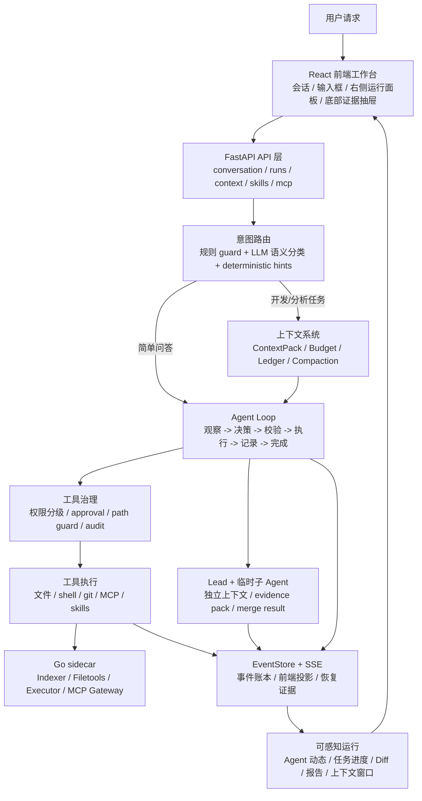
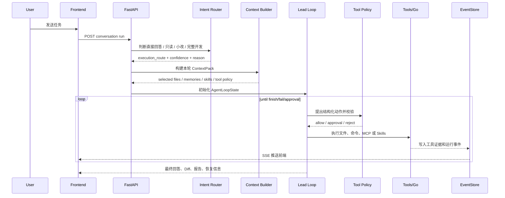

# 00. 学习路线：如何把 nanoCursor 真正吃透

最后更新：2026-06-12

## 1. 本章目标

这一章是整个学习站的入口。读完后你应该知道：nanoCursor 不是一堆功能堆在一起，而是一套围绕“本地 AI 编程任务”组织起来的运行系统。你要学的不是每个文件逐行怎么写，而是每个模块为什么存在、它接收什么输入、产出什么证据、失败时谁负责兜底。

学完本章，你应该能回答：

- 一次用户请求为什么会经过意图路由、上下文、Agent Loop、工具治理、事件流和交付总结。
- 哪些模块是“智能决策层”，哪些模块是“确定性执行层”，哪些模块是“观测与恢复层”。
- 学习时应该先读哪些章节，后读哪些章节，什么时候回到源码验证。
- 面试时如何把项目讲成一个可控的 AI 编程系统，而不是“用 AI 写了个 AI 工具”。

## 2. 先建立一张总图

把 nanoCursor 想成四层：交互层、决策层、执行层、证据层。前端不是核心智能，但它让运行过程可见；Agent Loop 不是简单 while loop，而是所有动作的控制面；Go sidecar 不是为了凑语言，而是把文件、索引、执行、MCP 这类确定性能力抽出去。



这张图要背后的含义是：**模型不是直接操作项目，模型只能提出下一步动作；动作要经过上下文、工具策略和事件证据约束。**

## 3. 学习时不要从文件开始，从问题开始

如果你一上来就打开 `src/api/services/`，会被几十个 service 淹没。更好的方式是从问题切入：

| 你要理解的问题 | 对应模块 | 先读章节 | 再看代码 |
|---|---|---|---|
| 用户一句话怎么变成一次 run？ | 请求生命周期 | 02 | `conversation_run_service.py`、`run_start_service.py` |
| 为什么“哈喽”不会创建 Coder？ | 意图路由 | 02、03 | `intent_router.py`、`semantic_intent_classifier.py` |
| Agent Loop 到底循环什么？ | Agent Loop | 03 | `agent_loop_state_service.py`、`agent_loop_controller_service.py` |
| 子 Agent 是不是污染主上下文？ | 多 Agent 编排 | 04 | `parallel_agent_service.py`、`agent_result_merge_service.py` |
| 模型为什么知道该看哪个文件？ | 上下文管理 | 05 | `context_service.py`、`context_budget_service.py` |
| 长对话怎么不爆 token？ | 记忆与压缩 | 06 | `memory_selection_service.py`、`compaction_service.py` |
| 工具为什么不能随便执行？ | 工具治理 | 07 | `tool_policy_runtime.py`、`action_execution_service.py` |
| 用户怎么知道系统没卡住？ | 事件流与前端可观测 | 08、12 | `event_store.py`、`useSSE.js` |
| 后端为什么要关心 async？ | 异步边界 | 09 | `runtime_executor_service.py`、`command_runner.py` |
| Go 在项目里到底有什么价值？ | Go sidecar | 10 | `go-services/`、`go_*_service.py` |
| MCP 和 Skills 怎么进入系统？ | 扩展能力 | 11 | `mcp_runtime_service.py`、`skill_*_service.py` |
| 怎么证明模块不是摆设？ | 测试与 Benchmark | 13 | `tests/`、`evals/`、benchmark services |

## 4. 一次请求的最小心智模型

你只要掌握下面这条链，就能解释项目大多数行为：



面试时不要把这条链背成接口列表，而要讲出“为什么”：意图路由避免过度执行，上下文选择避免盲目搜索，工具策略避免越权，EventStore 让过程可复盘，Agent Loop 让系统能根据中间结果继续决策。

## 5. 四条主线必须融会贯通

### 主线一：Agent Loop

Agent Loop 是“谁决定下一步”的问题。它的关键不是循环，而是每一步都被结构化记录：观察到了什么、选择了什么动作、为什么被允许、产生了什么证据、是否应该结束。

学到位的标志：你能解释为什么它不是 LangGraph 固定 DAG，也不是裸 while loop；你能说出 `AgentLoopState`、`LeadAction`、`append_loop_step`、`finish readiness` 分别负责什么。

### 主线二：上下文与记忆

上下文是“模型看什么”的问题。记忆是“哪些长期事实值得再次进入上下文”的问题。ContextPack 解决本轮输入结构，Budget 解决 token 分配，Ledger 解决可观测，Compaction 解决窗口压力，MemoryRecord 解决长期偏好和事实。

学到位的标志：你能解释为什么上下文管理比多 Agent 数量更重要；你能说出 P0 锚点、selected_files、omitted、conversation_summary、execution_summary 的区别。

### 主线三：工具治理与失败恢复

工具治理是“模型能做什么”的问题。失败恢复是“做错了怎么办”的问题。成熟系统不能让模型直接 shell，也不能所有错误都一句“交给 Agent 修”。需要先分类，再决定自动修复、等待审批、降级执行或询问用户。

学到位的标志：你能解释 read_only、safe_write、risky_write、shell_safe、shell_risky 的边界；能说明缺依赖、测试失败、路径越界、审批等待的处理差异。

### 主线四：事件、Go 与扩展能力

事件流是“用户怎么看见系统在干什么”的问题。Go sidecar 是“哪些确定性能力适合从 Python 中抽出”的问题。MCP/Skills 是“如何让系统接入外部能力和任务规范”的问题。

学到位的标志：你能解释 EventStore 为什么不是普通日志；Go 为什么不是策略中心；MCP 和 Skills 分别解决“工具协议”和“行为规范”。

## 6. 每章应该怎么学

每读一章都按同一个闭环走：

```text
先读目标 -> 看结构图 -> 找关键代码 -> 跑一个真实任务 -> 看事件和日志 -> 回答自测题 -> 写自己的复述
```

不要只看文档。学习站的目标是降低你读源码的门槛，不是替代源码。真正掌握的标准是：你能从一个前端现象反推后端链路，比如“为什么哈喽会创建任务卡”“为什么小改动没有写文件却失败”“为什么子 Agent 的工具事件显示到了聊天里”。

## 7. 建议的 7 天学习安排

| 天数 | 主题 | 目标 |
|---|---|---|
| Day 1 | 00、01、02 | 建立项目全景，能讲清一次请求生命周期 |
| Day 2 | 03、04 | 吃透 Agent Loop 和临时子 Agent 编排 |
| Day 3 | 05、06 | 吃透 ContextPack、预算、压缩、记忆选择 |
| Day 4 | 07、08、09 | 吃透工具治理、失败恢复、事件流和异步边界 |
| Day 5 | 10、11 | 吃透 Go sidecar、MCP、Skills 的边界和价值 |
| Day 6 | 12、13、14 | 理解前端可观测、测试体系、启动配置 |
| Day 7 | 15、interview、exercises | 用真实任务和面试题验证自己能讲出来 |

如果只有 2 天，就优先读 01、02、03、04、05、07、13、15 和面试题库。前端和 Go 细节可以作为加分项，不要抢主线。

## 8. 学完后的验收标准

你不需要能默写每个函数，但需要达到下面标准：

| 能力 | 达标表现 |
|---|---|
| 讲项目 | 1 分钟、3 分钟、8 分钟三个版本都能讲清楚 |
| 追链路 | 给一个用户请求，能说出前端、API、路由、上下文、Loop、工具、事件的顺序 |
| 解释取舍 | 能解释为什么不用固定 DAG、为什么默认 Lead、为什么 Go 只做 sidecar |
| 定位源码 | 面试官问某个模块时，能指出 2-3 个关键文件 |
| 承认边界 | 能诚实说出项目短板和下一步改进，不把它吹成成熟商业工具 |
| 做实验 | 能跑一个真实任务，并用事件、Diff、测试结果说明模块是否工作 |

## 9. 最容易被问倒的地方

提前准备这些问题：

- 你的 Agent Loop 和 LangGraph 到底有什么本质差异？
- Lead 是怎么决定创建哪些子 Agent 的？是否真的智能？
- 子 Agent 有没有独立上下文？结果怎么合并？
- 上下文选择如果选错文件怎么办？
- 记忆会不会污染当前任务？
- 工具审批是不是只是前端弹框？
- Go 微服务为什么有些反而慢？
- MCP/Skills 和成熟工具比差在哪里？
- 如果没有这些模块，系统还能不能运行？怎么用消融实验证明价值？

这些问题在后面的面试章节都有展开。你要做的不是背答案，而是把答案和真实代码、真实事件、真实测试绑定起来。

## 10. 本章自测

1. 用一句话解释 nanoCursor 的四层架构。
2. 为什么说 Agent Loop 是控制面，而 Go sidecar 是执行面？
3. ContextPack、ToolPolicy、EventStore 三者分别约束了什么？
4. 为什么学习这个项目不能只看前端效果？
5. 如果面试官质疑“这是 AI 辅助写出来的”，你应该如何把焦点转回系统设计和验证？
