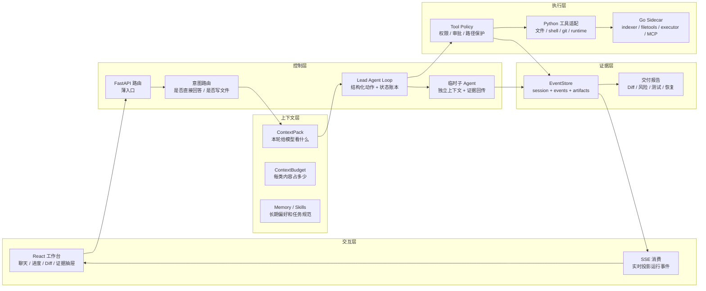

# 01. 项目全景：nanoCursor 到底是什么

最后更新：2026-06-12

## 1. 本章目标

读完本章，你应该能用 3 分钟讲清楚 nanoCursor 的定位、架构边界、核心模块和当前短板。重点不是背功能清单，而是理解：这个项目为什么不是普通聊天机器人，也为什么不能把它吹成 Codex/Cursor 的替代品。

## 2. 一句话定位

nanoCursor 是一个面向本地项目的轻量 AI 编程工作台。用户在前端发起需求，后端由 Lead Agent 判断任务复杂度，再按需进入 Agent Loop、选择上下文、创建临时子 Agent、调用受控工具、记录事件证据，并把代码改动、运行状态、风险和交付结果展示给用户。

它的价值不是替代成熟工具，而是把 AI 编程工具的核心机制拆开实现：**意图路由、Agent Loop、上下文管理、工具治理、事件流、失败恢复、MCP/Skills 和 Go sidecar 边界**。这几个模块能解释一个 AI 编程系统如何从“会聊天”走向“能在代码项目里受控地干活”。

## 3. 为什么它不是普通聊天机器人

普通聊天应用通常是：

```text
用户消息 -> LLM 回复 -> 前端展示
```

nanoCursor 的主链路更长：

```text
用户消息
  -> 绑定 workspace / conversation
  -> 意图识别与复杂度判断
  -> Lead 直接回答或进入 Agent Loop
  -> 构建 ContextPack 和工具策略
  -> 调用文件、命令、测试、记忆、MCP、Skills
  -> EventStore 持久化事件和证据
  -> 前端展示 Agent 动态、任务进度、Diff、恢复和交付物
```

所以项目关注的不只是“模型怎么回复”，而是一次编程任务从请求到交付的控制面：模型看到什么、能做什么、做错了怎么恢复、用户如何知道系统没卡住。

## 4. 系统分层图

学习这个项目时，不要把它看成“前端 + 后端 + Go 服务”三块，而要按职责分层理解：



这张图能帮你回答“项目到底复杂在哪里”：复杂点不在某个单独 API，而在控制层、上下文层、执行层、证据层之间的约束关系。

## 5. 核心模块总览

| 模块 | 入口文件 | 解决的问题 | 学习重点 |
|---|---|---|---|
| API 层 | `src/api/server.py`、`src/api/app.py`、`src/api/routes/` | 创建 FastAPI app，注册路由、中间件、健康检查和错误处理 | 路由只做薄入口，复杂逻辑下沉到 services |
| 会话与运行 | `conversation_run_service.py`、`run_start_service.py`、`workflow_thread_service.py` | 把用户消息变成绑定会话和工作区的一次 run | 同一会话连续对话不能乱开新上下文 |
| 意图路由 | `intent_router.py`、`routing_decision_service.py` | 判断直接回答、只读分析、小改动、完整开发或高风险任务 | 不让“哈喽”触发一堆任务卡 |
| Agent Loop | `agent_loop_state_service.py`、`agent_loop_controller_service.py` | 观察状态、提出动作、校验、执行、记录和收束 | 不是固定 DAG，而是可审计的持续决策 |
| 上下文管理 | `src/agent/context_pack.py`、`context_budget_service.py`、`file_outline_service.py` | 选择相关文件、摘要、记忆、Skills、失败信息和工具策略 | 让模型知道该看什么，而不是塞整个项目 |
| 工具治理 | `tool_policy_runtime.py`、`action_policy.py`、`action_execution_service.py` | 权限分级、路径防护、审批、审计和恢复 | Agent 可以做事，但不能越界 |
| 事件与前端可观测 | `event_store.py`、`useSSE.js`、`handleAgentEvent` | 把运行阶段、工具调用、Diff、错误和交付物实时展示 | 用户知道系统正在做什么 |
| 失败恢复 | `failure_recovery_loop_service.py`、`recovery.py` | 失败分类、恢复计划、Coder 修复任务、验证重跑 | 不是所有错误都交给 Agent，有些要停下或审批 |
| Go sidecar | `go-services/`、`file_ops.py`、`command_runner.py` | 文件工具、索引、命令执行、MCP 等确定性边界增强 | Go 是执行后端，不绕过 Python 策略层 |

## 6. 和 LangGraph 的关系

项目早期受 LangGraph / 状态图思路影响，但后来转向自研 Agent Loop。这个选择不是为了重复造轮子，而是因为交互式编程任务很难提前画死：用户可能只是问候，工具可能失败需要恢复，测试失败后也要先判断原因再决定改代码、改测试还是询问用户。

LangGraph 的优势是流程显式、状态图清楚，适合 RAG 管道、审批流、固定业务流程。nanoCursor 当前更像 Codex/Cursor 这类工具的执行模型：Lead 持续观察状态，决定下一步动作，动作通过策略校验后执行，并把每一步记录成 ledger。它没有固定图的边，但有步数限制、工具策略、任务板、事件日志和完成条件。

## 7. 和 Codex / Cursor 的差距

要诚实：nanoCursor 不是成熟商业编程工具。它依赖外部 LLM，本身没有模型训练；上下文选择、前端体验、真实任务稳定性、安全隔离和 MCP/Skills 生态都远不如成熟产品。当前安全也主要面向单机本地工具，不是多用户 SaaS。

但这不影响它作为学习和展示项目的价值。它真正值得讲的是：你亲手拆解并实现了 AI 编程系统的关键后端机制，而不是只调一个 LLM API 或套一个框架。

## 8. 最值得讲的五个点

| 亮点 | 怎么讲 |
|---|---|
| Agent Loop | 默认只有 Lead，简单问题直接回答；复杂任务才进入计划、工具、子 Agent 和验证。重点是“该少的时候少”。 |
| 上下文管理 | 用 ContextPack 结构化选择项目索引、文件 outline、最近变更、失败信息、记忆和 Skills，而不是无差别塞完整历史。 |
| 子 Agent 证据合并 | 子 Agent 拿独立 ContextPack，只把 EvidencePack 和 summary 回传给 Lead，避免污染主上下文。 |
| 工具治理 | 将工具分成 read_only、safe_write、risky_write、shell_safe、shell_risky、mcp_read、mcp_write，并接入审批和审计。 |
| 事件流 | 用 EventStore + SSE 把 Agent 活动、工具调用、任务状态、Diff、恢复和交付物变成前端可感知运行。 |
| 失败恢复 | 命令或测试失败后先分类，再生成恢复计划；代码/测试类失败交给 Coder 修复并重跑验证，缺依赖和高风险动作要用户确认。 |

## 9. 当前不成熟的地方

这个项目仍有明显边界：部分服务层还存在历史包袱，`dict[str, Any]` 仍然偏多；真实复杂任务的 benchmark 还不够系统；前端体验还需要继续打磨；Go sidecar 是增强层，不是所有场景都更快；MCP/Skills 可以用，但还不是成熟生态。面试时承认这些短板反而更可信，因为你能说出下一步如何补。

## 10. 推荐学习路径

不要从前端样式开始学，也不要从 API 列表开始硬背。更好的顺序是：先读请求生命周期，再读 Agent Loop；然后读上下文管理和工具治理；再看事件流如何驱动前端；最后看记忆、MCP/Skills、Go sidecar、测试质量和项目复盘。

## 11. 面试追问

### Q1：这个项目最核心的技术难点是什么？

不是“多 Agent”本身，而是让 Agent 在本地代码项目里可控地干活：它需要判断任务复杂度、选择上下文、调用受限工具、记录过程、失败恢复，并把运行状态实时展示给用户。

### Q2：为什么不用 LangGraph？

固定 DAG 适合确定流程，但编程任务会被中间结果不断改变。nanoCursor 改用 Agent Loop：每步观察状态、提出动作、校验合法性、执行并记录证据，用工具策略和预算保证可控。

### Q3：多 Agent 是不是噱头？

如果每个请求都创建很多 Agent，那就是噱头。nanoCursor 的策略是默认 Lead，简单问题直接回答；只有任务确实需要并行分析、代码实现或验证复核时，才创建临时子 Agent。

### Q4：怎么讲才不像玩具项目？

不要说“我做了个 AI 编程工具”。更好的说法是：我拆解并实现了一个轻量 AI 编程工作台的核心后端机制，包括 Agent Loop、上下文管理、工具治理、事件流、失败恢复和 Go sidecar 扩展边界。

## 12. 自测题

1. nanoCursor 和普通聊天机器人的链路差在哪里？
2. 为什么简单问候不应该进入完整 Agent Loop？
3. ContextPack、ToolPolicyRuntime、EventStore 分别解决什么问题？
4. Go sidecar 在系统里为什么只是执行后端，而不是策略中心？
5. 面试时如何诚实描述它和 Codex/Cursor 的差距？

## 13. 动手练习

1. 启动学习站：`cd learning-site && npm run dev`，打开首页确认 16 个章节和代码地图能正常显示。
2. 打开 `src/api/services/conversation_run_service.py`，找到意图路由和 `lead_only_execution_plan` 的调用位置。
3. 打开 `src/agent/context_pack.py`，找到 `ContextPack` 的核心字段，并解释每类字段为什么存在。
4. 打开 `src/runtime/tool_policy_runtime.py`，确认 read/write/shell/MCP 的权限分级。
5. 打开 `src/api/services/failure_recovery_loop_service.py`，观察测试失败、缺依赖和策略阻断分别如何生成不同恢复计划。
