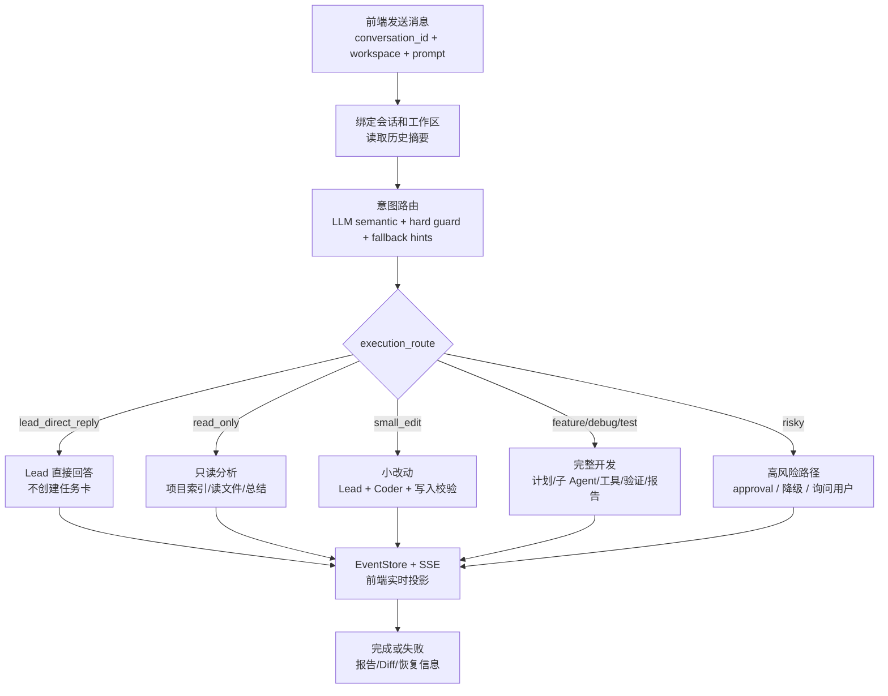

# 02. 请求生命周期：从用户消息到一次 run 完成

最后更新：2026-06-12

## 1. 本章目标

读完本章，你应该能追踪一条用户消息从前端输入到后端 run 完成的完整链路：它如何绑定 conversation 和 workspace，如何经过意图路由，什么时候 Lead 直接回答，什么时候进入 Agent Loop，事件又如何进入 EventStore 并被前端消费。

## 2. 总览流程

一次典型请求不是直接扔给模型，而是经过下面这条链路：

| 阶段 | 发生什么 | 关键文件 |
|---|---|---|
| 前端发送 | 带上 `conversation_id`、`workspace_dir`、prompt 和近期消息 | `frontend/src/store/actions/runActions.js` |
| 会话入口 | 调用 `POST /api/conversations/{conversation_id}/runs` | `src/api/routes/run_entry.py` |
| 会话绑定 | 根据 conversation 找到工作区和历史摘要 | `conversation_run_service.py` |
| 意图路由 | 判断直接回答、只读分析、代码任务、debug、高风险操作 | `intent_router.py` |
| 团队组合 | 简单任务只保留 Lead，复杂任务按需组合临时 Agent | `orchestration_service.py`、`ephemeral_agent_service.py` |
| 执行计划 | 生成 stages、tasks、agents、risks、tool_policy | `execution_plan_service.py` / `orchestration_service.py` |
| 标准 run | 注册 `RunContext`、创建 EventStore session、初始化 Loop state | `run_start_service.py` |
| 后台执行 | 用线程启动 Agent Runtime，API 先返回 `thread_id` | `workflow_thread_service.py` |
| 事件推送 | SSE 推送 Agent 活动、工具调用、Diff、错误、交付物 | `event_store.py`、`useSSE.js` |
| 结束恢复 | 前端 hydrate 快照/交付物，后端保留复盘证据 | `hydrators/`、`event_service.py` |

如果用户只是打招呼，这条链路会被压缩成：**意图识别为 direct answer -> Lead 回复 -> 不创建完整任务流**。这正是项目反复打磨的关键体验：不是所有消息都应该跑完整开发流程。



这张图能解释很多前端现象：如果一句问候右侧出现十几个任务，问题通常在 `Intent -> Route`；如果只读分析触发写文件，问题通常在 `align_tool_policy_with_intent`；如果任务结束后 Diff 没更新，问题通常在 `Events -> Finish` 的证据投影。

## 3. 关键入口代码

### 3.1 会话级 run 入口

```python
# src/api/routes/run_entry.py
@router.post("/conversations/{conversation_id}/runs")
async def create_agenthub_conversation_run(conversation_id: str, request: ConversationRunRequest):
    return await start_conversation_run(conversation_id, request)
```

这个接口说明：一次 run 应该绑定到已有会话，而不是每条消息都随便开一个新上下文。理想数据关系是：

```text
workspace -> conversations -> runs -> events/artifacts
```

### 3.2 意图路由优先于 Agent 编排

```python
# src/api/services/conversation_run_service.py
intent_context = context_from_conversation(
    conversation,
    prompt=request.prompt,
    workspace_dir=workspace_dir,
)
intent_decision = await classify_user_intent_async(
    request.prompt,
    conversation_summary=str(conversation.get("conversation_summary") or ""),
    runtime_context=intent_context,
)
is_simple = intent_decision.get("execution_route") == "lead_direct_reply"
```

`intent_decision` 同时包含“用户想做什么”和“系统该怎么运行”。常见字段有 `route`、`execution_route`、`requires_workspace_read`、`requires_workspace_write`、`requires_shell`、`requires_approval`。这里的设计重点是：**先判断是否需要干活，再决定创建哪些 Agent**。

当前路由已经不是单纯关键词 if/else，而是分成四层：

| 层 | 作用 | 失败时怎么处理 |
|---|---|---|
| deterministic fallback | 本地可运行的基础判断，保证没有模型也能用 | 作为兜底结果 |
| hard guard | 空输入、问候、no-write、高风险、approval 等强约束 | guard 胜过模型 |
| semantic classifier | 默认启用 LLM 结构化判断 route、confidence、risk、agents | 超时/非法 JSON 回退或澄清 |
| normalizer | 最终收口权限、Agent、工具策略、低置信澄清 | 输出稳定 `IntentDecision` |

这套设计的关键不是“让模型完全决定路由”，而是让模型只负责语义建议，系统负责安全边界。比如用户说“给我一个登录方案，不要改代码”，语义模型即使命中“登录模块实现”，normalizer 也会因为 explicit no-write 把写权限收掉。

当前默认模式是 `NANOCURSOR_SEMANTIC_INTENT_MODE=enabled`。也就是说，普通复杂请求会先尝试 LLM 语义判断；问候、空输入、高风险等强 guard 会提前结束，不浪费模型调用。如果需要离线调试或回归到确定性路由，可以设置 `NANOCURSOR_SEMANTIC_INTENT_MODE=disabled`。

语义分类器还会收到 deterministic fallback 的 hints。这样做不是让关键词重新主导决策，而是给模型一个“后端已经观察到什么”的上下文。例如 fallback 发现 `code_artifact_hint`、`tooling_hint`，语义模型就不应该轻易把“帮我写 Python 排序算法并比较性能”降级成普通解释。

每次判断还会写入 `router_trace`：

```json
{
  "deterministic_hints": ["code_artifact_hint", "tooling_hint"],
  "semantic_used": true,
  "semantic_route": "feature_delivery",
  "fallback_route": "feature_delivery",
  "final_route": "feature_delivery",
  "normalization_notes": ["semantic", "semantic_mode=enabled"]
}
```

`deterministic_hints` 不是最终决策，只是告诉你 fallback 看到了哪些线索。这样面试时可以讲清楚：项目没有盲目删除规则，而是把语义类关键词改成 `*_HINT_MARKERS`，把安全边界保留为 `*_GUARD_MARKERS`，再用 eval 逐步降低 hint 对最终结果的权重。

### 3.3 简单任务和复杂任务分流

简单问题使用 `lead_only_execution_plan`，它只保留 Lead，并限制写文件和高风险 shell。复杂任务才调用执行计划构造逻辑，并把团队、阶段、工具策略和验收标准写入计划。

```python
execution_plan = (
    lead_only_execution_plan(request.prompt, workspace_dir, members)
    if is_simple
    else await build_execution_plan_async(prompt=request.prompt, team=members, workspace_dir=workspace_dir)
)
align_tool_policy_with_intent(execution_plan, intent_decision)
```

`align_tool_policy_with_intent` 很关键：只读任务不允许写文件；测试任务可以运行 `shell_safe`，但不应该修改代码；高风险操作必须进入 approval。

### 3.4 标准 run 注册

`start_standard_run` 会生成 thread_id，创建 `RunContext`，初始化 EventStore session 和 Agent Loop state，然后启动后台 workflow thread。API 不等待 Agent 完成，而是立即返回 thread_id，让前端通过 SSE 观察运行过程。

```text
POST /api/conversations/{id}/runs
  -> start_conversation_run
  -> start_standard_run
  -> start_workflow_thread
  -> return { thread_id }
  -> frontend connects SSE
```

## 4. 两个真实案例

### 4.1 用户说“哈喽”

期望行为是：`route=direct_answer`，`execution_route=lead_direct_reply`，只出现 Lead，不创建 Planner/Coder/Tester，不生成完整交付报告，右侧进度为空或极简。如果出现一堆任务卡，通常不是模型“笨”，而是意图路由、会话绑定或前端旧 run 状态复用出了问题。

### 4.2 用户说“帮我用 Python 写常见排序算法并比较性能”

期望行为是：进入代码生成或 feature delivery 路线，`requires_workspace_write=true`，可能需要 `shell_safe` 测试命令；runtime team 至少包含 Lead + Coder，复杂时再引入 Tester/Reviewer；底部 Diff 能统计新增文件，最终交付报告应该整理改动、验证结果和使用方式，而不是把模型原始长回复直接塞给用户。

## 5. 常见 bug 排查

| 问题 | 优先排查 |
|---|---|
| 问候也生成任务卡 | `intent_router.py` 是否识别 greeting；`execution_route` 是否为 `lead_direct_reply`；前端右侧进度是否复用旧 run |
| 第二条消息开了新会话 | 前端是否保留当前 `conversation_id`；请求是否仍走 `/conversations/{id}/runs`；刷新 hydrate 是否覆盖会话状态 |
| 页面刷新回欢迎页 | URL/本地状态是否保存 conversation；启动时是否 restore active session；后端是否能按 workspace 返回会话 |
| Diff 没统计新文件 | change tracker 是否处理 untracked files；diff service 是否只看 git tracked；前端是否过滤新增文件 |
| 只读任务写文件 | `align_tool_policy_with_intent`、`check_loop_action_guard`、`ToolPolicyRuntime` 是否一致 |
| 运行失败后不知道下一步 | `failure_recovery_loop_service.py` 是否生成恢复计划；EventStore 是否有失败证据和恢复事件 |

## 6. 设计取舍

### 为什么要有 conversation run，而不是直接 `/api/run`

现代 AI 编程工具必须支持连续对话。每条消息都开独立 run 会导致历史丢失、任务串会话、刷新回欢迎页、右侧进度显示旧任务。会话级 run 让每条消息都能共享工作区、历史摘要、运行记录和上下文策略。

### 为什么区分 `route` 和 `execution_route`

用户意图和系统运行方式不是一回事。比如“Python 和 Java 谁更好”是讨论问题，执行方式是 Lead 直接回答；“运行测试看看”是验证任务，执行方式可能允许 `shell_safe`，但禁止写文件。把两层拆开后，工具策略才能对齐任务边界。

### 为什么不是所有任务都走完整计划

完整计划适合开发任务，但对问候、概念解释和讨论会显得很笨重。成熟工具的体验是“该轻的时候轻，该重的时候重”。nanoCursor 的 Lead-only 路线就是为了避免简单问题被复杂流程绑架。

## 7. 面试追问

### Q1：一次用户请求进入系统后发生了什么？

先进入会话级 run 接口，后端根据 conversation_id 和 workspace_dir 找上下文并做意图路由。简单问题由 Lead 直接回复；开发任务则组合运行时 Agent 团队，生成执行计划和工具策略，注册 RunContext，创建 EventStore session，启动后台 Agent Loop，并通过 SSE 把状态、工具调用、阶段进度、Diff 和交付物推给前端。

### Q2：为什么要把 run 绑定到 conversation？

因为 AI 编程不是一次性脚本。连续对话需要共享会话摘要、历史消息、工作区、运行记录和 Agent 策略；如果 run 游离在会话之外，就会出现第二条消息丢上下文、刷新回欢迎页、任务进度串到别的会话等问题。

### Q3：为什么不是完全让模型判断意图？

完全交给模型会在问候、高风险操作、空输入、是否写文件这些场景上不稳定。nanoCursor 使用确定性规则和 guard 兜底，再让 LLM 辅助复杂分类，最后由 normalizer 统一输出结构。

### Q4：EventStore 的价值是什么？

EventStore 让运行过程不只存在于内存队列。它支撑前端刷新恢复、历史会话回放、失败复盘、进度面板、底部证据抽屉和后续评测分析。

## 8. 自测题

1. `POST /api/conversations/{conversation_id}/runs` 和直接 `/api/run` 的区别是什么？
2. `route` 和 `execution_route` 为什么要分开？
3. 简单问候应该创建怎样的 execution plan？
4. `RunContext` 和 EventStore session 分别保存什么？
5. 如果右侧进度显示了别的会话任务，你会先查哪里？

## 9. 动手练习

打开 `exercises/01-read-the-request-lifecycle.md`，分别跑一次问候和一次代码任务，记录 API 入口、intent_decision、execution_plan、EventStore session、前端显示结果。重点观察：同一会话的第二条消息是否仍绑定原 conversation，简单问候是否没有复杂任务卡。
