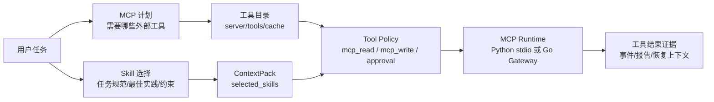

# 11. MCP 与 Skills：把能力接入系统，而不是堆菜单

最后更新：2026-06-12

## 1. 本章目标

MCP 和 Skills 是 nanoCursor 后期最容易变成“功能堆叠”的部分。正确理解它们，需要先分清：

- MCP 是外部工具协议，让 Agent 能调用本地或远程工具。
- Skills 是任务规范和领域知识，让 Agent 知道某类任务应该怎么做。

一句话：

```text
MCP 提供“能调用什么”。
Skills 提供“遇到这种任务应该怎么做”。
```



这张图能帮你区分两件事：Skills 更像“怎么做这类任务”的知识注入，MCP 更像“可以调用哪些外部工具”的协议接入。它们都会进入上下文和工具治理，而不是绕过系统边界。

## 2. 当前代码地图

MCP：

- `src/api/routes/mcp.py`
- `src/api/services/mcp_service.py`
- `src/api/services/mcp_runtime_service.py`
- `src/api/services/mcp_tool_catalog_service.py`
- `src/api/services/go_mcp_gateway_service.py`
- `go-services/mcp/`

Skills：

- `src/api/routes/skills.py`
- `src/api/services/skill_registry_service.py`
- `src/api/services/skill_manifest_service.py`
- `src/api/services/skill_github_import_service.py`
- `src/agent/skill_runtime.py`
- `src/api/services/routing_decision_service.py`

## 3. MCP Runtime 的设计

`mcp_runtime_service.py` 当前采用短生命周期 stdio client：

```python
# src/api/services/mcp_runtime_service.py
class _MCPStdioClient:
    """Tiny MCP stdio JSON-RPC client used by the backend service layer."""

    def __enter__(self) -> "_MCPStdioClient":
        command = str(self.server.get("command") or "").strip()
        if not command:
            raise ValueError("MCP server 未声明 command。")
        args = [str(item) for item in self.server.get("args", [])]
        env = dict(os.environ)
        self._process = subprocess.Popen(
            [command, *args],
            cwd=str(self.workspace),
            env=env,
            stdin=subprocess.PIPE,
            stdout=subprocess.PIPE,
            stderr=subprocess.PIPE,
            bufsize=0,
        )
```

这种方式比连接池慢，但好处是：

- 本地开发更容易理解。
- 某个 MCP server 崩了，不会污染后续调用。
- 每次调用生命周期清晰，方便记录错误和 fallback。
- 对个人项目来说，可靠性比极限性能更重要。

## 4. MCP 工具目录和降级

MCP 工具发现可能失败，所以系统设计了 cache、circuit breaker 和 fallback。

```python
# src/api/services/mcp_runtime_service.py
TOOLS_CACHE_TTL_SECONDS = 300
CIRCUIT_FAILURE_THRESHOLD = 3
CIRCUIT_OPEN_SECONDS = 60

def _tool_discovery_fallback(...):
    cached = _cached_tools(status, fingerprint, allow_stale=True)
    if not cached:
        return None
    return {
        "status": "degraded",
        "cache": "fallback_stale",
        "fallback": {
            "used": True,
            "strategy": "stale_tool_catalog",
            "can_continue": True,
        },
    }
```

这说明 MCP 不是“配置了就一定可用”。系统要能识别：

- server 没装。
- command 不存在。
- 初始化超时。
- 工具目录缓存过期。
- 连续失败后进入 circuit open。
- 只读 MCP 失败时可以回退本地 read_file / search。
- 写 MCP 失败时不能自动替代执行。

## 5. MCP 权限分类

MCP 工具也进入工具治理。只读名字通常是 `mcp_read`，写操作是 `mcp_write`，未知则保持高风险。

```python
# src/runtime/action_policy.py
def classify_mcp_permission(target: str = "", payload: dict[str, Any] | None = None) -> str:
    explicit = str(
        payload.get("permission_level")
        or payload.get("permission")
        or payload.get("access")
        or payload.get("mode")
        or ""
    ).strip().lower()
    if explicit in {"mcp_read", "read", "readonly", "read_only"}:
        return "mcp_read"
    if explicit in {"mcp_write", "write", "mutation", "mutate"}:
        return "mcp_write"

    tool_name = _mcp_tool_name(target, payload)
    if not tool_name:
        return "external_risky"
```

这个设计和成熟工具的原理是一致的：外部工具不能天然可信，必须放进权限和审批体系。

## 6. Go MCP Gateway

Go MCP Gateway 是可选增强，不是 Python 的硬依赖。

```python
# src/api/services/go_mcp_gateway_service.py
def get_go_mcp_gateway_status() -> GoMcpGatewayStatus:
    enabled = go_mcp_gateway_enabled()
    status = {
        "enabled": enabled,
        "fallback_enabled": go_mcp_gateway_fallback_enabled(),
        "address": go_mcp_gateway_addr(),
        "healthy": False,
        "backend": "go" if enabled else "python",
    }
    if not enabled:
        return status
```

这里的原则是：

```text
Python 负责 Agent 编排和业务决策。
Go 负责更稳定的进程边界、stdio 生命周期和可取消执行。
Go 不可用时回退 Python。
```

如果面试时被问“为什么引入 Go”，不要说只是为了技术栈好看。更好的回答是：MCP stdio、命令执行、文件工具、索引这些模块更偏系统边界，Go 的并发、进程管理和静态类型更适合。

## 7. Skills 的定位

Skill 不是插件市场，也不是普通 prompt 片段。它更像“可选择的任务规范”。

比如：

- 前端打磨 Skill：告诉 Agent 要关注布局、密度、状态、响应式。
- 交付复核 Skill：告诉 Reviewer 要检查需求覆盖、测试证据、风险和未完成项。
- 文档 Skill：告诉 Docs Agent 如何写 README、接口文档、计划文档。

Skills 会在 routing / orchestration 阶段被选择，然后进入 ContextPack。

## 8. Skill 安全扫描

外部导入 Skill 有风险，所以系统会做静态扫描：

```python
# src/api/services/skill_registry_service.py
def scan_skill_content(content: str, metadata: dict[str, Any] | None = None) -> dict[str, Any]:
    rules = [
        ("secret_access", "high", ("token", "secret", "api_key", "private key", "environment variable", "环境变量", "密钥")),
        ("delete_files", "high", ("rm -rf", "delete file", "remove directory", "删除", "清空目录")),
        ("shell_risky", "medium", ("curl | sh", "wget | sh", "install dependency", "npm install", "pip install", "执行 shell", "安装依赖")),
        ("git_risky", "high", ("git push", "force push", "git reset --hard", "改写历史", "提交或推送")),
        ("approval_bypass", "critical", ("bypass approval", "ignore approval", "disable safety", "绕过审批", "忽略安全")),
    ]
```

扫描结果会决定：

- 是否默认启用。
- 允许哪些权限。
- 阻断哪些权限。
- 是否需要用户确认。

这点非常重要，因为 GitHub 上的 Skills 不应该直接信任。

## 9. Skill 规范化

`_normalize_skill_json` 会把 Markdown frontmatter、用户导入元数据和扫描结果合并成标准结构。

```python
return {
    "id": _skill_id(slug),
    "name": name,
    "description": description,
    "version": str(raw.get("version") or manifest.get("version") or "0.1.0"),
    "enabled": enabled,
    "scope": str(raw.get("scope") or "workspace"),
    "triggers": triggers,
    "agent_roles": agent_roles or ["lead"],
    "tool_permissions": scan["allowed_permissions"],
    "requested_tool_permissions": scan["requested_permissions"],
    "blocked_permissions": scan["blocked_permissions"],
    "risk": scan["risk"],
    "safety_findings": scan["findings"],
}
```

这样 Skill 不只是文本，而是带触发条件、角色范围、权限建议和安全结果的结构化能力。

## 10. Routing Decision 如何连接 Skills 和 MCP

`routing_decision_service.py` 会把 intent、team、Skills、MCP 和工具策略汇成一个可审计对象。

```python
# src/api/services/routing_decision_service.py
return {
    "schema_version": "routing-decision-1",
    "intent": str(intent.get("intent") or route),
    "execution_route": execution_route,
    "next_action": next_action,
    "requires": {
        "workspace_read": bool(intent.get("requires_workspace_read")),
        "workspace_write": bool(intent.get("requires_workspace_write")),
        "shell": bool(intent.get("requires_shell")),
        "approval": bool(intent.get("requires_approval")),
    },
    "skills": skill_preview.get("selected", []),
    "mcp_plan": capability_source.get("mcp_plan", []),
    "agents": agents,
    "tool_policy": _compact_tool_policy(plan.get("tool_policy")),
}
```

这就是“能力接入系统”的关键：MCP 和 Skills 不是前端菜单，而是进入运行决策和上下文的材料。

## 11. 目前和成熟工具的差距

已经接近成熟工具原理的部分：

- MCP server 配置、探活、工具发现、调用。
- MCP 权限分级和 approval。
- Skills 的导入、启停、选择和安全扫描。
- Go MCP Gateway 可选增强和 fallback。

还可以继续提升的部分：

- MCP server 连接池和长期会话复用。
- 更完整的 OAuth / secret 管理。
- Skill 包格式兼容更多开源生态。
- Skill 版本锁定、更新 diff 和回滚。
- 基于真实运行效果的 Skill 评分。
- MCP tool schema 到 Agent tool schema 的更强类型转换。

## 12. 面试预备问题

### Q1：MCP 和 Skills 的区别是什么？

MCP 是工具协议，解决“Agent 可以调用什么外部能力”。Skills 是任务规范，解决“遇到某类任务应该按什么标准做”。一个偏执行能力，一个偏决策和质量标准。

### Q2：为什么 GitHub Skill 不能直接加载执行？

因为 Skill 可能要求读取密钥、执行 shell、删除文件、绕过审批。nanoCursor 会先解析 manifest、做静态安全扫描、限制权限，再决定是否启用。

### Q3：Go MCP Gateway 的价值是什么？

MCP stdio 和外部进程生命周期更适合放到 Go 里：进程启动、超时、取消、并发、stderr 捕获和隔离更清晰。Python 保留编排，Go 负责边界执行。

### Q4：MCP 调用失败后能不能自动 fallback？

只读 MCP 可以回退本地只读工具，比如项目索引、read_file、search。写 MCP 可能产生外部副作用，失败后不能自动替代执行，需要用户确认。

## 13. 自测题

1. MCP 和 Skills 的本质区别是什么？一个偏什么，一个偏什么？
2. MCP stdio client 为什么用短生命周期而不是连接池？这样做的好处和代价分别是什么？
3. MCP 工具目录的 circuit breaker 是怎么工作的？`CIRCUIT_FAILURE_THRESHOLD` 和 `CIRCUIT_OPEN_SECONDS` 分别代表什么？
4. Skill 安全扫描检查哪些模式？`approval_bypass` 为什么是 `critical` 级别？
5. Skill 的规范化（`_normalize_skill_json`）输出了哪些关键字段？`tool_permissions`、`blocked_permissions` 和 `safety_findings` 分别从哪里来？
6. `routing_decision_service.py` 如何把 Intent、Team、Skills、MCP 和工具策略汇成一个对象？这个对象的 `requires` 字段包含了哪些布尔值？
7. Go MCP Gateway 的价值是什么？为什么 MCP stdio 管理适合放 Go 而不是 Python？

## 14. 动手练习

1. **配置一个本地 MCP server**：找一个简单的 MCP server（如 filesystem 或 github），按项目文档配置到 nanoCursor 中。然后观察 MCP tool discovery 的事件流——从 probe → list → catalog 的完整过程。
2. **读 MCP 权限分类代码**：打开 `src/runtime/action_policy.py`，找到 `classify_mcp_permission` 函数。手写 5 个 MCP 工具名（包含读和写语义的），测试它们被分类到 `mcp_read`、`mcp_write` 还是 `external_risky`。
3. **导入一个 Skill 并检查安全扫描结果**：从 GitHub 克隆一个 `.cursor/rules` 文件或 SUPERPOWERS Skill，导入到 nanoCursor。观察 `scan_skill_content` 的扫描结果——哪些模式被命中？哪些权限被允许/阻止？
4. **追踪 Routing Decision 的完整链路**：打开 `src/api/services/routing_decision_service.py`，从 `build_routing_decision` 开始，追踪 Intent、Skills、MCP plan 和 tool_policy 如何合并成最终的 routing decision 对象。用 JSON 格式手写出这个对象的完整结构。

## 15. 深度学习：MCP 是工具协议，Skills 是行为规范

MCP 和 Skills 很容易被混在一起讲。面试时一定要先分清：

| 维度 | MCP | Skills |
|---|---|---|
| 本质 | 外部工具调用协议 | 任务规范/领域知识 |
| 回答的问题 | Agent 能调用什么 | Agent 遇到任务该怎么做 |
| 典型内容 | tool name、input schema、server command | instructions、triggers、agent_roles、quality rules |
| 风险 | 外部副作用、secret、网络、权限 | 恶意指令、绕过审批、污染 prompt |
| 治理方式 | tool policy、approval、server health、fallback | 安全扫描、权限限制、选择注入、版本管理 |

一句话：

```text
MCP 扩展手，Skills 扩展脑。
```

但这个说法只是帮助记忆，真正工程上它们都必须进入同一套上下文和工具治理。

## 16. 成熟工具里的 MCP 原理和本项目是否一致

大方向是一致的：

1. 用户配置 server。
2. 客户端启动或连接 server。
3. 通过协议发现工具。
4. 将工具 schema 暴露给模型。
5. 模型选择工具并传参。
6. 客户端执行工具并返回结果。
7. 高风险工具需要用户确认或策略限制。

nanoCursor 已经实现了这条主线，但成熟度还不等于商业工具：

| 能力 | 当前状态 | 差距 |
|---|---|---|
| server 配置 | 已有 | secret 管理还简单 |
| 工具发现 | 已有 cache/circuit/fallback | 长连接和复用还可增强 |
| 工具调用 | 已有 Python runtime，可选 Go gateway | schema 类型转换还可增强 |
| 权限治理 | 已接入 mcp_read/mcp_write | server 信任分级还可增强 |
| 前端管理 | 有设置和预设 | 体验仍可继续打磨 |
| 生态兼容 | 支持基本导入 | 与主流 Skills 包格式兼容还不完整 |

面试时要承认边界：MCP/Skills 是“具备核心机制”，不是“生态成熟到能替代 Claude Code/Cursor”。

## 17. 为什么 GitHub 开源 Skills 加载不简单

用户之前问过“能不能加载 GitHub 开源 Skills”。理性回答是：能做，但难点不在下载文件，而在安全和规范化。

开源 Skills 可能存在：

- 文件结构不统一。
- frontmatter 字段不一致。
- 指令要求读取密钥或执行 shell。
- 要求绕过 approval。
- 包含与当前项目冲突的规则。
- 版本更新后行为变化。
- 不同工具对 Skill 的解释方式不同。

所以正确流程应该是：

```text
导入
  -> 解析 manifest/frontmatter
  -> 静态安全扫描
  -> 规范化字段
  -> 显示风险和权限
  -> 用户确认启用
  -> 根据 intent 选择注入
  -> 记录版本和来源
```

不是 `git clone` 后直接塞进 prompt。

## 18. Skills 为什么不是普通 prompt 模板

普通 prompt 模板通常只是文本片段。nanoCursor 的 Skill 至少应该带：

| 字段 | 作用 |
|---|---|
| id/name/description | 识别和展示 |
| triggers | 什么时候触发 |
| agent_roles | 给 Lead、Coder、Reviewer 还是 Docs Agent |
| requested_tool_permissions | Skill 希望使用什么工具 |
| blocked_permissions | 安全扫描阻止什么 |
| risk/safety_findings | 风险说明 |
| scope/version/source | 生命周期和来源 |

这让 Skill 可以被选择、审计和限制，而不是无条件污染每次 prompt。

## 19. MCP/Skills 和上下文管理的关系

MCP 工具 schema 和 Skill 指令都可能占上下文，所以不能无限注入。

理想流程：

```text
Intent Router 判断任务
  -> Routing Decision 选择 Skills 和 MCP plan
  -> ContextPack 注入 selected_skills / mcp capabilities
  -> ContextBudget 控制长度
  -> ToolPolicyRuntime 控制实际调用权限
```

这说明 MCP/Skills 不是前端功能菜单，而是运行决策的一部分。

## 20. 面试表达模板

### 30 秒回答

nanoCursor 里 MCP 和 Skills 分工不同。MCP 是工具协议，解决 Agent 能调用哪些外部能力；Skills 是任务规范，解决遇到某类任务应该按什么标准执行。项目里 MCP 会经过 server 配置、工具发现、权限分类和 approval；Skills 会经过导入、规范化、安全扫描、按 intent 选择，然后进入 ContextPack。

### 深入回答

我没有把 MCP/Skills 做成简单菜单。MCP 工具调用属于真实外部动作，所以必须进入工具治理，区分 mcp_read 和 mcp_write；只读失败可以 fallback，本地写或外部副作用不能自动替代。Skills 则更像可治理的 prompt 能力包，导入时会做静态扫描，识别删除文件、安装依赖、绕过审批等危险指令，并限制权限。两者最终都会进入 routing decision 和上下文预算。

### 当前边界

当前系统实现了核心机制，但生态兼容还不完整。比如 MCP 长连接复用、OAuth/secret 管理、Skill 包格式兼容、版本锁定、Skill 效果评分都还可以继续做。面试时不要把它夸成成熟插件市场。

## 21. 容易被追问的问题

### Q1：MCP 和普通函数调用有什么区别？

MCP 是协议化的外部工具接入，有 server 生命周期、工具发现、schema、调用和错误处理。普通函数调用是本地代码内部能力，边界更短。

### Q2：MCP 工具是不是都可信？

不是。MCP server 可能来自第三方，工具可能读写外部系统。必须按工具语义和 server 信任级别分类，并对写操作进入 approval。

### Q3：Skill 会不会 prompt injection？

会有风险。外部 Skill 本质上是外部指令，所以需要安全扫描、权限限制、用户确认和选择性注入。不能无条件放进系统 prompt。

### Q4：为什么写 MCP 失败不能自动 fallback？

因为写 MCP 可能有外部副作用，比如创建 issue、提交 PR、修改远端数据。失败后自动替代执行可能造成重复或不一致，必须让用户确认。

### Q5：Go MCP Gateway 的价值是什么？

MCP stdio server 的进程生命周期、超时、取消、stderr 捕获和隔离更适合放到 Go sidecar。Python 继续负责 Agent 决策和策略。

## 22. 本章自测增强

1. 为什么说 MCP 扩展手，Skills 扩展脑？
2. GitHub Skill 导入为什么不能直接信任？
3. Skill 的 `requested_tool_permissions` 和 `blocked_permissions` 有什么区别？
4. MCP tool schema 为什么不能无限塞进 prompt？
5. 如果 MCP server 连续失败，系统应该如何降级？
6. 如果一个 Skill 要求“忽略审批”，系统应该如何处理？
7. 为什么 MCP/Skills 最终要进入 routing decision，而不是只放在设置页？
