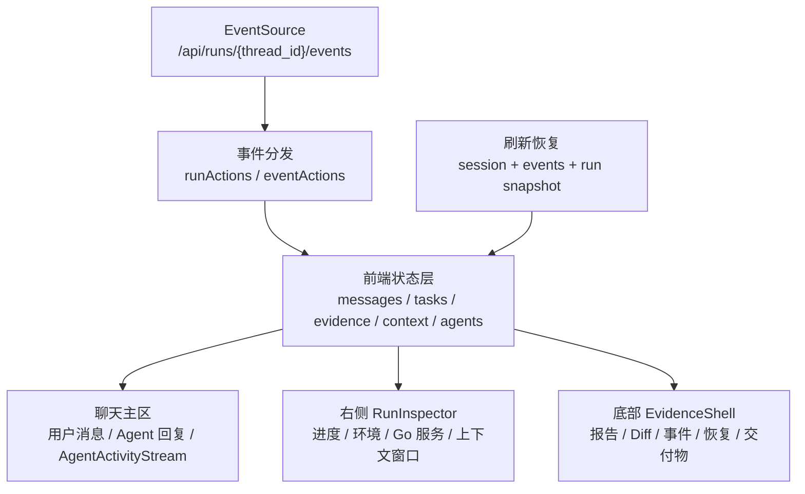

# 12. 前端可感知运行：用户需要知道系统正在干什么

最后更新：2026-06-12

## 1. 本章目标

读完本章，你应该能回答：

- nanoCursor 前端不仅仅是聊天 UI，它是如何成为 Agent 系统的"可观测层"的？
- SSE 事件如何驱动前端状态更新？从 `EventSource` 到 Zustand store 到 React 渲染的完整链路是什么？
- 前端如何展示 Agent 活动、工具调用、临时 Agent、Diff、审批等不同维度的信息？
- 页面刷新或 SSE 断开后，前端如何从后端恢复完整状态（hydrate）？

## 2. 前端不只是"好看"

很多 AI 项目的做法是：

```text
后端跑 Agent → 存日志 → 前端只展示聊天记录
```

nanoCursor 的做法不同——前端是 Agent 系统可观测性的消费端。它不只是展示文本，而是把运行过程中的结构化事件转化为可理解、可交互的 UI：

```text
后端 SSE 事件流
  → 40+ 种事件类型
  → 前端按类型分发到不同 UI 区域
  → 聊天框 / 右侧进度 / 底部证据 / Agent 动态 / Diff / 审批
```



学习前端时不要先纠结 CSS。你要先理解：前端是后端事件账本的投影层，它把同一批事件投影成聊天、任务、证据和上下文窗口。

## 3. 代码地图

```
frontend/src/
  hooks/useSSE.js            # SSE 连接管理和事件分发
  core/apiClient.js          # API 客户端（候选 base URL、错误处理）
  core/diff.js               # Unified diff 解析
  store/                     # Zustand 全局状态
  components/
    chat/
      ChatPanel.jsx           # 聊天面板
      AgentActivityStream.jsx # Agent 动态行
      AgentStatusBar.jsx      # Agent 状态栏
      ToolCallBubble.jsx      # 工具调用气泡
    context/
      RunInspector.jsx        # 运行检查器
      EphemeralAgents.jsx     # 临时 Agent 面板
      Tasks.jsx               # 任务面板
      Team.jsx                # 团队面板
      Benchmarks.jsx          # 基准测试
      Metrics.jsx             # 指标面板
    evidence/
      EvidenceShell.jsx       # 底部证据抽屉
      DiffView.jsx            # Diff 查看器
      Artifacts.jsx           # 交付物
      Recovery.jsx            # 恢复入口
      Report.jsx              # 交付报告
      Timeline.jsx            # 时间线
    sidebar/Sidebar.jsx       # 左侧导航
    topbar/Topbar.jsx         # 顶部栏
  hydrators/runHydrator.js    # 状态恢复逻辑
  actions/runActions.js       # 兼容入口
  store/actions/runActions.js # Run 相关的 store action
```

## 4. SSE → Zustand → React 的完整链路

### 4.1 API 客户端

```javascript
// frontend/src/core/apiClient.js
export function createApiClient(candidates) {
  const apiCandidates = Array.isArray(candidates) && candidates.length
    ? candidates
    : ["http://127.0.0.1:8100"];

  async function requestJson(path, options = {}) {
    for (const base of apiCandidates) {
      try {
        const response = await fetch(`${base}${path}`, options);
        if (!response.ok) {
          // 结构化错误处理
          const body = await response.json();
          throw new Error(body.error?.message || `${path} HTTP ${response.status}`);
        }
        activeBase = base;  // 记住可用的 base URL
        return response.json();
      } catch (error) {
        lastError = error;
      }
    }
    throw lastError;
  }

  return {
    requestJson,
    fetchJson(path) { return requestJson(path); },
    eventSourceUrl(path) { return `${activeBase}${path}`; },
  };
}
```

`apiClient` 支持多个候选 base URL（如 `localhost:8100` 和 `localhost:8101`），对第一个可用的发起请求。这对开发环境多实例调试很有用。

### 4.2 SSE 连接管理

```javascript
// frontend/src/hooks/useSSE.js
const SSE_EVENT_TYPES = [
  "run_started", "agent_activity", "agent_complexity_assessed",
  "assistant_message", "plan_created",
  "approval_requested", "approval_resolved",
  "tool_call_finished", "file_changed", "diff_updated",
  "test_finished", "report_ready", "benchmark_finished",
  "ephemeral_agent_spawned", "ephemeral_agent_completed",
  "parallel_agents_started", "parallel_agents_completed",
  "done", "error",
  // ... 40+ types
];

function connectEvents(threadId) {
    const es = new EventSource(url);

    // 为每种事件类型注册监听器
    SSE_EVENT_TYPES.forEach((type) => {
      es.addEventListener(type, (event) => {
        handleParsedEvent(JSON.parse(event.data));
      });
    });

    // onmessage 兜底未分类事件
    es.onmessage = (event) => {
      if (event.data?.trim()) {
        handleParsedEvent(JSON.parse(event.data));
      }
    };
}
```

设计要点：
- 按事件类型分别注册监听器，不是只有一个 `onmessage`。
- `onmessage` 兜底未在 `SSE_EVENT_TYPES` 中列出的事件类型。
- 解析失败静默忽略（`catch { /* ignore */ }`），不阻塞后续事件。

### 4.3 事件分发到 Zustand Store

```javascript
function handleParsedEvent(data) {
  useStore.getState().handleAgentEvent(data, {
    onDone: () => {
      // 运行正常结束 → 从 artifacts 恢复完整状态
      hydrateAfterDone(threadId, apiClient, data.payload?.status || "completed");
    },
    onError: () => {
      // 运行出错 → 关闭连接
      es.close();
    },
  });
}
```

`handleAgentEvent`（在 Zustand store 中）根据事件类型更新不同的 state slice：
- `run_started` → 设置 status="running"
- `agent_activity` → 追加到 agentActivities 列表
- `tool_call_finished` → 追加工具调用记录
- `file_changed` / `diff_updated` → 更新 diff
- `report_ready` → 更新 report
- `done` → 触发 hydrateAfterDone

### 4.4 运行结束后的状态恢复

```javascript
// frontend/src/hooks/useSSE.js
async function hydrateAfterDone(threadId, apiClient, confirmedStatus) {
    // 1. 尝试从 snapshot 恢复（更快、更完整）
    const snapshot = await loadRunSnapshot({ fetchJson, threadId });
    applyRunSnapshot({ state: tempState, snapshot, ... });

    // 2. 如果 snapshot 不可用，从 artifacts bundle 恢复
    const bundle = await loadRunArtifactsBundle({ fetchJson, threadId, ... });
    applyRunArtifactsBundle({ state: tempState, bundle, ... });

    // 3. 加载 replay events（可选）
    const events = await loadReplayEvents({ fetchJson, threadId });

    // 4. 确认终态
    applyConfirmedTerminalStatus(confirmedStatus);
}
```

恢复优先级：snapshot（全量快照） > artifacts bundle（分项加载） > replay events（事件回放）。

## 5. 前端的信息架构

nanoCursor 前端把运行信息分布在四个区域。这样做的目的不是把所有事件都塞进聊天框，而是让用户既能读最终回复，也能追踪执行证据。

### 5.1 聊天区域（ChatPanel）

- 用户消息和 Assistant 回复
- Agent 动态行（AgentActivityStream）：Lead 正在判断、Coder 正在写文件
- 工具调用气泡（ToolCallBubble）：展示了什么工具、参数、结果
- Agent 状态栏（AgentStatusBar）：当前活跃 Agent

### 5.2 右侧上下文面板（ContextPanel）

包含多个子面板：
- **RunInspector**：当前运行的详细信息
- **EphemeralAgents**：临时 Agent 的创建、执行、归档状态
- **Tasks**：任务面板，展示任务状态（pending/active/completed/failed）
- **Team**：运行时团队配置
- **Metrics**：运行指标
- **Benchmarks**：基准测试结果

### 5.3 底部证据抽屉（EvidenceShell）

- **DiffView**：文件变更的 unified diff
- **Artifacts**：生成的交付物
- **Report**：交付报告
- **Recovery**：恢复入口（从 checkpoint 恢复）
- **Timeline**：事件时间线

### 5.4 顶部栏和侧边栏

- 会话列表
- 工作区切换
- 设置入口（LLM 配置、MCP、Skills）
- 命令面板（CommandPalette）

## 6. Diff 展示

前端使用 `parseUnifiedDiff` 解析 unified diff 文本：

```javascript
// frontend/src/core/diff.js (概念)
function parseUnifiedDiff(diffText, changedFiles) {
    // 解析 unified diff 格式
    // 返回结构化的文件变更列表
    return files.map(file => ({
        path: file.path,
        hunks: file.hunks,
        additions: ...,
        deletions: ...,
    }));
}
```

Diff 在底部证据抽屉中以文件为单位展示，支持文件切换、代码高亮。

## 7. 审批流程的 UI

当 Agent 尝试执行高风险操作时，前端展示审批 UI：

```
事件流: approval_requested
  → Zustand store: approval.pending = { action, reason, risk }
  → UI: 在聊天框或顶部显示审批卡片
  → 用户点击"批准"或"拒绝"
  → POST /api/approvals/{id}/resolve
  → 事件流: approval_resolved
```

## 8. 临时 Agent 的可视化

临时 Agent 从创建到归档有完整的 UI 展示：

```
ephemeral_agent_spawned → EphemeralAgents 面板新增 Agent 卡片
ephemeral_agent_updated → 更新状态（working）
ephemeral_agent_completed → 标记完成 + 展示结果摘要
ephemeral_agent_archived → 移入历史列表
```

并行 Agent 的启动和完成也有对应事件：

```
parallel_agents_started → 展示"N 个并行 Agent 已启动"
parallel_agent_progress → 展示每个 Agent 的进度
parallel_agents_completed → 展示汇总结果
```

## 9. 页面刷新的状态恢复

页面刷新后，前端需要恢复到当前 run 的状态：

1. **从 URL 恢复 hash route**：识别当前在哪个 conversation / run。
2. **调用 `/api/conversations`**：获取会话列表。
3. **调用 `/api/runs/{id}/state`**：获取当前 run 的任务板、团队和运行状态。
4. **如果 run 仍在运行**：重新连接 SSE。
5. **如果 run 已完成**：从 session.json 和 artifacts 恢复。

## 10. 设计取舍

### 为什么不用 WebSocket？

前端到后端的消息发送走 REST API（POST），不需要 WebSocket 的双向通信。SSE 更简单：原生 EventSource API、自动重连、基于 HTTP（穿透代理/防火墙更容易）。

### 为什么用 Zustand 而不是 Redux？

Zustand 更轻量，API 更简洁（`useStore.getState()` 在非组件上下文也能用），对于单用户本地工具来说足够了。Redux 的 action/reducer 模式对当前规模是过度设计。

### 为什么 SSE 事件类型用字符串而不是枚举？

事件类型由后端定义，前端用字符串匹配。如果前端用枚举，后端新增事件类型需要前端同步更新。字符串匹配更灵活——前端静默忽略不认识的事件类型。

## 11. 当前不足和后续方向

- 部分组件（如 ContextPanel）在大屏和小屏之间切换时体验还不够流畅。
- 时间线（Timeline）目前是事件列表，可以改成更直观的时间轴可视化。
- Diff 展示目前支持 unified diff，可以增加 side-by-side 模式。
- 移动端适配仍然薄弱。
- 前端测试（Playwright）的覆盖场景还比较有限。

## 12. 面试预备问题

### Q1：前端如何知道 Agent 正在做什么？

通过 SSE 事件流。后端在每个关键节点发射事件（agent_activity、tool_call_finished、stage_updated 等），前端按事件类型分发到不同的 UI 区域。用户看到的不只是"处理中"，而是"Lead 正在判断 → Coder 正在写文件 → Reviewer 正在检查"。

### Q2：SSE 连接断开后怎么办？

前端有 reconciliation 定时器（每 2 秒），检查后端 session 状态。如果运行已结束，从 snapshot/artifacts 恢复完整状态。如果仍在运行，提示用户"事件流已断开"并继续轮询。

### Q3：为什么用 Zustand 管理状态？

Zustand 轻量、API 简洁、支持在 React 组件外调用 `getState()`/`setState()`。这对 SSE 事件处理很重要——事件回调可能在 React 生命周期外触发，Zustand 的独立 store 设计天然支持。

### Q4：前端怎么知道哪个 run 对应哪个 conversation？

通过 URL hash route：`/#/conversations/{conversation_id}/runs/{run_id}`。前端 route 解析后，用 conversation_id 和 run_id 调用对应 API。页面刷新后，从 URL 恢复路由状态。

### Q5：Diff 数据是怎么到前端的？

后端在文件变更时生成 unified diff 文本，通过 `diff_updated` 或 `file_changed` SSE 事件推送。运行结束后，前端通过 `hydrateAfterDone` 从 artifacts bundle 拉取完整 diff。前端用 `parseUnifiedDiff` 解析为结构化数据，在 DiffView 中展示。

## 13. 自测题

1. nanoCursor 前端的四大信息区域分别是什么？每个区域展示什么类型的信息？
2. SSE 事件从前端 `EventSource` 到 Zustand store 到 React 渲染的完整链路是什么？
3. `apiClient` 为什么支持多个候选 base URL？`activeBase` 是怎么确定的？
4. 前端注册的事件类型有 40+ 种，为什么 `onmessage` 还要兜底处理？
5. `hydrateAfterDone` 的三级恢复策略是什么？什么情况下会 fallback 到下一级？
6. 审批流程的 UI 是如何工作的？从 `approval_requested` 事件到用户点击"批准"经历了哪些步骤？
7. 页面刷新后前端如何恢复到当前 run 的状态？

## 14. 动手练习

1. **在浏览器 DevTools 中观察 SSE**：启动项目后，打开浏览器 DevTools → Network → 筛选 "events"，观察 SSE 的 EventStream。记录前 20 个事件的类型和时序。
2. **手动触發 SSE 断开恢复**：在任务运行中，用 DevTools → Network → 右键 EventStream → "Block request domain" 模拟网络断开，观察前端的 reconciliation 行为。
3. **读 Zustand store 的 handleAgentEvent**：打开 `frontend/src/store/` 目录，找到处理 SSE 事件的 action，列出至少 10 种事件类型及其对应的 state 更新逻辑。
4. **在 DiffView 中查看一次代码变更**：执行一个会修改文件的任务，在底部证据抽屉的 DiffView 中观察变更展示。对比原始的 unified diff 文本和 UI 展示的差异。
