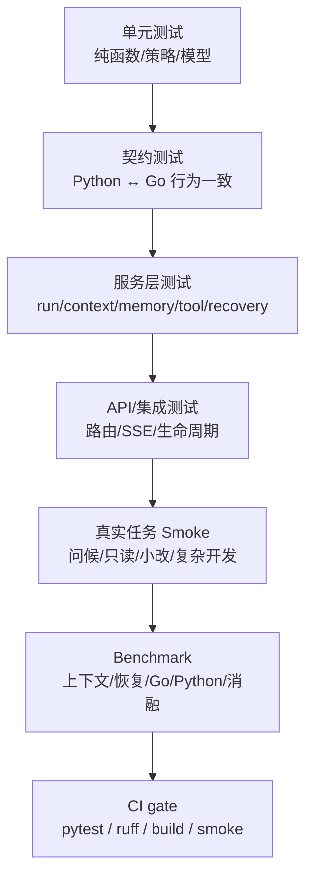

# 13. 测试与质量：证明系统不是只能跑 demo

最后更新：2026-06-12

## 1. 本章目标

读完本章，你应该能回答：

- nanoCursor 有哪些测试层次？每层覆盖什么？
- contract test 是什么？为什么对跨语言 sidecar 特别重要？
- 真实任务 smoke test 怎么设计？它和单元测试有什么区别？
- 测试覆盖率目标是什么？哪些模块最需要测试？
- CI 检查流程包含哪些步骤？



这个质量体系不是为了追求覆盖率数字，而是为了回答“这个模块是不是真的有用”。比如上下文压缩要看 token reduction 和锚点保留，Go sidecar 要看行为一致性和 fallback，Agent Loop 要看不同任务路由是否合理。

## 2. 测试金字塔

nanoCursor 的测试分为五个层次，从下到上：

```text
                    ┌─────────────┐
                    │ 真实任务     │  ← smoke test / benchmark
                    │ smoke       │
                   ┌┴─────────────┴┐
                   │ 集成测试      │  ← API routes / SSE / run lifecycle
                   │              │
                  ┌┴──────────────┴┐
                  │ 服务层测试     │  ← service functions / intent routing
                  │              │
                 ┌┴───────────────┴┐
                 │ Contract Test  │  ← Python↔Go 行为一致性
                 │               │
                ┌┴────────────────┴┐
                │ 单元测试         │  ← 单函数 / 单模块
                │                │
                └─────────────────┘
```

### 2.1 单元测试

覆盖单个函数或类，mock 外部依赖。示例：

```
tests/test_action_policy.py        # ActionPolicy 权限判断
tests/test_agent_loop_state_service.py  # AgentLoopState 状态机
tests/test_command_runner.py       # 命令执行
tests/test_compaction.py           # 上下文压缩
tests/test_context_scoring.py      # 上下文打分
tests/test_memory_governance_service.py  # 记忆 CRUD
tests/test_event_store.py          # EventStore 读写
tests/test_intent_router.py        # 意图路由
tests/test_path_guard.py           # 路径安全
tests/test_tool_approval_flow.py   # 审批流程
```

### 2.2 Contract Test（契约测试）

这是项目中非常有工程含金量的测试类别。Contract test 验证 Python 和 Go 对同一操作的行为一致性：

```
tests/contracts/test_filetools_contract.py  # Python file_ops vs Go filetools
tests/test_backend_contract.py              # legacy file_tools vs file_ops
tests/test_contract_freeze.py               # 锁定关键接口行为
tests/test_delivery_contract.py             # 交付物格式契约
```

契约测试的核心模式：

```text
1. 用 Python backend 执行操作 → 记录结果
2. 用 Go backend 执行相同操作 → 记录结果
3. 断言两者行为一致
4. 如果 Go 不可用，测试 skip 而非 fail
```

### 2.3 服务层测试

测试 service 层的完整逻辑链，可能涉及文件 I/O：

```
tests/test_conversation_api.py          # 会话 API
tests/test_memory_api.py                # 记忆 API
tests/test_mcp_runtime_service.py       # MCP 运行时
tests/test_skill_registry_service.py    # Skills 注册中心
tests/test_routing_decision_service.py  # 路由决策
tests/test_orchestration_service.py     # 编排服务
tests/test_run_lifecycle_service.py     # Run 生命周期
```

### 2.4 集成测试

端到端验证 API 路由、SSE 连接、run 生命周期：

```
tests/test_api_routes_smoke.py          # API 路由冒烟测试
tests/test_sse_broker.py                # SSE 代理测试
tests/test_agent_stream.py              # Agent 流式响应
tests/test_run_start_service.py         # Run 启动流程
tests/test_runtime_boundary_services.py # Runtime 边界服务
tests/test_runtime_executor_service.py  # Executor 服务
tests/test_ephemeral_agent_service.py   # 临时 Agent 完整流程
```

### 2.5 真实任务 Smoke Test

不是 mock 的能通过就行，而是在真实工作区跑真实任务：

```
tests/test_real_task_smoke.py           # 真实任务冒烟
scripts/run_real_task_smoke.py          # 真实任务执行脚本
```

真实任务测试的特点：
- 在真实项目目录中运行（不只是 fixture）。
- 调用真实 LLM（或记录/回放模式的 mock）。
- 验证最终交付物（文件是否真的被创建/修改）。
- 验证事件流完整性。
- 验证 Agent 没有产生高风险误操作。

## 3. 测试配置

```python
# tests/conftest.py
# 共享 fixtures: temp workspace, mock LLM, mock EventStore, ...
```

关键 fixtures：
- `temp_workspace`：创建临时工作区目录，测试结束后自动清理。
- `mock_llm_client`：mock LLM 调用，返回预定义的 tool_call 或 text 响应。
- `mock_event_store`：mock EventStore，避免测试污染真实数据。
- `mock_run_manager`：mock RunManager，模拟活跃 run 状态。

## 4. 质量检查命令

```bash
# 运行所有测试
pytest

# 运行测试并检查覆盖率（目标 ≥50%）
pytest --cov

# 运行单个测试文件
pytest tests/test_file_tools.py

# Lint 检查
ruff check .

# 类型检查
mypy src/

# 前端检查
cd frontend && npm run check

# 学习包检查
python learning-site/src/content/handbook/scripts/check_learning_package.py
```

## 5. Go Sidecar 的测试策略

Go sidecar 的测试在 `go-services/` 中：

```
go-services/filetools/internal/filetools/*_test.go
go-services/executor/internal/*/..._test.go
go-services/indexer/internal/*/..._test.go
```

Python 侧的 Go 集成测试：

```
tests/test_filetools_client.py        # Python→Go filetools gRPC client
tests/test_filetools_evidence.py      # evidence 生成验证
tests/test_go_filetools_status.py     # Go filetools 状态接口
tests/test_go_executor_status.py      # Go executor 状态接口
tests/test_go_indexer_status.py       # Go indexer 状态接口
tests/test_go_mcp_gateway_client.py   # Go MCP gateway client
tests/test_go_mcp_gateway_status.py   # Go MCP gateway 状态
tests/test_go_runtime_client.py       # Go runtime HTTP client
tests/test_go_service_integration.py  # 综合集成测试
```

测试模式：
```text
1. 启动 Go sidecar（或 mock gRPC server）
2. Python client 调用
3. 验证行为正确
4. 模拟 Go 不可用，验证 fallback
```

## 6. 审批流程的测试

审批是高风险管理的关键环节，有专门的测试：

```
tests/test_approval_token.py          # Approval token 生成/验证
tests/test_tool_approval_flow.py      # 工具→审批→执行→拒绝 完整流程
```

测试覆盖：
- 高风险工具是否被正确拦截并进入审批。
- 审批通过后工具是否正确执行。
- 审批拒绝后工具是否被阻止。
- approval token 的过期和校验。

## 7. 测试盲区和改进方向

当前测试覆盖较好的模块：
- memory_governance_service
- event_store
- intent_router
- action_policy
- command_runner
- agent_loop_state_service
- ephemeral_agent_service

测试覆盖较弱的模块：
- 前端 Playwright 测试（场景有限）
- Agent Loop 的完整决策链（复杂，依赖 LLM）
- 并行 Agent 的冲突处理（依赖时序，难复现）
- 长时间运行的稳定性测试
- 内存泄漏测试

## 8. 面试预备问题

### Q1：项目的测试层次是怎么设计的？

五个层次从下到上：单元测试（单函数/模块）→ 契约测试（Python↔Go 一致性）→ 服务层测试（完整逻辑链）→ 集成测试（API/SSE/生命周期）→ 真实任务 smoke test（真实工作区验证）。每层关注不同粒度，避免只用单元测试造成"mock 都通过了但真实跑不起来"的问题。

### Q2：Contract test 为什么重要？

因为项目有 Python 和 Go 两套实现（filetools、executor、indexer、MCP gateway）。Contract test 验证两者对相同输入产生相同输出，防止"Python 版本修了一个 bug 但 Go 版本还在"或者相反。跨语言 sidecar 最怕的就是行为慢慢不一致。

### Q3：为什么需要真实任务 smoke test？

单元测试用 mock LLM，验证的是"如果 LLM 返回 X，系统行为是 Y"。但真实 LLM 可能返回意想不到的内容。真实任务 smoke test 在真实工作区调用真实 LLM，验证完整的 Agent Loop 能产生预期的交付物，且不会执行高风险误操作。

### Q4：覆盖率目标为什么是 50%？

对 AI Agent 项目来说，100% 覆盖率既不现实也不合理。Agent Loop 的决策路径非常多，全部覆盖需要海量 mock 组合。50% 覆盖核心模块（memory、event_store、intent_router、action_policy、tool_policy_runtime）是有意义的——这些模块是"错了就会出事故"的系统边界。

## 9. 自测题

1. nanoCursor 的测试金字塔有哪五层？每层的典型测试文件是什么？
2. contract test 和单元测试的区别是什么？为什么跨语言 sidecar 必须有 contract test？
3. 真实任务 smoke test 验证什么？它和用 mock LLM 的集成测试有什么本质区别？
4. Go sidecar 的测试怎么组织？Python 侧和 Go 侧分别有哪些测试文件？
5. 审批流程的测试覆盖了哪些场景？
6. 当前测试覆盖较好的模块有哪些？覆盖较弱的有哪些？
7. `pytest --cov` 的覆盖率目标是多少？为什么是这个数字？

## 10. 动手练习

1. **运行全量测试**：`pytest --cov -q`，查看覆盖率报告。找到覆盖率最低的 3 个模块，思考是否需要补充测试。
2. **读一个 contract test**：打开 `tests/contracts/test_filetools_contract.py`，找出至少 3 个测试用例，说明每个用例验证了什么"Python 和 Go 行为一致"的场景。
3. **写一个简单的服务层测试**：参考 `tests/test_intent_router.py` 的风格，为 `classify_user_intent` 写一个测试用例——输入"帮我写一个排序算法"，断言返回的 route 不是 `direct_answer`。
4. **跑一次真实任务 smoke test**：在真实工作区中运行 `scripts/run_real_task_smoke.py`（或 `tests/test_real_task_smoke.py`），观察它如何验证 Agent 的最终交付物。

## 11. Benchmark 不是演示按钮，而是质量证据

项目后期已经有三类 benchmark，不要把它们混在一起讲。

| 类型 | 入口 | 证明什么 |
|---|---|---|
| 固定交付 benchmark | `src/api/services/benchmark_service.py` 的 `BENCHMARKS` | 系统能生成任务、文件、diff、测试和报告 |
| 真实任务 benchmark | `REAL_TASK_BENCHMARKS` | intent router、Agent 创建、工具策略是否符合预期 |
| 上下文窗口 benchmark | `run_context_window_pressure_benchmark` | context ledger、压缩策略、锚点保护是否有效 |

对应 API：

```text
GET  /api/benchmarks
POST /api/benchmarks/run
GET  /api/benchmarks/real-tasks
POST /api/benchmarks/real-tasks/run
GET  /api/benchmarks/context-window
POST /api/benchmarks/context-window/run
```

对应测试：

```text
tests/test_benchmark_routes.py
```

面试时可以这样解释：

> 我没有只靠手动点前端验证项目，而是做了确定性 benchmark。真实任务 benchmark 验证路由、Agent 创建和工具权限是否符合预期；上下文窗口 benchmark 构造 token 压力，验证压缩能否降低 token，同时保护用户请求、当前计划和工具策略这些 P0 锚点。

## 12. 消融实验：证明一个组件是否真的有用

如果一个项目说“我有 Agent Loop、上下文、记忆、Go sidecar”，面试官可能追问：这些模块真的有必要吗？

消融实验就是为了回答这个问题。

当前消融服务在：

```text
src/api/services/ablation_config_service.py
src/api/services/ablation_benchmark_service.py
src/api/routes/evals.py
tests/test_ablation_benchmark_service.py
```

核心思想：

```text
baseline
  -> disable_agent_loop
  -> disable_context_pack
  -> disable_project_index
  -> disable_failure_recovery
  -> disable_go_sidecars
  -> 计算组件 lift 和 verdict
```

组件列表来自 `COMPONENTS`：

| 组件 | 主要观察指标 |
|---|---|
| `agent_loop` | task_success_rate、agent_noise_score、avg_turn_count |
| `context_pack` | context_hit_rate、irrelevant_file_read_count、avg_tool_calls |
| `project_index` | context_hit_rate、avg_tool_calls |
| `memory_selection` | memory_precision、task_success_rate |
| `skills` | task_success_rate、avg_turn_count |
| `mcp_tools` | tool_execution_rate、fallback_success_rate |
| `go_sidecars` | avg_duration_ms、tool_execution_rate、event_completeness |
| `failure_recovery` | failure_recovery_rate、retry_count、task_success_rate |

对应 API：

```text
GET  /api/evals/ablation/components
POST /api/evals/ablation/matrix
POST /api/evals/ablation/report
POST /api/evals/ablation/suite/run
GET  /api/evals/ablation/suites
POST /api/evals/ablation/suites
GET  /api/evals/ablation/suites/{suite_id}
POST /api/evals/ablation/suites/{suite_id}/run
GET  /api/evals/ablation/suites/{suite_id}/report
GET  /api/evals/ablation/suites/{suite_id}/artifacts
```

消融结果不应该被夸大。它能证明的是：

- 在当前 eval 集里，关闭某个模块会不会明显降分。
- 哪些组件是 `necessary`、`useful`、`neutral`、`negative`。
- 哪些组件目前只是管线可见，但还没有真实 runtime hook。

它不能证明：

- 模块在所有真实项目里都必然有效。
- 一次 benchmark 分数就代表商业产品质量。
- 组件越多越好。

## 13. CI 失败时怎么排查

GitHub 上测试失败时，不要一上来就改业务代码。先按这个顺序：

1. **确认失败类别**：lint、unit test、contract test、frontend build、Go test、real task benchmark。
2. **找最小失败文件**：比如 `tests/test_benchmark_routes.py::test_context_window_benchmark_routes`。
3. **确认环境差异**：CI 没有本地 API key、没有 Go sidecar、路径不同、端口不同、Node/Python 版本不同。
4. **确认是否写入真实工作区**：测试应该使用 `tmp_path`，不要污染用户目录。
5. **确认是否依赖服务启动顺序**：Go sidecar 不应成为默认测试硬依赖。
6. **确认断言是否过强**：LLM 相关测试要避免断言完整自然语言。

推荐命令：

```bash
pytest tests/test_benchmark_routes.py -q
pytest tests/test_ablation_benchmark_service.py -q
pytest tests/contracts/test_filetools_contract.py -q
ruff check .
python learning-site/src/content/handbook/scripts/check_learning_package.py
```

## 14. 面试表达：如何讲“质量体系”

### 30 秒回答

nanoCursor 的质量体系不是只有单元测试。它有单元测试、服务层测试、API/SSE 集成测试、Python/Go contract test、真实任务 benchmark、上下文窗口 benchmark 和组件消融实验。这样可以分别证明：单个模块正确、跨语言行为一致、API 能跑通、上下文压缩有效、组件不是随便堆出来的。

### 深入回答

我把测试分成“正确性”和“有效性”两类。正确性靠 pytest、contract test 和 API smoke；有效性靠 benchmark 和 ablation。比如上下文压缩不是只测函数返回，而是构造超长 ContextLedger，验证压缩前是 emergency，压缩后 token 降低，同时 P0 锚点保留率是 1.0。消融实验则会关闭 context_pack、failure_recovery、go_sidecars 等模块，看 baseline 和 disabled variant 的分数差。

### 诚实边界

当前 benchmark 还偏确定性和本地化，真实复杂项目样本不够多。它能证明工程管线和核心机制有效，但还不能证明它达到商业 AI 编程工具的泛化能力。

## 15. 本章自测增强

1. `BENCHMARKS`、`REAL_TASK_BENCHMARKS`、`CONTEXT_WINDOW_PRESSURE_CASE` 分别证明什么？
2. 为什么真实任务 benchmark 里要检查 `forbidden_agents`？
3. 上下文窗口 benchmark 为什么要检查 `anchor_preservation_rate`？
4. 消融实验里的 baseline 和 disable variant 分别是什么？
5. `build_component_necessity_report` 如何给组件打 `necessary` / `neutral`？
6. 为什么 Go sidecar benchmark 不能简单讲“Go 一定更快”？
7. CI 中 Go sidecar 不可用时，测试应该 fail 还是 fallback/skip？为什么？
8. 如果一个组件消融后分数没有下降，你会怎么判断它是否应该保留？
