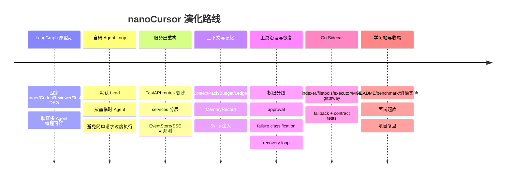

# 15. 项目复盘：这个项目到底给你带来了什么

最后更新：2026-06-12

## 1. 本章目标

读完本章，你应该能：

- 理解 nanoCursor 从早期原型到当前架构的演化过程。
- 知道哪些技术决策是正确的，哪些是可以改进的。
- 清楚地回答"这个项目对求职真正有价值的地方是什么"。
- 有能力讲清楚：如果重做一次，架构会怎么设计。



复盘时最重要的不是证明每一步都完美，而是说明你在不断把系统从“能跑 demo”推向“有边界、有证据、能解释”的方向。

## 2. 项目演化简史

### 阶段 1：LangGraph 原型期

项目最初使用了 LangGraph。那时的想法是"用状态图建模 AI 编程流程"，Planner → Coder → Reviewer → Tester 形成一个固定 DAG。

**做得对的：**
- 快速搭建了一个可运行的多 Agent 原型。
- 验证了"AI 写代码"这个方向是可行的。

**后来发现的问题：**
- 用户说"哈喽"也会触发完整 DAG，体验很差。
- 代码修改后测试失败，下一步不一定是"进入 Reviewer"，但 DAG 已经画死了。
- 每次改流程都要改图，开发体验像"画流程图"而不是"写代码"。
- LangGraph 对个人项目来说偏重——依赖多、概念多、调试难。

### 阶段 2：自研 Agent Loop

做了两个关键决策：

1. **去掉 LangGraph**，转向自研 Agent Loop。
2. **默认只有 Lead**，需要时才创建临时 Agent。

这个阶段解决了：
- 简单问候不再触发 11 个任务卡。
- Agent 可以根据中间结果动态调整策略。
- 代码量减少，概念更清晰（Loop 就是 while + 状态 + 检查）。

代价：
- 需要自己实现 loop 控制（步数限制、任务板、完成判断、审批门）。
- 失去了 LangGraph 的可视化调试能力。

### 阶段 3：服务层重构

随着功能增加，原始的 `engine.py` 和 `api_server.py` 变得越来越大。做了服务层拆分：

```text
单体 engine.py
  → agent/engine.py（核心 loop）
  → api/services/conversation_run_service.py（会话运行）
  → api/services/run_start_service.py（标准启动）
  → api/services/intent_router.py（意图路由）
  → api/services/workflow_thread_service.py（线程管理）
  → api/services/agent_loop_controller_service.py（loop 控制）
  → api/services/event_store.py（事件持久化）
  → api/services/memory_governance_service.py（记忆治理）
  → ... 30+ services
```

**做得对的：**
- 每个 service 有单一职责，方便测试和修改。
- 新功能可以独立开发，不影响已有逻辑。

**可以改进的：**
- 拆分力度不完全统一，部分 service 仍然偏大。
- 部分 `dict[str, Any]` 仍然过多，应该用 Pydantic model。

### 阶段 4：工具治理和安全

意识到"Agent 可以写文件、跑命令、调 MCP"是一个需要认真对待的问题。引入了：
- 权限分级（read_only / safe_write / risky_write / shell_safe / shell_risky / mcp_read / mcp_write）。
- ActionPolicy 统一入口。
- Approval 机制。
- 文件备份和恢复。

**做得对的：**
- 没有把安全当作"后期再加上"的功能，而是内建在工具调用链路里。
- 工具策略和意图路由对齐——只读任务里写文件会被自动拦截。

**可以改进的：**
- Shell 命令分类目前基于 `shlex` + 模式匹配，对复杂 shell 表达式可能误判。
- 没有做沙盒级别的隔离（Docker/gVisor），当前依赖策略层拦截。

### 阶段 5：Go Sidecar 引入

为了处理系统边界问题（文件 I/O、命令执行、MCP stdio、项目索引），选择性引入 Go：

```text
Python: Agent 编排、上下文管理、工具策略、事件流、API
Go:    文件工具、命令执行、项目索引、MCP gateway
```

**做得对的：**
- 没有"全量 Go 重写"——Python 在 Agent 编排和 LLM 集成上有天然优势。
- Go 放在 sidecar 位置——边界清楚、通过 gRPC 通信、有 contract test。
- 每个 Go 服务都有 feature flag 和 fallback 机制——不是强依赖。

**可以改进的：**
- Go sidecar 的部署复杂度增加了（多启动几个终端）。
- gRPC 的 Python 客户端在某些环境下安装不够顺畅。

### 阶段 6：学习站和文档

最近期的阶段——把项目从"我做了很多功能"整理成"我能说清楚每个模块为什么存在"。

这是容易被忽略但对求职影响最大的阶段。

### 阶段 7：失败恢复与组件价值评估

后期又补了一层更“产品级”的能力：不是只记录工具失败，而是把失败归类、生成恢复计划、限制恢复动作权限，并记录组件在真实任务中的贡献。

这个阶段解决了两个问题：

- 命令失败、缺依赖、测试失败、策略阻断不再只是一条错误日志，而是可以被恢复循环消费的结构化事实。
- 系统里的模块不再只是“我做了”，而是可以回答“它在真实任务中解决了什么问题、触发了几次、失败率如何、有没有必要保留”。

这让项目从功能堆叠更接近工程系统：新增模块需要能被观测、能被评估、能被解释。

## 3. 关键架构决策回顾

### 决策 1：不用 LangGraph

**判断：✅ 正确。** 对 AI 编程场景来说，动态 Agent Loop 比固定 DAG 更自然。LangGraph 适合预定义流程（如 RAG 管道），但编程任务经常需要根据中间结果调整。

### 决策 2：默认只有 Lead

**判断：✅ 正确。** 解决了"用户说哈喽也出现 11 个任务卡"的体验问题。多 Agent 应该按需创建，不是默认排场。

### 决策 3：Python 主后端 + Go sidecar

**判断：✅ 正确。** Python 的 LLM 生态、FastAPI 开发效率、Agent 编排灵活性是核心优势。Go 在系统边界（并发、进程管理、静态类型）上有优势。两者混合比全用一种语言更合理。

### 决策 4：JSON 文件持久化

**判断：⚠️ 当前够用，但有天花板。** JSONL 对单用户本地工具来说足够简单。但随着 run 数量增加（几百到几千个），需要索引、分页查询和更强的订阅能力。Go eventstore sidecar 已经作为实验性模块存在，但主链路仍以 Python EventStore + JSONL 为准；它不是当前必须启用的服务。

### 决策 5：用 Zustand 而非 Redux

**判断：✅ 正确。** Zustand 对当前规模够用，API 简洁，非组件上下文也能调用。Redux 的样板代码对单用户工具来说是过度设计。

### 决策 6：前端用 SSE 而非 WebSocket

**判断：✅ 正确。** 单向推送场景下 SSE 更简单，浏览器原生支持自动重连。

## 4. 投入产出比分析

### 高投入产出比的模块

| 模块 | 投入 | 产出 | 原因 |
|------|------|------|------|
| Agent Loop | 高 | 高 | 核心执行模型，面试必问 |
| 上下文管理 | 中 | 高 | 面试区分度最高的模块 |
| 工具治理 | 中 | 高 | 让系统从"聊天机器人"变成"可执行的工具" |
| 失败恢复 | 中 | 高 | 让系统能解释失败、规划恢复，而不是只抛异常 |
| Intent Router | 中 | 中 | 解决简单问候触发完整流程的问题 |
| EventStore + SSE | 中 | 中 | 让前端可观测，用户体验提升明显 |

### 中等投入产出比的模块

| 模块 | 投入 | 产出 | 原因 |
|------|------|------|------|
| 记忆机制 | 中 | 中 | 设计完整但使用频率还不够高 |
| Go filetools | 中 | 中 | 工程范例价值高，但实际性能提升不明显 |
| MCP / Skills | 高 | 中 | 接入复杂度高，生态还在早期 |
| 临时 Agent | 中 | 中 | 设计好但并行执行场景有限 |
| 组件指标 | 低 | 中 | 帮助判断模块是否值得保留，适合复盘和面试表达 |

### 低投入产出比的模块

| 模块 | 原因 |
|------|------|
| Legacy 模块兼容 | 历史包袱，维护成本高于使用价值 |
| 早期前端多次重构 | 应该先定好信息架构再写代码 |

## 5. 如果重做一次

### 会保留的

- Agent Loop 作为核心执行模型。
- ContextPack 结构化上下文管理。
- 工具权限分级 + ActionPolicy。
- EventStore JSONL + SSE 事件流。
- 默认只有 Lead，按需创建子 Agent。
- Python + Go sidecar 的混合架构。

### 会改变的

1. **先做信息架构，再写前端**：早期前端经历了多次重构（Vue → React → React 重构），根本原因是对"前端到底要展示什么信息"不够明确。应该先画好信息架构图。

2. **更早引入 Pydantic**：大量 `dict[str, Any]` 增加了调试和测试的难度。应该更早地用 Pydantic model 替代裸字典。

3. **更早做 contract test**：Python 和 Go 的行为一致性应该在 Go 代码写好的同时就有 contract test，而不是后面补。

4. **减少对 legacy 模块的容忍**：`file_tools.py`、`legacy_runtime.py` 等旧模块保留太久。应该更早地做"硬切换 + contract test 兜底"。

5. **先做实任务 smoke test，再堆功能**：很多功能完成后的第一反应是"继续加功能"，但更好的做法是先跑真实任务验证已有功能是否真的可用。

## 6. 这个项目对求职的价值

### 6.1 和其他项目的区别

大多数 AI 项目是：
- "调了一个 LLM API，做了个聊天界面"。
- "用 LangChain/LangGraph 搭了一个流程"。
- "套了一个开源框架，没做任何底层决策"。

nanoCursor 的区别在于：
- 你亲手实现了 Agent Loop——从 LLM 调用到工具执行到结果交付的完整循环。
- 你做了上下文管理——知道哪些信息应该进入 prompt，哪些应该裁剪。
- 你做了工具治理——知道 Agent 能做什么、不能做什么、什么需要审批。
- 你做了事件流——让运行过程可被前端观察，而不只是一个"处理中"。
- 你做了失败恢复——命令失败、测试失败、缺依赖、权限阻断都能进入结构化恢复链路。
- 你做了 Python + Go 混合架构——不是"为了简历堆语言"，而是有明确的工程分工。

### 6.2 面试中可以主动讲的故事

**故事 1：为什么去掉 LangGraph 来自研 Agent Loop**

> "我们一开始用 LangGraph，因为它让流程很清晰。但后来发现 AI 编程任务不是固定 DAG——用户可能中途改变需求、工具调用可能失败需要重试、简单问候不应该触发完整流程。所以我把执行模型从固定图转向了 Agent Loop：每步观察状态、决策下一步、校验合法性、记录证据。同时保留了最大步数、工具策略、审批和事件日志来保证可控性。"

**故事 2：上下文管理的工程化设计**

> "我们不是把整个项目拼成 prompt。ContextPack 是一个结构化对象，包含项目索引、文件大纲、相关代码片段、记忆、Skills 和工具策略。不同任务有不同的 token 预算分配——bug fix 需要更多失败日志，refactor 需要更多文件大纲。裁剪掉的信息记录在 omitted 里，可以审计。P0 上下文（用户任务、工具策略、当前计划）永不裁剪。"

**故事 3：Go sidecar 不是炫技**

> "我没有把 Go 当成替代 Python 的方案。Go 在文件 I/O、命令执行、进程管理这些系统边界上有优势——静态类型、并发模型好、进程生命周期管理清晰。Python 在 Agent 编排、LLM 集成、Prompt 构建上更有优势。两者通过 gRPC 通信，每个 Go 服务都有 feature flag 和 fallback 机制，还有 contract test 验证行为一致性。"

**故事 4：失败恢复为什么不是简单 retry**

> "失败恢复不是让模型无脑重试。系统会先把失败分成命令失败、测试失败、缺依赖、读写失败或策略阻断，再生成有限的恢复计划。恢复动作仍然经过工具治理，比如安装依赖属于 shell_risky，需要 approval；读日志和跑安全检查才可以自动执行。这样失败恢复不会变成绕过权限的后门。"

### 6.3 面试中应该如何定位这个项目

不要说：
- ❌ "我做了个 AI 编程工具"（会被和 Codex/Cursor 直接对比）
- ❌ "我用 LangGraph 做了个多 Agent 系统"（已经不用了）
- ❌ "我写了很多代码"（没有信息量）

应该说：
- ✅ "我拆解并实现了一个 AI 编程工具的核心后端机制，包括 Agent Loop、上下文管理、工具治理、事件流和扩展系统"
- ✅ "这不是一个调 API 的 demo——它有完整的执行控制、安全边界、状态可观测性和失败恢复"
- ✅ "我亲手做了从 LangGraph 到自研 Agent Loop 的架构决策，理解两种模型的取舍"

## 7. 项目下一步的优先级

如果继续投入，建议优先级：

1. **上下文命中率**：做 context hit rate 监控（最终修改的文件是否在 selected_files 中）。
2. **Agent Loop 决策质量**：记录更丰富的 loop step 数据，分析"Lead 的判断是否正确"。
3. **真实任务测试**：建立 10-20 个常见任务场景的 benchmark。
4. **组件价值仪表盘**：统计工具调用、fallback、恢复成功率和模块贡献，判断哪些模块值得保留。
5. **Go eventstore**：在 run 数量真正变大时，再把事件存储从实验模块推到主链路。
6. **前端打磨**：移动端适配、Diff side-by-side、更好的错误展示。

不建议做的：
- 加更多 Agent 角色（已经够多了）。
- 做多用户 SaaS（偏离了学习型单用户工具的定位）。
- 全量 Go 重写（Python 在主链路上的优势不可替代）。

## 8. 如何证明“组件不是摆设”

这个项目做到后期，最重要的问题已经不是“还能加什么功能”，而是：

```text
这个组件为什么必须存在？
如果关掉它，系统会变差吗？
它的成本和收益是否匹配？
```

这也是项目从玩具感走向工程感的关键。

可以把组件价值分成三层：

| 层级 | 判断方式 | 示例 |
|---|---|---|
| 结构必要 | 没有它系统无法表达核心流程 | Agent Loop、EventStore、ToolPolicy |
| 质量提升 | 没有它还能跑，但成功率或可控性下降 | ContextPack、Failure Recovery、Project Index |
| 可选增强 | 不是主链路必需，但在特定场景有收益 | Go sidecar、MCP Gateway、Skills |

项目现在已经能用 benchmark 和 ablation 来给部分组件做证据：

- `context_pack`：看 context hit rate、tool call 数、是否读错文件。
- `failure_recovery`：看失败任务是否从 failed 变 passed，恢复次数是否受控。
- `go_sidecars`：看大目录扫描、文件工具和进程边界是否更稳定。
- `agent_loop`：看简单任务是否直接回答，复杂任务是否能多步推进。

这套思路比“我做了很多模块”更有说服力。

## 9. 最终项目定位

不要把 nanoCursor 讲成“我做了一个能替代 Codex/Cursor 的工具”。这个说法不可信，也会让面试官直接拿商业产品压你。

更好的定位是：

> 我做的是一个本地 AI Coding Agent 工程系统，用来拆解和实现成熟 AI 编程工具背后的核心机制：Agent Loop、上下文预算、工具权限、事件账本、失败恢复、Go sidecar、MCP/Skills 和 benchmark 评估。

这个定位有三个好处：

1. 不和商业工具硬碰硬。
2. 能突出你对底层机制的理解。
3. 能自然过渡到源码、测试和工程取舍。

## 10. 最应该主动讲的三条主线

如果面试时间有限，不要把所有功能平均铺开。优先讲三条：

### 主线 1：Agent Loop 为什么替代固定 DAG

关键词：

- 从 LangGraph 固定流程到自研 Loop。
- 简单任务 direct answer。
- 复杂任务动态创建临时 Agent。
- 每步有状态、权限、事件和终止条件。

一句话：

> 编程任务不是固定流水线，下一步经常由工具结果决定，所以我用受控 Agent Loop 替代固定 DAG。

### 主线 2：上下文管理如何决定系统聪明程度

关键词：

- ContextPack、ContextBudget、ContextLedger。
- Project Index、file outline、selected_files。
- conversation summary、execution summary、MemoryRecord。
- 90% 上下文压力自动压缩，保护 P0 锚点。

一句话：

> Agent 看到什么，往往比有几个 Agent 更重要，所以我把上下文当成系统核心模块，而不是 prompt 拼接。

### 主线 3：工具治理和失败恢复让系统能真实干活

关键词：

- read_only / safe_write / risky_write / shell_safe / shell_risky。
- approval token。
- backup / rollback / diff evidence。
- command failure classification。
- recovery plan 不绕过权限。

一句话：

> 真正能干活的 Agent 必须能执行工具，但工具调用必须可控、可审批、可恢复。

## 11. 面试中的诚实边界

面试时一定要主动承认边界，这反而会显得成熟：

| 追问 | 推荐回答 |
|---|---|
| 能替代 Cursor/Codex 吗？ | 不能。它是学习和展示核心机制的本地工作台，不是商业级 IDE Agent。 |
| 多 Agent 一定更好吗？ | 不一定。简单任务单 Lead 更好，多 Agent 只在复杂任务和复核场景有价值。 |
| Go 一定提升性能吗？ | 不一定。小任务受 RPC 开销影响，Go 主要适合系统边界和长任务。 |
| MCP/Skills 完整吗？ | 核心机制具备，但生态兼容、secret 管理和长连接复用还可增强。 |
| Benchmark 能证明什么？ | 能证明当前 eval 集下模块有效，但不能证明所有真实项目都泛化。 |

## 12. 如果把项目收尾，最后应该做什么

从性价比看，收尾阶段不要再大改架构，应该做四件事：

1. **冻结主线功能**：Agent Loop、上下文、工具治理、失败恢复、Go sidecar、MCP/Skills。
2. **补高质量 README 和学习站**：让别人 10 分钟能看懂项目，1 小时能看懂架构。
3. **跑一组可复现 benchmark**：保存结果、截图、报告，避免只靠口头描述。
4. **准备面试题库和项目讲述**：把“做了什么”变成“为什么这么做，怎么证明有效”。

如果还继续写代码，优先级应该是：

| 优先级 | 方向 | 原因 |
|---|---|---|
| P0 | 修 CI / 测试稳定性 | GitHub 失败会严重影响项目可信度 |
| P1 | 补 benchmark / ablation 结果 | 能证明模块价值 |
| P1 | 清理 legacy 入口和死代码 | 降低项目杂乱感 |
| P2 | 前端体验小修 | 只修明显 bug，不再大重构 |
| P3 | 新 Agent / 新页面 | 暂时不建议继续堆功能 |

## 13. 最终复盘回答模板

### 30 秒版本

nanoCursor 是我用来拆解 AI 编程工具核心机制的本地工作台。它不是简单聊天 UI，而是实现了 Agent Loop、上下文预算、工具权限、事件账本、失败恢复、Go sidecar 和 MCP/Skills。项目最大的收获是我真正理解了 AI Coding Agent 的难点不在“调一次模型”，而在上下文、工具、安全、恢复和评测这些工程系统。

### 2 分钟版本

项目一开始基于 LangGraph，但我发现固定 DAG 不适合编程任务：简单问候不应该跑完整流程，测试失败后的下一步也不一定符合预设图。所以我改成了受控 Agent Loop，由 Lead 根据任务复杂度决定直接回答、只读分析、小改动还是创建临时 Agent。为了让 Agent 真正能干活，我做了工具治理和 approval；为了让它不盲目，我做了 ContextPack、Project Index、MemoryRecord 和上下文压缩；为了让运行可观察，我做了 EventStore 和 SSE；为了系统边界，我引入 Go sidecar 处理文件、索引、命令和 MCP stdio。最后用 benchmark 和 ablation 去证明组件不是摆设。

### 诚实版本

它还不是商业工具，复杂任务稳定性、MCP/Skills 生态、前端体验和多用户安全都还有差距。但作为个人项目，它已经覆盖了 AI 编程工具最核心的工程问题，比普通 LLM 应用更能体现系统设计和工程落地能力。

## 14. 最终自测

1. 这个项目最核心的 3 条主线是什么？
2. 为什么它不应该被讲成 Codex/Cursor 替代品？
3. 哪些模块是结构必要，哪些是质量提升，哪些是可选增强？
4. 如果面试官质疑 Go 是硬凑，你怎么回答？
5. 如果面试官问“怎么证明上下文管理有用”，你怎么回答？
6. 如果面试官问“多 Agent 是不是噱头”，你怎么回答？
7. 如果面试官问“项目最大短板”，你怎么诚实回答？
8. 如果只给你 1 分钟介绍项目，你会讲哪几句话？

## 15. 最后的话

nanoCursor 不是一个"完美的产品"，但它是你亲手从头构建的一个 AI 系统。你理解了：

- Agent 怎么在边界内做决策
- 上下文怎么被结构化、评分、裁剪
- 工具怎么被分级、治理、审批
- 事件怎么被持久化、流式推送和消费
- 记忆怎么被创建、选择、淘汰
- 失败怎么被分类、恢复、审计
- Python 和 Go 怎么在一个项目里各司其职

这些东西不是看文档、听课、套框架能学到的。它们是你在真实代码里踩过坑、做过决策、推倒重来后才内化的。

面试里不需要把这个项目说得完美。相反，清楚地讲出"哪里做得对、哪里可以改进、如果重做会怎么设计"——这比一个"做好了但说不出为什么"的项目更有说服力。
