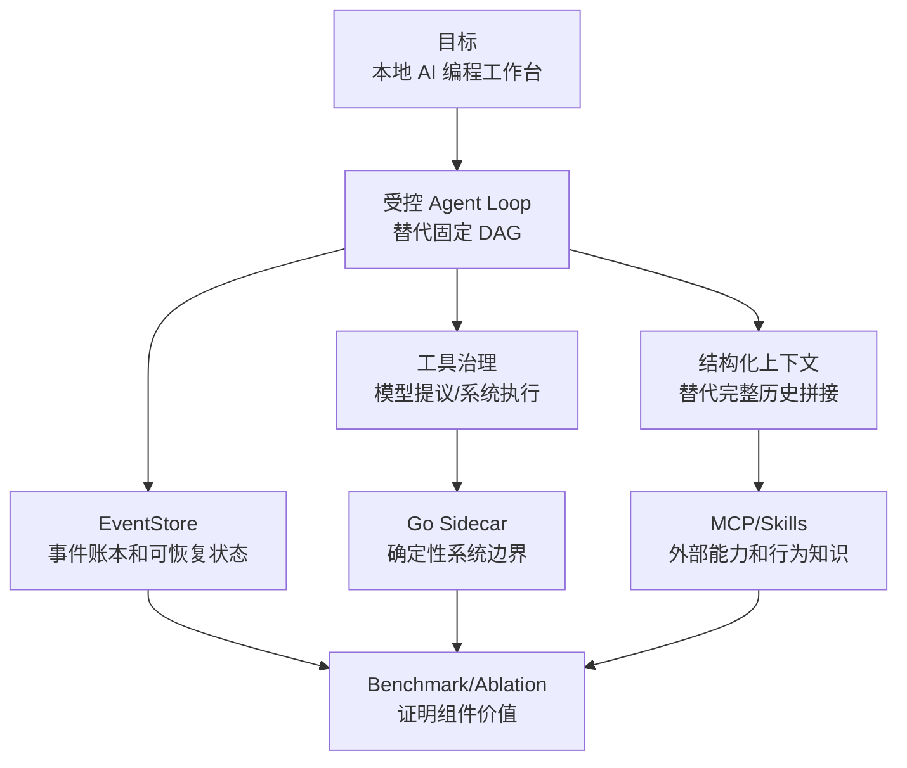
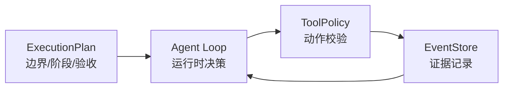
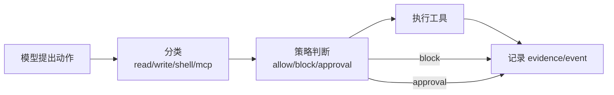
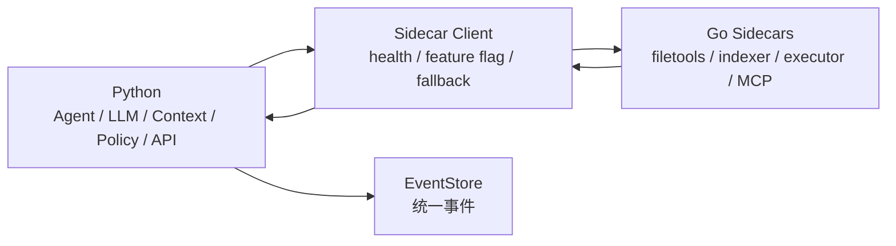

# 16. 架构决策：为什么 nanoCursor 变成现在这样

最后更新：2026-06-12

这章专门回答“为什么”。前面的章节讲系统有哪些模块、怎么运行、怎么排障；这一章把关键取舍整理成架构决策记录。真正面试或维护项目时，最能体现工程理解的往往不是“我做了什么”，而是“我为什么这样做，为什么没选另一条路，以及这个选择带来了什么代价”。

## 1. 本章目标

读完这一章，你应该能：

- 解释为什么项目从固定多 Agent 流程转向 Agent Loop。
- 解释为什么 ExecutionPlan 不是 DAG，而是边界和验收标准。
- 解释为什么默认只有 Lead，子 Agent 按需创建。
- 解释为什么上下文管理比 Agent 数量更重要。
- 解释为什么 EventStore 不是普通日志。
- 解释为什么工具策略必须独立于模型。
- 解释为什么 Go 是 sidecar，而不是全量替换 Python。
- 解释为什么 MCP/Skills 是扩展层，不是核心运行时。
- 承认每个设计的代价，而不是只讲优点。

## 2. 决策总图



这张图背后的逻辑是：项目核心不是“多 Agent 很热闹”，而是让 Agent 在本地项目里可控地读、写、验证、恢复，并留下证据。

## 3. 决策一：从 LangGraph / 固定 DAG 转向 Agent Loop

### 背景

项目早期基于固定流程：Planner -> Coder -> Reviewer / Tester。这种结构容易理解，也方便画图，但真实使用时出现几个问题：

| 问题 | 表现 |
|---|---|
| 简单请求过度执行 | 用户问候也会触发完整任务 |
| 只读任务被迫走开发流程 | “帮我看看文件”也创建 Coder |
| 中间结果改变后续路径 | 测试失败、权限阻断、缺依赖都需要动态决策 |
| 前端噪声大 | 多个 Agent 和任务卡让用户误以为系统在乱跑 |

### 选择

核心执行改为 Lead 驱动的受控 Agent Loop：每一步观察状态、决定下一步动作、通过策略校验、执行、记录事件，再进入下一步。

### 为什么不是固定 DAG

固定 DAG 适合流程稳定、分支少、每一步输入输出明确的场景，例如审批流、ETL、简单 RAG 管道。AI 编程任务的问题是：下一步经常取决于刚刚读到的文件、刚刚失败的命令、刚刚被拦截的工具调用。

### 代价

| 代价 | 缓解方式 |
|---|---|
| Loop 可能失控 | 最大步数、终止条件、工具策略、事件账本 |
| 行为不如 DAG 可预测 | 结构化动作和 EventStore 审计 |
| 测试更难 | intent eval、real-task benchmark、ablation |

### 源码入口

- `src/api/services/agent_loop_state_service.py`
- `src/api/services/runtime_executor_service.py`
- `src/api/services/workflow_thread_service.py`
- `src/api/services/runtime_routing_service.py`

### 面试说法

> 我不是否定 DAG，而是发现交互式 AI 编程任务的路径经常被中间结果改变。nanoCursor 用 Agent Loop 做运行时决策，同时用最大步数、工具策略、EventStore 和审批机制补足可控性。

## 4. 决策二：ExecutionPlan 只做边界，不做死流程

### 背景

如果完全没有计划，Agent 会一上来就改文件、跑命令、写报告；如果计划变成固定图，又会回到 LangGraph 式流程。

### 选择

ExecutionPlan 负责表达：

- 本轮任务目标。
- 可能涉及的 Agent。
- 阶段和验收标准。
- 工具权限和风险边界。
- 交付物要求。

但它不强制每一步都按固定边执行。实际下一步仍由 Agent Loop 根据状态决定。



### 代价

这种设计比纯 DAG 难画流程图，但更接近真实 AI 编程工具的行为：计划给方向，Loop 根据证据行动。

### 源码入口

- `src/api/services/orchestration_service.py`
- `src/api/services/conversation_run_service.py`
- `src/api/services/run_start_service.py`

## 5. 决策三：默认只有 Lead，子 Agent 按需创建

### 背景

一开始多 Agent 很容易做成“默认四个角色一起上”。这看起来很有展示效果，但实际问题明显：

- 问候和普通解释也创建 Agent，显得不聪明。
- 前端任务卡噪声很大。
- 多 Agent 没有独立上下文时，容易只是重复说话。
- 并行写文件会引入冲突。

### 选择

默认只有 Lead。复杂任务才创建临时子 Agent。临时子 Agent 完成后归档，证据通过 EvidencePack 合并回 Lead。

### 为什么并行主要用于读

并行读可以扩大观察面，风险较低；并行写会造成文件冲突、覆盖、回滚和 merge 策略复杂化。当前项目更适合让子 Agent 做只读分析、测试建议、风险检查，再由 Lead 或主执行链路合并执行。

### 代价

| 好处 | 代价 |
|---|---|
| 简单任务更自然 | 少了一些“多 Agent 展示感” |
| 降低上下文污染 | 子 Agent 自治程度有限 |
| 写入更可控 | 复杂任务并行加速有限 |

### 源码入口

- `src/api/services/parallel_agent_service.py`
- `src/api/services/agent_orchestration_service.py`
- `src/api/services/agent_loop_state_service.py`

## 6. 决策四：上下文管理优先于 Agent 数量

### 背景

多 Agent 系统最常见的误区是不断增加角色，但真正决定结果的是 Agent 看到了什么。上下文错了，多个 Agent 只是并行犯错。

### 选择

把上下文做成结构化 ContextPack，并引入 ContextBudget、ContextLedger、MemoryRecord、Project Index、file outline 和压缩策略。

### 为什么不塞完整项目

| 问题 | 后果 |
|---|---|
| token 成本高 | 延迟和费用上升 |
| 注意力分散 | 模型更容易忽略关键文件 |
| 历史污染 | 旧目标、旧错误和过时事实被带入新任务 |
| 不可解释 | 不知道模型为什么看了这些内容 |

### 代价

上下文选择本身会出错，所以需要 context hit rate、miss audit、selected files 和最终 touched files 的对比。

### 源码入口

- `src/agent/context_pack.py`
- `src/api/services/context_service.py`
- `src/api/services/context_budget_service.py`
- `src/api/services/context_ledger_service.py`
- `src/api/services/context_compaction_service.py`

### 面试说法

> 我后来意识到多 Agent 的核心不是角色数量，而是上下文命中率。nanoCursor 把上下文拆成可预算、可裁剪、可压缩、可解释的 ContextPack，而不是把完整历史和完整项目塞进 prompt。

## 7. 决策五：EventStore 作为事件账本，而不是普通日志

### 背景

普通日志能帮助开发者排查，但不能可靠地支撑前端恢复、任务复盘、报告生成和 benchmark 证据。

### 选择

使用 EventStore 持久化 run 事件：run_started、intent_decision、agent_status、tool_call、tool_result、diff、approval、failure、recovery、report 等。

### 为什么不是普通 logger

| Logger | EventStore |
|---|---|
| 面向开发者排查 | 面向系统状态和用户可见证据 |
| 文本为主 | 结构化事件 |
| 不保证可重放 | 可用于恢复和前端投影 |
| 不适合作为交付证据 | 可作为 benchmark / report evidence |

### 代价

事件 schema 需要维护，前后端对事件语义必须对齐，否则会出现“后端事件对，前端显示错”。

### 源码入口

- `src/api/services/event_store.py`
- SSE broker
- 前端事件 projection/store
- `maps/event-map.md`

## 8. 决策六：工具策略独立于模型

### 背景

AI 编程工具会读文件、写文件、运行命令、调用外部工具。这些都是副作用，不能只靠 prompt 约束。

### 选择

模型只提出动作；系统用 ToolPolicy 进行分类、审批、执行和记录。



### 为什么不是 prompt 约束

Prompt 约束不能保证模型不犯错，也不能防止工具入口被其他路径调用。真正可靠的边界必须在后端工具执行前检查。

### 代价

工具策略会带来误拦截，所以需要审批、解释和回归测试。

### 源码入口

- `src/runtime/tool_policy_runtime.py`
- `src/api/services/action_policy_service.py`
- `src/api/services/shell_policy_service.py`
- `src/api/routes/approvals.py`

## 9. 决策七：失败恢复是结构化恢复，不是无限重试

### 背景

真实任务里经常出现命令失败、缺依赖、测试断言失败、路径错误、权限阻断。如果只是把 stderr 再丢给模型，很容易无限循环。

### 选择

失败先分类，再生成有限恢复计划。恢复动作仍然经过工具策略。

### 关键边界

| 失败类型 | 恢复方式 |
|---|---|
| 缺依赖 | 说明依赖，必要时请求安装审批 |
| 测试断言失败 | 分析断言和实现差异 |
| 语法错误 | 定位文件和行号，生成小修复 |
| 权限阻断 | 不绕过，解释并等待用户 |
| 超时 | 降低任务规模或请求用户确认 |

### 源码入口

- `src/api/services/failure_recovery_loop_service.py`
- `src/runtime/command_runner.py`
- `src/api/services/event_store.py`

## 10. 决策八：Go 只做 sidecar，不替代 Python 主脑

### 背景

项目后期引入 Go，是为了增强确定性系统边界，而不是为了把整个后端重写成 Go。

### 选择

Python 继续负责 Agent 编排、LLM、上下文、策略和 API；Go 负责文件工具、索引、命令执行、MCP stdio 等更确定性的边界。



### 为什么不是全 Go

Python 在 LLM 生态、快速迭代和 AI 相关库上仍然更顺手。把 Agent 编排和上下文策略全迁到 Go，工程量大，收益不明确。

### 为什么不是全 Python

文件工具、命令执行、进程生命周期、MCP stdio 这类边界更适合 Go 的并发模型、二进制部署和系统编程能力。

### 代价

跨语言 RPC 有开销，小任务可能反而变慢；所以需要 feature flag、health check、fallback、contract test 和 benchmark。

### 源码入口

- `go-services/`
- sidecar Python client
- `src/runtime/command_runner.py`
- filetools / indexer service

## 11. 决策九：MCP/Skills 是扩展层，不是核心安全边界

### 背景

MCP 和 Skills 能让系统接外部工具和领域知识，但如果它们能绕过系统策略，就会变成风险源。

### 选择

MCP 提供工具协议，Skills 提供行为知识。它们可以影响上下文和路由，但不能覆盖 ToolPolicy、Approval 和 EventStore。

### 区别

| MCP | Skills |
|---|---|
| 接外部工具和上下文源 | 描述某类任务应该怎么做 |
| 偏协议和工具调用 | 偏行为规范和经验 |
| 有外部副作用风险 | 有 prompt injection / 越权指令风险 |

### 源码入口

- `src/api/routes/mcp.py`
- `src/api/routes/skills.py`
- `src/api/services/skill_registry_service.py`
- `src/api/services/routing_decision_service.py`
- `go-services/mcp-gateway`

## 12. 决策十：用 benchmark 和 ablation 证明组件价值

### 背景

如果只说“我做了 Agent Loop、上下文、Go sidecar”，面试官可能会质疑这些是不是堆功能。

### 选择

引入测试、真实任务 benchmark、上下文窗口 benchmark、消融实验和 contract test。

### 证明链路


### 代价

Benchmark 不能夸大。它证明的是特定 eval 集上的工程机制有效，不代表任意复杂项目都能成功。

### 源码入口

- `src/api/services/benchmark_service.py`
- `src/api/services/ablation_benchmark_service.py`
- `tests/contracts/`
- `tests/test_benchmark_routes.py`

## 13. 如果重做一次，会保留和改变什么

| 会保留 | 原因 |
|---|---|
| Agent Loop | 更适合交互式编程任务 |
| ContextPack | 上下文命中率是核心 |
| EventStore | 可观察和可恢复的基础 |
| ToolPolicy | 本地副作用必须受控 |
| Go sidecar | 确定性边界适合系统语言 |

| 会改变 | 原因 |
|---|---|
| 更早做指标 | 避免后期才补 benchmark 和 ablation |
| 更早清理前端信息架构 | 减少 UI 状态和事件投影返工 |
| 更早统一术语 | Conversation/run/thread 混用会增加理解成本 |
| 更早限制功能范围 | 避免为了“看起来完整”堆太多低收益模块 |

## 14. 面试答题模板

当面试官问“你为什么这样设计”时，可以按这个结构回答：

```text
背景：当时遇到什么问题
选择：最后选择了什么方案
替代方案：为什么不用另一个方案
代价：这个方案牺牲了什么
约束：怎么避免它失控
证据：用什么测试、事件或 benchmark 证明它有效
```

例子：

> 我没有继续用固定 DAG，是因为交互式编程任务路径会被中间结果改变。固定 DAG 很适合稳定流程，但问候、只读分析、小代码改动和失败恢复不应该走同一张图。所以我改成 Agent Loop。它的代价是路径不如 DAG 可预测，因此我用结构化动作、最大步数、ToolPolicy、EventStore 和 benchmark 来约束和验证。

## 15. 学习检查

学完本章后，请用自己的话回答：

1. 为什么 Agent Loop 不是“失控 while loop”？
2. 为什么 ExecutionPlan 不应该变成固定 DAG？
3. 为什么默认只有 Lead？
4. 为什么并行子 Agent 更适合做读任务？
5. 为什么 ContextPack 比完整 prompt 更好？
6. 为什么 EventStore 不是 logger？
7. 为什么 ToolPolicy 不能只靠 prompt？
8. 为什么失败恢复不能无限重试？
9. 为什么 Go sidecar 不应该成为策略中心？
10. 为什么 benchmark 和 ablation 是项目可信度的一部分？

如果你能把这些问题讲清楚，说明你已经从“知道项目做了什么”进阶到“知道项目为什么这样做”。
