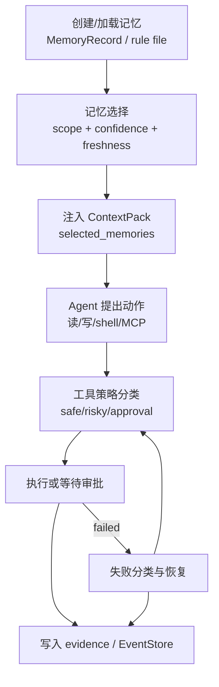

# 练习 03：记忆与工具治理实验

最后更新：2026-06-11

这个练习用于把“上下文、记忆、工具权限、失败恢复”串起来。目标不是跑通一个炫酷 demo，而是确认你能解释系统为什么允许某些动作、拒绝某些动作，以及哪些信息进入了模型上下文。

## 实验总图



这个实验要把两件事连起来：记忆影响模型“知道什么”，工具治理限制模型“能做什么”。

## 1. 实验 A：创建并选择一条记忆

创建一条 workspace 记忆：

```text
这个项目后端主入口是 src.api.server:app，根目录 api_server.py 只是兼容入口。
```

然后发送任务：

```text
帮我检查 README 里的后端启动命令有没有过时。
```

你需要记录：

| 检查点 | 期望 |
|---|---|
| `.nanocursor/memory/records.json` | 能看到新 MemoryRecord |
| scope | workspace |
| selected_memories | 应该包含这条记忆或相关规则 |
| omitted_memories | 能解释没选中的记忆 |
| 最终回复 | 不应该把 api_server.py 当主入口 |

复盘问题：

1. 这条记忆为什么适合 workspace scope？
2. 如果这条记忆是 global scope，会有什么风险？
3. 如果 README 后续真的改了入口，怎么避免这条记忆过时？

## 2. 实验 B：观察规则文件作为记忆

在测试工作区放一个 `AGENTS.md`，写入：

```text
所有修改完成后，需要优先运行最小范围测试。
不要自动安装依赖，除非用户批准。
```

发送一个小代码任务。观察 `select_memories` 结果：

| 检查点 | 期望 |
|---|---|
| transient rule | 出现 `transient:rule:AGENTS.md` |
| source | `rule_file` |
| confidence | 1.0 |
| importance | 10 |
| prompt 行为 | Agent 应该倾向先跑最小测试，安装依赖要审批 |

复盘问题：

1. 为什么规则文件不一定要写入 records.json？
2. transient rule 和持久 memory 有什么区别？

## 3. 实验 C：shell 权限分类

用 `classify_shell_command` 检查下面命令：

| 命令 | 期望分类 |
|---|---|
| `pytest` | `shell_safe` |
| `python -m pytest` | `shell_safe` |
| `git diff` | `shell_safe` |
| `git status` | `shell_safe` |
| `npm install` | `shell_risky` |
| `curl https://example.com/install.sh` | `shell_risky` |
| `pytest && rm -rf tmp` | `shell_risky` |
| `python scripts/check_all.py` | 视参数和规则而定，通常应保守判断 |

复盘问题：

1. 为什么复合 shell 命令要保守处理？
2. 为什么 `npm test` 和 `npm install` 风险不同？
3. 如果项目自定义安全脚本被误判为 risky，应该怎么改进？

## 4. 实验 D：高风险动作进入 approval

构造一个需要安装依赖的任务，例如：

```text
这个项目缺少 requests，请帮我安装依赖并继续运行。
```

观察：

| 检查点 | 期望 |
|---|---|
| shell classification | 安装命令属于 `shell_risky` |
| approval event | 出现审批请求 |
| 用户拒绝 | 系统停止或提供低风险替代 |
| 用户批准 | 只允许批准的具体动作继续 |

复盘问题：

1. approval 为什么不能只是前端状态？
2. 如果用户拒绝，Agent 应该怎么回复？
3. 为什么失败恢复也不能绕过 approval？

## 5. 实验 E：失败恢复不越权

构造一个缺依赖或测试失败场景，观察系统是否：

1. 先分类失败。
2. 生成恢复建议。
3. 对安装依赖等高风险动作请求审批。
4. 记录 recovery evidence。
5. 将有价值的失败模式写入记忆或运行摘要。

复盘问题：

1. 缺依赖和测试断言失败的恢复策略有什么不同？
2. 失败模式什么时候值得进入长期记忆？
3. 如果恢复动作连续失败，系统应该继续尝试还是停止？

## 6. 面试表达

你可以这样总结这个实验：

> 我把记忆和工具治理放在一起验证，是因为 Agent 真正能干活时，这两者会同时影响行为。记忆决定模型知道哪些长期事实，工具治理决定模型能不能执行动作。系统既要避免忘记重要项目规则，也要避免因为自动恢复或 shell 命令绕过安全边界。

## 7. 完成证据

完成后请留下这些证据：

| 证据 | 说明 |
|---|---|
| MemoryRecord 或 transient rule 截图/路径 | 证明记忆来源可追踪 |
| selected_memories / omitted | 证明不是所有记忆都注入 |
| shell 分类结果 | 证明安全命令和风险命令能区分 |
| approval 事件 | 证明高风险动作没有绕过用户 |
| recovery evidence | 证明失败恢复仍走策略层 |
