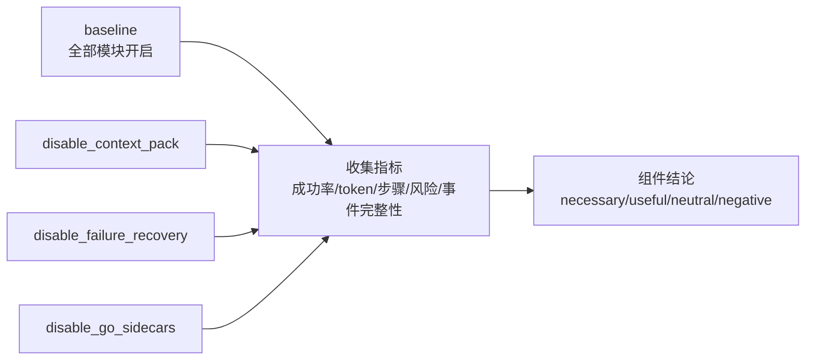

# 练习 04：跑一次 Benchmark 与消融实验

最后更新：2026-06-11

这个练习用于回答一个非常关键的问题：系统里的模块到底有没有用？

目标不是刷高分，而是学会把一次 benchmark/ablation 跑成可以复盘的证据。

## 实验总图



消融实验的重点不是“关闭模块后一定变差”，而是用同一任务、同一指标体系观察差异，避免只凭感觉说某个模块重要。

## 1. 实验 A：真实任务 benchmark

先跑真实任务 benchmark：

```bash
pytest tests/test_benchmark_routes.py::test_real_task_benchmark_suite_scores_core_cases -q
```

你需要观察：

| 字段 | 期望 |
|---|---|
| `routing_accuracy` | 是否接近或等于 1.0 |
| `tool_policy_accuracy` | 工具权限是否符合预期 |
| `test_pass_rate` | 验证命令是否通过 |
| `forbidden_agents` | 问候类任务不能创建 Coder/Tester |

复盘问题：

1. 为什么问候任务要验证 `forbidden_agents`？
2. `easy-project-overview` 为什么应该是只读？
3. 如果 `hard-risky-delete` 没有进入 approval，说明哪个模块有问题？

## 2. 实验 B：上下文窗口 benchmark

运行：

```bash
pytest tests/test_benchmark_routes.py::test_context_window_pressure_benchmark_compacts_and_preserves_anchors -q
```

重点看这些断言：

| 字段 | 意义 |
|---|---|
| `before_status == "emergency"` | 构造出了上下文压力 |
| `after_tokens < before_tokens` | 压缩真的降低 token |
| `reduction_ratio >= 0.30` | 降幅足够明显 |
| `anchor_preservation_rate == 1.0` | P0 锚点没有丢 |
| `llm_fallback_warnings` | LLM summary 失败时能 fallback |

复盘问题：

1. 为什么当前用户请求、当前计划和工具策略不能被压缩掉？
2. deterministic compaction 和 LLM summary compaction 的区别是什么？
3. 为什么要专门测试 LLM summary fallback？

## 3. 实验 C：组件消融实验

运行：

```bash
pytest tests/test_ablation_benchmark_service.py -q
```

重点读这些用例：

```text
test_component_lift_and_verdicts_are_explainable
test_context_pack_ablation_has_runtime_effect
test_failure_recovery_ablation_keeps_original_failure_when_disabled
test_go_sidecar_ablation_is_reported_without_starting_services
```

消融实验的核心结构：

```text
baseline
disable_context_pack
disable_failure_recovery
disable_go_sidecars
```

复盘问题：

1. baseline 分数和 disabled 分数的差值代表什么？
2. `necessary`、`useful`、`neutral`、`negative` 分别应该怎么解释？
3. 如果一个组件暂时没有 runtime hook，报告里应该隐藏它还是诚实标注？
4. 为什么消融实验不能只跑一次就下结论？

## 4. 实验 D：手动调用 API

如果后端已经启动，可以手动请求：

```bash
curl http://127.0.0.1:8100/api/evals/ablation/components
```

构造矩阵：

```bash
curl -X POST http://127.0.0.1:8100/api/evals/ablation/matrix \
  -H "Content-Type: application/json" \
  -d '{"eval_ids":["small_python_bugfix"],"components":["context_pack","failure_recovery"],"repetitions":1}'
```

复盘问题：

1. matrix 里有多少个 run？
2. baseline 为什么也要作为一个 variant？
3. 每个 row 里的 `disabled_components` 和 `config` 有什么用？

## 5. 面试表达

可以这样讲：

> 我后来意识到，AI Agent 项目不能只说“我做了上下文、失败恢复、Go sidecar”，还要证明这些组件真的有贡献。所以我做了 benchmark 和 ablation。benchmark 验证系统在真实任务、上下文压力和交付场景下能否跑通；ablation 则用 baseline 和单组件关闭的对照实验，观察关闭某个模块后分数、成功率、事件完整性和工具调用是否变差。

## 6. 完成标准

完成这个练习后，你应该能回答：

1. nanoCursor 有哪些 benchmark？
2. 上下文窗口 benchmark 保护哪些锚点？
3. ablation matrix 是怎么生成的？
4. 组件 verdict 是怎么计算的？
5. benchmark 能证明什么，不能证明什么？

## 7. 结果记录模板

| 实验 | baseline | disabled variant | 差异 | 初步结论 | 还需要补什么证据 |
|---|---|---|---|---|---|
| real task benchmark |  |  |  |  |  |
| context window benchmark |  |  |  |  |  |
| failure recovery ablation |  |  |  |  |  |
| go sidecar ablation |  |  |  |  |  |
