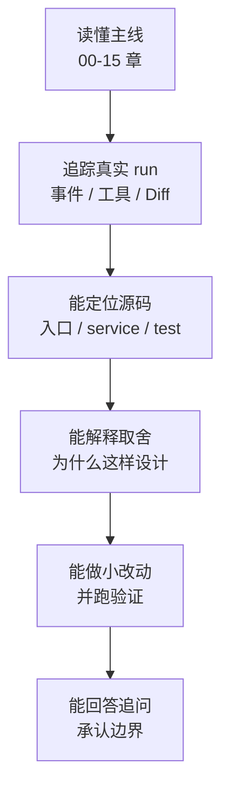

# 练习 05：最终掌握度检查

最后更新：2026-06-12

这不是普通练习，而是学习站的“毕业检查”。目标是判断你是否真的把 nanoCursor 吃透，而不是只看完了文档。

## 0. 检查路径



如果你只能说“文档里写了”，还不算掌握。真正掌握的标准是：看到一个现象，能知道该看哪个事件、哪个 service、哪个测试；被问到一个取舍，能讲出收益、代价和边界。

## 1. 三档掌握标准

| 等级 | 表现 | 还缺什么 |
|---|---|---|
| L1：会讲概念 | 能说 Agent Loop、ContextPack、EventStore 是什么 | 还不能定位源码和证据 |
| L2：会追链路 | 能追踪一次 run，从请求到事件到前端显示 | 还不能独立修改或排查 |
| L3：会维护系统 | 能按边界修改功能，补测试，解释取舍 | 已达到面试可讲和后续维护标准 |

学习站的目标是让你达到 L3。不是要求你背下每一行代码，而是能稳定回答“为什么、在哪里、怎么验证”。

## 2. 必做任务 A：追踪一个简单问答

任务：

```text
你好，你是谁？
```

你需要证明：

| 检查点 | 证据 |
|---|---|
| 没有创建 Coder/Tester | 事件中没有子 Agent 创建事件 |
| 没有写文件 | Diff 为 0，工具调用中没有 write |
| Lead 直接回答 | 前端聊天框有 Lead 回复 |
| 右侧任务不应该出现完整开发计划 | 进度面板只显示轻量状态或为空 |

要回答的问题：

1. 这次请求的 intent 是什么？
2. 为什么它不需要 execution plan？
3. 如果它错误创建了 Coder，你会先查哪个模块？

## 3. 必做任务 B：追踪一个只读分析

任务：

```text
帮我看看当前工作目录下面有哪些和排序算法有关的文件，不要修改任何文件。
```

你需要证明：

| 检查点 | 证据 |
|---|---|
| 路由为只读 | `requires_workspace_read=true`，`requires_workspace_write=false` |
| 工具策略禁止写入 | tool policy 或 action policy 不允许 write |
| 只读工具被记录 | 文件列表、搜索或读取事件进入 EventStore |
| 最终回答包含证据 | 回复中说明看了哪些路径 |

要回答的问题：

1. 只读分析和普通问答的区别是什么？
2. 如果模型试图写文件，应该由谁拦截？
3. 只读任务是否需要子 Agent？什么情况下需要？

## 4. 必做任务 C：追踪一个小代码修改

任务：

```text
在一个临时目录里创建 Python 脚本，实现 quicksort，并加一个简单测试。
```

你需要证明：

| 检查点 | 证据 |
|---|---|
| 进入 small_edit 或 coding route | intent / execution route |
| 有成功写入证据 | tool evidence 中有 write success |
| 有验证动作 | pytest 或等价检查 |
| 交付报告不是纯聊天 | report、diff、artifact 都能对应到事件 |

要回答的问题：

1. 为什么 small_edit 不能在没有写入证据时标记完成？
2. 测试失败时恢复模块如何介入？
3. 如果写入发生在工作区外，系统应该怎么处理？

## 5. 必做任务 D：压测上下文窗口

构造一个较长会话或使用 context-window benchmark，让上下文接近压缩阈值。

你需要证明：

| 检查点 | 证据 |
|---|---|
| ContextLedger 记录 section 占用 | token 面板或 context ledger 数据 |
| 达到阈值后触发压缩 | compaction event |
| P0 锚点保留 | 当前请求、当前计划、工具策略仍在 |
| 压缩失败有 fallback | deterministic summary 或保守裁剪 |

要回答的问题：

1. 为什么不能简单截断 prompt？
2. 哪些 section 可以优先压缩？
3. 压缩如何影响 Agent Loop 的后续决策？

## 6. 必做任务 E：验证一个失败恢复

构造一个会失败但可恢复的场景，例如测试期望值写错、缺少依赖、命令超时。

你需要证明：

| 检查点 | 证据 |
|---|---|
| 失败被分类 | failure kind / recovery reason |
| 恢复计划有限制 | recovery plan 有 step 和 limit |
| 高风险动作仍需审批 | shell_risky 不自动执行 |
| 恢复结果被记录 | recovery event 和最终状态 |

要回答的问题：

1. 失败恢复为什么不能只是“再问一次模型”？
2. 缺依赖和断言失败的恢复策略有什么不同？
3. 什么情况下系统应该停止并询问用户？

## 7. 必做任务 F：解释 Go Sidecar 的取舍

你不需要把 Go 源码全部背下来，但必须能解释边界。

| 问题 | 合格回答要点 |
|---|---|
| 为什么不是全 Go？ | LLM、Agent 编排、Python 生态和快速迭代仍适合 Python |
| 为什么不是全 Python？ | 文件工具、命令执行、MCP stdio 等确定性边界适合 Go |
| Go 会不会绕过安全？ | 不应该，策略仍由 Python 统一收口 |
| 哪些 Go 服务默认启用更合理？ | 行为稳定、有 contract/fallback、收益明确的 sidecar |

要找的证据：

- Go service health check。
- Python client fallback。
- contract test。
- benchmark 或 real-task evidence。

## 8. 面试口述检查

请用自己的话完成下面四段，每段不超过 90 秒：

1. nanoCursor 不是 ChatGPT 套壳，它多了哪些工程机制？
2. 为什么 Agent Loop 比固定 DAG 更适合这个项目？
3. 为什么上下文管理比 Agent 数量更重要？
4. 为什么 Go sidecar 是边界增强，而不是为了“简历上凑 Go”？

评分标准：

| 维度 | 合格表现 |
|---|---|
| 结构 | 先结论，再实现，再证据，再边界 |
| 源码 | 至少能说出 2 个相关路径 |
| 证据 | 能提到事件、测试、benchmark 或 diff |
| 边界 | 能承认项目不是生产级商业工具 |

## 9. 最终验收表

| 能力 | 自评 | 证据 |
|---|---:|---|
| 能画出整体架构图 | 0 / 1 / 2 | |
| 能追踪一次 run 的完整生命周期 | 0 / 1 / 2 | |
| 能解释 Agent Loop 的状态和停止条件 | 0 / 1 / 2 | |
| 能解释子 Agent 的创建、证据和归档 | 0 / 1 / 2 | |
| 能解释 ContextPack、ContextBudget、ContextLedger | 0 / 1 / 2 | |
| 能解释记忆如何筛选和避免污染 | 0 / 1 / 2 | |
| 能解释工具权限和审批 | 0 / 1 / 2 | |
| 能解释失败恢复的分类和边界 | 0 / 1 / 2 | |
| 能解释 EventStore 与 SSE | 0 / 1 / 2 | |
| 能解释 Python / Go 分工 | 0 / 1 / 2 | |
| 能解释 MCP 和 Skills 的区别 | 0 / 1 / 2 | |
| 能跑一次 benchmark 或消融实验 | 0 / 1 / 2 | |
| 能回答 5 个尖锐面试追问 | 0 / 1 / 2 | |

总分建议：

- 0-12：还在概念层，需要回到 00-05 章。
- 13-20：能讲项目，但源码定位还不稳。
- 21-26：基本达到面试可讲状态。

## 10. 如果卡住了，怎么补

| 卡住位置 | 回看文档 |
|---|---|
| 不知道项目整体怎么讲 | `chapters/00-learning-roadmap.md`、`interview/01-project-pitch.md` |
| 不知道请求怎么跑 | `chapters/02-request-lifecycle.md`、`maps/api-map.md` |
| 不懂 Agent Loop | `chapters/03-agent-loop.md`、`interview/03-agent-loop-deep-dive.md` |
| 不懂上下文 | `chapters/05-context-management.md`、`interview/04-context-and-memory.md` |
| 不懂工具和恢复 | `chapters/07-tool-governance.md`、`interview/05-tools-recovery-and-observability.md` |
| 不懂 Go / MCP / Skills | `chapters/10-go-sidecar.md`、`chapters/11-mcp-and-skills.md` |
| 不会证明项目价值 | `chapters/13-testing-and-quality.md`、`interview/08-testing-benchmark-retrospective.md` |

这张表是你面试前最后的路线图：哪里说不清，就回到对应章节补证据。
