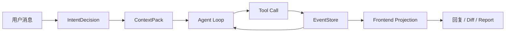
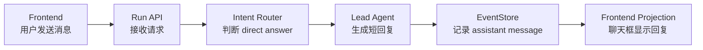
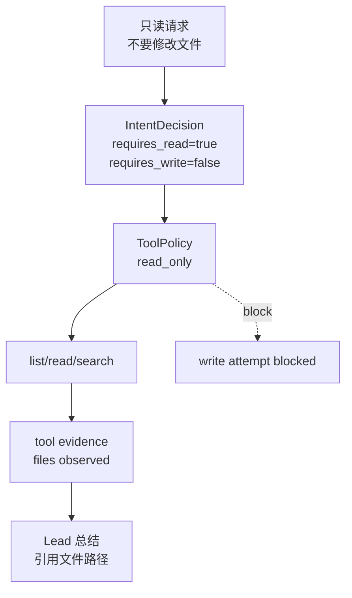
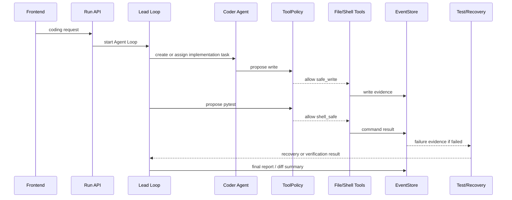

# 练习 06：三类真实 Run 全链路 Walkthrough

最后更新：2026-06-12

这份练习把前面所有知识串起来。你不再单独学习 Agent Loop、ContextPack、ToolPolicy 或 EventStore，而是拿三类真实任务沿着同一条链路完整复盘：**用户消息 -> 意图路由 -> 上下文 -> Agent Loop -> 工具调用 -> 事件账本 -> 前端投影 -> 交付/恢复**。

## 0. 为什么需要 Walkthrough

只看模块文档容易形成“我知道很多名词”的错觉。真正掌握这个项目，应该能在一个真实 run 里同时回答：

- 这次请求为什么走这个 route？
- 这次模型看到了哪些上下文？
- 哪些工具被允许，哪些工具会被拦截？
- 哪些事件证明系统确实做了事？
- 前端哪些 UI 是由哪些事件投影出来的？
- 如果失败了，恢复模块会怎么接管？



这张图是本练习的核心。每一个案例都按这条线检查，不跳步。

## 1. 准备工作

启动系统后，为每个案例创建一个干净工作区，避免污染 nanoCursor 自己的仓库。

建议准备：

```text
/tmp/nanocursor-walkthrough/direct-answer
/tmp/nanocursor-walkthrough/read-only
/tmp/nanocursor-walkthrough/small-edit
```

每个案例都记录下面信息：

| 字段 | 内容 |
|---|---|
| workspace path | |
| conversation_id | |
| thread_id / run_id | |
| 用户请求 | |
| intent route | |
| execution_route | |
| 关键事件 | |
| 文件变更 | |
| 前端显示 | |
| 结论 | |

如果你不能填出这张表，说明你还没有真正追完一次 run。

## 2. 案例 A：简单问答 Direct Answer

### 用户请求

```text
你好，你是谁？这个项目能做什么？
```

### 预期行为

| 项目 | 预期 |
|---|---|
| route | direct / answer / conversation |
| execution_route | Lead 直接回复 |
| workspace read | 通常不需要，最多轻量读取项目状态 |
| workspace write | 不允许 |
| shell | 不需要 |
| 子 Agent | 不应该创建 |
| Diff | 0 |
| report | 不需要交付报告 |

### 链路图



### 你要检查的证据

| 证据 | 检查点 |
|---|---|
| intent event | route 是否为 direct 类 |
| run metadata | 是否没有完整 execution plan |
| events.jsonl | 是否没有 write/shell/tool risky 事件 |
| 前端聊天 | 是否只有 Lead 回复，没有 Coder/Tester 队列 |
| 右侧进度 | 不应该出现完整开发任务列表 |

### 如果不符合预期

| 异常 | 可能原因 |
|---|---|
| 创建了 Coder/Tester | intent router 或 team composition 误判 |
| 出现完整任务卡 | 前端显示了旧 run 的任务，或 direct run 仍生成完整 plan |
| 出现 Diff | 工具策略严重错误，应立即查 write evidence |

### 源码定位

- `src/api/services/intent_router.py`
- `src/api/services/conversation_run_service.py`
- `src/api/services/routing_decision_service.py`
- 前端 conversation / progress projection store

### 学习问题

1. 为什么 direct answer 不应该生成交付报告？
2. 为什么问候不应该创建临时 Agent？
3. 如果前端显示了旧任务，应该先查后端还是前端？

## 3. 案例 B：只读项目分析

### 用户请求

```text
帮我看看当前目录有哪些 Python 文件，简单说明它们分别做什么。不要修改任何文件。
```

### 预期行为

| 项目 | 预期 |
|---|---|
| route | read_only / inspect / explain |
| workspace read | 允许 |
| workspace write | 不允许 |
| shell | 一般不需要，最多 shell_safe 的 list 命令 |
| 子 Agent | 可选，复杂目录时可以创建只读分析 Agent |
| Diff | 0 |
| 回复 | 应引用看到的文件路径 |

### 链路图



### 你要检查的证据

| 证据 | 检查点 |
|---|---|
| intent decision | `requires_workspace_write=false` |
| tool policy | 模式是否只读 |
| tool events | 只出现 list/read/search，不出现 write success |
| final answer | 是否引用真实文件 |
| diff | 是否为 0 |

### 如果不符合预期

| 异常 | 可能原因 |
|---|---|
| 模型写了文件 | 工具策略入口没有统一拦截 |
| 回复没有文件路径 | ContextPack 或工具 evidence 没进入总结 |
| 读错目录 | workspace 绑定错误 |
| 前端文件列表和回复不一致 | EventStore 与前端文件接口不同步 |

### 源码定位

- `src/api/services/intent_router.py`
- `src/runtime/tool_policy_runtime.py`
- `src/api/services/action_policy_service.py`
- `src/api/services/event_store.py`
- `maps/source-navigation-index.md`

### 学习问题

1. “只读任务”为什么仍然需要 ToolPolicy？
2. 如果 LLM 语义判断说要写文件，但用户明确说“不要修改”，谁优先？
3. 为什么最终回答最好引用路径，而不是只写概括？

## 4. 案例 C：小代码修改 Small Edit

### 用户请求

```text
在当前目录创建一个 sorting_demo.py，实现 bubble_sort 和 quick_sort，并加一个简单的 pytest 测试。
```

### 预期行为

| 项目 | 预期 |
|---|---|
| route | small_edit / coding |
| workspace read | 允许 |
| workspace write | 允许 safe_write |
| shell | pytest 属于 shell_safe |
| 子 Agent | 可选，通常 Lead + Coder，必要时 Tester |
| Diff | > 0 |
| report | 应总结新增文件、测试结果和风险 |

### 链路图



### 你要检查的证据

| 证据 | 检查点 |
|---|---|
| intent decision | 是否进入 small_edit/coding |
| execution plan | 是否有实现和验证阶段 |
| write evidence | 是否存在成功写入工具调用 |
| shell evidence | pytest 是否执行，exit_code 是多少 |
| diff | 新文件是否被统计 |
| report | 是否引用真实测试和文件变更 |

### 如果不符合预期

| 异常 | 可能原因 |
|---|---|
| 回复完成但 Diff 为 0 | small_edit 完成验证缺失或 write evidence 没记录 |
| 新文件没进 Diff | diff 统计逻辑漏掉 untracked/new file |
| pytest 失败但仍完成 | failure classifier 或 finalization gate 错 |
| 安装依赖自动执行 | shell_risky 没进入 approval |
| report 很碎 | 把工具原始输出当成最终消息 |

### 源码定位

- `src/api/services/runtime_routing_service.py`
- `src/api/services/tool_evidence_service.py`
- `src/api/services/run_finalization_service.py`
- `src/runtime/command_runner.py`
- `src/api/services/failure_recovery_loop_service.py`
- `src/api/services/event_store.py`

### 学习问题

1. 为什么 small_edit 必须检查 write evidence？
2. pytest 失败后，系统应该怎么分类和恢复？
3. 为什么 report 不能直接用模型最后一条 Markdown？

## 5. 三个案例的对比表

| 维度 | Direct Answer | Read Only | Small Edit |
|---|---|---|---|
| 是否读工作区 | 通常否 | 是 | 是 |
| 是否写工作区 | 否 | 否 | 是 |
| 是否需要 shell | 否 | 一般否 | 可能需要 pytest |
| 是否需要子 Agent | 否 | 可选只读分析 | 可选 Coder/Tester |
| 是否应该有 Diff | 否 | 否 | 是 |
| 是否需要交付报告 | 否 | 简短说明即可 | 是 |
| 核心风险 | 过度执行 | 误写文件 | 假完成/测试失败 |

这张表非常适合面试回答“你的系统怎么判断什么时候该做什么”。

## 6. 事件核对模板

每跑完一个案例，把关键事件填进这张表：

| 阶段 | 你看到的事件 | 是否符合预期 | 备注 |
|---|---|---|---|
| run started | | | |
| intent decision | | | |
| context built | | | |
| plan / team | | | |
| agent status | | | |
| tool call | | | |
| tool result | | | |
| diff / artifact | | | |
| failure / recovery | | | |
| final message | | | |

如果某个阶段没有事件，不一定是 bug。关键看它是否符合本案例的执行路线。例如 direct answer 没有 diff 是正常的，small edit 没有 write evidence 就不正常。

## 7. 前端核对模板

| UI 区域 | Direct Answer | Read Only | Small Edit |
|---|---|---|---|
| 聊天框 | Lead 简短回复 | Lead 总结文件 | Lead 总结交付 |
| Agent 动态 | 基本不显示或很短 | 可显示读取进度 | 显示实现/测试/恢复 |
| 右侧进度 | 不应出现完整计划 | 可显示只读任务 | 显示阶段进度 |
| 底栏 Diff | 0 | 0 | > 0 |
| 底栏事件 | 少量 | read/list 事件 | write/test/report |
| 报告 | 无需 | 可无 | 应有 |

前端验证的关键不是“好不好看”，而是 UI 是否真实反映了 EventStore 的事实。

## 8. 最终复盘问题

完成三个案例后，请用自己的话回答：

1. direct answer、read only、small edit 的边界分别是什么？
2. 这三类任务的 ToolPolicy 有什么不同？
3. 哪些事件能证明系统不是只在聊天？
4. 哪些 UI 状态来自 EventStore，哪些来自普通 API 查询？
5. 如果 small edit 没有 Diff，你会先查哪三个地方？
6. 如果 read only 出现写入，你会如何定位责任层？
7. 为什么同一个学习系统必须同时看后端事件和前端投影？

如果这些问题都能回答清楚，你就已经能把 nanoCursor 当成一个完整系统理解，而不是一堆分散模块。
