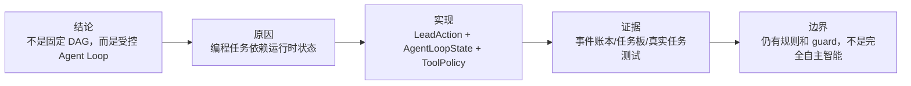

# 面试深挖：Agent Loop 与多 Agent 协同

最后更新：2026-06-12

这份材料用于准备面试中最可能被追问的部分：为什么 nanoCursor 不用固定 DAG，为什么不是默认多 Agent，以及如何让 Agent Loop 可控。



回答 Agent Loop 相关追问时，尽量按这五步说：先给结论，再讲为什么，再讲怎么做，再给证据，最后主动讲边界。

## 1. 一句话版本

nanoCursor 的核心不是“很多 Agent 聊天”，而是一个 Lead 驱动的 Agent Loop：Lead 先判断任务复杂度，简单问题直接回答，复杂代码任务再按需创建临时子 Agent，并通过上下文、工具策略、事件账本和恢复机制保证每一步可观察、可约束、可复盘。

## 2. 30 秒版本

我最初也尝试过固定流程，但交互式编程任务不适合一开始把所有步骤写死。比如用户可能只是问候，也可能是只读分析，也可能是跨文件修改；测试失败后下一步也要根据错误动态决定。所以我把系统设计成 Agent Loop：每一步先观察当前状态，再生成结构化动作，动作经过工具策略和风险检查后才能执行。这样既比固定 DAG 灵活，又不是完全无约束的 while loop。

## 3. 2 分钟版本

这个项目里我把 execution plan 和 Agent Loop 分开了。execution plan 负责边界：阶段、负责人、工具约束、验收标准；Agent Loop 负责实际运行：当前上下文是什么、任务进度如何、有没有失败、有没有待审批、下一步应该回答、读文件、写文件、运行测试还是终止。

为了避免 Loop 失控，我做了几层约束：

| 约束 | 作用 |
|---|---|
| intent router | 简单问答不进入完整开发流程 |
| AgentLoopState | 每一步动作持久化成 ledger |
| tool policy | 高风险读写和 shell 需要审批 |
| max steps | 防止无限循环 |
| EventStore | 所有关键事件可追踪 |
| recovery | 命令失败后分类处理，而不是盲目重试 |
| context ledger | 防止长会话上下文失控 |

多 Agent 在这里不是默认排场，而是 Lead 的一种动作选择。默认只有 Lead，只有当任务需要计划、实现、测试、复核或安全检查时，才创建临时 Agent。临时 Agent 是 run scoped，完成后归档，不污染长期会话。

## 4. 面试官可能追问

### Q1：为什么不用 LangGraph？

可以这样答：

> 我不是觉得 LangGraph 没价值，而是这个项目后期目标更像交互式编程工作台。固定图适合流程稳定的任务，但代码任务经常受中间结果影响。比如测试失败后，下一步可能是修实现、修测试、补依赖、请求审批或终止，这些都依赖运行时状态。所以我把 execution plan 保留为边界，把实际执行改成 Agent Loop。

继续补充：

- LangGraph/DAG 的优势是可视化和流程稳定。
- nanoCursor 的重点是运行时决策、会话连续性、工具治理和前端可感知运行。
- 所以不是“反对图”，而是把图从主执行模型降级为计划和约束。

### Q2：Agent Loop 会不会变成不可控？

答法：

> 如果只是裸 while loop，肯定不可控。所以我做的是受控 Loop。动作必须结构化，执行前要过策略检查；每一步都写入 AgentLoopState 和 EventStore；有最大步数、审批、失败分类和终止条件。它灵活的是路径，不灵活的是安全边界。

可以举例：

- `lead_direct_reply` 任务不允许创建临时子 Agent。
- read only 任务会限制写工具。
- shell risky 会进入审批。
- 超过 max steps 会停止。

### Q3：为什么默认只有 Lead？

答法：

> 因为用户的大量输入不是开发任务。默认四个 Agent 会制造噪声，也会让系统看起来像 demo。成熟工具的体验应该是：该直接回答时直接回答，该分工时再分工。所以 nanoCursor 默认只有 Lead，Lead 根据任务复杂度创建临时 Agent。

可以继续说：

- 问候：Lead 直接回答。
- 只读分析：Lead 使用索引和读工具。
- 小改动：Lead + Coder。
- 中等开发：Lead + Planner + Coder + Reviewer。
- 高风险：增加 Tester / Security / Migration。

### Q4：子 Agent 的结果怎么合并？

答法：

> 当前设计里并行 Agent 主要做只读 briefing，不直接写文件。它们输出 Summary、Evidence、Risks、Recommended Next Actions，Lead 再做合并。这样避免并行写文件导致冲突。真正的文件修改仍由受控工具链串行处理，并产生 diff 和 evidence。

如果被追问“这样是不是不够智能”，可以承认：

> 是的，它牺牲了一部分并行写入能力，但换来了更容易恢复和审计的工程安全性。后续如果要做并行写入，需要 patch 合并、冲突检测和事务性回滚，这会复杂很多。

### Q5：如何判断该不该创建 Agent？

答法：

> 现在系统结合意图路由、任务复杂度、工具需求和关键词规则。比较成熟的方向不是纯硬编码，也不是完全交给模型，而是模型输出结构化判断，再由 deterministic guard 校验。比如模型可以建议需要 Coder 和 Tester，但如果当前任务是 read only，guard 会把写权限收掉。

更新后的版本可以再补一句：

> 当前意图路由默认启用 LLM 语义分类，但不是让模型裸奔。deterministic fallback 会提供 hints，hard guard 保护 no-write、高风险和问候等强边界，normalizer 最后统一权限、Agent 和执行路线。

### Q6：多 Agent 真的提升效果了吗？

答法：

> 我不会简单说 Agent 越多越好。这个项目里多 Agent 的价值主要在两个地方：复杂任务分工和结果复核。比如 Coder 负责实现，Tester 负责验证，Reviewer 负责风险和交付质量。但对于简单问答，多 Agent 是负收益。所以我更强调“按需协同”，而不是固定多 Agent。

## 5. 可以讲的工程亮点

### 亮点 1：从 DAG 改成运行时合约

不是直接删掉流程控制，而是把控制点拆成 intent、plan、state、policy、event、recovery。

### 亮点 2：默认 Lead，按需创建临时 Agent

把 Agent 从静态角色列表变成运行时资源，解决了“问候也跑 Planner/Coder/Tester”的玩具感。

### 亮点 3：并行只读，串行写入

在个人项目里这是一种很合理的安全取舍：先并行收集证据，再统一修改文件。

### 亮点 4：前端可感知运行

Agent Loop 的状态不是只存在后端日志里，而是通过 SSE 变成前端的 Agent 动态、右侧进度、Diff 和交付物。

## 6. 不要这样讲

不要说：

```text
我实现了一个比 LangGraph 更好的框架。
```

更好的说法：

```text
我没有做通用框架，而是针对本地 AI 编程任务实现了一套更轻量的运行时。它牺牲了通用图编排能力，换来更贴近代码任务的动态决策、工具治理和前端可观测性。
```

不要说：

```text
多 Agent 能显著提升准确率。
```

更好的说法：

```text
我没有把多 Agent 当成万能解法。项目里默认只有 Lead，只有任务复杂到需要计划、实现、验证或复核时才创建临时 Agent。重点是减少不必要的协作噪声。
```

## 7. 当前边界

面试里诚实讲边界反而更可信：

- Agent 创建策略还可以更智能，目前仍有规则和启发式判断。
- 并行 Agent 主要只读，不支持成熟的并行 patch 合并。
- Loop 决策质量还需要更多 benchmark 和事后评估。
- 复杂任务的完成条件还可以进一步结合测试、风险和用户目标。

## 8. 反问准备

如果面试官问“你下一步会怎么做”，可以回答：

1. 做 Agent decision eval：记录 Lead 每次路由和创建 Agent 的判断，事后标注是否合理。
2. 做 context hit rate：判断最终修改文件是否被提前选入 ContextPack。
3. 做 recovery benchmark：统计命令失败后自动恢复的成功率。
4. 做 patch transaction：为未来并行写入准备冲突检测和回滚机制。

## 9. 自测

你应该能不看稿回答这些问题：

1. execution plan 和 Agent Loop 的区别是什么？
2. 为什么固定 DAG 不适合这个项目后期目标？
3. Agent Loop 如何避免失控？
4. 为什么简单问候不应该进入完整开发流程？
5. 临时 Agent 为什么完成后要归档？
6. 为什么并行 Agent 暂时不直接写文件？
7. 如果 Lead 创建了错误的 Agent，应该从哪些层排查？
8. 你如何证明 Agent Loop 比固定流程更适合这个项目？
