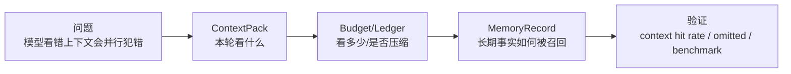

# 面试深挖：上下文管理与记忆机制

最后更新：2026-06-12

这份材料用于准备 nanoCursor 里最容易讲出深度的第二条主线：上下文管理和记忆机制。它们决定 Agent 是否“看对东西”，比单纯增加 Agent 数量更重要。



这类问题不要只说“我做了摘要”。更好的回答是：上下文是一个选择、预算、压缩、审计和评估系统。

## 1. 一句话版本

nanoCursor 没有把完整项目和完整聊天历史直接塞给模型，而是把项目索引、文件 outline、会话摘要、运行摘要、失败记录、用户偏好、Skills 和工具策略组织成 ContextPack，再通过 ContextBudget、ContextLedger 和记忆选择器控制注入内容、token 占用和自动压缩。

## 2. 30 秒版本

我认为 AI 编程工具的关键不是 Agent 数量，而是上下文命中率。nanoCursor 里我把上下文拆成结构化的 ContextPack，记录本轮任务、相关文件、文件大纲、最近失败、记忆、Skills 和工具策略。记忆系统则把长期有价值的信息抽成 MemoryRecord，并按 scope、source、confidence、importance、freshness 做筛选。这样每次任务只注入相关内容，也能解释哪些内容被选中或裁掉。

## 3. 2 分钟版本

这个项目里上下文管理分三层：

| 层 | 作用 |
|---|---|
| ContextPack | 决定本轮给模型看什么 |
| ContextBudget | 决定每类内容最多占多少 |
| ContextLedger | 记录实际窗口占用和压缩状态 |

记忆不是直接拼进 prompt，而是长期候选池。比如用户偏好、项目规则、运行摘要、失败模式和成功工作流都会以 MemoryRecord 存储。每次 run 会根据 prompt、active task、selected files、conversation_id 和 run_id 选择相关记忆，并记录 selected 和 omitted。文件相关记忆还绑定 file_fingerprint，文件变化后会变 stale，避免旧事实污染。

长会话时，ContextLedger 会发现上下文压力，触发 deterministic 或 summary compaction。压缩时会保护当前用户请求、当前计划和工具策略这些 P0 锚点。LLM 摘要失败也不能让 run 失败，必须 fallback 到本地 deterministic summary。

## 4. 面试官可能追问

### Q1：为什么不直接用长上下文模型？

可以这样答：

> 长上下文不是免费的，也不是越长越聪明。即使模型支持几十万 token，成本、延迟和注意力分散仍然存在。AI 编程更需要上下文命中率：让模型看到和当前任务最相关的文件、失败、计划和约束，而不是把整个项目塞进去。

继续补充：

- 大上下文会掩盖检索和选择问题。
- 工具策略、当前请求、当前计划必须比历史日志优先。
- 可观测上下文能解释模型为什么没看到某个文件。

### Q2：ContextPack 和普通 prompt 模板有什么区别？

答法：

> 普通 prompt 模板只是字符串。ContextPack 是结构化对象，每个字段都可以被评分、裁剪、展示和测试断言。比如 selected_files 记录选了哪些文件以及原因，omitted 记录被裁掉的内容，budget_report 记录 token 占用。这让上下文管理变成可调试系统，而不是玄学 prompt。

### Q3：记忆和聊天历史有什么区别？

答法：

> 聊天历史是发生过什么，记忆是系统认为以后还值得参考什么。历史是原始时序记录，记忆是被提取、分层、打分、带来源和新鲜度的结构化信息。不能把完整聊天历史直接当记忆，否则会把过时目标和错误策略一起带进新任务。

### Q4：记忆会不会污染模型？

答法：

> 会，所以需要治理。nanoCursor 的记忆有 scope、source、confidence、importance、freshness 和 expires_at。选择时还会记录 omitted。文件绑定记忆有 fingerprint，文件变更后会 stale。自动项目事实必须有 evidence_refs，避免把模型猜测固化成长期事实。

### Q5：上下文压缩会不会丢重要信息？

答法：

> 压缩一定有信息损失，所以关键是保护锚点和记录来源。当前请求、当前计划、工具策略不能裁掉；低优先级历史、旧工具输出和远期 Agent 动态可以被摘要替代。压缩结果会保留 source_section_ids，LLM summary 失败时会 fallback。

## 5. 可以讲的工程亮点

### 亮点 1：上下文是结构化合约

不是拼 prompt，而是 ContextPack + Budget + Ledger。

### 亮点 2：记忆有治理字段

scope、source、confidence、importance、freshness、file_fingerprint 让记忆可以被解释和淘汰。

### 亮点 3：自动压缩有 fallback

LLM summary 是增强，不是单点依赖。失败时 deterministic summary 兜底。

### 亮点 4：上下文可做 benchmark

可以比较无压缩、deterministic、summary、LLM fallback 的 token 占用和锚点保留率。

## 6. 不要这样讲

不要说：

```text
我做了一个记忆系统，可以记住所有聊天内容。
```

更好的说法：

```text
我做的是受治理的长期上下文候选池。系统不会记住所有聊天，而是抽取有证据、有范围、有新鲜度的信息，并在每次任务里按相关性和预算选择注入。
```

不要说：

```text
上下文越多越好。
```

更好的说法：

```text
上下文管理追求的是命中率和可解释性。过多无关上下文会增加成本，也会干扰模型注意力。
```

## 7. 当前边界

- token 估算仍是近似值，不等同于模型 tokenizer 精确值。
- 记忆选择主要是确定性打分，还没有接入向量语义检索。
- 不同 Agent 的上下文视图还可以继续细分。
- context hit rate 和 miss audit 还可以做成更系统的评测指标。

## 8. 反问准备

如果面试官问“下一步怎么提升”，可以说：

1. 做 context hit rate：最终修改文件是否在 selected_files 中。
2. 做 context miss audit：模型后来读取但初始没注入的文件，反推索引漏召回。
3. 做 memory pruning：低置信、低使用、过期记忆自动降权或归档。
4. 做 per-agent context view：Coder、Tester、Reviewer 拿不同上下文。
5. 引入可选向量召回，但保留 scope、freshness 和 audit。

## 9. 自测

你应该能不看稿回答：

1. ContextPack、ContextBudget、ContextLedger 分别解决什么问题？
2. 为什么工具策略属于 P0 上下文？
3. selected_files 和 omitted 分别有什么用？
4. 记忆为什么要有 scope？
5. file_fingerprint 如何避免旧事实污染？
6. summary compaction 为什么必须有 fallback？
7. 如果模型改错文件，你会如何排查上下文问题？
