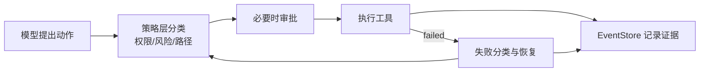

# 面试深挖：工具治理、失败恢复与可观测性

最后更新：2026-06-12

这份材料用于准备 nanoCursor 的第三条工程主线：Agent 能真实执行工具，但执行过程必须安全、可观察、失败后能恢复。



回答工具和恢复问题时，重点是把“模型想做什么”和“系统允许做什么”分开讲。

## 1. 一句话版本

nanoCursor 把模型动作和真实执行分开：模型只能提出结构化动作，系统通过工具权限、approval、路径安全、EventStore、失败分类和恢复计划决定能不能执行、怎么执行、怎么留下证据。

## 2. 30 秒版本

我认为 AI 编程 Agent 真正的风险在工具调用，不在聊天回复。所以 nanoCursor 对工具做了权限分级：只读、安全写、高风险写、安全 shell、高风险 shell、MCP 读写等。高风险动作进入 approval。每次工具执行都会写 EventStore，失败后从事件提取 evidence，分类成缺依赖、权限阻断、测试失败、命令不存在等，再生成恢复计划，但恢复动作仍然要经过同一套工具治理。

## 3. 2 分钟版本

系统执行链路可以拆成五步：

```text
propose -> classify -> decide -> execute -> record
```

Lead 或子 Agent 提出动作后，系统先判断工具权限和风险。比如读文件是 read_only，写普通工作区文件是 safe_write，删除、回滚、安装依赖、网络请求、Git 写操作是高风险。高风险动作不会直接执行，而是产生 approval。用户批准后，approval token 只绑定到具体动作，避免一次批准被复用到其他命令。

工具执行结果会进入 EventStore。失败恢复模块不会凭空猜，而是从 command_failed、tool_call_failed、error 等事件中提取 command、stderr、exit_code、related_files 等 evidence，再构建恢复计划。比如 ModuleNotFoundError 可能建议检查依赖文件并请求安装审批；测试断言失败则应该分析失败用例，决定修实现还是修测试。

可观测性方面，每个 run 有 session.json 和 events.jsonl。SSE 只是事件账本的实时投影，前端断开后仍可以从 session、snapshot 和 events 恢复。

## 4. 高频追问

### Q1：为什么工具治理比多 Agent 更重要？

多 Agent 只是决策方式，工具治理决定系统能不能安全地执行真实动作。没有工具治理，Agent 要么只能聊天，要么非常危险。

### Q2：approval 为什么不是前端弹窗那么简单？

前端只是展示。后端必须记录 approval request、绑定 workspace、工具、命令 hash、过期时间和用户决策。否则用户批准一次可能被错误复用。

### Q3：失败恢复怎么避免无限重试？

靠失败分类、恢复次数、任务状态、approval、最大步数和终止条件。恢复不是简单重跑，而是先判断失败类型，再选择低风险动作，必要时请求用户确认。

### Q4：为什么 EventStore 用 JSONL？

本地单用户场景下，JSONL 足够简单可靠，便于追加、grep 和人工排查。它不适合大规模跨 run 聚合，但当前项目优先本地可维护性。

### Q5：SSE 和 EventStore 是什么关系？

EventStore 是事实来源，SSE 是实时投影。SSE 断开不会导致事件丢失，因为事件已经写到 EventStore。前端可以通过 reconciliation 恢复。

### Q6：如何证明系统真的可观测？

可以从一次 run 里拿出 thread_id，展示 session.json、events.jsonl、任务板、Diff、approval、失败恢复 evidence 和最终报告。能复盘“谁在什么时候做了什么”，才叫可观测。

## 5. 可以讲的工程亮点

### 亮点 1：工具权限分级

不是所有工具一视同仁，而是按读、写、危险写、shell、MCP 外部副作用分层。

### 亮点 2：失败恢复不绕过权限

恢复动作仍要经过 tool policy 和 approval，避免“自救机制”变成安全后门。

### 亮点 3：EventStore 是运行账本

事件不只是日志，还用于前端展示、报告、恢复、benchmark 和面试复盘。

### 亮点 4：异步边界明确

API 快速返回，长任务后台线程执行，阻塞命令 to_thread 或 Go executor，前端通过 SSE 观察。

## 6. 当前边界

- shell 分类仍是保守规则，不是完整 shell AST。
- EventStore 仍是本地 JSONL，跨 run 聚合能力有限。
- 失败恢复的成功率还需要更多 benchmark。
- Go executor 和 Python subprocess 的分流策略仍可继续优化。

## 7. 反问准备

如果面试官问下一步怎么做，可以说：

1. 为工具策略做更多 contract test。
2. 为失败恢复做 benchmark，统计不同失败类型的恢复成功率。
3. 为 EventStore 增加轻量索引，支持跨 run 查询。
4. 将 shell 分类升级为更强的结构化 parser。
5. 为 Go executor 做更智能的分流策略。

## 8. 自测

1. 工具调用五段式是什么？
2. 为什么失败恢复不能绕过 approval？
3. EventStore 和 SSE 的边界是什么？
4. command_failed 事件里最重要的字段有哪些？
5. 为什么本地项目可以先用 JSONL，而不是数据库？
6. 如果前端显示 Agent 卡住，你会如何从事件、SSE、线程、前端 store 排查？
