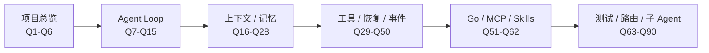

# nanoCursor 面试问题题库

最后更新：2026-06-12

这份题库不是让你逐字背，而是让你面试前快速刷一遍“可能被问到什么”。每个回答都尽量按同一个结构：先给结论，再讲设计，再讲边界。

## 0. 刷题路径

不要从 Q1 背到 Q90。更有效的刷法是先把问题归到主线里：项目为什么存在、Agent Loop 怎么决策、上下文怎么组织、工具怎么受控、Go 和 MCP 为什么放在边界层、最后用测试和消融证明这些模块不是摆设。

## 1. 项目总览

### Q1：一句话介绍 nanoCursor？

nanoCursor 是一个本地优先的 AI 编程工作台，重点不是聊天生成代码，而是把一次代码任务拆成可观察、可审批、可恢复、可复盘的 Agent Run。

### Q2：这个项目解决什么问题？

它解决 AI Coding Agent 落地时的工程问题：上下文怎么选、工具怎么控、Agent 怎么循环决策、失败怎么恢复、用户怎么知道系统正在做什么。

### Q3：它和普通 ChatGPT 套壳有什么区别？

普通套壳主要是 prompt -> answer。nanoCursor 有 workspace、conversation、run、execution plan、Agent Loop、ContextPack、ToolPolicy、EventStore、SSE、Diff 和恢复证据。

### Q4：它和 Codex/Cursor 的区别？

成熟工具更强，nanoCursor 不替代它们。nanoCursor 的价值是显式实现和展示 AI 编程工具背后的工程机制。

### Q5：这个项目最核心的亮点是什么？

Agent Loop、上下文管理、工具治理、事件流、失败恢复、Go sidecar、MCP/Skills。面试时不要平均讲，优先讲 Agent Loop 和上下文。

### Q6：最大短板是什么？

复杂任务成功率仍依赖模型和上下文命中率；MCP/Skills 生态不够成熟；多用户安全不是目标；前端体验仍可打磨。

## 2. Agent Loop 与编排

### Q7：为什么不用固定 DAG？

AI 编程任务中间结果会改变下一步动作。固定 DAG 适合稳定流程，Agent Loop 更适合根据运行时状态动态决策。nanoCursor 用工具策略、最大步数、事件账本和审批补足可控性。

### Q8：为什么不用 LangGraph？

不是 LangGraph 没价值，而是项目后期更像交互式编程工作台。固定图容易把任务流程写死，而 nanoCursor 需要简单问答、只读分析、代码交付、失败恢复走不同路径。

### Q9：Agent Loop 会不会失控？

裸 while loop 会失控。nanoCursor 的 Loop 每一步有结构化动作、dry-run 校验、工具权限、审批、最大步数、EventStore 和终止条件。

### Q10：默认为什么只有 Lead？

很多用户输入不是开发任务。默认四个 Agent 会制造噪声。Lead 先判断任务复杂度，只有需要分工时才创建临时 Agent。

### Q11：什么时候创建 Coder / Tester / Reviewer？

小代码改动创建 Coder；需要验证时创建 Tester；跨模块或高风险变更需要 Reviewer/Security。问候、解释、普通讨论不创建。

### Q12：临时 Agent 为什么完成后要归档？

临时 Agent 是 run scoped，只服务当前任务。完成后归档可以避免污染长期会话和前端团队状态。

### Q13：并行 Agent 为什么只读？

并行读可以扩大观察面，风险低；并行写会造成文件冲突、覆盖和回滚复杂度。当前设计是并行收集证据，Lead 串行合并执行。

### Q14：多 Agent 真的有必要吗？

不是所有任务都必要。多 Agent 的价值在复杂任务的职责分离和复核；简单任务单 Lead 更好。

### Q15：如何判断 Agent 创建是否合理？

看是否减少错误、是否提高上下文命中率、是否产生有用 evidence。未来可以做 Agent decision eval。

## 3. 上下文管理

### Q16：为什么上下文管理比多 Agent 更重要？

Agent 看到的上下文错了，再多 Agent 也只是并行犯错。上下文命中率决定系统是否理解项目。

### Q17：ContextPack 是什么？

它是本轮模型输入的结构化上下文，包含任务、会话摘要、运行摘要、项目索引、相关文件、失败、记忆、Skills 和工具策略。

### Q18：ContextBudget 是什么？

它控制不同内容类别的 token 预算，比如 snippets、file_outlines、recent_failures、preferences_skills 等。

### Q19：ContextLedger 是什么？

它记录实际上下文窗口占用、section 优先级、是否可压缩和当前压力状态，供前端展示和压缩策略使用。

### Q20：为什么不把整个项目塞给模型？

成本高、延迟高、注意力分散，而且会引入无关信息。更好的方式是项目索引 + 文件 outline + 按需读取。

### Q21：上下文压缩怎么做？

保护当前请求、当前计划、工具策略等 P0 锚点；压缩低优先级历史、旧工具输出和 Agent 动态；LLM summary 失败时 fallback 到 deterministic summary。

### Q22：怎么证明上下文模块有价值？

做 context hit rate：最终修改或读取的文件是否在初始 selected_files 中；做 miss audit：模型后来读取但初始没选中的文件是什么。

## 4. 记忆机制

### Q23：记忆和聊天历史有什么区别？

历史是发生过什么，记忆是值得长期参考什么。记忆有 scope、source、confidence、importance、freshness 和 evidence。

### Q24：MemoryRecord 有哪些关键字段？

scope、workspace_id、conversation_id、run_id、file_path、kind、content、source、confidence、importance、freshness、evidence_refs、file_fingerprint。

### Q25：为什么记忆要有 scope？

防止 A 项目的事实污染 B 项目，防止某次会话目标变成全局偏好。

### Q26：file_fingerprint 解决什么问题？

文件变更后，基于旧内容的 file/rule 记忆会变 stale，避免旧事实误导。

### Q27：为什么不用向量数据库？

当前记忆规模不大，确定性打分更可解释。未来可以引入向量召回，但 scope、freshness、audit 仍要保留。

### Q28：FailureLearner 有什么用？

把重复失败模式提取成记忆，提高后续相关任务的警觉性，但不能让失败记忆无条件永久高优先级。

## 5. 工具治理和安全

### Q29：工具权限怎么分级？

read_only、safe_write、risky_write、shell_safe、shell_risky、mcp_read、mcp_write、external_risky。

### Q30：为什么工具治理比多 Agent 更重要？

多 Agent 是决策形态，工具治理决定系统能否安全执行真实动作。

### Q31：shell_safe 和 shell_risky 怎么区分？

测试、lint、只读命令通常 safe；安装依赖、网络请求、删除、Git 写操作、复合 shell 命令通常 risky。

### Q32：为什么 `pytest && rm -rf tmp` 要拦截？

复合命令里混入删除操作，不能只看第一个命令是 pytest。

### Q33：为什么高风险动作不直接禁止？

真实开发有时需要安装依赖、回滚、调用外部工具。approval 让用户决定是否承担风险。

### Q34：approval token 应该绑定什么？

workspace、工具、目标、命令 hash、过期时间和用户决策，避免批准被复用到别的操作。

### Q35：失败恢复为什么不能绕过权限？

否则恢复模块会成为安全后门。恢复动作仍然要进入同一套 tool policy 和 approval。

## 6. 失败恢复

### Q36：命令失败后系统怎么处理？

先提取 evidence，再分类失败，比如 ModuleNotFoundError、SyntaxError、permission denied、timeout、test assertion failure，再生成恢复计划。

### Q37：缺依赖怎么处理？

先检查依赖文件和错误上下文；安装依赖属于 shell_risky，需要 approval，不能自动执行。

### Q38：测试失败怎么处理？

分析失败用例和错误输出，判断是实现错、测试预期错还是环境错，再小范围修复或请求用户确认。

### Q39：如何避免无限修复？

最大步数、恢复次数、失败分类、approval、终止条件和任务状态共同限制。

### Q40：怎么证明失败恢复有价值？

做 recovery benchmark，统计不同失败类型的恢复成功率、平均步骤数、是否绕过权限、最终测试结果。

## 7. EventStore 与 SSE

### Q41：EventStore 是什么？

它是 run 的事件账本，持久化 session.json 和 events.jsonl，记录运行过程、工具调用、失败、审批、交付物。

### Q42：EventStore 和普通日志有什么区别？

普通日志主要给开发者看；EventStore 同时服务前端展示、恢复、报告、benchmark 和面试复盘。

### Q43：为什么用 SSE？

nanoCursor 主要需要服务端向前端单向推送运行状态，SSE 简单、HTTP 原生、浏览器支持自动重连。

### Q44：SSE 断了会丢事件吗？

不会。事件写到 EventStore，SSE 只是实时投影。断线后可通过 session、snapshot、events 恢复。

### Q45：前端显示旧任务怎么办？

优先查 conversation_id、thread_id、workspace 绑定和前端 store 是否清理旧 run，不要只改 CSS。

## 8. 异步边界

### Q46：为什么 Agent Run 放线程里？

Agent Run 是长任务，包含 LLM、文件、shell、事件。放线程可以让 API 快速返回 thread_id，避免阻塞事件循环。

### Q47：async def 里调用 subprocess.run 有什么问题？

它仍然阻塞事件循环，导致其他请求和 SSE heartbeat 卡住。

### Q48：asyncio.to_thread 用来做什么？

把同步阻塞操作放到线程池执行，比如 subprocess、同步 Go client、大文件操作。

### Q49：为什么不用 Celery？

项目是本地单用户工具，引入 Redis/RabbitMQ 会增加部署复杂度。线程 + EventStore 足够。

### Q50：如何排查 SSE 不刷新？

看 `/health` 是否响应、EventStore 是否追加、run 线程是否存活、SSE 是否断开、前端 store 是否消费事件。

## 9. Go Sidecar

### Q51：为什么引入 Go？

Go 适合确定性系统边界：文件工具、索引、命令执行、MCP stdio。Python 继续做 Agent 编排。

### Q52：为什么不全 Go？

LLM 生态、prompt、Agent Loop、上下文和工具治理更适合 Python。全 Go 不能解决核心问题。

### Q53：哪些 Go 服务默认启用？

indexer、filetools 属于默认增强层；executor、MCP gateway 可选；eventstore/policy 等是实验候选。

### Q54：Go 服务挂了怎么办？

fallback 到 Python，并记录事件，进入 cooldown，避免反复失败。

### Q55：Go 一定更快吗？

不一定。小命令和小文件受 RPC 开销影响可能更慢；长命令、大扫描、进程管理更适合 Go。

### Q56：contract test 有什么用？

验证 Python 和 Go 对同一输入行为一致，防止跨语言实现逐渐偏离。

## 10. MCP 与 Skills

### Q57：MCP 和 Skills 区别？

MCP 是工具协议，解决能调用什么；Skills 是任务规范，解决应该怎么做。

### Q58：MCP 工具是否可信？

不天然可信。需要 server 探活、工具发现、权限分类、approval 和 fallback。

### Q59：GitHub Skills 为什么不能直接加载？

外部 Skill 可能包含危险指令，比如读取密钥、删除文件、绕过审批。需要解析、扫描、规范化、用户确认。

### Q60：Skill 和 prompt 模板有什么区别？

Skill 有 triggers、roles、permissions、risk、source、version，可以被选择和治理；普通模板只是文本。

### Q61：MCP 写工具失败为什么不能自动 fallback？

写工具有外部副作用，自动替代可能导致重复创建或状态不一致，必须用户确认。

### Q62：Go MCP Gateway 的价值？

管理 stdio server 生命周期、超时、取消、stderr 捕获和隔离。

## 11. 测试、Benchmark 与证明

### Q63：项目怎么证明不是堆功能？

通过 contract test、API smoke、benchmark、ablation、EventStore evidence、真实任务测试证明模块有作用。

### Q64：哪些测试最关键？

工具权限测试、approval 测试、filetools contract、context window benchmark、failure recovery benchmark、API smoke。

### Q65：消融实验有什么意义？

关闭某个模块跑同一任务，看成功率、token、步骤数、失败率变化，证明组件是否必要。

### Q66：benchmark 结果怎么讲？

讲趋势和证据，不夸大绝对数字。比如上下文压缩减少 token 且保留锚点，Go sidecar 对大任务有价值但小任务未必更快。

## 12. 简历与项目价值

### Q67：这个项目适合写简历吗？

适合，尤其投 AI Agent、AI Infra、后端工程、LLM 应用工程岗位。它展示系统设计和工程落地，而不是单纯调 API。

### Q68：项目名字叫 nanoCursor，但真的 nano 吗？

代码量已经不小，但 nano 可以理解为“轻量复刻核心机制”，不是完整商业工具。面试时不用纠结名字。

### Q69：你最大的收获是什么？

认识到 AI 编程工具的难点不是调用模型，而是上下文、工具、安全、事件、恢复和评测的系统工程。

### Q70：如果让你重做，会怎么做？

更早定义核心指标和边界：context hit rate、Agent decision eval、recovery benchmark；更早收敛主线，少做前端细节反复。

### Q71：项目最能体现工程能力的点？

Agent Loop 受控运行、ContextPack/Ledger、ToolPolicy/Approval、EventStore/SSE、Go sidecar fallback、失败恢复和测试体系。

### Q72：如何诚实评价项目？

它不是成熟商业工具，但已经超过玩具 Demo。它是一个围绕 AI Coding Agent 核心机制展开的本地工程系统。

## 13. 语义意图路由

### Q73：现在的意图路由是纯关键词吗？

不是。当前默认启用 LLM 语义分类器，由模型输出结构化 route、confidence、risk、agents 和工具需求；确定性规则主要承担 fallback、hard guard 和可解释 hints。简单说：LLM 负责语义判断，后端规则负责安全边界和回退。

### Q74：为什么不完全交给 LLM 判断？

因为意图路由会直接影响是否读文件、写文件、运行命令和进入 approval。模型可能把代码任务误判成闲聊，也可能忽略“不要改代码”这样的边界。nanoCursor 的做法是让 LLM 提建议，再由 hard guard 和 normalizer 收口。

### Q75：hard guard 主要保护什么？

保护空输入、问候、显式 no-write、高风险操作、approval 边界等不应该被模型覆盖的场景。比如用户只是说“哈喽”，系统应该直接 Lead 回复；用户说“删除 node_modules 并 git push”，即使模型觉得只是普通任务，也必须进入高风险路径。

### Q76：deterministic hints 有什么用？

它们不是最终决策，而是给语义模型和 trace 提供线索。比如 fallback 看到 `code_artifact_hint` 和 `tooling_hint`，语义模型就不应该轻易把“写 Python 排序算法并比较性能”判断成 direct answer。这样既减少纯关键词误判，又避免完全失去可解释性。

### Q77：如果 LLM 语义判断错了怎么办？

normalizer 会做一致性收口。明确写代码的 fallback 证据不能被 LLM 直接降级成闲聊；明确 no-write 的用户边界会强制收掉写权限；高风险 guard 永远优先。LLM 超时或输出非法 JSON 时，也会 fallback 到 deterministic / legacy 路径或澄清。

### Q78：怎么证明语义路由有效？

一是跑 intent eval，覆盖问候、解释、只读、小改、feature、debug、test、review、高风险、连续对话和 no-write；二是看 `router_trace` 里 semantic route、fallback route、final route 和 normalization notes；三是用真实 LLM smoke 验证简单问候不会浪费模型调用，代码任务能进入 feature delivery。

## 14. 子 Agent 独立上下文与结果合并

### Q79：现在 Lead 是一开始就定死所有子 Agent 吗？

不是完全定死。系统会先根据意图和 execution plan 判断是否需要并行 briefing 或临时子 Agent。当前仍有规则和计划约束，但不是每个请求默认创建固定四个 Agent。成熟方向是让 Lead 用模型结构化判断提出子 Agent 方案，再由 deterministic guard 限制数量、权限和风险。

### Q80：子 Agent 有独立上下文吗？

有第一版。子 Agent 执行前会构建 scoped ContextPack，只包含它完成当前子任务需要的信息；它完成后生成 EvidencePack，并通过 `merge_agent_result` 让 Lead 合并摘要和证据。Lead 不直接继承子 Agent 的完整过程，避免污染主上下文。

### Q81：EvidencePack 解决什么问题？

它把子 Agent 的输出从“聊天片段”变成可审计证据，包含 summary、artifacts、risks、event refs、context_pack_id 等信息。这样 Lead 合并的是结构化结果，而不是把子 Agent 的所有中间日志塞回 prompt。

### Q82：为什么不让多个子 Agent 并行写代码？

并行写会带来冲突、覆盖、回滚和责任归因问题。当前更稳的设计是并行读、并行分析、并行验证建议，然后由 Lead 在工具治理链路中收敛写操作。成熟工具也通常不会让多个写作者同时改同一批文件。

## 15. 上下文窗口与压缩

### Q83：上下文窗口面板展示的是什么？

它展示当前模型、窗口上限、估算 token 使用量，以及各 section 的占比，例如 selected files、recovery context、recent failures、tool policy、turn context。它不是精确 tokenizer，但足够帮助判断是否接近压缩阈值。

### Q84：达到 90% 窗口压力时怎么处理？

系统应该触发压缩策略，优先压缩低优先级、可压缩 section，例如旧 Agent 动态、旧工具输出和远期历史。当前用户请求、当前计划、工具策略是 P0 锚点，不应该被压缩掉。

### Q85：怎么证明上下文压缩不是拍脑袋？

看 benchmark：无压缩、deterministic、summary、LLM summary、fallback 各自的 token reduction、pressure status 和 anchor preserved。面试时重点讲趋势，不要夸大某一次数字。

## 16. 失败自动处理与组件价值

### Q86：命令失败是不是都交给同一个 Agent 修？

不是理想状态。系统先做失败分类：缺依赖、语法错误、测试断言失败、权限拒绝、超时、路径越界等，再决定自动修复、请求审批、降级或停止。Agent 负责可修复的代码/测试类问题，但策略和审批仍由后端控制。

### Q87：缺依赖时为什么不能直接 pip install？

安装依赖属于 shell_risky，可能改环境、联网或引入供应链风险。系统可以识别 `ModuleNotFoundError` 并建议安装，但执行前应该进入 approval。

### Q88：如何证明某个模块是必须的？

用消融实验。比如关闭语义路由看问候和 no-write 是否误判；关闭上下文选择看 context hit rate 是否下降；关闭工具治理看高风险命令是否被拦；关闭恢复看测试失败后能否自动收敛。

### Q89：如果面试官说“这些功能都是 AI 帮你写的”，怎么回答？

不要否认使用 AI 工具。更好的回答是：实现过程中借助了 AI，但系统边界、问题拆解、验证标准、模块取舍和最终复盘是我主导的。这个项目的价值不在于每行代码手写，而在于我能解释每个模块为什么存在、如何验证、有什么边界。

### Q90：现在项目应该继续做什么，还是收尾？

作为个人展示项目已经可以收尾。继续产品化当然还能做，但性价比最高的是整理 README、学习站、面试材料、稳定 demo 和 benchmark。再无限堆功能，收益不如把 Agent Loop、上下文、工具治理、恢复和 Go sidecar 讲深。
