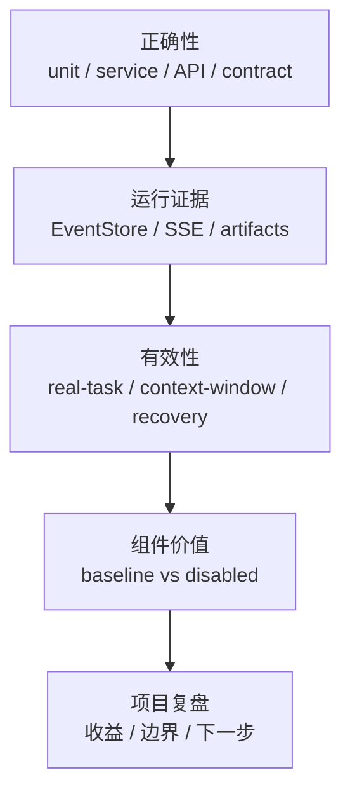

# 面试深挖：测试、Benchmark、消融实验与项目复盘

最后更新：2026-06-11

这份材料用于准备项目最后一类高频追问：你怎么证明系统不是 demo？如果面试官质疑“组件是不是堆出来的”，应该怎么回答？

这份材料的回答重点是：先证明系统能正确运行，再证明模块确实有用，最后诚实说明证据边界。不要把 benchmark 讲成商业级泛化能力，它更像一组工程验收样例。

## 1. 一句话版本

nanoCursor 不只靠手动演示证明可用，而是用测试、contract、benchmark 和 ablation 从不同层面证明：模块能正确运行，跨语言行为一致，真实任务路由合理，上下文压缩有效，关键组件关闭后会造成可观测退化。

## 2. 30 秒版本

项目的质量体系分两类：正确性和有效性。正确性靠单元测试、服务层测试、API/SSE 集成测试、Python/Go contract test；有效性靠真实任务 benchmark、上下文窗口 benchmark 和组件消融实验。这样既能证明代码没坏，也能证明 Agent Loop、ContextPack、Failure Recovery、Go sidecar 这些模块不是摆设。

## 3. 高频追问

### Q1：你怎么证明这个项目不是只能跑 demo？

答法：

> 我做了分层测试和确定性 benchmark。单元测试验证工具策略、意图路由、EventStore、记忆和上下文压缩；contract test 验证 Python/Go 文件工具行为一致；real-task benchmark 验证简单问候、只读分析、小代码改动、带测试交付和高风险删除这些任务会走正确路由；context-window benchmark 验证压缩能降低 token 并保留 P0 锚点。

### Q2：消融实验解决什么问题？

答法：

> 消融实验回答“组件是不是必须的”。做法是 baseline 跑一组 eval，然后分别关闭 context_pack、failure_recovery、go_sidecars 等组件，再比较分数和通过率。如果关闭失败恢复后原本能修复的失败保持 failed，就说明它在这个 eval 里是 necessary。

### Q3：Benchmark 和普通测试的区别？

答法：

> 普通测试更关注函数或接口行为是否正确；benchmark 更关注系统级能力是否符合预期，比如路由准确率、工具策略准确率、上下文压缩降幅、锚点保留率、组件关闭后的分数变化。

### Q4：为什么 benchmark 不能夸大？

答法：

> 因为当前 benchmark 仍然是有限 eval 集，很多是确定性构造场景。它能证明当前机制有效，但不能证明任意真实项目都能成功。所以我会把它讲成工程证据，不讲成商业级泛化能力。

### Q5：如果 CI 上 benchmark 失败，怎么排查？

答法：

> 先看失败类型：是 API route、context window、ablation、Go sidecar 还是前端 build。然后确认环境差异，比如 CI 没启动 Go sidecar、没有 API key、路径不同、端口不同。再看是否有测试污染真实工作区，是否使用了 tmp_path，是否断言自然语言过强。

### Q6：你怎么证明 Go sidecar 不是硬凑？

答法：

> 一是只把边界清楚的文件工具、索引、命令执行、MCP stdio 放到 Go；二是有 feature flag、health check、fallback；三是用 contract test 和 benchmark 证明行为一致和场景收益；四是承认小任务可能因为 RPC 开销不划算。

### Q7：如果一个组件消融后没有明显降分，是不是应该删除？

答法：

> 不一定。要看 eval 是否覆盖了它的适用场景。如果没有覆盖，结论是 insufficient data；如果覆盖充分且长期没有收益，可以降级为可选增强或删除。组件价值评估不能只看一次分数。

## 4. 项目复盘追问

### Q8：你觉得这个项目最大的收获是什么？

答法：

> 最大收获是理解 AI 编程工具不是“LLM + 写文件”，而是上下文、工具、安全、事件、恢复和评测的系统工程。真正难的是让 Agent 知道该看什么、能安全做什么、失败后怎么恢复、用户怎么观察整个过程。

### Q9：如果重做一次，你会怎么做？

答法：

> 我会更早确定核心指标，比如 context hit rate、routing accuracy、failure recovery rate、ablation lift；更早做 contract test；更早收敛前端信息架构；更早清理 legacy 模块，减少后期维护成本。

### Q10：项目最大短板是什么？

答法：

> 复杂任务成功率仍依赖模型能力和上下文命中率；MCP/Skills 生态兼容还不完整；多用户隔离和生产级安全不是当前目标；前端体验也还不能和成熟工具比。

### Q11：它现在还算玩具吗？

答法：

> 按商业产品标准，它还不是成熟工具；但按个人项目标准，它已经不是玩具 Demo。因为它有可运行的 Agent Loop、上下文预算、工具治理、失败恢复、事件账本、Go sidecar、MCP/Skills 和 benchmark，而不是只做聊天界面。

### Q12：怎么把这个项目放到简历里最合适？

答法：

> 不要写成“多 Agent 工作台”这种泛泛标题。应该突出 AI Coding Agent 的工程底座：受控 Agent Loop、上下文预算和压缩、工具权限与失败恢复、Python + Go sidecar、MCP/Skills 扩展，以及 benchmark/ablation 评估。

## 5. 可以主动展示的证据

| 证据 | 对应文件 |
|---|---|
| 真实任务 benchmark | `src/api/services/benchmark_service.py`、`tests/test_benchmark_routes.py` |
| 上下文窗口 benchmark | `run_context_window_pressure_benchmark` |
| 组件消融 | `src/api/services/ablation_benchmark_service.py` |
| Python/Go contract | `tests/contracts/test_filetools_contract.py` |
| 工具审批测试 | `tests/test_tool_approval_flow.py` |
| EventStore 账本 | `.nanocursor/runs/<thread_id>/events.jsonl` |

## 6. 回答原则

1. 先讲结论，再讲证据。
2. 不把 benchmark 夸成商业级评测。
3. 主动承认边界，反而更可信。
4. 把“做了很多功能”转成“每个模块解决什么问题”。

## 7. 自测题

1. 正确性测试和有效性 benchmark 有什么区别？
2. 消融实验为什么需要 baseline？
3. 什么情况下组件 verdict 应该是 insufficient data？
4. 为什么上下文窗口 benchmark 要保护 P0 锚点？
5. 为什么 CI 失败时不能直接改业务逻辑？
6. 面试官质疑项目像玩具时，应该怎么回答？
7. 如果只让你展示一个测试文件，你会选哪个？为什么？
8. 如果只让你展示一个 benchmark，你会选哪个？为什么？
