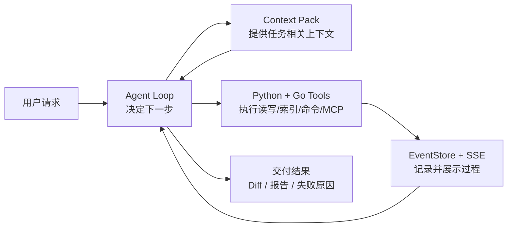
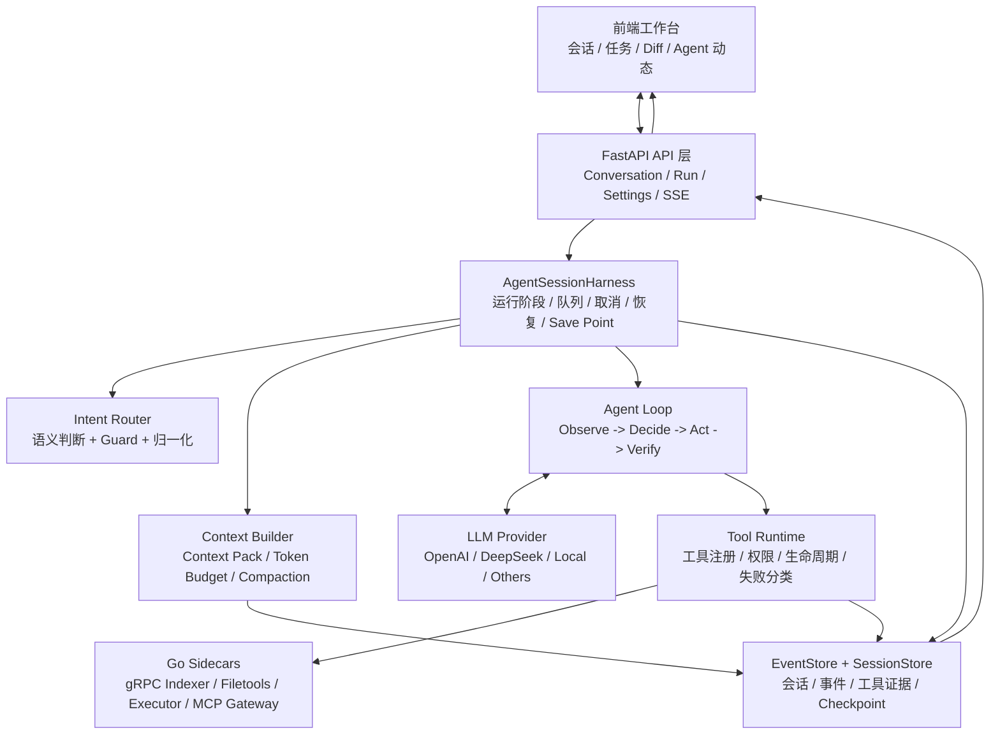
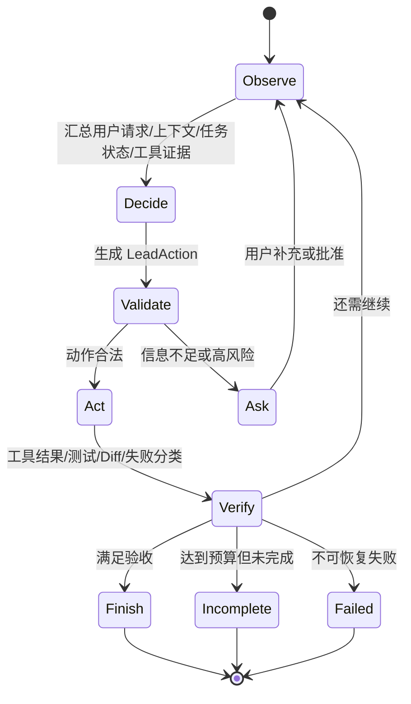
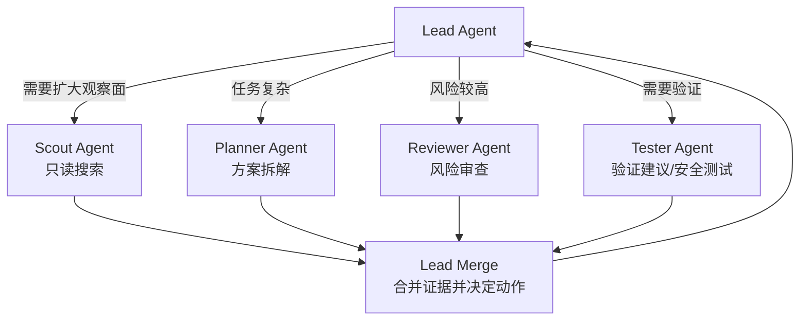
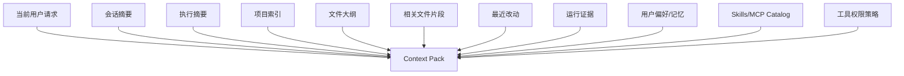
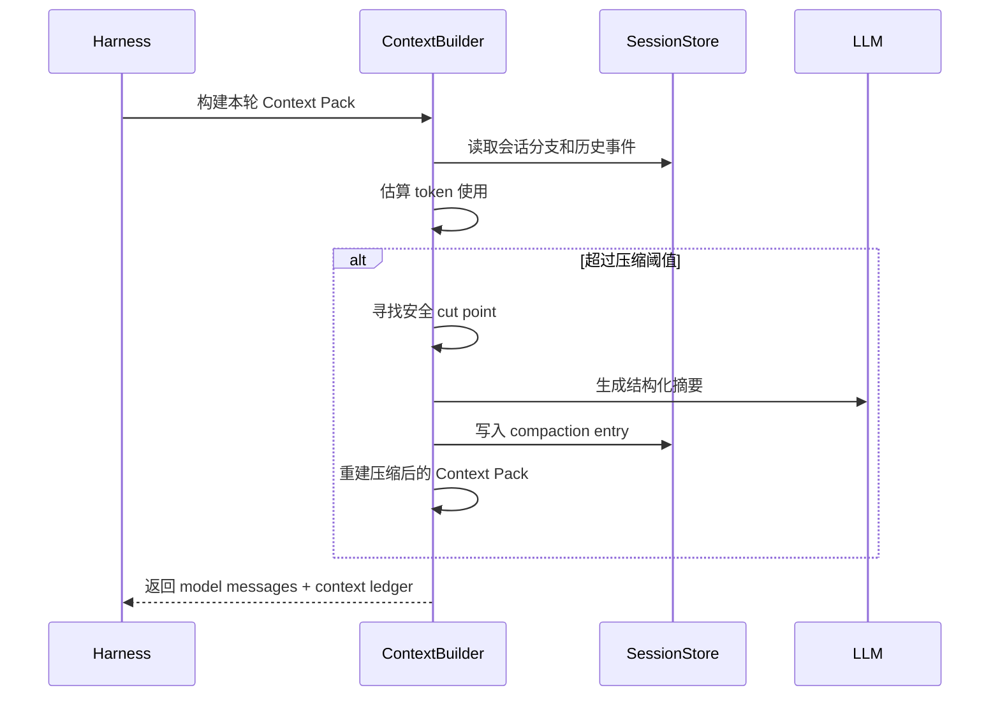
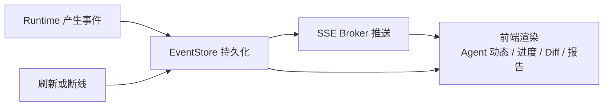
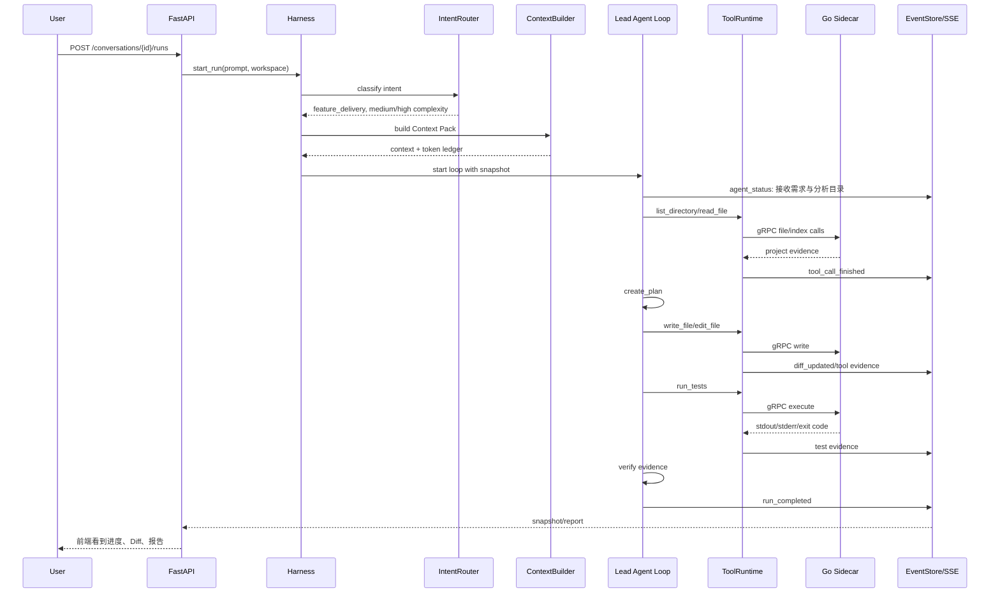
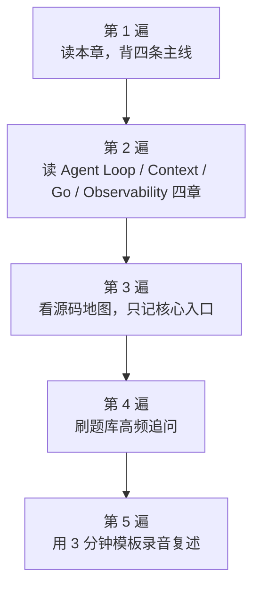

# 简历四条融会贯通：从项目描述到面试可讲清楚

最后更新：2026-06-13

## 1. 本章目标

这一章不是再写一版项目介绍，而是把简历上的四条内容拆成你能真正讲清楚的知识体系。你需要做到三件事：

- 能用一张图说明 nanoCursor 重构完成后的整体架构。
- 能把 Agent Loop、Context Pack、Python + Go 运行时、可观测执行四条串成一次真实请求的生命周期。
- 面试官追问“为什么这样设计、和成熟项目有什么差距、哪些地方吸收了 Pi 的启发”时，你能不慌，能讲边界，也能讲取舍。

这一章默认采用“重构完成版”的心智模型来学习。它不是鼓励夸大，而是帮助你把项目讲成一个清晰的工程系统：核心是 Agent Runtime，不是普通聊天 UI，也不是为了堆技术名词。

## 2. 简历四条先翻译成人话

你的简历写法可以压缩成一句话：

> nanoCursor 是一个本地 AI 编程工作台，用 Lead Agent Loop 驱动代码任务，通过 Context Pack 控制模型输入，用 Python 组织智能决策，用 Go 承担系统边界工具，并通过 SSE 和事件账本让运行过程可观察、可恢复。

四条简历内容分别回答四个问题：

| 简历模块 | 面试官真正想听什么 |
|---|---|
| Agent Loop 机制 | 你的系统如何判断“现在该做什么”，而不是每次固定跑一套流程 |
| 上下文管理 | 你的系统如何让模型看到对的东西，而不是把全部历史和全部文件塞进去 |
| Python + Go 运行时 | 你为什么用两种语言，它们的边界是否合理，不是为了炫技 |
| 可观测执行 | 你如何让用户和开发者知道系统做了什么、哪里失败、怎么恢复 |

这四条不是并列堆料，而是一条链：



面试时一定要记住：**Agent Loop 是大脑，Context Pack 是工作记忆，Python + Go 是手脚和工具层，EventStore + SSE 是黑盒记录仪和仪表盘。**

## 3. 重构完成版整体架构

重构完成后的 nanoCursor 可以用下面这张图理解：



这里最重要的设计取舍是：**把智能决策和系统工具边界拆开**。

Python 更适合快速组织 Agent 决策、Prompt、上下文和事件流；Go 更适合做边界清楚、输入输出明确、需要稳定 IO 和并发处理的系统工具。这样不是“用 Go 重写 Python”，而是让 Go 成为工具侧的可靠后端。

## 4. Agent Loop 机制：系统如何知道下一步该做什么

### 4.1 先理解它解决的问题

AI 编程任务不是固定流水线。用户可能说：

- “你好”。
- “帮我看看这个项目结构”。
- “修一下这个 bug”。
- “给我写一个课程设计级别的选课系统”。
- “运行测试，失败了你帮我修”。

如果每次都固定走 Planner -> Coder -> Tester -> Reviewer，系统会显得很笨：问候也跑任务，简单解释也生成 Diff，复杂任务又可能在错误阶段卡死。

所以 Agent Loop 的核心不是“循环调用模型”，而是：

```text
观察状态 -> 判断任务类型 -> 选择动作 -> 校验动作 -> 执行工具 -> 记录证据 -> 决定继续还是结束
```

### 4.2 Loop 的四个阶段



你可以把 Lead Agent 理解成“项目经理 + 主执行者”的结合体。它不一定亲自做所有事情，但所有动作都要回到它这里收口。

### 4.3 重构完成后的 LeadAction

Agent 不应该直接说一段自然语言“我准备执行 xxx”，而是先产出结构化动作：

```python
class LeadAction(BaseModel):
    type: Literal[
        "answer",
        "inspect_project",
        "create_plan",
        "call_tool",
        "spawn_agent",
        "merge_agent_result",
        "request_approval",
        "run_checks",
        "summarize",
        "finish",
        "fail",
        "incomplete",
    ]
    agent: str = "Lead"
    goal: str
    reason: str
    expected_evidence: list[str] = []
    tool_call: dict | None = None
    risk_level: str = "low"
```

这样做的意义是：模型的意图先变成协议，再被系统检查。系统可以问：

- 这个动作和用户意图一致吗？
- 这个工具是否允许？
- 是否需要审批？
- 是否需要读文件或写文件？
- 是否有完成证据？
- 当前 run 是否已经结束，不能再追加动作？

### 4.4 不同任务如何走不同路线

| 用户输入 | 合理路线 | 不合理路线 |
|---|---|---|
| “你好” | Lead 直接回答，然后 finish | 创建 Planner/Coder/Tester |
| “看看当前目录有什么” | read-only inspect，然后总结 | 生成交付报告和 Diff |
| “修复 README 里的错别字” | small edit，读文件、改文件、记录 Diff | 启动复杂多 Agent |
| “写一个课程设计项目” | 规划、创建文件、运行测试、交付总结 | 只回复“我会帮你写”但不调用工具 |
| “删除整个目录” | 风险识别，request approval | 直接执行 shell |

成熟工具看起来“聪明”，往往不是模型更神奇，而是前面这套路由和动作合同做得细。

### 4.5 子 Agent 的正确位置

重构完成版里，子 Agent 不是默认出场，而是 Lead 的一种工具化能力：



关键原则：

- 子 Agent 可以并行读，但不要并行写。
- 子 Agent 的完整日志不要污染 Lead 的上下文。
- 子 Agent 输出给 Lead 的应该是 summary、evidence_refs、risks、recommended_actions。
- 写文件、跑高风险命令、最终交付仍由 Lead 收口。

### 4.6 面试追问：你们和 LangGraph 有什么区别

可以这样回答：

> LangGraph 更像把流程节点和边提前定义好，适合状态明确、流程稳定的任务。nanoCursor 后期更关注交互式编程场景：用户请求可能很轻，也可能很复杂，中途工具失败、测试失败、用户补充需求都会改变下一步。因此我用 Lead Agent Loop 表达运行时决策，同时用结构化 LeadAction、工具权限、事件账本和完成证据来保证可控性。它不是完全自由的 while loop，而是有边界的动态决策。

## 5. 上下文管理：系统如何让模型看到对的东西

### 5.1 为什么上下文比多 Agent 更重要

多 Agent 的前提是每个 Agent 看到了正确上下文。上下文错了，多个 Agent 只是并行犯错。

AI 编程里的上下文噪声来自几个地方：

- 历史对话太长。
- 项目文件太多。
- 旧工具输出太长。
- 子 Agent 中间过程太碎。
- 用户偏好和当前任务无关。
- Skills/MCP 全量注入导致 prompt 膨胀。

Context Pack 解决的问题就是：**本轮任务到底应该给模型看什么，不给模型看什么，以及为什么。**

### 5.2 Context Pack 的组成



注意：Context Pack 不是把这些东西全部塞进去，而是按任务相关性和 token 预算选择。

### 5.3 Context Pack 里的优先级

| 优先级 | 内容 | 为什么重要 |
|---|---|---|
| P0 | 当前用户请求、当前工作路径、工具边界、未完成任务 | 丢了就会跑偏 |
| P1 | 相关文件片段、最近失败、当前 Diff、执行计划 | 决定能不能完成任务 |
| P2 | 项目索引、文件大纲、最近改动、会话摘要 | 帮助理解项目结构 |
| P3 | 用户偏好、Skills/MCP catalog、历史摘要 | 有用但可裁剪 |
| P4 | 旧工具长输出、旧 Agent 动态、无关历史 | 应优先压缩或移除 |

面试时可以强调：上下文管理不是“省 token”这么简单，它是在控制模型注意力。

### 5.4 Token Budget 和 Context Ledger

Token Budget 是预算，Context Ledger 是账本。

```text
Token Budget：计划每类内容最多占多少。
Context Ledger：实际每类内容占了多少、是否被裁剪、是否可压缩。
```

举例：

| Section | 预算 | 实际 | 处理 |
|---|---:|---:|---|
| current_request | 2K | 300 | 完整保留 |
| selected_files | 20K | 16K | 保留 |
| recent_failures | 4K | 3K | 保留 |
| tool_outputs | 8K | 18K | 裁剪并落盘 |
| old_messages | 12K | 30K | 压缩为 summary |

这也是前端上下文面板能展示“当前窗口用了多少、各部分占多少”的基础。

### 5.5 压缩不是简单总结

成熟的上下文压缩要满足三件事：

1. 不切断一个工具调用的上下文。
2. 不丢当前任务目标、约束、失败原因和关键文件。
3. 压缩结果要能被后续 run 继续使用。

重构完成版的压缩流程可以这样理解：



### 5.6 Skills/MCP 怎么进入上下文

不要把所有 Skill 内容和 MCP 工具说明全部塞进 prompt。更成熟的做法是 progressive disclosure：

```text
第一层：只注入 catalog
  name
  description
  location
  permission

第二层：需要使用时再加载完整 Skill 或 MCP tool schema

第三层：使用结果以 evidence 或 tool result 形式回到 Context Pack
```

这也是从 Pi 学到的重要经验：技能系统应该帮模型发现能力，而不是一上来淹没模型。

### 5.7 面试追问：怎么证明上下文管理有用

可以这样回答：

> 我会用 context hit rate 和消融实验验证。比如记录初始 Context Pack 选中的文件，最后实际修改或读取的文件是否命中；再对比关闭项目索引、关闭最近改动、关闭压缩时，任务成功率、工具调用次数、token 使用和失败率的变化。上下文模块的价值不应该只靠主观感觉，而应该有可观测指标。

## 6. Python + Go 运行时：为什么不是单纯炫技

### 6.1 两种语言的边界

项目里 Python 和 Go 的分工应该这样讲：

| 层 | Python | Go |
|---|---|---|
| 智能决策 | Agent Loop、意图路由、Prompt、上下文 | 不负责 |
| API 服务 | FastAPI、SSE、会话管理 | 不负责主 API |
| 工具后端 | 调度、权限、fallback | 文件工具、索引、命令执行、MCP Gateway |
| 可靠性 | 策略、恢复、事件 | 健康检查、超时、gRPC 错误码 |

一句话：**Python 负责变化快的 Agent 策略，Go 负责边界清楚的系统工具。**

### 6.2 为什么这些模块适合 Go

#### 项目索引

项目索引要做大量文件扫描、忽略规则、目录遍历、文件摘要。Go 的并发和二进制部署比较适合这种 IO 密集任务。

#### 文件读写工具

文件工具要求路径规范、权限边界、原子写入、错误码稳定。Go 可以作为一个更明确的文件服务边界，Python 只通过 gRPC 调用。

#### 命令执行

命令执行涉及进程、超时、stdout/stderr 流、取消和退出码。Go 更适合做可控 executor sidecar。

#### MCP Gateway

MCP Gateway 本质上是外部工具协议桥接，适合做成独立服务。这样 Python Agent 不直接和每个 MCP 服务耦合。

### 6.3 gRPC 在这里的意义

gRPC 的价值不是“更高级”，而是：

- 接口 schema 明确。
- 错误码和状态更稳定。
- 跨语言调用自然。
- 可以做健康检查。
- 方便 sidecar 独立启动、关闭和 fallback。

典型调用链：

```mermaid
sequenceDiagram
  participant Loop as Agent Loop
  participant Tool as Tool Runtime
  participant Py as Python Adapter
  participant Go as Go Filetools gRPC
  participant Store as EventStore

  Loop->>Tool: call_tool(read_file)
  Tool->>Py: 检查权限和路径
  Py->>Go: gRPC ReadFile(path, limit)
  Go-->>Py: content / error code
  Py->>Store: 写入 tool evidence
  Py-->>Tool: ToolResultRecord
  Tool-->>Loop: 注入裁剪后的结果
```

### 6.4 为什么保留 Python fallback

保留 fallback 是为了工程可用性：

- 用户机器可能没有 Go 环境。
- sidecar 可能启动失败。
- gRPC 端口可能冲突。
- 某些小任务走 Python 更简单。

这不是架构不坚定，而是本地开发工具必须考虑启动成功率。面试时可以说：

> Go sidecar 是优化路径，不是唯一生存路径。Python fallback 保证功能可用，Go 服务健康时再接管适合它的工具边界。

### 6.5 面试追问：为什么不用 Go 重写整个后端

可以这样回答：

> Agent 编排、Prompt、上下文选择和意图路由变化很快，而且强依赖 Python 生态和 LLM SDK，整体重写 Go 的收益不高。Go 更适合放在稳定边界，比如文件、索引、命令执行、MCP Gateway。这样既能体现 Go 的工程价值，也不会把策略层写得过重。

## 7. 可观测执行：怎么知道系统真的做了什么

### 7.1 可观测执行解决的问题

AI 编程工具最怕黑盒：

- 用户不知道系统是不是卡住。
- 模型说完成了，但没有文件变更。
- 工具失败了，但最终回复没有解释。
- 多个 Agent 干了什么互相混在一起。
- 任务失败后无法复盘。

可观测执行的目标是：**每一次 run 都能回答“谁在什么时候做了什么，结果是什么，证据在哪里”。**

### 7.2 EventStore 是运行账本

EventStore 不是普通日志。普通日志偏开发者排障，EventStore 同时服务：

- 前端实时展示。
- 运行恢复。
- 交付报告。
- benchmark。
- 失败复盘。
- 面试时的证据链。

典型事件：

| 事件 | 含义 |
|---|---|
| run_started | 一次用户请求开始执行 |
| intent_decided | 意图路由结果 |
| context_pack_built | 上下文包构建完成 |
| agent_message | Agent 用户可见消息 |
| agent_status | Agent 正在做什么 |
| tool_call_started | 工具开始执行 |
| tool_call_finished | 工具执行结束 |
| diff_updated | 文件变更更新 |
| approval_requested | 等待用户审批 |
| run_failed | run 失败并带错误原因 |
| run_completed | run 完成并带交付证据 |

### 7.3 SSE 是实时投影

SSE 可以理解成 EventStore 的实时投影：



注意这里的关键：**SSE 断了不应该丢事实，因为事实在 EventStore。**

### 7.4 工具证据为什么重要

模型说“我已经写好了”不算证据。证据应该来自工具层：

- write_file 成功。
- edit_file 返回 diff。
- run_tests 返回通过/失败。
- git diff 有文件变化。
- report 里引用了 evidence id。

所以完成条件应该是 evidence-aware，而不是 response-aware。

### 7.5 可恢复能力怎么讲

恢复不是“绝对不会失败”，而是失败后有路径：

| 失败 | 恢复方式 |
|---|---|
| 文件写失败 | 路径检查、权限检查、保留备份 |
| edit 匹配失败 | 重新读取目标片段，缩小修改范围 |
| 命令失败 | 分类错误，生成恢复建议 |
| 测试失败 | 提取失败用例，回到修复循环 |
| 模型上下文溢出 | 压缩后重试 |
| 用户拒绝审批 | 停止高风险动作，给只读替代方案 |

### 7.6 面试追问：SSE 和 WebSocket 为什么选 SSE

可以这样回答：

> nanoCursor 的主要需求是服务端向前端单向推送 Agent 状态、工具事件和任务进度，前端并不需要高频双向通信。SSE 基于 HTTP，浏览器原生支持自动重连，实现更简单，也更适合这种运行事件流。用户输入仍然走普通 HTTP API，运行事件走 SSE。

## 8. 一次真实复杂任务怎么串起来

假设用户输入：

> 帮我在当前目录下用 Python 写一个选课系统，作为本科课程设计项目。

重构完成版的理想执行链路是：



用这条链路复述项目，比单独背四条简历更稳。

## 9. 如果面试官逐条问，你怎么回答

### 9.1 问 Agent Loop：你们到底怎么判断任务复杂度

回答结构：

1. 先做 intent routing，结合 deterministic guard 和 LLM semantic classifier。
2. 输出不是一句分类，而是包含 route、complexity、side effects、required evidence 的合同。
3. Lead 根据合同选择 action：answer、inspect、call_tool、spawn_agent、run_checks、finish 等。
4. 每个 action 先 dry-run 校验，再执行。
5. 完成时看 evidence，而不是看模型最后一句话。

一句话版本：

> 我们不是让模型完全自由判断，也不是全靠关键词，而是用 guard 保底、LLM 语义补充、normalizer 收口，最后把结果变成 Agent Loop 能执行和校验的合同。

### 9.2 问上下文管理：Context Pack 具体怎么控制噪声

回答结构：

1. 先说输入来源：请求、摘要、索引、相关文件、最近变更、工具证据、记忆、Skills/MCP。
2. 再说排序：按任务相关性和优先级。
3. 再说预算：每类 section 有 token budget。
4. 再说裁剪：长工具输出落盘，只给摘要；旧历史压缩；无关文件只给 outline。
5. 最后说 ledger：记录实际注入了什么，方便前端和调试。

一句话版本：

> Context Pack 的目标不是让模型看得更多，而是让模型看得更准，并且能解释为什么这些内容进入了本轮上下文。

### 9.3 问 Python + Go：Go 在项目里是不是为了简历

回答结构：

1. 承认一开始确实考虑过展示 Go 能力。
2. 但最后收敛到适合 Go 的边界：索引、文件工具、命令执行、MCP Gateway。
3. Python 保留策略层，因为 Agent 编排和 Prompt 变化快。
4. Go sidecar 通过 gRPC 接入，有健康检查、开关和 fallback。

一句话版本：

> 我没有用 Go 重写 Agent 策略，而是把 Go 放在系统边界清楚的工具层，这样更符合两种语言各自擅长的地方。

### 9.4 问可观测执行：你怎么证明模型真的改了文件

回答结构：

1. 工具调用会生成 ToolEvidence。
2. 文件写入会生成 Diff。
3. 测试会生成测试事件和输出。
4. EventStore 持久化过程。
5. 完成条件检查 evidence，缺证据不能 completed。

一句话版本：

> 模型自然语言不作为完成证据，真正的完成要看工具调用、文件 Diff、测试输出和 run outcome。

## 10. 和 Pi 的启发怎么讲

你可以这样讲，不要说“我照抄 Pi”：

> 后期我专门调研了一个成熟 coding agent 项目 Pi，最大的启发不是某个具体功能，而是它的边界设计：低层 Agent Loop 很薄，Harness 负责会话、队列和 save point，Context 和 Tool 都是独立模块，Skills 采用 progressive disclosure，子 Agent 作为扩展而不是默认主流程。这个思路帮助我重新理解 nanoCursor 的问题：不是功能少，而是需要把运行时边界拆清楚。

可以具体落到四点：

| Pi 启发 | nanoCursor 吸收后的方向 |
|---|---|
| Agent Loop 很薄 | 把核心循环和 FastAPI/前端事件/业务服务拆开 |
| Harness 管运行阶段 | 引入 run phase、turn snapshot、save point、incomplete 状态 |
| Skills progressive disclosure | MCP/Skills 先注入 catalog，需要时再加载完整内容 |
| Faux provider 测试 | 用确定性模型响应测试 loop，而不是只靠真实模型手测 |

## 11. 不要夸大的边界

面试时最危险的是讲过头。下面这些不要说：

| 不建议说 | 更稳的说法 |
|---|---|
| “实现了一个完整 Cursor” | “实现了一个本地 AI 编程工作台原型，重点探索 Agent Runtime 的核心机制” |
| “多 Agent 能自动完成复杂项目” | “复杂任务可以按需拆分临时 Agent，但写操作仍由 Lead 收口” |
| “上下文压缩完全解决长上下文问题” | “通过预算、裁剪和摘要降低上下文噪声，但仍依赖任务相关性判断” |
| “Go 服务显著提升所有性能” | “Go 更适合文件、索引、命令执行等边界清楚的工具服务，部分场景收益更明显” |
| “系统已经产品级” | “它不是商业产品，但核心链路有可观测、可恢复、可评测的工程设计” |

克制反而更可信。

## 12. 三分钟口述模板

你可以这样讲：

> nanoCursor 是我做的一个本地 AI 编程工作台。它不是简单的聊天套壳，而是围绕代码任务实现了一套轻量 Agent Runtime。
>
> 用户提交请求后，系统先通过意图路由判断这是直接问答、只读分析、代码修改还是高风险操作。之后由 Lead Agent 进入 Agent Loop，根据当前上下文和工具结果持续决定下一步：可能直接回答，也可能读取项目、修改文件、运行测试，或者创建临时子 Agent 做只读分析和审查。
>
> 这个项目里我最关注的是上下文和工具边界。上下文方面，我设计了 Context Pack，把用户请求、会话摘要、项目索引、相关文件、最近改动、运行证据、用户偏好和 Skills/MCP 能力整理后再注入模型，并结合 token 预算和裁剪记录控制模型输入。工具方面，Python 负责 Agent 编排、意图路由、上下文构建和事件流，Go 通过 gRPC 承担项目索引、文件工具、命令执行和 MCP Gateway 这些系统边界能力。
>
> 为了让运行过程不是黑盒，我用 FastAPI + SSE 把 Agent 状态、任务进度、工具调用、Diff、错误和交付结果实时推给前端，同时用 EventStore 持久化会话、运行计划、工具证据和日志。这样失败时可以复盘，完成时也能看到实际证据，而不是只相信模型说完成了。
>
> 后期我也复盘过成熟开源项目 Pi，最大的启发是核心 Agent Loop 要薄，Session Harness、Context、Tool Runtime 和 Skills/MCP 要拆开。这个项目的价值对我来说不是替代 Codex 或 Cursor，而是系统性理解并实现 AI 编程工具背后的关键工程问题。

## 13. 八分钟深挖结构

如果面试官愿意听，你按这个顺序展开：

1. 项目动机：AI 编程不是聊天生成代码，而是本地项目里的可控执行。
2. 核心架构：Frontend + FastAPI + AgentSessionHarness + AgentLoop + ContextBuilder + ToolRuntime + Go sidecars。
3. Agent Loop：为什么不是固定 DAG，如何 action contract、dry-run check、evidence-aware finish。
4. Context Pack：为什么上下文命中率比多 Agent 更重要，如何预算、裁剪和压缩。
5. Python + Go：为什么策略层留 Python，工具边界放 Go，gRPC 和 fallback 怎么保证可用。
6. 可观测执行：EventStore、SSE、ToolEvidence、Diff、checkpoint 和恢复。
7. 测试和反思：真实任务测试、benchmark、faux provider 的必要性。
8. 项目边界：不是商业替代品，但能展示对 coding agent runtime 的理解。

## 14. 面试前自测题

如果下面这些问题你能闭卷讲清楚，就基本过关：

1. 用户发送一句“你好”，为什么不应该创建任务和子 Agent？
2. 用户让系统“看看当前目录”，为什么是 read-only route？
3. 用户让系统“写一个项目”，Context Pack 里最重要的 P0/P1 内容是什么？
4. 子 Agent 为什么适合并行读，不适合并行写？
5. Agent Loop 和固定 DAG 的本质区别是什么？
6. 为什么 max_steps 不能作为完成条件？
7. 工具失败后为什么不能都丢给 Reviewer？
8. Go sidecar 为什么适合文件工具和命令执行？
9. SSE 断开后为什么不应该丢运行状态？
10. 模型说“完成了”，系统还要检查哪些证据？
11. Skills/MCP 为什么不应该全量注入 prompt？
12. 如果面试官说“这不就是造轮子吗”，你怎么回答？

最后一题建议这样答：

> 是的，从产品替代角度看它不是要重新造一个商业 Codex。但从学习和工程展示角度，我的目标是拆解 coding agent runtime 的关键问题：路由、Agent Loop、上下文、工具、事件、恢复和 sidecar。做这个项目让我能把这些机制从黑盒工具里拆出来理解，也能讨论它们的工程取舍和局限。

## 15. 复习路线

三天面试前，不建议再通读所有源码。按这个顺序复习：



最重要的是不要试图证明项目完美。你要证明的是：你做过、踩过坑、复盘过，也能讲清楚如何从一个胶水项目走向更清晰的 Agent Runtime。

