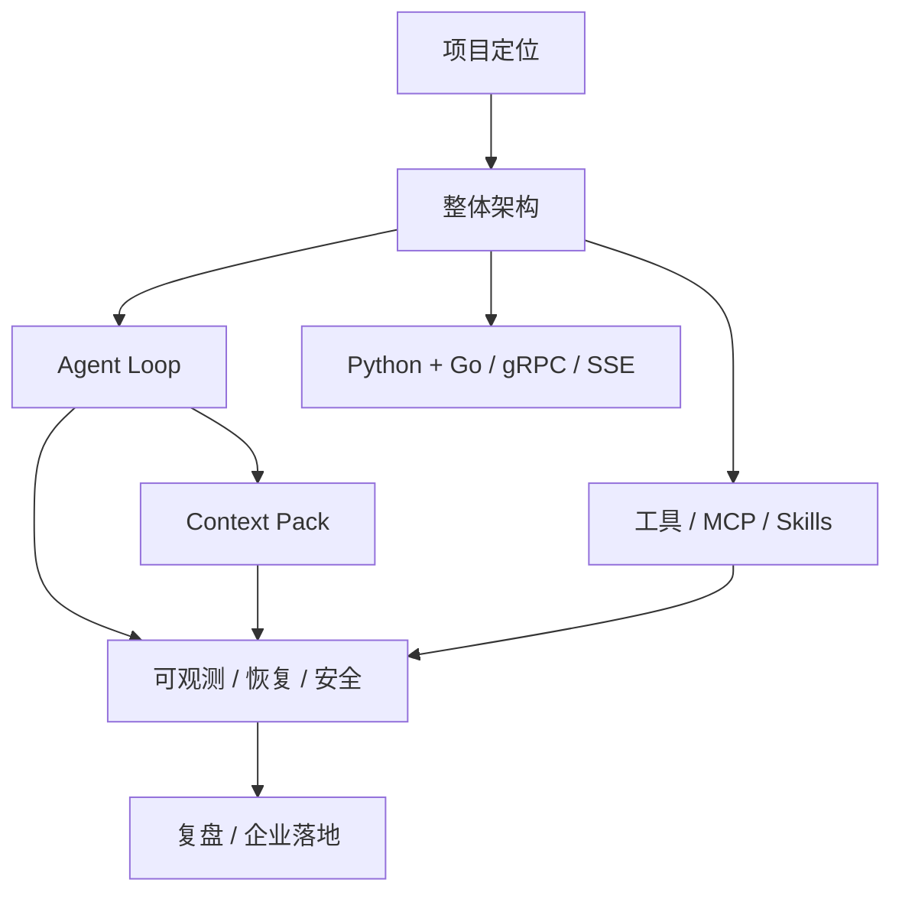

# nanoCursor 高频 50 问：口语化面试回答

最后更新：2026-06-13

## 1. 怎么用这份题库

这 50 个问题不是让你逐字背。更好的方式是：每个问题先记住一句话结论，再用自己的话展开两三句，最后补一句边界或反思。

回答时尽量保持三个原则：

- 先说结论，不要一上来堆技术名词。
- 主动讲边界，不要把项目说成商业级 Cursor。
- 把每个回答都拉回四条主线：Agent Loop、Context Pack、Python + Go、可观测执行。
- 分清“当前已经做了什么”和“如果继续完善会怎么做”，不要把后续设计说成已经完全落地。



面试里最稳的总纲是：

> nanoCursor 不是为了替代成熟 AI 编程工具，而是我用来拆解和实现 coding agent runtime 核心机制的本地工作台。它重点做了 Agent Loop、上下文组织、工具调用、事件流、失败恢复，以及 Python + Go 的工具边界。

### 回答时的三层结构

遇到任何追问，都尽量按这三层回答：

```text
当前实现：我现在做到了什么。
设计取舍：为什么这样做，而不是另一种做法。
后续优化：如果产品化或继续重构，还要补什么。
```

比如被问 Go sidecar，不要只说“Go 挂了就 fallback”。更稳的说法是：

> 当前 Go sidecar 主要承担项目索引、文件工具、命令执行和 MCP Gateway 这些边界清楚的能力，并通过健康检查和开关暴露状态。基础 Python 工具链仍然是兜底思路；如果继续完善，我会把 fallback 做成更明确的 ToolRuntime 策略，而不是散落在调用处。

如果面试官继续追问“哪些已经做了，哪些只是设计”，你可以接一句：

> 现在已经做的是 Go 服务接入、健康状态、开关配置和一部分 Python 本地工具保留；更工程化的 fallback 策略还需要继续收敛，比如统一错误码、降级事件和自动切换策略。

### 面试时可以随手拿出来的 5 个实现证据

这 50 问里很多回答都要靠“证据感”支撑。你可以准备下面 5 个例子：

| 证据 | 面试时怎么讲 |
|---|---|
| 完整任务链路 | 用户请求 -> 创建 run -> 意图路由 -> Context Pack -> Agent Loop -> 工具调用 -> Diff/测试 -> SSE 展示 -> 交付结果 |
| 失败案例 | 复杂任务假完成、状态漂移、工具失败或上下文噪声；说明怎么发现、怎么改、还剩什么问题 |
| Context Pack 字段 | `user_goal`、`conversation_summary`、`project_index`、`relevant_files`、`recent_changes`、`tool_evidence`、`skill_catalog`、`token_budget` |
| SSE 事件样例 | `run_started`、`context_pack_built`、`tool_call_started`、`tool_call_finished`、`diff_updated`、`approval_requested`、`run_completed`、`run_failed` |
| Go gRPC 接口样例 | `SearchFiles`、`ReadFile`、`WriteFile`、`RunCommand`、`GetProjectTree`、`ListMcpTools`，重点讲它们输入输出稳定、适合做 sidecar |

## 2. 项目背景与定位

### Q1：一句话介绍 nanoCursor？

**推荐回答：**  
nanoCursor 是一个本地 AI 编程工作台。它不是简单的聊天页面，而是围绕代码任务实现了一套轻量 Agent Runtime：能读取项目、组织上下文、调用工具、修改文件、运行测试，并把执行过程实时展示出来。

**追问时怎么展开：**  
我主要关注的是 AI 编程工具背后的工程机制，比如 Agent 怎么决定下一步、上下文怎么选、工具怎么安全执行、失败怎么恢复。它更像一个学习和展示型的 coding agent runtime，而不是商业产品。

**不要这样说：**  
不要说“我做了一个 Cursor / Codex”。可以说“参考它们的思想，做了一个小型可解释版本”。

### Q2：这个项目解决什么问题？

**推荐回答：**  
它解决的是“让大模型在本地项目里可控地做事”的问题。直接问模型写代码很容易脱离真实文件和运行结果，而 nanoCursor 会把项目上下文、工具调用、文件变更、测试结果和运行事件串起来。

**追问时怎么展开：**  
比如用户让它修 bug，它不是只生成一段代码，而是应该先看项目文件，再调用工具修改，之后运行测试，最后根据证据判断是否完成。

**不要这样说：**  
不要说它已经能稳定自动完成所有开发任务。复杂任务仍然需要人工确认和复核。

### Q3：它和普通 ChatGPT 问代码有什么区别？

**推荐回答：**  
普通 ChatGPT 更像 prompt 到 answer；nanoCursor 多了 workspace、run、Context Pack、工具调用、Diff、事件流和恢复记录。它不是只回答，而是可以围绕一个真实目录执行任务。

**追问时怎么展开：**  
区别主要在“接地气”：模型看到的是当前项目的上下文，调用的是受控工具，结果会落到文件系统和事件账本里。

**不要这样说：**  
不要把 ChatGPT 说得很弱。成熟模型本身很强，nanoCursor 关注的是工具化和工程化链路。

### Q4：它和 Cursor / Claude Code / Codex 有什么区别？

**推荐回答：**  
成熟工具在模型能力、产品体验和稳定性上都强很多。nanoCursor 的价值不是替代它们，而是把其中一些核心机制拆出来实现和学习，比如 Agent Loop、上下文压缩、工具治理、事件流和 Go sidecar。

**追问时怎么展开：**  
我会把它定位为个人项目和工程理解展示，不会夸大成生产级产品。

**不要这样说：**  
不要说“比 Cursor 更轻更好”。更稳的说法是“轻量、可解释、适合学习核心链路”。

### Q5：你参考了 Pi，那原创性在哪里？

**推荐回答：**  
Pi 给我的主要启发是分层思想，而不是某段具体代码。它让我意识到 Agent Loop 不应该承担所有职责，会话、上下文、工具执行、事件记录和 Skills 加载都应该拆开。nanoCursor 没有 fork Pi，而是在自己的 Python + Go 技术栈里重新实现了一套本地工作台链路。

**追问时怎么展开：**  
可以具体说三点：第一，Python 侧实现 FastAPI、意图路由、Context Pack、Agent Loop 和 SSE 事件流；第二，Go 侧通过 gRPC 做项目索引、文件工具、命令执行和 MCP Gateway；第三，前端做可观测面板，把 Agent 状态、工具调用、Diff 和结果展示出来。Pi 对我更多是架构启发，nanoCursor 是我按自己的技术栈重新组织的实现。

**不要这样说：**  
不要说“完全原创”或“已经复刻 Pi”。更可信的是“调研成熟项目后吸收架构思想，再结合自己的技术栈重构”。

### Q6：为什么要做这个项目？

**推荐回答：**  
一开始是想做一个多 Agent 编程助手，后来发现真正难的不是 Agent 数量，而是上下文、工具、循环决策和恢复。所以这个项目逐渐变成我理解 AI 编程工具工程机制的练习。

**追问时怎么展开：**  
这和科研有点像，不只是拿开源项目当对比，而是要学习别人系统设计里真正成熟的地方。

**不要这样说：**  
不要说“为了简历堆技术”。可以诚实说“它确实服务于求职展示，但过程里我重点学习了 Agent Runtime 的真实工程问题”。

## 3. 整体架构

### Q7：系统整体架构是什么？

**推荐回答：**  
整体是前后端分离。前端负责会话、任务、Agent 状态、Diff 和报告展示；后端 FastAPI 负责 API、SSE、会话和 run 管理；核心运行时负责 Agent Loop、Context Pack 和工具调度；Go sidecar 通过 gRPC 提供索引、文件工具、命令执行和 MCP Gateway。

**追问时怎么展开：**  
可以用一条链路说：用户输入 -> 创建 run -> 意图路由 -> 构建 Context Pack -> Agent Loop 调模型和工具 -> 工具结果写入 EventStore -> SSE 推给前端。

**不要这样说：**  
不要先报一堆框架名。先讲职责边界。

### Q8：前端、后端、Agent Runtime 分别负责什么？

**推荐回答：**  
前端负责让用户看见系统在做什么；后端 API 负责接收请求、管理会话和推送事件；Agent Runtime 才负责真正的智能执行，包括路由、上下文、工具调用和完成判断。

**追问时怎么展开：**  
我后期最大的反思就是不能把这些东西都混在一起。成熟架构里，UI 状态、API 状态、运行时状态应该有清楚边界。

**不要这样说：**  
不要说前端只是“页面”。它在 AI 工具里很重要，因为用户要感知长任务进展。

### Q9：一次用户请求的完整链路是怎样的？

**推荐回答：**  
用户在前端发送消息，后端创建 conversation run，先做意图路由，再构建 Context Pack，然后 Lead Agent 进入 Agent Loop。Loop 过程中可能读文件、写文件、运行测试或调用 MCP。每个事件都写入 EventStore，并通过 SSE 推送给前端，最后根据工具证据和任务状态生成结果。

**追问时怎么展开：**  
这里的重点是“不是一次 HTTP 请求等模型返回”，而是一个持续运行过程。

**不要这样说：**  
不要把链路说成“前端调后端，后端调模型”。那太像普通套壳。

### Q10：会话、Run、任务之间是什么关系？

**推荐回答：**  
会话是用户连续对话的容器，Run 是某一次用户请求触发的一次执行，任务是 Run 内部为了追踪进度拆出来的步骤。理想关系是：工作路径绑定会话，会话下面有多个 Run，每个 Run 有自己的任务、事件和证据。

**追问时怎么展开：**  
之前项目里也踩过状态漂移的问题，比如新会话显示旧任务，所以后面我更重视 conversation_id、run_id 和 workspace_dir 的绑定。

**不要这样说：**  
不要说“都存在 EventStore 里”就结束，要讲清层级。

### Q11：为什么需要 EventStore？

**推荐回答：**  
Agent 任务是长过程，不是一次性响应。EventStore 像运行账本，记录 run 开始、意图判断、上下文构建、工具调用、Diff、错误和结果。它既服务前端展示，也服务失败复盘和恢复。

**追问时怎么展开：**  
普通日志主要给开发者看；EventStore 还要给前端和最终报告用，所以事件结构要更稳定。

**不要这样说：**  
不要把 EventStore 说成数据库替代品。它主要是运行事件账本。

### Q12：系统瓶颈在哪里？

**推荐回答：**  
最大的瓶颈不是某个接口慢，而是模型调用和上下文质量。模型调用天然慢，上下文选错会导致更多工具调用和返工。另外文件扫描、命令执行、SSE 投影也会影响体验，所以项目里用 Go sidecar 和上下文预算去缓解。

**追问时怎么展开：**  
优化方向包括：减少无效上下文、缓存项目索引、工具输出截断、确定性测试和更清晰的完成条件。

**不要这样说：**  
不要说“Go 解决了性能问题”。Go 只是解决一部分工具边界问题。

## 4. Agent Loop

### Q13：什么是 Agent Loop？

**推荐回答：**  
Agent Loop 就是让 Agent 不只回答一次，而是在“观察状态、决定动作、调用工具、读取结果、再决定下一步”之间循环，直到任务完成、失败、需要用户确认或达到预算。

**追问时怎么展开：**  
它和固定流程不同，下一步取决于运行时状态。比如测试失败后，不是固定进入下一个节点，而是要判断失败原因。

**不要这样说：**  
不要把它说成简单 while 循环。关键是循环里有动作协议、权限和停止条件。

### Q14：Agent 每一轮具体做什么？

**推荐回答：**  
每一轮先收集当前状态，包括用户目标、上下文、任务进度、工具结果和失败信息；然后 Lead 生成一个动作，比如回答、读文件、改文件、运行测试或请求审批；系统校验动作是否合法，执行后记录证据，再判断是否继续。

**追问时怎么展开：**  
可以概括成 Observe -> Decide -> Act -> Verify。

**不要这样说：**  
不要说“模型自己决定”。模型可以参与判断，但系统要用规则和证据收口。

### Q15：Agent 怎么决定直接回答还是调用工具？

**推荐回答：**  
先通过意图路由判断请求类型。问候、概念讨论、普通解释可以 Lead 直接回答；涉及当前项目文件、代码修改、测试验证的任务才进入工具调用；高风险操作先走审批。

**追问时怎么展开：**  
后期我更倾向 guard + LLM 语义判断 + normalizer。guard 兜底，LLM 处理语义，normalizer 把结果变成 runtime 能执行的合同。

**不要这样说：**  
不要承认“全靠关键词”。早期有关键词，成熟方案应该是混合路由。

### Q16：如何避免 Agent 死循环？

**推荐回答：**  
主要靠几层限制：最大步数和工具预算防止无限跑；相似失败和重复工具调用会被识别；工具失败会分类，不会盲目重试；完成条件看证据，不满足就 incomplete 或请求用户决策，而不是假完成。

**追问时怎么展开：**  
真正成熟的做法不是去掉 max_steps，而是达到上限后不能标记完成，要明确告诉用户完成了什么、没完成什么。

**不要这样说：**  
不要说“模型会自己停”。这不可靠。

### Q17：如何判断任务已经完成？

**推荐回答：**  
不能只看模型说“完成了”。要看 intent 对应的完成证据：只读任务要有读取或分析结果；写入任务要有真实 Diff 或写入证据；需要验证的任务要有测试或检查结果；如果还有 pending task、失败事件或待审批，就不能直接 completed。

**追问时怎么展开：**  
我会把它叫 evidence-aware finish。

**不要这样说：**  
不要说“最终回复生成了就完成”。

### Q18：任务复杂度怎么判断？

**推荐回答：**  
不是单一规则。简单问候和讨论可以由 guard 直接判断；代码任务会结合动词、文件/代码线索、风险词、上下文状态和 LLM 语义分类。最终结果会归一化成 route、complexity、side effects 和 required evidence。

**追问时怎么展开：**  
比如“python 和 java 谁更好”是讨论；“用 python 写排序算法并比较性能”是代码生成；“删除整个目录”是高风险。

**不要这样说：**  
不要说“完全交给 LLM”。成熟系统通常是规则兜底 + LLM 语义判断。

### Q19：为什么不用固定 DAG 或 LangGraph？

**推荐回答：**  
固定 DAG 适合流程稳定的任务，但编程任务经常被中间结果改变。测试失败、上下文不足、用户补充需求、工具被拒绝，都会改变下一步。所以我更倾向 Agent Loop，用动态决策处理不同情况，同时用动作协议和事件账本保持可控。

**追问时怎么展开：**  
早期我确实考虑过或使用过固定图，后来发现交互式编程更需要运行时决策。

**不要这样说：**  
不要贬低 LangGraph。说“不适合我这个项目后期的交互式目标”就够了。

### Q20：多 Agent 真的有必要吗？

**推荐回答：**  
不是所有任务都需要。我的理解是：简单任务单 Lead 更好；复杂任务可以让子 Agent 做并行只读分析、规划或审查，但写文件和最终交付应该由 Lead 收口。

**追问时怎么展开：**  
多 Agent 的价值不是角色多，而是扩大观察面、减少主上下文压力和提供独立证据。

**不要这样说：**  
不要说“Agent 越多越智能”。这很容易被质疑。

## 5. Context Pack / 上下文管理

### Q21：什么是 Context Pack？

**推荐回答：**  
Context Pack 是本轮任务要给模型看的结构化上下文。它会把用户请求、会话摘要、项目结构、相关文件、最近改动、工具证据、用户偏好和 Skills/MCP 能力按相关性整理起来。

**追问时怎么展开：**  
它不是把所有东西塞进去，而是控制模型注意力，让模型看对东西。

**不要这样说：**  
不要把 Context Pack 简化成“拼 prompt”。

### Q22：为什么需要上下文管理？

**推荐回答：**  
因为代码项目里信息太多，模型看错文件或者看太多无关内容都会出错。上下文管理决定模型是否理解当前任务，比盲目增加 Agent 更重要。

**追问时怎么展开：**  
我后来意识到，多 Agent 的前提也是每个 Agent 得到正确上下文，否则只是并行犯错。

**不要这样说：**  
不要说“上下文窗口大就不用管”。窗口大也会有注意力噪声。

### Q23：Context Pack 包含哪些内容？

**推荐回答：**  
核心包括当前用户请求、会话摘要、执行摘要、项目索引、文件大纲、相关文件片段、最近改动、运行证据、失败信息、用户偏好、Skills/MCP catalog 和工具策略。

**追问时怎么展开：**  
我会按优先级处理：当前请求和工具边界是 P0，相关文件和失败证据是 P1，历史摘要和偏好可以裁剪。

**不要这样说：**  
不要说“包含所有历史和所有文件”。

### Q24：项目很大时怎么选择相关文件？

**推荐回答：**  
先用项目索引和文件大纲建立结构，再结合用户显式提到的路径、最近改动、入口文件、测试文件、错误日志和工具读取历史选相关文件。必要时先给 outline，再按需读取具体片段。

**追问时怎么展开：**  
代码项目不只靠语义相似度，路径、依赖关系、最近变更和错误堆栈都很重要。

**不要这样说：**  
不要说“用 RAG 就行”。代码上下文比普通文档 RAG 更依赖结构。

### Q25：为什么没有直接用向量数据库？

**推荐回答：**  
当前项目更像本地代码工作台，规模和目标还不一定需要完整向量库。代码场景里，规则检索、项目结构、路径线索、最近改动和错误日志往往很有效。后续如果做大规模代码库，可以引入 embedding + rerank。

**追问时怎么展开：**  
我的选择是先做可解释的结构化上下文，再考虑向量召回，而不是一开始就把问题变成通用 RAG。

**不要这样说：**  
不要说“向量库没用”。它有用，只是不是第一阶段的唯一答案。

### Q26：怎么控制 token 预算？

**推荐回答：**  
给不同 context section 分预算，比如当前请求、相关文件、文件大纲、历史摘要、工具输出、失败信息。超过预算时，优先裁剪低优先级历史和长工具输出，保留当前目标、关键文件和失败原因。

**追问时怎么展开：**  
Context Ledger 会记录每部分用了多少、哪些被裁剪，方便前端展示和调试。

**不要这样说：**  
不要只说“超过就截断”。那会丢关键信息。

### Q27：历史对话太长怎么办？

**推荐回答：**  
不能把完整历史一直塞给模型。更好的方式是保留当前轮、最近关键消息和结构化摘要；旧工具输出和旧 Agent 动态压缩成 summary；真正关键的约束、文件和失败原因要保留下来。

**追问时怎么展开：**  
压缩要按 turn boundary 做，不能切断工具调用和工具结果的关系。

**不要这样说：**  
不要说“直接总结一下就行”。总结也要有结构和保留策略。

### Q28：如何评估上下文构造效果？

**推荐回答：**  
可以看 context hit rate：最终实际读取或修改的文件，有多少在初始 Context Pack 里被选中。还可以做消融实验，比如关闭项目索引、关闭最近改动、关闭压缩，看成功率、工具调用次数和 token 使用变化。

**追问时怎么展开：**  
上下文模块不能只靠感觉，要能用 benchmark 和失败案例复盘。

**不要这样说：**  
不要说“模型回答对了就说明上下文好”。需要更细的指标。

## 6. 工具调用 / MCP / Skills

### Q29：Agent 怎么选择工具？

**推荐回答：**  
先由意图路由决定本轮允许的工具范围，再由 Agent 根据当前动作选择具体工具。工具调用前会经过参数 schema、路径安全、权限等级和审批策略检查。

**追问时怎么展开：**  
比如只读任务只能读文件和搜索，写入任务才允许 edit/write，高风险 shell 需要 approval。

**不要这样说：**  
不要说“模型想调哪个就调哪个”。

### Q30：工具调用输入输出怎么设计？

**推荐回答：**  
我希望每个工具都不是一个随手调用的函数，而是一个有合同的能力。当前项目里工具会有名称、参数、权限和运行事件；更完整的 ToolRuntime 设计里，输出还应该统一成 status、summary、output_ref、error、evidence_id 这类字段，这样上下文、前端和恢复模块都能复用。

**追问时怎么展开：**  
比如命令输出很长时，不适合全部塞回模型。更好的做法是完整输出落盘，模型上下文只拿摘要或裁剪结果，前端需要时再展开查看。

**不要这样说：**  
不要只说“函数返回结果”。Agent 工具要有生命周期。

### Q31：工具调用失败后怎么处理？

**推荐回答：**  
先分类失败来源。读文件失败可能是路径错；写文件失败可能是权限或越界；命令失败可能是缺依赖、语法错或测试失败。分类后再决定重试、换工具、请求用户确认或终止。

**追问时怎么展开：**  
我不希望所有失败都丢给一个模糊 Reviewer，而是让 Tool Runtime 给出结构化失败类型。

**不要这样说：**  
不要说“失败就让模型再试一次”。这容易无限循环。

### Q32：MCP 在项目里是什么？

**推荐回答：**  
MCP 可以理解成让 Agent 访问外部工具和上下文服务的一套协议。nanoCursor 目前更偏轻量级 MCP Gateway 思路：把外部工具能力整理成 catalog，包括名称、描述、参数 schema、权限等级和执行结果，再接入 Agent 的工具系统。

**追问时怎么展开：**  
我不会说它已经是完整商业级 MCP 生态。当前重点是证明我理解工具扩展的边界：Agent 不能直接随便调外部能力，而是要经过 catalog、权限和 evidence 这几层。

**不要这样说：**  
不要把 MCP 说成万能插件市场，也不要说“已经完整支持所有 MCP”。它在项目里主要是工具扩展协议和 Gateway 方向。

### Q33：Skills 在项目里是什么？

**推荐回答：**  
Skills 是可复用的任务指导或能力说明，比如某类项目的开发规范、测试策略或工具使用说明。更成熟的方式是 progressive disclosure：先只给模型 skill 名称、描述和位置，需要时再读取完整内容。

**追问时怎么展开：**  
这样可以避免把所有 skill 内容塞进 prompt，降低上下文噪声。

**不要这样说：**  
不要说“Skills 就是 prompt 模板”。它还包含触发条件、使用说明和能力边界。

### Q34：为什么不直接写几个函数，非要 MCP/Skills？

**推荐回答：**  
直接写函数短期简单，但扩展性和治理差。统一成工具协议后，可以管理 schema、权限、错误、证据和展示。Skills/MCP 则让能力可以按需发现和加载。

**追问时怎么展开：**  
这会让 Agent Loop 不关心具体工具内部实现，只关心工具合同。

**不要这样说：**  
不要说“为了高级”。要说“为了扩展边界和治理”。

## 7. Python + Go / gRPC / SSE

### Q35：为什么用 Python + Go？

**推荐回答：**  
Python 适合 Agent 编排、模型 SDK、Prompt、上下文构建和 FastAPI 事件流；Go 适合边界清楚的系统工具，比如文件索引、文件读写、命令执行和 MCP Gateway。两者通过 gRPC 连接。

**追问时怎么展开：**  
我的理解是：策略层变化快，留在 Python；工具层输入输出明确，适合 Go sidecar。

**不要这样说：**  
不要说“因为 Go 更快所以都用 Go”。不是所有模块都适合 Go。

### Q36：为什么不是纯 Python？

**推荐回答：**  
纯 Python 也能做，但文件扫描、命令执行、MCP Gateway 这些系统边界如果用 Go sidecar，会让接口更清楚，也方便做健康检查、超时和独立部署。

**追问时怎么展开：**  
Go 的价值不是替代 Python，而是把工具层隔离出来。当前项目里我更看重的是边界清晰和跨语言服务治理；如果继续产品化，fallback、错误码和降级事件应该统一收敛到 ToolRuntime。

**不要这样说：**  
不要说 Python 性能不行。这个项目的主要瓶颈常常是模型和上下文。

### Q37：为什么不是纯 Go？

**推荐回答：**  
Agent 策略、Prompt、上下文和 LLM SDK 变化很快，Python 生态更顺手。纯 Go 会让策略层迭代成本变高。所以我没有把 Agent Loop 和 Prompt 层放到 Go。

**追问时怎么展开：**  
Go 更适合稳定边界，不适合承担频繁变化的模型策略。

**不要这样说：**  
不要说“我不会 Go 写后端”。回答要回到工程边界。

### Q38：为什么用 gRPC，不是 REST？

**推荐回答：**  
gRPC 适合 Python 和 Go 之间的强 schema 通信，接口、错误码和健康检查都比较明确。文件工具、索引、命令执行这种 service-to-service 调用，用 gRPC 比 REST 更像内部 RPC。

**追问时怎么展开：**  
REST 也能做，不是不能；这里选择 gRPC 主要是为了跨语言接口约束。

**不要这样说：**  
不要说 gRPC 一定比 REST 好。要结合场景。

### Q39：为什么用 SSE，不用 WebSocket？

**推荐回答：**  
Agent 执行过程主要是服务端持续把状态推给前端，用户输入仍然走普通 HTTP。SSE 简单、浏览器原生支持自动重连，适合这种单向事件流。

**追问时怎么展开：**  
如果未来要做高频双向协作或多人实时编辑，WebSocket 会更合适。

**不要这样说：**  
不要说 WebSocket 不好。只是当前场景 SSE 足够轻。

### Q40：Go sidecar 挂了怎么办？

**推荐回答：**  
Go sidecar 是优化路径，不是唯一生存路径。当前项目里会暴露 Go 服务的健康状态和开关配置，基础 Python 工具链也保留兜底思路。更完整的做法是把 fallback 收敛到 ToolRuntime：Go 不可用时，读文件、列目录、基础索引这类能力可以降级到 Python，本轮 run 也要把降级事件记录出来。

**追问时怎么展开：**  
这也是本地工具很重要的一点：启动成功率比理论架构更重要。

**不要这样说：**  
不要说“Go 服务不会挂”。任何 sidecar 都可能挂。

### Q41：Python 后端异步怎么处理？

**推荐回答：**  
API 层不能被长任务阻塞，所以 run 应该后台执行，前端通过 SSE 看进度。阻塞型文件扫描、命令执行或 CPU/IO 操作要放到线程或 Go sidecar，避免卡住事件循环。

**追问时怎么展开：**  
之前 review 里也提过异步正确性问题，所以后续更应该把阻塞边界拆清楚。

**不要这样说：**  
不要说“用了 async 就不会阻塞”。async 函数里跑阻塞代码一样会卡。

## 8. 可观测、恢复与安全

### Q42：为什么要做可观测执行？

**推荐回答：**  
Agent 任务可能执行几十秒甚至更久，用户需要知道它是在分析、读文件、写文件、跑测试，还是卡在审批或失败。可观测执行让系统不是黑盒。

**追问时怎么展开：**  
它还帮助开发者复盘：第几步错了、哪个工具失败、有没有真实 Diff。

**不要这样说：**  
不要把可观测性只理解成日志。它还影响用户信任。

### Q43：SSE 推送哪些内容？

**推荐回答：**  
主要推送 run 状态、Agent 状态、任务进度、工具调用开始/结束、stdout/stderr 摘要、Diff 更新、审批请求、错误事件和最终报告。举例来说，可以有 `run_started`、`context_pack_built`、`tool_call_started`、`tool_call_finished`、`diff_updated`、`approval_requested`、`run_completed`、`run_failed` 这类事件。

**追问时怎么展开：**  
前端应该消费结构化事件，而不是解析后端日志字符串。日志主要给开发者排错，SSE 事件要能直接驱动 UI 状态。

**不要这样说：**  
不要说“推送日志”。事件比日志更结构化。

### Q44：如何处理代码修改风险？

**推荐回答：**  
主要靠工作区限制、路径安全、工具权限、Diff 证据、文件备份、checkpoint 和回滚入口。高风险写操作或 shell 命令应该进入 approval。

**追问时怎么展开：**  
自动化代码修改最怕越界、误删和无证据完成，所以工具层必须比模型回答更可信。

**不要这样说：**  
不要说“模型会小心”。风险控制必须在系统层。

### Q45：命令执行失败怎么办？

**推荐回答：**  
先保留 stdout/stderr 和退出码，然后分类：缺依赖、命令不存在、测试失败、权限问题、超时等。不同失败走不同恢复策略，比如缺依赖需要用户批准安装，测试失败则回到修改循环。

**追问时怎么展开：**  
失败恢复不能绕过工具权限，否则恢复模块会变成安全后门。

**不要这样说：**  
不要说“失败就自动安装依赖”。安装依赖是高风险动作。

### Q46：如何防止危险命令？

**推荐回答：**  
通过工具权限分级、命令解析、黑白名单、工作目录限制和审批机制。比如测试和 lint 可以是 safe shell，删除、安装依赖、网络请求、git push 这类属于高风险，需要用户确认。

**追问时怎么展开：**  
生产环境还需要容器沙箱、认证、审计和更严格的多租户隔离。

**不要这样说：**  
不要说“已经完全安全”。个人项目的安全能力要诚实讲边界。

### Q47：如何复现一次失败任务？

**推荐回答：**  
看 EventStore 里的 run 事件、工具证据、上下文记录、Diff 和最终错误。理想情况下，每个 run 都有 thread_id/run_id，可以重建当时的任务输入、工具调用顺序和失败原因。

**追问时怎么展开：**  
这也是可观测执行的价值：不是只看一条 traceback，而是看完整过程。

**不要这样说：**  
不要说“看日志”。要说事件账本和证据。

## 9. 项目复盘与企业落地

### Q48：这个项目最大的难点是什么？

**推荐回答：**  
最大的难点不是写 UI 或接模型，而是让 Agent 在真实项目里可控地做事。具体就是意图路由、上下文命中、工具安全、失败恢复和状态一致性。

**追问时怎么展开：**  
我也踩过很多坑，比如状态漂移、前端显示和真实 run 不一致、复杂任务假完成、上下文噪声太大。这些让我意识到边界和测试比堆功能更重要。

**不要这样说：**  
不要说“没什么难点”。这个项目本来就难。

### Q49：项目目前最大的不足是什么？

**推荐回答：**  
我觉得主要有三点：第一，复杂任务稳定性还不够，需要更强的确定性测试和 Mock LLM / Fake LLM，用固定模型输出来测试路由、工具调用、失败恢复和完成判断；第二，Agent Loop、工具、会话和上下文边界还可以继续抽薄；第三，安全和多用户能力还停留在个人项目级别。

**追问时怎么展开：**  
这也是我后来调研 Pi 的原因：它让我看到成熟项目会把 Loop、Harness、Session、Tool 和 Skills 拆得更清楚。

**不要这样说：**  
不要说“基本没问题”。主动讲不足更可信。

### Q50：如果把它落到企业内部研发场景，你会怎么做？

**推荐回答：**  
我会先把它定位成研发辅助 Agent，而不是自动替代开发者。企业落地要接代码库权限、知识库、CI、Issue 系统和代码审查流程；工具权限、审计、沙箱、用户确认和评估体系也要补齐。

**追问时怎么展开：**  
比如可以先做只读代码解释、Bug 定位、单测生成、CI 失败分析这类低风险场景，再逐步开放受控代码修改。

**不要这样说：**  
不要说“直接让 Agent 自动写业务代码上线”。企业里一定要有人审查和流程约束。

## 10. 15 分钟速刷版

面试前最后 15 分钟，不看全部 50 题，只看这 8 句：

1. nanoCursor 是本地 AI 编程工作台，重点是 coding agent runtime，不是聊天套壳。
2. 它和成熟工具的差距很大，但价值在于把 Agent Loop、Context、Tool、Event、Recovery 拆出来实现。
3. Agent Loop 的核心是 Observe -> Decide -> Act -> Verify，不是固定 DAG。
4. 简单任务 Lead 直接回答，复杂任务才按需调用工具或创建临时子 Agent。
5. Context Pack 控制模型看到什么，目标是看得准，不是看得多。
6. Python 负责变化快的 Agent 策略，Go 负责边界清楚的系统工具。
7. SSE + EventStore 让长任务可观察、可复盘、可恢复。
8. 项目还不是生产级，后续最该补的是确定性测试、运行时边界、安全沙箱和更稳的上下文评估。

如果面试官质疑“这是不是造轮子”，可以这样收尾：

> 我认可它不是要替代成熟工具。我的收获是通过亲手实现，把 AI 编程工具里的关键工程问题拆清楚：模型怎么决定、上下文怎么组织、工具怎么受控、失败怎么恢复、用户怎么观察过程。这个过程比做一个普通 CRUD 项目更能体现我对 Agent 系统的理解。
