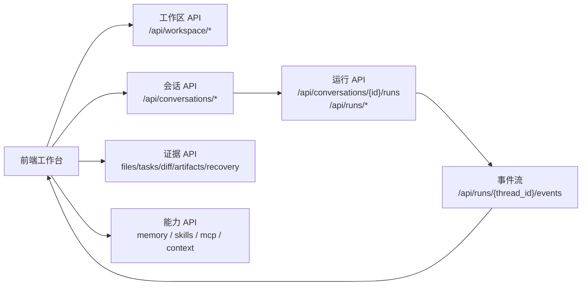
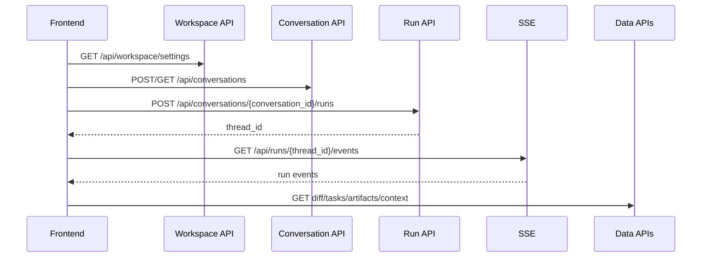

# API 地图

最后更新：2026-06-12

这份文档记录 nanoCursor 学习时最应该关注的 API。完整接口以代码为准，这里只整理主链路。

## 0. API 使用总图



这张图说明前端不是只调一个 `/chat` 接口。它先确认工作区和会话，再创建 run，通过 SSE 获取实时事件，最后通过数据接口读取 Diff、任务、交付物、恢复信息和上下文窗口。

## 1. 系统状态

| 方法 | 路径 | 作用 |
|---|---|---|
| `GET` | `/health` | 存活检查 |
| `GET` | `/ready` | 检查 LLM 配置是否可用 |
| `GET` | `/version` | 返回版本和 commit |

## 2. 运行入口

| 方法 | 路径 | 作用 | 备注 |
|---|---|---|---|
| `POST` | `/api/run` | legacy 标准运行入口 | 兼容旧入口 |
| `POST` | `/api/runs` | AgentHub 标准运行入口 | 不一定绑定会话 |
| `POST` | `/api/conversations/{conversation_id}/runs` | 会话内创建运行 | 当前主线入口 |
| `GET` | `/api/run/{thread_id}/events` | SSE 事件流 | legacy event stream |

推荐学习和后续开发优先看：

```text
POST /api/conversations/{conversation_id}/runs
```

因为它最符合现在的产品模型：

```text
workspace -> conversation -> run -> events/artifacts
```

### 主链路 API 时序



学习接口时要记住：`conversation_id` 解决“这是谁的连续对话”，`workspace_dir` 解决“在哪个项目里工作”，`thread_id` 解决“这一次运行的事件和证据在哪里”。

## 3. 会话

路由文件：

- `src/api/routes/conversations.py`

学习时重点确认：

- 如何创建会话
- 会话如何绑定工作区
- 会话历史如何过滤空会话
- 当前会话如何恢复
- run 如何 link 回 conversation

## 4. 工作区

路由文件：

- `src/api/routes/workspaces.py`

学习时重点确认：

- 当前工作区路径
- 最近项目
- 工作区设置
- 工作区与会话隔离

典型设计约束：

- 默认工作区不应该和 nanoCursor 项目源码混在一起。
- 同一个工作区可以有多个会话。
- 会话历史不应该跨工作区污染。

## 5. 数据和文件

路由文件：

- `src/api/routes/data.py`

可能包含：

- 文件列表
- 任务列表
- Diff
- 交付物
- 质量结果

学习重点：

- 前端左侧文件管理从哪里拿数据
- 底部 Diff 从哪里拿数据
- 新建文件是否能被统计进 diff

## 6. 事件、分析和恢复

相关路由：

- `src/api/routes/runs.py`
- `src/api/routes/run_analytics.py`
- `src/api/routes/recovery.py`
- `src/api/routes/approvals.py`

关注点：

- run 状态查询
- 事件查询
- 运行分析
- 审批请求
- 快照恢复

## 7. 记忆

路由文件：

- `src/api/routes/memory.py`

关注点：

- 添加记忆
- 查询记忆
- 更新记忆
- 记忆是否按 workspace / conversation 区分
- 记忆是否进入上下文

## 8. MCP / Skills

路由文件：

- `src/api/routes/mcp.py`
- `src/api/routes/skills.py`

关注点：

- MCP 服务器列表
- MCP 预设安装
- MCP 工具目录
- Skills 列表
- Skills 导入
- Skills 是否注入 Agent 上下文

## 9. API 学习练习

建议用 API smoke 或浏览器开发者工具追一次：

1. 创建新会话
2. 发送“哈喽”
3. 确认调用的是会话 run 接口
4. 查看返回 thread_id
5. 查看事件流
6. 再发送“帮我用 Python 写排序算法并比较性能”
7. 对比两次 intent decision 和 execution plan
