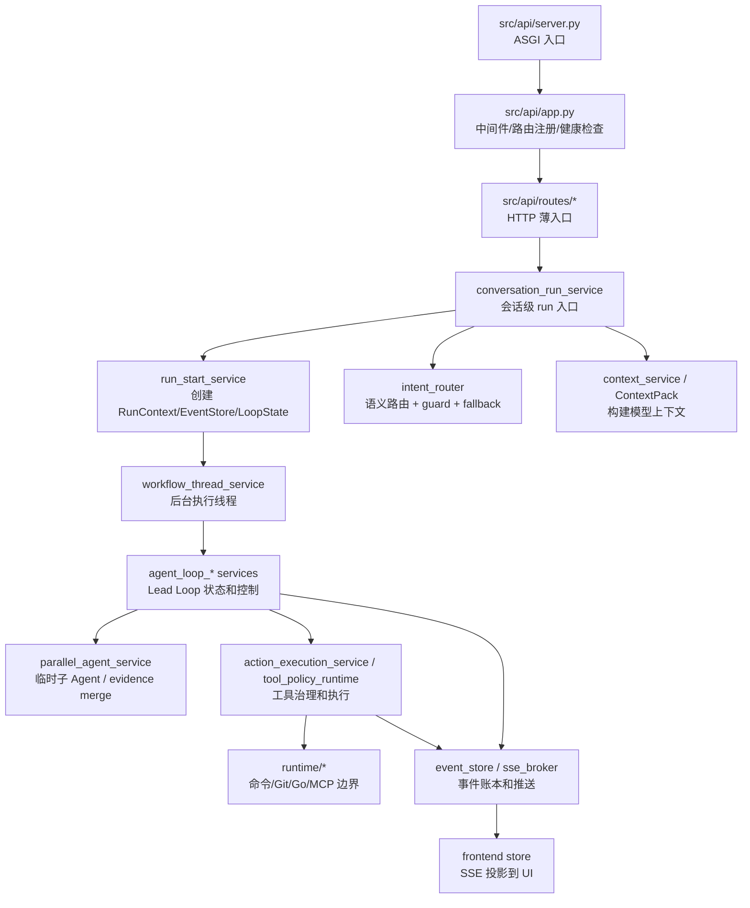

# 后端代码地图

最后更新：2026-06-12

这份地图用于快速定位 nanoCursor 后端主要模块。它不是 API 文档，而是“我要理解或修改某个能力时应该看哪里”。

## 0. 后端阅读总图

先用这张图建立方向感，再去看下面的文件列表。不要从 `src/api/services/` 随机打开文件读，那样会很容易迷路。



读代码时按这条主干走：**入口 -> 会话 run -> 意图 -> 上下文 -> Loop -> 工具 -> 事件**。看懂主干后，再按问题去读具体 service。

## 1. 后端入口

### `src/api/server.py`

官方 ASGI 入口：

```python
from src.api.app import create_app

app = create_app()
```

如果使用 uvicorn 启动，推荐入口是：

```bash
python -m uvicorn src.api.server:app --host 127.0.0.1 --port 8100
```

如果项目仍保留根目录 `api_server.py`，它应该只作为兼容入口，不应该再承载核心逻辑。

### `src/api/app.py`

负责创建 FastAPI app：

- CORS
- request id
- 统一错误响应
- 慢请求日志
- health / ready / version
- 路由注册

学习后端时先看这个文件，可以知道系统暴露了哪些功能入口。

## 2. 路由层：`src/api/routes/`

路由层只应该处理 HTTP 协议、请求模型和响应，不应该塞大量业务逻辑。

重点文件：

| 文件 | 作用 |
|---|---|
| `run_entry.py` | run 主入口，包含 `/api/run`、`/api/runs`、`/api/conversations/{id}/runs` |
| `runs.py` | run 查询、事件、运行时相关接口 |
| `conversations.py` | 会话创建、查询、更新 |
| `workspaces.py` | 工作区设置、最近项目 |
| `data.py` | 文件、任务、Diff 等数据接口 |
| `memory.py` | 记忆接口 |
| `mcp.py` | MCP 服务器和工具接口 |
| `skills.py` | Skills 管理接口 |
| `approvals.py` | 审批接口 |
| `recovery.py` | 恢复和快照接口 |
| `benchmarks.py` | benchmark / 真实任务评测 |
| `evals.py` | Agent 评估相关接口 |

## 3. 运行启动链路

### 一次 run 的服务调用链

```mermaid
sequenceDiagram
  participant Route as run_entry.py
  participant Conv as conversation_run_service
  participant Intent as intent_router
  participant Plan as orchestration_service
  participant Start as run_start_service
  participant Loop as agent_loop_state_service
  participant Thread as workflow_thread_service
  participant Store as EventStore

  Route->>Conv: start_conversation_run()
  Conv->>Intent: classify_user_intent_async()
  Conv->>Plan: compose team / build execution plan
  Conv->>Start: start_standard_run()
  Start->>Store: create_session()
  Start->>Loop: init_agent_loop_state()
  Start->>Thread: start_workflow_thread()
  Thread-->>Store: append run events
```

这张图可以用来排查“前端点发送后到底后端走到哪里了”。比如没有 `thread_id`，看 `run_entry` 和 `conversation_run_service`；有 `thread_id` 但没有事件，看 `run_start_service`、`workflow_thread_service` 和 `EventStore`。

### `src/api/services/conversation_run_service.py`

会话级运行入口。

核心职责：

- 根据 conversation_id 找会话
- 调用意图路由
- 组合 runtime team
- 构建 execution plan
- 对齐 tool policy
- 调用 `start_standard_run`
- 把 run 绑定回会话
- 写 EventStore 元信息
- 发出复杂度和计划事件

重点函数：

- `start_conversation_run`
- `lead_only_execution_plan`
- `align_tool_policy_with_intent`

### `src/api/services/run_start_service.py`

标准 run 启动器。

核心职责：

- 生成 thread_id
- 设置 active workspace
- 限流和并发上限
- 创建消息历史
- 创建并注册 `RunContext`
- 创建 EventStore session
- 初始化 Agent Loop 状态
- 发出 `run_started`
- 启动 workflow thread

重点函数：

- `start_standard_run`
- `messages_for_run`
- `intent_session_fields`

### `src/api/services/workflow_thread_service.py`

负责把实际 Agent 执行放到后台线程/任务里，避免 API 请求阻塞到任务完成。

阅读它时重点关注：

- workflow_runner 如何注入
- 线程生命周期
- 异常如何回写 run 状态
- 结束时如何清理 active run

## 4. 意图路由和 Agent 策略

### `src/api/services/intent_router.py`

负责用户意图判断。

它结合：

- 确定性关键词和信号
- guard
- LLM 分类器
- normalizer

输出统一的 intent decision。

重点概念：

- `route`：用户要做什么
- `execution_route`：系统如何运行
- `requires_workspace_read`
- `requires_workspace_write`
- `requires_shell`
- `requires_approval`

### `src/api/services/routing_decision_service.py`

把 intent、execution plan、team 等信息进一步整理成运行决策。

### `src/api/services/orchestration_service.py`

负责构建 execution plan。学习时重点看：

- 阶段如何生成
- Agent 如何分配
- 验收标准如何表达
- tool policy 如何进入计划

## 5. Agent Runtime

### `src/agent/engine.py`

历史核心引擎。它比较大，但仍然是理解系统的关键。

包含：

- 工具定义
- `BASE_TOOLS`
- `TASK_TOOLS`
- `MEMORY_TOOLS`
- `AGENT_RUNTIME_TOOLS`
- 工具处理函数
- Agent Loop
- 子 Agent spawn/gather
- 文件、shell、测试、记忆工具接入

阅读建议：

1. 先看工具定义。
2. 再看 `run_tests`、文件工具和 shell 工具封装。
3. 再找 Agent Loop 主函数。
4. 最后看子 Agent 相关函数。

### `src/agent/context_pack.py`

负责把项目上下文整理成可注入模型的上下文包。

### `src/agent/compaction.py`

负责上下文压缩。

### `src/agent/learner.py`

和学习/记忆更新相关。

### `src/agent/skill_runtime.py`

Skills 在 Agent 运行时的接入点。

### `src/agent/strategy/`

Agent 策略相关模块：

- `classifier.py`
- `planner.py`
- `tool_policy.py`

## 6. 上下文和记忆

重点文件：

| 文件 | 作用 |
|---|---|
| `context_service.py` | 构建任务上下文 |
| `context_budget_service.py` | 控制上下文预算 |
| `context_recovery_service.py` | 上下文异常恢复 |
| `file_outline_service.py` | 文件 outline |
| `project_index` 相关服务 | 项目索引 |
| `memory_selection_service.py` | 选择相关记忆 |
| `memory_governance_service.py` | 记忆治理 |
| `memory_service.py` | 记忆基础服务 |

学习顺序：

1. 项目索引如何生成
2. 文件 outline 如何保存
3. run 启动时如何选择上下文
4. conversation_summary 和 execution_summary 如何使用
5. 记忆如何被写入和召回

## 7. 工具治理

重点文件：

| 文件 | 作用 |
|---|---|
| `src/agent/strategy/tool_policy.py` | Agent 侧工具策略 |
| `src/api/services/action_execution_service.py` | 动作执行 |
| `src/api/services/approval_service.py` | 审批 |
| `src/tools/path_safety.py` | 路径安全 |
| `src/tools/file_ops.py` | Agent Runtime canonical 文件读写编辑层，包含 Go sidecar fallback |
| `src/tools/file_tools.py` | legacy / AST 兼容文件工具，不应重新作为模型主工具入口 |
| `src/tools/bash.py` | shell 执行 |
| `src/runtime/command_runner.py` | 命令运行封装 |
| `src/runtime/tool_policy_runtime.py` | runtime 权限分级、敏感文件和高风险写入审批 |

核心问题：

- 哪些工具能读？
- 哪些工具能写？
- 哪些命令算安全？
- 哪些操作需要审批？
- 文件修改前是否有备份？
- 失败后如何恢复？

## 8. EventStore 和事件流

重点文件：

| 文件 | 作用 |
|---|---|
| `src/api/services/event_store.py` | 事件持久化 |
| `src/api/services/event_service.py` | 事件查询 |
| `src/api/services/legacy_sse_service.py` | SSE 兼容流 |
| `src/api/run_state.py` | active run 和事件 emit |

学习重点：

- session 如何创建
- event 如何追加
- 前端如何订阅
- 刷新后如何恢复
- 不同 conversation/run 如何隔离

## 9. MCP / Skills

重点文件：

| 文件 | 作用 |
|---|---|
| `src/api/routes/mcp.py` | MCP API |
| `src/api/routes/skills.py` | Skills API |
| `src/api/services/mcp_service.py` | MCP 配置和状态 |
| `src/api/services/mcp_runtime_service.py` | MCP 运行时 |
| `src/api/services/mcp_tool_catalog_service.py` | MCP 工具目录 |
| `src/api/services/skill_service.py` | Skills 管理 |
| `src/agent/skill_runtime.py` | Skills 注入 Agent |

## 10. Go sidecar

目录：

- `go-services/filetools/`
- `go-services/indexer/`
- `go-services/executor/`
- `go-services/mcp/`

Python 接入：

- `src/tools/filetools_client.py`
- `src/tools/file_ops.py`
- `src/api/services/go_filetools_service.py`
- `src/api/routes/runtime.py`
- `src/runtime/go_runtime_client.py`
- `src/runtime/go_mcp_gateway_client.py`

理解重点：

- Go 不是替换所有 Python
- Go 更适合文件工具、文件索引、长进程 watcher、工具执行隔离、高并发 sidecar
- Python 继续承担 LLM 编排和业务决策
- Go filetools 默认启用，但保留 Python fallback 和失败冷却
- Go sidecar 不能绕过 `ToolPolicyRuntime`，只作为执行 backend

## 11. 测试

重点目录：

- `tests/`
- `scripts/check.py`
- `scripts/check_all.py`
- `scripts/api_smoke.py`
- `scripts/run_real_task_smoke.py`

测试类型：

- 单元测试
- API smoke
- 服务层测试
- Agent Loop 状态测试
- Python/Go contract test
- 前端构建/Playwright
- 真实任务 smoke

## 12. 读代码建议

第一次读后端，不要从 `engine.py` 一头扎进去。推荐顺序：

1. `src/api/server.py`
2. `src/api/app.py`
3. `src/api/routes/run_entry.py`
4. `src/api/services/conversation_run_service.py`
5. `src/api/services/run_start_service.py`
6. `src/api/services/intent_router.py`
7. `src/api/services/orchestration_service.py`
8. `src/api/run_state.py`
9. `src/api/services/event_store.py`
10. `src/agent/engine.py`
