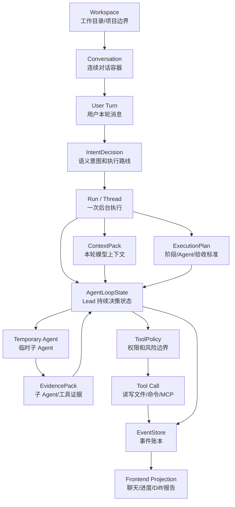
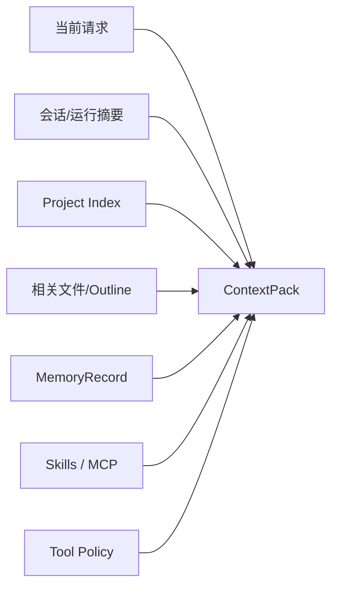

# 核心概念词典：把项目语言统一起来

最后更新：2026-06-12

这份词典不是背单词用的，而是帮你把 nanoCursor 里的核心概念连成一个系统。很多源码难懂，不是因为代码本身复杂，而是因为 `conversation`、`run`、`thread_id`、`ContextPack`、`EventStore`、`EvidencePack` 这些词混在一起后容易失去边界。

## 0. 一张图看概念关系



记住这张图的核心：**Conversation 是连续对话容器，Run 是一次执行实例，ContextPack 是模型看到的材料，EventStore 是系统留下的证据，ToolPolicy 是副作用边界。**

## 1. Workspace

Workspace 是 nanoCursor 工作的项目目录边界。

| 维度 | 说明 |
|---|---|
| 解决的问题 | 防止会话、文件、任务、Diff 混到 nanoCursor 自己源码或其他项目里 |
| 你要看的源码 | `src/api/routes/workspaces.py`、workspace service、active workspace 相关逻辑 |
| 典型事件/证据 | run metadata 里的 workspace path，右侧栏“本地”路径 |
| 容易混淆 | Workspace 不是 nanoCursor 仓库本身，而是用户希望 Agent 工作的目录 |

面试说法：本地 AI 编程工具必须先有工作区边界，否则文件读写、上下文索引和会话历史都会串项目。

## 2. Conversation

Conversation 是连续对话容器。用户在同一个对话里连续发消息，应该共享历史摘要、工作区、记忆和上下文策略。

| 维度 | 说明 |
|---|---|
| 解决的问题 | 避免第二条消息丢历史、刷新回欢迎页、任务进度串到其他会话 |
| 你要看的源码 | `src/api/routes/conversations.py`、`src/api/services/conversation_run_service.py` |
| 典型事件/证据 | conversation_id、messages、绑定的 run ids |
| 容易混淆 | Conversation 不是一次任务；一次 conversation 里可以有多个 run |

学习时要特别注意：一个用户消息可能启动一个 run，但它仍然属于当前 conversation。

## 3. Run / Thread

Run 是一次后台执行实例。很多代码里会使用 `thread_id` 表示 run 的唯一标识，这是历史命名遗留，但你学习时可以理解成 run_id。

| 维度 | 说明 |
|---|---|
| 解决的问题 | 把一次用户请求的执行状态、事件、Diff、报告、恢复记录聚合起来 |
| 你要看的源码 | `src/api/services/run_start_service.py`、`src/api/services/workflow_thread_service.py` |
| 典型事件/证据 | `.nanocursor/runs/<thread_id>/events.jsonl` |
| 容易混淆 | Thread 不等于 Python thread；它更多是一次 run 的标识 |

如果前端显示失败、右侧任务串了、刷新后状态错了，第一件事就是确认当前 conversation 绑定的是哪个 run/thread。

## 4. IntentDecision

IntentDecision 是用户意图判断结果。它回答两个问题：用户想做什么，以及系统应该用哪种方式执行。

| 字段 | 含义 |
|---|---|
| route | 用户意图，比如 direct answer、read-only、small edit、debug、risky |
| execution_route | 系统执行方式，比如 Lead 直接回答、轻量运行、完整 Agent Loop |
| requires_workspace_read | 是否需要读工作区 |
| requires_workspace_write | 是否允许写工作区 |
| requires_shell | 是否需要命令执行 |
| requires_approval | 是否可能触发审批 |

源码入口：

- `src/api/services/intent_router.py`
- `src/api/services/routing_decision_service.py`
- `src/api/services/conversation_run_service.py`

成熟设计不是纯关键词，也不是完全交给 LLM。更稳的是：deterministic guard 保护硬边界，LLM 负责语义判断，normalizer 负责把结果收口到稳定 schema。

## 5. ExecutionPlan

ExecutionPlan 是本轮任务的执行蓝图，但它不是固定 DAG。它描述阶段、Agent、验收标准、能力约束和工具边界。

| 维度 | 说明 |
|---|---|
| 解决的问题 | 避免 Agent 一上来无边界改项目 |
| 你要看的源码 | `src/api/services/orchestration_service.py`、`conversation_run_service.py` |
| 典型证据 | 右侧进度任务、plan event、阶段完成状态 |
| 容易混淆 | Plan 不是死流程；实际下一步仍由 Agent Loop 根据状态决定 |

面试回答可以这样说：ExecutionPlan 提供边界和验收标准，Agent Loop 负责运行时动态决策。

## 6. ContextPack

ContextPack 是本轮给模型看的结构化上下文。



| 维度 | 说明 |
|---|---|
| 解决的问题 | 不把整个项目和完整历史粗暴塞给模型 |
| 你要看的源码 | `src/agent/context_pack.py`、`src/api/services/context_service.py`、`src/api/services/context_budget_service.py` |
| 典型证据 | context section、token ledger、selected files |
| 容易混淆 | ContextPack 不是 prompt 字符串，而是可预算、可裁剪、可解释的数据结构 |

一句话记忆：Agent 的聪明程度，很大程度取决于 ContextPack 命中率。

## 7. ContextBudget / ContextLedger

ContextBudget 控制每类上下文最多占多少；ContextLedger 记录实际占了多少。

| 概念 | 作用 |
|---|---|
| ContextBudget | 预算规则，例如代码片段、outline、失败日志、记忆各占多少 |
| ContextLedger | 运行账本，记录各 section token、压力等级、是否需要压缩 |
| Compaction | 达到压力阈值后，压缩低优先级内容，保护 P0 锚点 |

P0 锚点通常包括当前用户请求、当前计划、工具策略。它们不能随便被裁剪，否则模型会跑偏或越权。

## 8. MemoryRecord

MemoryRecord 是被提取出来的长期有价值信息，不等于聊天历史。

| 字段 | 作用 |
|---|---|
| scope | 控制记忆属于全局、工作区、会话还是文件 |
| source | 记忆来源，方便回溯 |
| confidence / importance / freshness | 控制注入优先级 |
| file_fingerprint | 防止旧文件事实污染新任务 |
| evidence_refs | 让记忆不是凭空生成 |

源码入口：

- `src/api/services/memory_service.py`
- `src/api/services/failure_learning_service.py`

面试时要强调：记忆系统的难点不是“存下来”，而是防止过时、跨项目污染和错误记忆反复影响新任务。

## 9. AgentLoopState

AgentLoopState 是 Lead Agent 的运行时账本。它记录当前任务、已完成步骤、失败、审批、子 Agent、工具调用和终止状态。

| 维度 | 说明 |
|---|---|
| 解决的问题 | 让 Loop 不是失控 while，而是可审计的小步执行 |
| 你要看的源码 | `src/api/services/agent_loop_state_service.py` |
| 典型证据 | loop step、task status、completion/failure reason |
| 容易混淆 | LoopState 不是普通日志，它会参与下一步决策 |

判断一个 Agent Loop 是否成熟，看三点：动作是否结构化，执行前是否校验，执行后是否写入可复盘状态。

## 10. Temporary Agent

Temporary Agent 是 run scoped 的临时子 Agent。它不是长期团队成员，通常服务于本轮任务。

| 维度 | 说明 |
|---|---|
| 解决的问题 | 在复杂任务中拆分只读分析、实现建议、验证复核 |
| 你要看的源码 | `src/api/services/parallel_agent_service.py`、`src/api/services/agent_orchestration_service.py` |
| 典型证据 | child agent created、agent evidence、agent archived |
| 容易混淆 | 子 Agent 不应该永久污染全局团队状态 |

当前设计更偏“Lead 主控 + 子 Agent 辅助收集证据”，而不是完全自治的多 Agent 社会。

## 11. EvidencePack

EvidencePack 是子 Agent 或工具产出的结构化证据包。

| 内容 | 例子 |
|---|---|
| observation | 看到了哪些文件、测试、错误 |
| proposal | 建议修改什么 |
| risk | 发现哪些风险 |
| touched_files | 涉及哪些路径 |
| confidence | 证据可信度 |

为什么需要 EvidencePack？因为子 Agent 的自然语言回答不能直接变成最终结果。Lead 需要合并证据、处理冲突、再决定是否执行。

## 12. ToolPolicy

ToolPolicy 是工具调用的权限和风险边界。

| 等级 | 例子 |
|---|---|
| read_only | 读文件、搜索、项目索引 |
| safe_write | 工作区内小范围写文件 |
| risky_write | 删除、移动、大范围替换 |
| shell_safe | 测试、lint、只读命令 |
| shell_risky | 安装依赖、网络请求、删除、Git 写操作 |
| mcp_read / mcp_write | 外部 MCP 工具读写 |

源码入口：

- `src/runtime/tool_policy_runtime.py`
- `src/api/services/action_policy_service.py`
- `src/api/services/shell_policy_service.py`

一句话：模型可以提出动作，但不能直接拥有副作用权限。

## 13. Approval

Approval 是高风险动作的人类确认机制。

| 触发场景 | 为什么需要 |
|---|---|
| 删除/移动文件 | 可能不可逆 |
| 安装依赖 | 改变环境 |
| 网络请求 | 可能泄露信息或引入不确定性 |
| Git 写操作 | 改变版本历史 |
| MCP 写工具 | 外部系统副作用 |

Approval 的价值不是“多一个弹窗”，而是让本地 Agent 工具有安全感：用户知道什么时候系统会停下来问。

## 14. Tool Call

Tool Call 是实际动作，例如读文件、写文件、运行命令、调用 MCP。它必须被策略检查、执行、记录证据。

成熟链路应该是：

```text
propose -> classify -> decide -> execute -> record -> summarize
```

如果某个工具失败，失败信息也应该结构化进入 EventStore 和恢复模块，而不是只打印到日志。

## 15. EventStore

EventStore 是运行事件账本。

| 维度 | 说明 |
|---|---|
| 解决的问题 | 让系统运行过程可恢复、可复盘、可投影到前端 |
| 你要看的源码 | `src/api/services/event_store.py` |
| 典型文件 | `.nanocursor/runs/<thread_id>/events.jsonl` |
| 容易混淆 | EventStore 不是普通 logger；它是系统状态恢复和前端投影的依据 |

如果你要排查一个 run，最应该先看的不是最终回复，而是 events.jsonl。

## 16. SSE / Frontend Projection

SSE 是后端把运行事件推给前端的通道；Frontend Projection 是前端把事件变成聊天消息、任务进度、Agent 动态、Diff 和报告。

| 层 | 作用 |
|---|---|
| EventStore | 持久化事实 |
| SSE Broker | 实时推送事件 |
| Frontend Store | 把事件投影成 UI 状态 |
| UI Components | 展示聊天、进度、底栏详情 |

前端 bug 往往不是样式问题，而是事件语义和前端投影没有对齐。

## 17. Artifact / Report / Diff

| 概念 | 含义 |
|---|---|
| Diff | 文件变更证据 |
| Artifact | 运行产物，例如报告、测试结果、恢复快照 |
| Report | 面向用户的交付总结 |

一个代码任务不能只靠“模型说完成了”来完成。它至少要能对应到写入证据、Diff、测试或报告中的一部分。

## 18. Go Sidecar

Go Sidecar 是确定性系统边界增强，不是主业务脑。

| 适合放到 Go | 不适合放到 Go |
|---|---|
| 文件工具 | Agent 决策 |
| 项目索引 | 上下文策略 |
| 命令执行隔离 | 记忆策略 |
| MCP stdio 生命周期 | 工具审批规则 |

面试时讲清楚：Go 增强的是性能、隔离、并发和系统边界；Python 保留 LLM 生态、Agent 编排和策略收口。

## 19. MCP

MCP 是工具协议，让系统能接外部工具或上下文源。

| 维度 | 说明 |
|---|---|
| 解决的问题 | 把文件系统、知识库、GitHub、推理工具等统一成可调用工具 |
| 你要看的源码 | `src/api/routes/mcp.py`、MCP service、`go-services/mcp-gateway` |
| 风险 | 外部工具可能有读写副作用，必须进入工具策略 |

MCP 的重点是“协议化工具接入”，不是让 Agent 随便调用一切外部能力。

## 20. Skills

Skills 是行为知识包，告诉 Agent 某类任务应该怎么做、注意什么、调用什么能力。

| 维度 | 说明 |
|---|---|
| 解决的问题 | 把重复的领域经验沉淀成可复用规则 |
| 你要看的源码 | `src/api/services/skill_registry_service.py`、`src/api/services/routing_decision_service.py` |
| 风险 | Skill 不能绕过审批，也不能覆盖系统级安全规则 |

MCP 更像“工具协议”，Skills 更像“操作手册”。一个给能力，一个给方法。

## 21. Benchmark / Ablation

Benchmark 用来证明系统能力；Ablation 用来证明组件价值。

| 概念 | 问的问题 |
|---|---|
| benchmark | 系统在一组任务上表现如何 |
| ablation | 关闭某个组件后是否退化 |
| contract test | Python/Go 或接口之间行为是否一致 |
| real-task eval | 真实任务路由和执行是否符合预期 |

面试时不要说“我感觉这个模块有用”，要说“我用什么样的评测证明它在某类场景下有收益，边界是什么”。

## 22. 最容易混淆的 8 组概念

| 容易混淆 | 区别 |
|---|---|
| Conversation vs Run | Conversation 是连续对话容器；Run 是一次后台执行 |
| Run vs Thread | Thread 多数时候是历史命名下的 run id，不一定等于 Python thread |
| ExecutionPlan vs Agent Loop | Plan 定边界和验收；Loop 运行时决策下一步 |
| ContextPack vs Prompt | ContextPack 是结构化输入；Prompt 是序列化后的文本形态 |
| Memory vs History | History 是发生过什么；Memory 是提炼后值得长期参考什么 |
| EvidencePack vs Report | EvidencePack 给系统合并决策；Report 给用户阅读 |
| EventStore vs Logger | EventStore 是状态和恢复依据；logger 主要用于开发排查 |
| MCP vs Skills | MCP 提供工具协议；Skills 提供任务方法和领域规则 |

## 23. 学习检查

学完这份词典，你应该能不用看文档回答：

1. 用户在同一会话里发第二条消息，为什么不应该创建新 conversation？
2. 为什么小代码修改必须有成功写入证据才能完成？
3. 为什么 EventStore 比普通日志重要？
4. 为什么子 Agent 的结果要通过 EvidencePack 合并？
5. 为什么 ToolPolicy 必须进入 ContextPack？
6. 为什么 Go sidecar 不能绕过 Python 策略？
7. 为什么 Skills 不能拥有比系统更高的权限？
8. 为什么 benchmark 和 ablation 是两件不同的事？

如果这些问题回答不稳，先回看 `chapters/00-learning-roadmap.md`、`maps/source-navigation-index.md` 和 `exercises/05-mastery-audit.md`。
