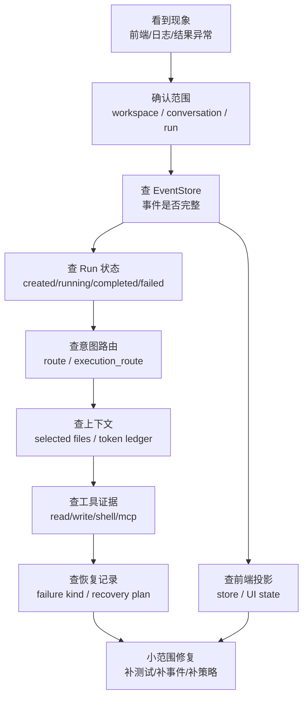
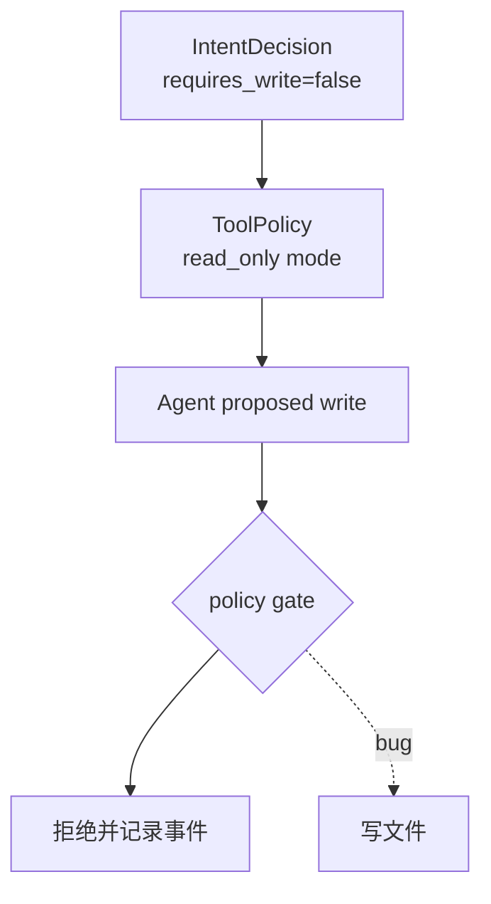
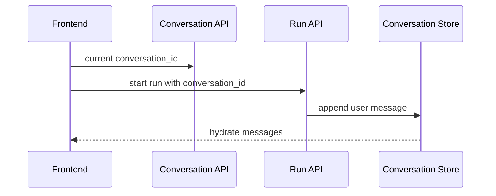
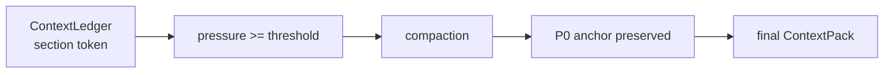
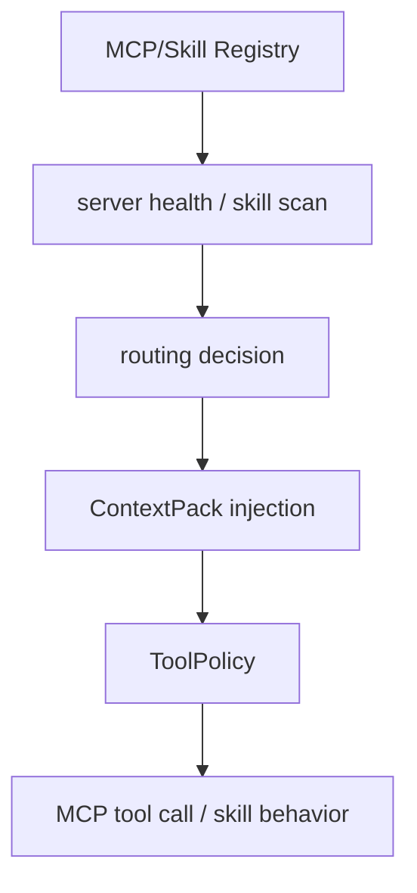

# 实战排障手册：从现象定位到源码

最后更新：2026-06-12

这份手册解决最后一个学习难点：你不只是要知道模块是什么，还要能在系统出问题时判断“应该先看哪里”。如果你能按这份手册排查 5-8 类真实问题，说明你已经不只是读懂文档，而是开始具备维护项目的能力。

## 0. 排障总图



排障的第一原则：**不要先猜模型是不是笨，也不要先改前端样式。先确定当前 workspace、conversation、run，然后看 EventStore 是否记录了事实。**

## 1. 通用排障流程

### 1.1 先收集四个 ID

| 信息 | 为什么重要 |
|---|---|
| workspace path | 确认 Agent 工作的目录是不是你以为的目录 |
| conversation_id | 确认连续对话有没有串会话 |
| thread_id / run_id | 确认当前 UI 显示的是哪次执行 |
| latest event timestamp | 确认后台是否还在运行，还是事件流断了 |

如果这四个信息不清楚，后面的排查都会变成猜。

### 1.2 再看三类证据

| 证据 | 位置 | 用途 |
|---|---|---|
| 事件账本 | `.nanocursor/runs/<thread_id>/events.jsonl` | 判断后端发生了什么 |
| API 状态 | `/api/runs/{thread_id}`、相关 run 查询接口 | 判断前端拿到的状态是否对 |
| 前端投影 | 前端 store / UI 面板 | 判断事件是否被正确展示 |

同一个问题至少要看两层证据：后端事件和前端显示。如果事件对、前端错，是投影问题；如果事件本身错，是后端链路问题。

## 2. 症状 A：简单问候却触发完整任务

现象：

```text
用户只发“你好”，右侧却出现 Coder / Tester / 完整开发任务。
```

排查路径：


应该检查：

| 检查点 | 说明 |
|---|---|
| intent decision | route 是否是 direct/answer，而不是 small_edit |
| execution plan | 是否用了 `lead_only_execution_plan` |
| team composition | 是否错误创建了 Coder/Tester |
| frontend progress | 是否显示了旧 run 的任务 |

源码入口：

- `src/api/services/intent_router.py`
- `src/api/services/conversation_run_service.py`
- `src/api/services/routing_decision_service.py`

常见原因：

1. 关键词规则把普通问候误判成代码任务。
2. LLM 分类结果置信度低，但 normalizer 没收口。
3. 新会话 UI 仍展示旧 run 的进度。
4. conversation 与 run 绑定错了。

修复方向：

- 补 intent eval：问候、闲聊、解释类问题必须 direct。
- 更新前端：新会话没有用户消息时不显示旧任务。
- 后端：direct answer 不创建完整 execution plan。

## 3. 症状 B：用户要求只读，系统却写文件

现象：

```text
用户说“只看看，不要修改”，但 Diff 出现文件变更。
```

排查路径：



应该检查：

| 检查点 | 说明 |
|---|---|
| `requires_workspace_write` | 只读任务应该是 false |
| tool policy mode | 是否进入 read_only |
| action policy | 写动作是否被拦截 |
| write evidence | 是否真的发生了 write tool success |

源码入口：

- `src/api/services/intent_router.py`
- `src/runtime/tool_policy_runtime.py`
- `src/api/services/action_policy_service.py`
- `src/api/services/file_ops.py`

修复方向：

- 强化“不要修改”“只读”“read only”等约束的 hard guard。
- 写工具入口统一检查 policy，不允许某个工具绕过。
- 增加只读任务回归测试：有写入即失败。

## 4. 症状 C：前端显示完成，但没有任何文件变更

现象：

```text
用户要求实现功能，系统回复完成，但 Diff 为 0，文件没有变。
```

先判断：这到底是正常 direct answer，还是代码任务假完成？

排查表：

| 检查点 | 正常情况 | 异常情况 |
|---|---|---|
| intent route | direct/read-only 可以没有 Diff | small_edit/coding 不应该没有写入证据 |
| write evidence | 代码任务应有 write success | 只有自然语言总结 |
| finalization | 应检查工具证据 | 没检查就 completed |
| report | 应引用真实变更 | 只复述模型文本 |

源码入口：

- `src/api/services/runtime_routing_service.py`
- `src/api/services/run_finalization_service.py`
- `src/api/services/tool_evidence_service.py`
- `src/api/services/event_store.py`

修复方向：

1. small_edit/coding 任务完成前必须验证成功写入证据。
2. 交付报告必须绑定 Diff、测试或 artifact，不能只塞最后一条模型回复。
3. 前端报告区如果没有 artifact，应显示“无代码交付”，而不是假装完成。

## 5. 症状 D：连续对话第二条消息丢历史

现象：

```text
同一个会话里发第二条消息，前面的消息看不见了，或者自动开了新会话。
```

排查路径：



应该检查：

| 检查点 | 说明 |
|---|---|
| URL/hash | 刷新后是否仍带 conversation id |
| start run payload | 是否传了当前 conversation_id |
| conversation store | 第二条消息是否 append 到同一个 conversation |
| frontend state reset | 发送后是否误清空 message list |

源码入口：

- `src/api/routes/conversations.py`
- `src/api/services/conversation_run_service.py`
- 前端会话 store / router / hydrate 逻辑

修复方向：

- conversation 是容器，run 是执行，不要混用。
- 新会话只有用户真正发送消息后才进入历史列表。
- 刷新页面时应按 URL 或 active conversation 恢复，而不是回欢迎页。

## 6. 症状 E：Agent 动态碎片太多

现象：

```text
聊天框里出现大量底层工具输出，比如 mkdir、FD from fork、文件路径碎片。
```

判断原则：

| 内容 | 应该出现在哪里 |
|---|---|
| Agent 当前正在做什么 | Agent 动态条 |
| 工具调用详情 | 底栏事件或工具详情 |
| 最终用户回复 | 聊天消息 |
| 原始 stderr / debug 输出 | 日志或折叠详情，不直接塞聊天 |

排查入口：

- 后端事件类型：是否把 low-level tool output 标成 message。
- 前端投影：是否把 tool event 当作 agent chat message。
- final report：是否直接拼接工具原始输出。

源码入口：

- `src/api/services/event_store.py`
- SSE broker / event normalization service
- 前端 event projection/store
- Markdown message renderer

修复方向：

1. 后端事件分层：`agent_status`、`tool_call`、`tool_result`、`final_message` 分开。
2. 前端只把 `final_message` 和高级 Agent 叙述放聊天。
3. 工具原始输出进入底栏事件或折叠详情。

## 7. 症状 F：上下文窗口爆掉或压缩后模型跑偏

现象：

```text
长会话后模型忘记当前任务，或者上下文面板显示压力很高但没有压缩。
```

排查路径：



应该检查：

| 检查点 | 说明 |
|---|---|
| model window | 当前模型上下文窗口配置是否正确 |
| section token | 哪些 section 占用最高 |
| compression trigger | 是否达到阈值 |
| P0 anchors | 当前请求、当前计划、工具策略是否保留 |
| summary fallback | LLM 摘要失败是否 fallback |

源码入口：

- `src/api/services/context_window_service.py`
- `src/api/services/context_ledger_service.py`
- `src/api/services/context_compaction_service.py`
- `src/api/services/context_budget_service.py`

修复方向：

- 不要随意截断字符串。
- 优先压缩旧 Agent 动态、旧工具输出、低相关文件和远期历史。
- P0 锚点必须强制保留。

## 8. 症状 G：Go sidecar 显示已连接，但功能没走 Go

现象：

```text
右侧显示 Go filetools/indexer/executor 已连接，但实际性能或日志看起来还是 Python 路径。
```

排查表：

| 检查点 | 说明 |
|---|---|
| feature flag | 是否启用 Go sidecar |
| health check | 对应服务是否 healthy |
| client route | Python client 是否选择 Go |
| fallback reason | 是否因为参数、超时、错误 fallback 到 Python |
| contract test | Go 与 Python 行为是否一致 |

源码入口：

- `go-services/`
- Python sidecar client
- `src/runtime/command_runner.py`
- filetools / indexer service

修复方向：

1. 日志里明确记录 `go_used=true/false` 和 fallback reason。
2. benchmark 分小任务和大任务，避免 RPC 开销掩盖收益。
3. 不要为了“用了 Go”强行全量替换，适合的路径才走 Go。

## 9. 症状 H：MCP/Skills 看起来配置了，但 Agent 没用

现象：

```text
设置里有 MCP server 或 Skills，但任务执行时没有任何相关工具或行为变化。
```

排查路径：



应该检查：

| 检查点 | 说明 |
|---|---|
| registry | MCP/Skill 是否真的安装和启用 |
| health | MCP server 是否可连接 |
| routing decision | requires 里是否包含相关能力 |
| context injection | Skill 内容是否进入上下文 |
| tool policy | MCP 写工具是否被策略拦截 |

源码入口：

- `src/api/routes/mcp.py`
- `src/api/routes/skills.py`
- `src/api/services/skill_registry_service.py`
- `src/api/services/routing_decision_service.py`
- `go-services/mcp-gateway`

修复方向：

- MCP/Skills 需要明确事件：发现、启用、注入、调用、失败。
- Skill 不能绕过审批。
- MCP 工具失败要进入 EventStore，而不是只在 stderr 里消失。

## 10. 症状 I：测试失败但系统没有恢复

现象：

```text
pytest 失败后，Agent 没有分析失败原因，也没有生成恢复计划。
```

排查表：

| 检查点 | 说明 |
|---|---|
| command event | 测试命令是否被记录 |
| exit code | 是否捕获非零退出码 |
| stderr/stdout | 是否保存失败输出 |
| failure classifier | 是否识别为 test_failure |
| recovery plan | 是否生成受限恢复步骤 |
| policy gate | 恢复动作是否被权限阻断 |

源码入口：

- `src/runtime/command_runner.py`
- `src/api/services/failure_recovery_loop_service.py`
- `src/api/services/recovery_routes` / recovery service
- `src/api/services/event_store.py`

修复方向：

1. 命令失败必须结构化记录 exit_code、stdout、stderr、cwd。
2. 恢复分类要区分缺依赖、断言失败、语法错误、权限阻断、超时。
3. 恢复动作要有次数限制，不能无限 retry。

## 11. 症状 J：Benchmark 结果不能说明问题

现象：

```text
benchmark 跑完了，但不知道结果能证明什么。
```

排查问题：

| 问题 | 判断 |
|---|---|
| eval 场景是否覆盖目标组件 | 没覆盖就不能证明组件没价值 |
| baseline 是否清楚 | 没 baseline 就不知道提升多少 |
| disabled component 是否真的关闭 | feature flag 必须可验证 |
| 指标是否稳定 | 只看一次自然语言输出不可靠 |
| 失败原因是否分类 | failed 需要知道是 route、context、tool 还是 model |

源码入口：

- `src/api/services/benchmark_service.py`
- `src/api/services/ablation_benchmark_service.py`
- `tests/test_benchmark_routes.py`

修复方向：

- Benchmark 要写清楚：任务、期望、指标、证据、限制。
- 消融实验要回答组件价值，不是只跑一个 demo。

## 12. 排障时最常用的源码入口

| 问题类别 | 首选入口 |
|---|---|
| API 请求没到 | `src/api/routes/*` |
| run 没启动 | `src/api/services/conversation_run_service.py`、`run_start_service.py` |
| 意图判断错 | `src/api/services/intent_router.py` |
| Agent Loop 异常 | `src/api/services/agent_loop_state_service.py` |
| 子 Agent 异常 | `src/api/services/parallel_agent_service.py` |
| 上下文错 | `context_service.py`、`context_budget_service.py`、`context_ledger_service.py` |
| 工具权限错 | `src/runtime/tool_policy_runtime.py`、`action_policy_service.py` |
| shell 异常 | `src/runtime/command_runner.py`、`shell_policy_service.py` |
| 失败恢复错 | `failure_recovery_loop_service.py` |
| 事件没显示 | `event_store.py`、SSE broker、前端 projection |
| Go 没生效 | `go-services/`、sidecar client、feature flag |
| MCP/Skills 没生效 | `mcp.py`、`skills.py`、`skill_registry_service.py` |

## 13. 你应该形成的排障直觉

| 现象 | 第一反应 |
|---|---|
| 前端显示错 | 先看事件是否对，再看前端投影 |
| 模型答偏 | 先看 ContextPack 是否选对文件 |
| 任务做过头 | 先看 intent 和 ToolPolicy |
| 没有 Diff | 先看是否代码任务，以及 write evidence |
| 子 Agent 很乱 | 先看是否把 tool event 投影成 chat message |
| Go 不快 | 先看是否真的走 Go，以及任务是否适合 Go |
| 恢复无效 | 先看失败有没有结构化分类 |
| Benchmark 没意义 | 先看 eval 是否覆盖目标模块 |

## 14. 最终练习

任选三个真实问题，按下面模板写排障记录：

| 字段 | 内容 |
|---|---|
| 现象 | 用户看到什么 |
| workspace / conversation / run | 三个 ID 或路径 |
| EventStore 证据 | 关键事件 |
| API 状态 | run 当前状态 |
| 前端状态 | UI 显示什么 |
| 初步判断 | 属于 route/context/tool/frontend/recovery 哪类 |
| 源码入口 | 先看哪些文件 |
| 修复方案 | 小范围修改 |
| 验证方式 | 测试、benchmark 或手动任务 |

能稳定写出这张表，说明你已经从“会看项目”进入“会维护项目”的阶段。
