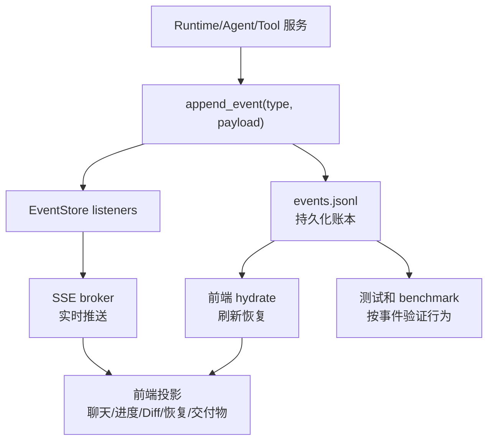

# 事件地图

最后更新：2026-06-12

事件是 nanoCursor 前端“知道系统正在干什么”的基础。没有事件流，Agent Loop 就会变成黑盒。

## 1. 事件的作用

事件承担四件事：

1. 实时告诉前端当前 run 进展。
2. 持久化运行证据，支持刷新恢复。
3. 支撑右侧进度、底部详情、聊天动态。
4. 为失败复盘和测试提供数据。

事件的价值不只是“显示进度”。同一份事件账本同时服务实时 UI、刷新恢复、失败诊断、benchmark 和面试复盘。

## 2. 主要事件来源

重点代码：

- `src/api/run_state.py`
- `src/api/services/event_store.py`
- `src/api/services/event_service.py`
- `src/api/services/legacy_sse_service.py`
- `src/api/services/conversation_run_service.py`
- `src/api/services/run_start_service.py`

## 3. 关键事件类型

| 事件 | 含义 | 常见发送位置 |
|---|---|---|
| `intent_routed` | 用户意图已识别 | `run_start_service.py` |
| `routing_decision_built` | 运行决策已生成 | `run_start_service.py` |
| `run_started` | run 已启动 | `run_start_service.py` |
| `agent_complexity_assessed` | Lead 完成复杂度判断 | `conversation_run_service.py` |
| `team_updated` | 本轮运行团队已确定 | `conversation_run_service.py` |
| `plan_created` | 执行计划已生成 | `conversation_run_service.py` |
| `agent_activity` | Agent 正在做某件事 | `run_state.py` 相关 emit |
| `stage_update` | 阶段状态更新 | `emit_stage_updates` |
| `tool_call` | 工具调用 | 工具执行相关服务 |
| `tool_result` | 工具结果 | 工具执行相关服务 |
| `approval_requested` | 等待用户审批 | approval 服务 |
| `run_completed` | run 完成 | workflow 结束 |
| `run_failed` | run 失败 | workflow 异常处理 |
| `agent_context_pack_built` | 子 Agent 独立上下文已构建 | `agent_result_merge_service.py` |
| `agent_evidence_pack_built` | 子 Agent 证据包已生成 | `agent_result_merge_service.py` |
| `agent_result_merge_recorded` | Lead 已合并子 Agent 结果 | `agent_result_merge_service.py` |
| `context_compacted` | 上下文被压缩或摘要替换 | compaction 相关服务 |
| `recovery_plan_created` | 失败恢复计划已生成 | recovery 相关服务 |

具体事件名以代码为准。学习时重点不是背名字，而是理解事件如何驱动 UI。

### 事件到 UI 的对应关系

| 事件类别 | 后端含义 | 前端应该更新哪里 |
|---|---|---|
| run lifecycle | run 开始、完成、失败、取消 | 顶部状态、右侧状态、输入框按钮 |
| intent/plan/task | 路由、计划、任务阶段变化 | 右侧进度列表 |
| agent activity | Agent 正在做什么 | 聊天框当前消息下方活动行 |
| tool call/result | 文件、shell、MCP、审批结果 | 聊天工具气泡、底部事件、证据抽屉 |
| diff/artifact/report | 代码变更和交付物 | 底部 Diff、报告、交付物 |
| context/memory | 上下文窗口、压缩、记忆选择 | 右侧上下文面板 |
| recovery | 失败分类、恢复计划、重试结果 | 底部恢复标签和质量风险 |

## 4. 前端如何使用事件

事件通常会影响：

- 聊天框 Agent 动态
- 右侧进度列表
- 环境信息
- 底部“事件”标签
- 底部“交付物”标签
- Diff 统计
- 恢复入口

设计原则：

- 用户消息上方不应该更新新 Agent 状态。
- 新 run 的 Agent 动态应该出现在当前用户消息下方。
- 历史 run 的 Agent 动态不应该继续滚动。
- 临时 Agent 完成后应该显示完成状态或归档，而不是永久占据全局 Agent 列表。

## 5. 常见事件相关 bug

### 5.1 新会话显示旧任务

可能原因：

- 前端没有按 conversation_id 过滤 run
- 后端查询事件时只按 workspace 过滤
- 当前 active run 状态没有清理

### 5.2 页面刷新回欢迎页

可能原因：

- conversation_id 没有持久化
- 前端启动时没有 hydrate 当前会话
- 路由状态和会话状态脱节

### 5.3 问候也出现复杂任务进度

可能原因：

- 意图路由返回错误
- 右侧进度复用了旧 execution plan
- `lead_direct_reply` 的事件被渲染成完整任务流

### 5.4 Agent 动态行位置不对

可能原因：

- 前端按全局 active agent 渲染
- 没有把 Agent activity 绑定到 message/run
- 历史消息和当前消息共用滚动状态

## 6. 学习检查

追踪一次真实任务时，至少记录：

- 第一个事件是什么
- 什么时候发出 `run_started`
- 什么时候发出 `plan_created`
- Agent activity 是否按 run 分组
- EventStore 是否能查到历史事件
- 前端刷新后事件是否恢复
