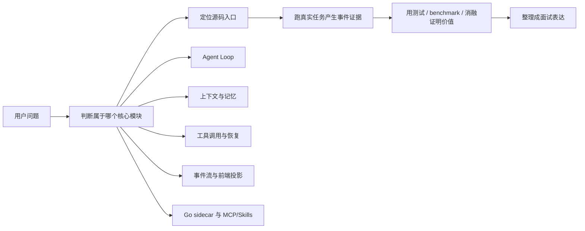
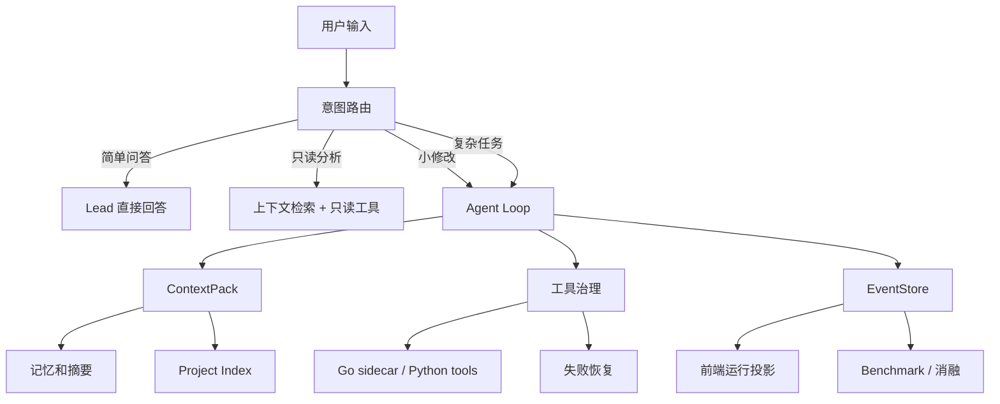

# 模块证据矩阵：从功能讲到源码、事件和验证

这份文档是学习站的“总接线板”。前面的章节会分别解释 Agent Loop、上下文、记忆、工具治理、事件流、Go sidecar、MCP/Skills；但真正面试或维护项目时，问题通常不是按章节来的，而是这样来的：

- 你说这个模块有用，证据是什么？
- 如果线上出现问题，你从哪里开始查？
- 这个功能对应哪些源码，哪些事件，哪些测试？
- 这个设计和成熟 AI 编程工具有什么相似和不同？
- 如果让你继续改，你会改哪里？

所以你可以把这份矩阵当成最后的复习入口。读法很简单：先看模块为什么存在，再看源码入口，再看运行证据，最后练习面试表达。



## 1. 总体证据链

一个成熟的项目讲法不能只说“我做了某某功能”，而要能拿出完整证据链：

```text
需求痛点 -> 设计取舍 -> 核心源码 -> 运行事件 -> 测试验证 -> 已知边界 -> 后续优化
```

以“上下文压缩”为例：

- 需求痛点：长会话会让模型上下文膨胀，盲目塞完整历史会降低稳定性。
- 设计取舍：不用无限追加历史，而是拆成 conversation summary、execution summary、file outline、selected files、recovery context。
- 核心源码：看 context 相关 service、intent route 的 context pack 构造、token usage 统计。
- 运行事件：看 context build、compression、run summary、EventStore 中的相关记录。
- 测试验证：跑长对话、多轮 small edit、benchmark 或消融实验。
- 已知边界：token 估算不是模型官方 tokenizer 级别，压缩质量依赖模型摘要质量。
- 后续优化：加入分层缓存、按文件热度和任务意图重新排序、对摘要做质量评估。

这就是面试里能把项目讲“实”的关键。

## 2. 核心模块矩阵

| 模块 | 它解决什么问题 | 核心源码入口 | 运行证据 | 验证方式 | 面试一句话 |
|---|---|---|---|---|---|
| 意图路由 | 判断任务是闲聊、只读分析、小修改还是复杂开发 | `src/api/services/intent_*`、`src/api/services/runtime_routing_service.py` | intent decision、route、confidence、fallback reason | intent eval、简单问候/只读/小修改/复杂任务对比 | 我没有把所有请求都硬塞进完整多 Agent 流程，而是先做语义路由和 hard guard。 |
| Agent Loop | 让 Lead 持续观察、行动、验证、停止 | `src/api/services/agent_loop_*`、`src/api/services/runtime_executor_service.py` | loop step、phase change、agent activity、finalization | 真实 run、失败恢复、停止条件测试 | 我把它从固定 DAG 收敛成 Lead 驱动的循环，ExecutionPlan 只做边界，不做死图。 |
| 子 Agent 协同 | 对复杂任务做读分析、复核、测试等分工 | `src/api/services/agent_team_*`、`src/api/services/parallel_agent_*` | child agent created、agent proposal、merge evidence | 并行读任务、复杂任务追踪 | 子 Agent 更适合独立读和复核，写路径仍需要收敛到可控边界。 |
| 上下文管理 | 避免完整历史和无关文件污染模型 | `src/api/services/context_*`、Project Index 相关 service | context pack、selected files、token usage | 长对话、文件相关性、上下文预算面板 | 项目真正变聪明的关键不是 Agent 数量，而是给模型喂对信息。 |
| 记忆机制 | 保存偏好、摘要和长期项目事实 | memory 相关 service、workspace settings、EventStore | conversation summary、preference memory、execution summary | 连续会话、多轮偏好验证 | 记忆不是聊天记录堆叠，而是可筛选、可压缩、可撤销的上下文素材。 |
| 工具治理 | 控制读写、命令、审批和风险边界 | `src/api/services/tool_*`、policy/recovery 相关 service | tool call、approval wait、permission level、risk event | 危险命令、越界路径、写文件任务 | 工具权限必须独立于模型判断，否则用户不会信任自动修改代码。 |
| 失败恢复 | 命令失败、读写失败、测试失败后能分类处理 | recovery 相关 service、runtime routing、tool result normalizer | failure classified、retry suggestion、recovery context | 缺依赖、测试失败、写入失败场景 | 失败不是简单重试，而要先分类，再决定交给模型、工具还是用户。 |
| EventStore + SSE | 让后端运行过程可追踪、可恢复、可投影 | `src/api/services/event_store*`、SSE route、run service | session、run、tool evidence、agent activity | 前端实时运行、刷新恢复、历史会话 | EventStore 不是日志文件，而是前端和恢复逻辑都能消费的事实账本。 |
| 前端运行感知 | 告诉用户系统正在做什么，不像卡死 | 主前端视图、event projection service | agent activity、task progress、diff/report drawer | 浏览器真实任务截图 | 用户不只需要结果，也需要知道 Agent 正在读什么、写什么、等什么。 |
| Go sidecar | 把适合高并发和系统边界的能力移到 Go | `go-services/`、Python Go client/adapter | health、connected、benchmark result | Python vs Go benchmark、fallback 测试 | Go 不是为了炫技替换 Python，而是做文件、执行器、MCP gateway 这类边界服务。 |
| MCP/Skills | 把外部能力和项目经验接入 Agent | MCP/Skills service、settings、registry/loader | installed MCP、skill loaded、tool capability | 预设 MCP、Skill 导入、能力注入 | MCP 是工具协议，Skills 是任务经验包，两者都要先进入能力描述再被路由选择。 |
| Benchmark/消融 | 证明组件不是“感觉有用” | `scripts/`、tests、benchmark docs | pass rate、latency、token usage、risk count | baseline vs no-context/no-recovery/no-go | 简历项目最怕空泛，消融实验能说明每个模块为什么值得存在。 |

## 3. 五条主线怎么互相连接



这张图要牢记：系统不是“多个 Agent 随便聊天”，而是一个受控循环。

- 意图路由决定本轮需要多重。
- ContextPack 决定模型看到什么。
- ToolPolicy 决定模型能做什么。
- EventStore 记录模型做过什么。
- Recovery 决定失败后怎么继续。
- Benchmark/消融证明这些设计有没有价值。

如果面试官问“你这个项目和普通 ChatGPT wrapper 有什么不同”，可以顺着这张图答。

## 4. 模块到源码的学习路线

### 4.1 先从一次请求进入

推荐入口：

1. 看 API route：用户消息如何进入后端。
2. 看 runtime executor：如何创建 run、启动任务、写事件。
3. 看 runtime routing：如何决定 direct/read-only/small-edit/full runtime。
4. 看 EventStore：事件如何保存。
5. 看前端投影：事件如何变成聊天框、右侧进度、底栏详情。

学习时不要一上来全局搜索所有 Agent 文件。先沿着一次请求走完，再回头补模块。

### 4.2 再看 Agent Loop

Agent Loop 的关键不是“有几个 Agent”，而是“什么时候继续，什么时候停止”。建议按下面问题读源码：

- loop state 里保存了哪些字段？
- append step 时有哪些状态门禁？
- 什么情况下会拒绝继续写 step？
- finalization 为什么可能 best effort 失败？
- 小修改任务为什么需要检查本轮写入证据？
- 子 Agent 的结果如何进入 Lead 的合并上下文？

你前面遇到过 `未检测到本轮成功写入工具调用，不能完成 small_edit`，这就是典型的状态门禁。它说明系统不允许模型只说“我改好了”，必须有写工具证据。

### 4.3 然后看上下文和记忆

上下文模块建议拆成三层理解：

| 层级 | 关注点 | 学习问题 |
|---|---|---|
| 会话层 | 最近消息、conversation summary | 连续对话如何不丢历史？ |
| 项目层 | Project Index、入口文件、最近修改 | 为什么模型知道应该看哪些文件？ |
| 运行层 | selected files、tool evidence、recovery context | 当前 run 为什么只注入这些信息？ |

真正成熟的 AI 编程工具也不是把整个仓库塞给模型，而是通过索引、搜索、摘要、最近变更、工具结果不断更新上下文。

### 4.4 最后看 Go sidecar 和 MCP/Skills

这两块不要混在一起：

- Go sidecar 是工程边界：更适合文件系统、命令执行、MCP gateway 这类 I/O 密集、长驻、可独立 health check 的服务。
- MCP/Skills 是能力边界：告诉 Agent 可以使用哪些外部工具和经验模板。

面试时可以这样讲：

> Python 负责编排、模型交互和业务状态，Go 负责可独立部署的系统边界服务。MCP/Skills 则是能力扩展层，不直接替代 Agent Loop，而是给 Loop 提供更多可选择工具和任务经验。

## 5. 运行证据应该看什么

一轮真实任务至少要看这些证据：

| 证据 | 说明 | 出问题时怎么用 |
|---|---|---|
| 用户消息 | 原始需求 | 判断是否被误路由 |
| intent decision | 路由类型和置信度 | 看 direct/read-only/small-edit 是否合理 |
| context pack | 注入模型的信息 | 看是否漏文件、塞太多、摘要过旧 |
| plan/tasks | Lead 拆分出的阶段 | 看复杂任务是否过度拆分 |
| agent activity | Agent 正在做什么 | 看前端是否碎片化、后端是否卡住 |
| tool call/result | 实际读写和命令执行 | 看是否有写入证据、失败原因 |
| diff/report | 最终交付 | 看是否真的修改了文件 |
| recovery event | 失败分类和处理 | 看是否盲目重试 |
| token usage | 上下文预算 | 看是否该压缩 |
| benchmark result | 量化对比 | 看模块是否值得存在 |

如果一个模块没有事件证据，就很难证明它真的被系统使用。学习时要有这个意识。

## 6. 面试表达模板

### 6.1 被问“这个项目最核心的难点是什么”

可以回答：

> 我认为最核心的是上下文管理和 Agent Loop 的边界控制。多 Agent 本身不难，难的是让模型在每一轮只看到相关信息、只能调用符合权限的工具、每一步都有事件证据，失败后还能分类恢复。nanoCursor 的设计重点是把用户请求先做意图路由，再构造 ContextPack，Lead 在 Agent Loop 中观察、行动、验证和停止，工具调用、Diff、失败恢复和 token 使用都会写入 EventStore，再由前端实时投影。

### 6.2 被问“你为什么不用 LangGraph”

可以回答：

> 早期用过 LangGraph，但后来我发现固定 DAG 对编程任务不够自然。真实开发更像 Agent Loop：观察当前状态、决定下一步、调用工具、根据结果调整。nanoCursor 仍保留 ExecutionPlan，但它主要是边界和验收标准，不是硬编码执行图。这样可以避免每个任务都被固定阶段拖着走，也能让简单问答直接回答。

### 6.3 被问“Go 在里面是不是为了简历硬加的”

可以回答：

> 这个风险我专门做过取舍。不是所有模块都适合 Go，比如 Agent 编排和模型交互留在 Python 更自然；Go 更适合文件工具、命令执行、MCP gateway 这种系统边界能力。接入时也不是全量替换，而是做智能分流、health check、fallback 和 benchmark。这样 Go 的价值是边界清晰、可独立观测，而不是为了提高代码占比。

### 6.4 被问“你怎么证明不是玩具”

可以回答：

> 我会从四类证据证明。第一是完整链路：前端请求、后端 SSE、EventStore、Agent Loop、工具调用、Diff 和交付报告是闭环的。第二是安全边界：路径越界、工具权限、审批、快照和恢复都有设计。第三是上下文和意图路由：不是所有请求都走重流程，长会话有摘要和 token 预算。第四是工程验证：有真实任务测试、benchmark 和消融实验，能说明组件不是凭感觉堆出来的。

## 7. 自测题

学习完这份矩阵后，建议你闭卷回答下面的问题：

1. 用户问“哈喽”和“帮我改 README”为什么不应该走同一条执行路径？
2. small edit 为什么必须检查写工具证据？
3. Agent Loop 和 DAG 最大区别是什么？
4. 子 Agent 并行读有什么价值，为什么写路径不能随便并行？
5. ContextPack 里哪些内容来自会话，哪些来自项目，哪些来自运行？
6. EventStore 为什么不是普通日志？
7. Go sidecar 哪些场景值得启用，哪些场景不值得？
8. MCP 和 Skills 的边界分别是什么？
9. 如果前端右侧进度出现旧任务，应该查哪些后端字段？
10. 如果模型说“已完成”但 Diff 是空的，系统应该怎么拦截？

如果这些问题能答得出来，并能指出源码和事件证据，你对项目的理解就不是“看过文档”，而是能维护、能解释、能继续演进。

## 8. 关联阅读

- `chapters/00-learning-roadmap.md`：先建立学习路线。
- `chapters/03-agent-loop.md`：深入理解循环和停止条件。
- `chapters/05-context-management.md`：理解上下文选择和压缩。
- `chapters/07-tool-governance.md`：理解工具权限和审批。
- `chapters/10-go-sidecar.md`：理解 Go sidecar 的边界。
- `chapters/11-mcp-and-skills.md`：理解能力扩展层。
- `maps/backend-code-map.md`：按源码定位模块。
- `maps/source-navigation-index.md`：从问题反查源码入口。
- `maps/debugging-playbook.md`：从真实 bug 反查链路。
- `exercises/06-real-run-walkthroughs.md`：用三类真实 run 练习全链路。
