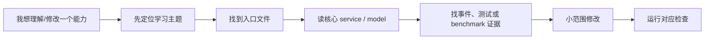
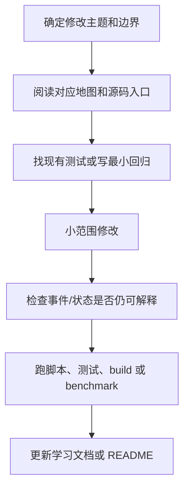

# 源码定位索引：从问题反查代码

最后更新：2026-06-12

这份索引解决一个很实际的问题：学习文档看懂了，但一打开源码还是不知道从哪里下手。它不是完整文件清单，而是一张“问题 -> 入口 -> 核心文件 -> 验证方式”的导航图。

## 0. 如何使用这份索引

不要从 `src/api/services/` 随机扫文件。更稳的方式是先问自己：这个问题属于请求入口、Agent Loop、上下文、工具、事件、Go sidecar、MCP/Skills、前端投影，还是测试评估？确定主题后再沿着入口读。

## 1. 请求入口与会话运行

| 你想理解的问题 | 先看哪里 | 继续看哪里 | 验证方式 |
|---|---|---|---|
| 前端发送一条消息后后端怎么启动 run | `src/api/routes/run_entry.py` | `src/api/services/conversation_run_service.py`、`src/api/services/run_start_service.py` | 创建一次真实会话，看是否产生 `thread_id` 和 `run_started` |
| 为什么同一个会话能连续对话 | `src/api/routes/conversations.py` | `conversation_run_service.py`、会话存储相关 service | 连续发送两条消息，检查 conversation_id 是否一致 |
| run 为什么能绑定工作区 | `src/api/routes/workspaces.py` | `workspace_service.py`、`run_context.py` | 切换 workspace 后创建 run，看 EventStore metadata |
| 为什么刷新后还能恢复状态 | `runs.py` 查询接口 | `event_store.py`、`run_snapshot` / hydrate 相关逻辑 | 刷新前端后检查消息、进度和 artifact 是否恢复 |

阅读顺序：

1. 从路由层看请求模型和返回值。
2. 进入 service 看业务动作。
3. 找 EventStore 写入点。
4. 找前端如何消费这个接口或 SSE 事件。

## 2. 意图路由与执行模式

| 你想理解的问题 | 先看哪里 | 继续看哪里 | 验证方式 |
|---|---|---|---|
| 为什么问候不会进入代码流程 | `src/api/services/intent_router.py` | intent eval 测试、`lead_only_execution_plan` | 发“你好”，应 direct answer，不应创建 Coder |
| 为什么“看看文件夹”是只读 | `intent_router.py` | `routing_decision_service.py`、tool policy alignment | 发只读请求，检查 `requires_workspace_write=false` |
| 为什么小改动要求写文件证据 | `runtime_routing_service.py` | `tool_evidence`、small_edit verification | 小改动任务中断写入时应失败而不是假完成 |
| LLM 语义路由如何不失控 | `intent_router.py` | hard guard、normalizer、fallback decision | 打开 LLM route，跑 intent eval |

学习重点不是“关键词怎么匹配”，而是理解成熟路由一般是组合式的：**deterministic guard 先兜底安全边界，LLM 做语义判断，normalizer 把结果收口成稳定 schema**。

## 3. Agent Loop 与子 Agent

| 你想理解的问题 | 先看哪里 | 继续看哪里 | 验证方式 |
|---|---|---|---|
| Lead Loop 每一步怎么推进 | `src/api/services/agent_loop_state_service.py` | `agent_loop_control_service.py`、`runtime_executor_service.py` | 看 `.nanocursor/runs/<id>/events.jsonl` 的 loop 事件 |
| 为什么不是固定 DAG | `agent_loop_state_service.py` | `runtime_routing_service.py`、`workflow_thread_service.py` | 同时测试问候、只读、代码修改三类请求 |
| 子 Agent 如何创建和归档 | `parallel_agent_service.py` | `agent_orchestration_service.py`、`temporary_agent` 相关 service | 复杂任务中观察 child agent 事件 |
| 子 Agent 证据如何合并回 Lead | `parallel_agent_service.py` | `EvidencePack`、`merge_agent_result` 相关逻辑 | 查看 `agent_proposals` / `agent_merge` 事件 |
| 为什么并行主要用于读 | `parallel_agent_service.py` | tool policy、merge strategy | 并行任务应产出 evidence，而不是直接并发写文件 |

面试时可以这样讲：nanoCursor 当前不是“所有 Agent 独立自治然后互相聊天”，而是 Lead 负责主循环，临时子 Agent 负责收集证据或执行有限子任务，结果通过 evidence merge 回到 Lead。这个设计牺牲了一些自治性，但换来更可控的状态和更低的写冲突风险。

## 4. 上下文、记忆与压缩

| 你想理解的问题 | 先看哪里 | 继续看哪里 | 验证方式 |
|---|---|---|---|
| ContextPack 怎么构造 | `src/agent/context_pack.py` | `context_service.py`、`context_budget_service.py` | 打印或查看 context section 事件 |
| 项目索引如何选文件 | `project_index_service.py` | file outline、recent changes、selected files | 对比 selected files 与最终修改文件 |
| 上下文窗口怎么估算 | `context_window_service.py` | `context_ledger_service.py` | 查看右侧栏 token 面板或 context ledger 接口 |
| 什么时候触发压缩 | `context_compaction_service.py` | summary / deterministic fallback | 构造长会话，观察压缩事件 |
| 记忆如何注入 | `memory_service.py` | `failure_learning_service.py`、MemoryRecord schema | 新建偏好或失败记忆，再跑后续任务 |

这里最重要的一句话是：**上下文管理不是拼 prompt，而是把信息变成可选择、可预算、可压缩、可解释的结构化输入。**

## 5. 工具治理、失败恢复与执行边界

| 你想理解的问题 | 先看哪里 | 继续看哪里 | 验证方式 |
|---|---|---|---|
| 文件读写为什么要分级 | `src/runtime/tool_policy_runtime.py` | `action_policy_service.py`、`file_ops.py` | 尝试路径越界或敏感文件写入 |
| shell 命令如何判定风险 | `shell_policy_service.py` | `command_runner.py`、Go executor client | 测试 `pytest`、`rm -rf`、安装依赖 |
| 审批如何进入流程 | `approvals.py` | approval store、SSE approval event | 触发 risky shell，看前端是否等待审批 |
| 失败怎么分类 | `failure_recovery_loop_service.py` | recovery plan / failure classifier | 构造缺依赖、断言失败、语法错误 |
| 失败恢复会不会绕过策略 | `failure_recovery_loop_service.py` | tool policy runtime | 缺依赖安装应进入审批或受限策略 |

这条线要特别注意边界：恢复模块可以建议怎么修，但不能因为“系统在自救”就绕过工具权限。所有真实副作用仍然要经过统一策略层。

## 6. EventStore、SSE 与前端运行感知

| 你想理解的问题 | 先看哪里 | 继续看哪里 | 验证方式 |
|---|---|---|---|
| 运行过程为什么可复盘 | `src/api/services/event_store.py` | `.nanocursor/runs/<id>/events.jsonl` | 打开真实 run 的 events.jsonl |
| 前端为什么能实时更新 | `sse_broker.py` | `runs.py` SSE route、前端 event store | 浏览器 Network 看 event-stream |
| 任务卡、Agent 动态从哪里来 | 事件类型定义 | 前端 projection/store | 对比 event_map 和 UI 状态 |
| 断线后如何恢复 | run snapshot / hydrate API | 前端 hydrateAfterDone | 刷新页面后看状态是否回填 |

学习这条线时不要只看前端。要同时看三层：后端写了什么事件、SSE 推了什么事件、前端把事件投影成什么 UI 状态。

## 7. Go Sidecar 与 MCP/Skills

| 你想理解的问题 | 先看哪里 | 继续看哪里 | 验证方式 |
|---|---|---|---|
| Go filetools 是否接入 | `go-services/filetools` | Python client / feature flag | 跑 filetools contract test |
| Go executor 为什么不是全量替换 | `go-services/executor` | command runner 分流策略 | 对比 shell safe/risky 的分流结果 |
| Go indexer 适合做什么 | `go-services/indexer` | project index service fallback | 跑索引 benchmark |
| MCP gateway 负责什么 | `go-services/mcp-gateway` | MCP Python route/client | 调用 MCP server 列表和工具探测 |
| Skills 如何影响路由 | `skill_registry_service.py` | `routing_decision_service.py` | 导入 Skill 后看 routing decision |

这里的核心取舍是：Go 做确定性系统边界，Python 做 Agent 决策、上下文、策略和事件归一化。Go 不应该变成第二套业务策略中心。

## 8. 测试、Benchmark 与消融实验

| 你想理解的问题 | 先看哪里 | 继续看哪里 | 验证方式 |
|---|---|---|---|
| 常规测试怎么跑 | `scripts/check_all.py` | `tests/` | 运行全量检查 |
| 真实任务 benchmark 验证什么 | `benchmark_service.py` | benchmark routes/tests | 跑 real-task benchmark |
| 消融实验如何证明组件价值 | `ablation_benchmark_service.py` | benchmark result schema | 对比 baseline 与 disabled |
| 上下文压缩怎么评估 | context window benchmark | ContextLedger / compaction events | 看 token 降幅和 P0 保留 |
| Python/Go 行为一致性怎么测 | `tests/contracts/` | Go service test | 跑 contract test |

如果面试官问“这些模块是不是堆出来的”，不要只回答“我觉得有用”。要回答你如何用 benchmark、消融和 contract test 提供证据。

## 9. 修改功能时的最小安全流程

实践要求：

1. 改后端入口前，先确认路由层是否仍然薄。
2. 改 Agent Loop 前，先确认 LoopState 是否还能复盘。
3. 改上下文前，先确认 P0 锚点不会被裁掉。
4. 改工具执行前，先确认 approval 和 policy 没被绕过。
5. 改 Go sidecar 前，先确认 Python fallback 仍然可用。
6. 改前端状态前，先确认 EventStore 事件语义没有被前端私自重解释。

## 10. 自测问题

学完这份索引后，你应该能回答：

1. 从前端发送消息到后台 Agent Loop 启动，中间经过哪些 service？
2. `route` 和 `execution_route` 有什么区别？
3. 子 Agent 的 evidence 为什么不能直接等同于最终结果？
4. ContextPack 里哪些 section 是 P0，为什么？
5. 失败恢复为什么不能绕过工具策略？
6. Go sidecar 哪些场景适合、哪些场景不适合？
7. 如果一个任务前端显示“完成”但没有文件变更，你会先看哪三个地方？
8. 如果一个组件消融后没降分，你会如何解释？
