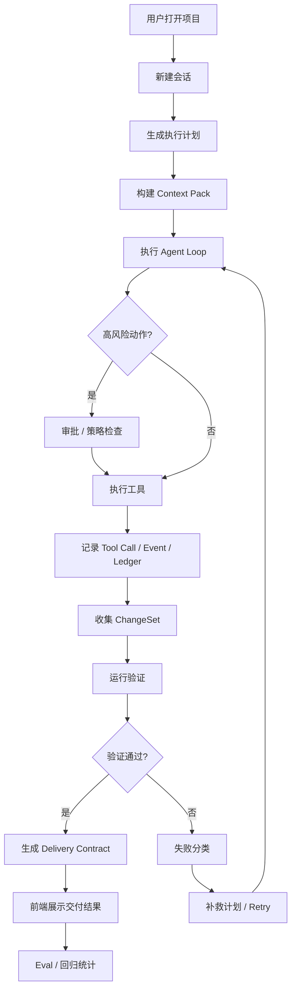

# nanoCursor

> 面向个人开发者和小团队的多 Agent 软件交付工作台。

nanoCursor 不是聊天式代码生成器。它把软件开发拆成"项目理解 → 智能组队 → 执行蓝图 → 协作实现 → 验证复核 → 风险恢复 → 交付复盘"的完整流程，每一步都有状态、证据和可回溯记录。

## 当前状态

```text
pytest -q          → 561 passed
python scripts/backend_audit.py  → 144 routes, 0 duplicates, 0 bare dict
cd frontend && npm run check     → passed
```

项目处于主动开发阶段，已完成 R0-R8 全部 9 个阶段的改进。

## 快速开始

### 1. 环境检查

```bash
python scripts/doctor.py
```

检查 Python、Node、npm、依赖、.env、LLM 配置、Git、端口、Playwright、MCP 等。

### 2. 安装依赖

```bash
# Python (建议 3.10+)
pip install -r requirements.txt

# 前端
cd frontend && npm install
```

### 3. 配置 LLM

```bash
cp .env.example .env
```

在 `.env` 中配置任一 LLM 提供商（系统自动检测已配置的 API key）：

| 提供商 | 环境变量 |
|--------|---------|
| Anthropic | `ANTHROPIC_API_KEY` |
| DeepSeek | `DEEPSEEK_API_KEY` |
| MiniMax | `MINIMAX_API_KEY` |
| OpenAI | `OPENAI_API_KEY` |
| Ollama | `OLLAMA_BASE_URL` |

### 4. 启动

**一键启动 (前后端同时)**:

```bash
python scripts/dev.py
```

**分别启动**:

```bash
# 后端 http://127.0.0.1:8100
python scripts/dev_backend.py

# 前端 http://127.0.0.1:5173 (另开终端)
python scripts/dev_frontend.py
```

打开 http://127.0.0.1:5173

### 5. CLI 模式

```bash
python cli.py
python cli.py "帮我检查这个项目还有哪些可以改进"
```

## 一键检查

```bash
python scripts/check_all.py
```

运行: Python 编译 → pytest(561) → 后端审计 → 前端语法检查

## 核心亮点

- **多 Agent 协作**: 根据需求自动推荐 Lead、Planner、Coder、Tester、Reviewer、Designer、DevOps
- **可编辑执行蓝图**: 运行前生成任务阶段、负责人、能力包和验收标准，用户确认后执行
- **项目级工作台**: 打开目录后展示项目索引、最近会话、最近 runs、Skills、MCP、恢复点
- **运行生命周期**: 每个 run 11 个状态 (CREATED→PLANNING→WAITING_APPROVAL→RUNNING→VALIDATING→COMPLETED/FAILED/CANCELLED/INTERRUPTED→RECOVERING)
- **交付可信**: DeliveryContract(J)、Quality Gate、Score、Traceability、ChangeSet、Artifact Center
- **变更驱动**: Diff 作为一等对象，风险分级 (low/medium/high)，规则引擎自动评估
- **失败恢复**: 10 种 FailureClass，自动分类 + 补救计划 + remediation run
- **安全管线**: 7 种 ActionKind，统一 check→approve→audit 管线
- **评测驱动**: 10+ eval fixture，6 类任务 (bug_fix/small_feature/frontend_polish/docs_update/refactor_safe/config_mcp_skill)

## 架构



## 项目数据结构

```text
<workspace>/.nanocursor/
  runs/{thread_id}/
    session.json              # 运行会话
    events.jsonl              # 事件流
    tools.jsonl               # 工具调用台账 (R3)
    steps.json                # 步骤记录 (R3)
    approvals/                # 审批记录
    changes.json              # 变更集 (R2)
    delivery.json             # 交付契约 (R1)
    delivery.md               # 人类可读交付报告 (R1)
    failures.json             # 失败记录 (R4)
    audit.jsonl               # 审计跟踪 (R5)
  conversations/{id}/
  skills/{name}/
  evals/
  checkpoints/
.tasks/
.team/
.backups/
.snapshots/
.memory/
```

## 主要 API (144 routes)

### R0 核心

| 接口 | 说明 |
|------|------|
| `GET /health`, `/ready`, `/version` | 健康检查、就绪、版本 |
| `POST /api/run` | 启动工作流 |
| `GET /api/runs/{id}/events` | SSE 实时事件流 |
| `POST /api/runs/{id}/cancel` | 取消运行 |

### R1-R3 交付/变更/台账

| 接口 | 说明 |
|------|------|
| `GET /api/runs/{id}/delivery` | 交付契约 |
| `GET /api/runs/{id}/changes` | 变更集 (含风险分级) |
| `GET /api/runs/{id}/ledger` | 统一运行台账 |
| `GET /api/runs/{id}/steps` | 步骤记录 |
| `GET /api/runs/{id}/tools` | 工具调用记录 |

### R4-R5 失败/安全

| 接口 | 说明 |
|------|------|
| `GET /api/runs/{id}/failures` | 失败分类记录 |
| `POST /api/runs/{id}/failures/{fid}/remediate` | 创建补救运行 |
| `POST /api/runs/{id}/actions/check` | 动作预检查 |
| `GET /api/runs/{id}/audit` | 审计跟踪 |

### R6 评测

| 接口 | 说明 |
|------|------|
| `GET /api/evals` | 评测任务列表 (10+) |
| `POST /api/evals/suite/run` | 运行评测套件 |
| `GET /api/evals/summary` | 评测汇总 |
| `GET /api/evals/runs/{id}/artifacts` | 评测交付物 |

### 其他

完整 API 契约见 [docs/api-contract.md](docs/api-contract.md)

## 项目结构

```text
nanoCursor/
  api_server.py                  # FastAPI 后端入口
  cli.py                         # CLI 入口
  requirements.txt
  pyproject.toml
  frontend/
    src/main.js                  # Web 工作台 (vanilla JS SPA)
    src/styles.css               # CSS Grid 5 区布局
    tests/e2e/smoke.spec.ts      # Playwright E2E 测试 (12)
  src/
    agent/                       # Agent loop、prompt、状态、strategy
    api/
      app.py                     # FastAPI 工厂
      errors.py                  # 统一错误模型 (12 错误码)
      models.py                  # Pydantic 模型 (60+)
      routes/                    # 模块化路由 (evals, runs, system, workspaces)
      services/                  # 业务服务层 (40+ 服务)
    cli/                         # REPL 和斜杠命令
    indexer/                     # 项目索引
    infra/                       # 配置、日志、path guard、hooks
    memory/                      # 长期记忆和上下文压缩
    runtime/                     # 运行时: 状态机、事件、台账、变更集、交付、策略、审计
    tasks/                       # 任务系统
    team/                        # 多 Agent 团队协作
    tools/                       # 文件、bash、git、memory、project、todo 工具
  tests/                         # pytest 测试 (561)
  evals/                         # 评测任务和 fixture (10+)
    tasks/                       # 评测任务定义 JSON
    fixtures/                    # 评测 fixture 代码
  scripts/                       # 开发脚本
    doctor.py                    # 环境检查
    dev.py                       # 一键启动前后端
    dev_backend.py               # 启动后端
    dev_frontend.py              # 启动前端
    check_all.py                 # 全量检查
    backend_audit.py             # 后端审计
  docs/                          # 文档
    api-contract.md              # API 契约 (144 routes)
    event-contract.md            # 事件契约 (27 types)
    run-state-contract.md        # 状态机契约 (11 states)
```

## 开发命令

```bash
# 后端
pytest -q                       # 全部测试 (561)
pytest tests/test_delivery_contract.py  # 单个测试文件
python scripts/backend_audit.py # 路由审计
ruff check .                    # Lint

# 前端
cd frontend && npm run check    # 语法检查
npx playwright test             # E2E 测试

# 全量
python scripts/check_all.py     # compile + pytest + audit + frontend
python scripts/doctor.py        # 环境诊断
```

## 当前限制

- **无用户认证**: 单机单用户，不适合多用户部署
- **无云端部署**: 仅本地运行，无 Docker 镜像或云托管配置
- **MCP Phase 1**: 配置扫描和展示，尚未实现完整 MCP 协议客户端
- **Eval 模拟模式**: 部分 eval 使用模拟事件，暂未接入真实 agent_loop
- **前端零框架**: vanilla JS DOM 操作，不适用于大规模 UI 迭代
- **Windows 路径**: 基本兼容但未完整测试所有路径场景
- **大文件性能**: 超大 diff（>5000行）可能导致前端渲染缓慢

## 文档

- [API 契约](docs/api-contract.md) — 144 routes 完整清单
- [事件契约](docs/event-contract.md) — 27 种事件类型
- [状态机契约](docs/run-state-contract.md) — 11 个状态 + 转移图
- [后端改进实施记录](docs/nanoCursor后端产品级改进-全部9阶段实施记录.md)
- [后端改进实施指南](docs/nanoCursor后端产品级改进实施指南.md)
- [真实可用工具化开发实施指南](docs/nanoCursor真实可用工具化开发实施指南.md)

## License

MIT · [LiHua](https://github.com/MagicalLiHua)
