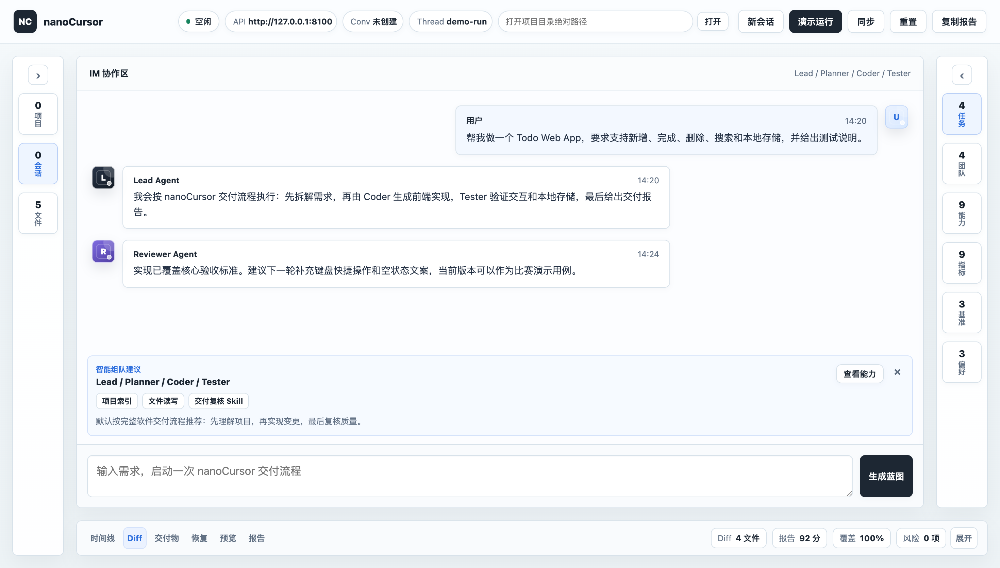

# nanoCursor

> 一个面向个人开发者和小团队的多 Agent 软件交付工作台。

nanoCursor 不是普通的聊天式代码生成器。它把一次软件开发任务拆成”项目理解、智能组队、执行蓝图、协作实现、验证复核、风险恢复、交付复盘”的完整流程，让 Agent 的每一步都有状态、证据和可回溯记录。



## 核心亮点

- **多 Agent 协作**：根据用户需求自动推荐 Lead、Planner、Coder、Tester、Reviewer、Designer、DevOps 等角色。
- **可编辑执行蓝图**：运行前生成任务阶段、负责人、能力包和验收标准，用户批准后再执行。
- **项目级工作台**：打开目录后展示项目索引、最近会话、最近 runs、Skills、MCP 状态和恢复点。
- **真实运行生命周期**：每个 run 都有阶段状态、开始/完成时间、失败原因和工具证据。
- **交付可信度**：内置 Quality Gate、Delivery Score、Requirement Traceability、Artifact Center、Diff 和报告。
- **安全恢复中心**：汇总错误事件、失败阶段、备份、快照和恢复建议。
- **MCP / Skills 方向**：支持扫描 MCP 配置和工作区自定义 Skill，后续会继续增强配置、验证和使用证据。

## 当前状态

```text
pytest -q
115 passed

cd frontend
npm run check
passed
```

项目仍处于主动开发阶段，适合作为软件挑战赛 / Agent 平台方向的展示项目。核心工作流已经可演示，MCP / Skill 配置流、恢复动作和比赛材料还在继续打磨。

## 快速开始

### 1. 克隆项目

```bash
git clone https://github.com/<your-name>/nanoCursor.git
cd nanoCursor
```

### 2. 创建 Python 环境

建议使用 Python 3.10+。

```bash
python -m venv .venv
source .venv/bin/activate
pip install -r requirements.txt
```

Windows PowerShell：

```powershell
python -m venv .venv
.venv\Scripts\Activate.ps1
pip install -r requirements.txt
```

### 3. 配置 LLM

复制环境变量模板：

```bash
cp .env.example .env
```

在 `.env` 中配置任一提供商：

```bash
# 自动检测优先级：Anthropic > DeepSeek > MiniMax > OpenAI > Ollama
ANTHROPIC_API_KEY=sk-ant-...
DEEPSEEK_API_KEY=sk-...
MINIMAX_API_KEY=...
OPENAI_API_KEY=sk-...
OLLAMA_BASE_URL=http://localhost:11434
```

也可以显式指定：

```bash
LLM_PROVIDER=deepseek
LLM_MAX_TOKENS=8192
LLM_TEMPERATURE=0.2
```

`.env` 包含密钥，不要提交到 GitHub。

## 启动 Web 工作台

启动后端：

```bash
python -m uvicorn api_server:app --host 127.0.0.1 --port 8100
```

另开一个终端启动前端：

```bash
cd frontend
npm run dev
```

打开：

```text
http://127.0.0.1:5173
```

前端默认连接：

```text
http://127.0.0.1:8100
```

如果需要切换后端地址，可以在浏览器控制台设置：

```js
localStorage.setItem("agenthub_api_base", "http://127.0.0.1:8100")
```

## 使用 CLI

nanoCursor 仍然支持终端交互式编程助手。

```bash
python cli.py
python cli.py "帮我检查这个项目还有哪些可以改进"
```

常用命令：

| 命令 | 说明 |
| --- | --- |
| `/help` | 查看所有命令 |
| `/files` 或 `/ls` | 列出工作区文件 |
| `/cat <path>` | 查看文件 |
| `/config` | 查看 LLM 配置 |
| `/metrics` | 查看 token 和工具调用统计 |
| `/workspace` 或 `/pwd` | 查看当前工作区 |
| `/team list` | 查看团队成员 |
| `/memory list` | 查看长期记忆 |
| `/task list` | 查看任务 |

## Web 工作台功能

### 项目入口

- 当前项目路径
- 项目索引摘要
- 最近会话
- 最近运行
- Skills / MCP 接入状态
- 恢复点和风险摘要

### 会话与运行

- 新建会话
- 每条用户请求启动隔离 run
- 会话团队快照
- SSE 实时事件流
- run session 和 events 持久化到 `.nanocursor/runs`

### 智能组队与编排

- 根据需求推荐 Agent 群组
- 支持用户增删团队成员
- 生成可审批执行蓝图
- 将阶段、负责人、能力包注入 runtime prompt
- 工具调用自动关联阶段和 capability trace

### 交付复盘

- Diff
- Delivery Report
- Quality Gate
- Delivery Score
- Requirement Traceability
- Artifact Center
- Recovery Center

## 主要 API

| 接口 | 说明 |
| --- | --- |
| `GET /api/workspace/overview` | 项目级概览 |
| `POST /api/conversations` | 创建会话 |
| `GET /api/conversations` | 会话列表 |
| `PUT /api/conversations/{conversation_id}/team` | 更新会话团队 |
| `POST /api/conversations/{conversation_id}/runs` | 启动会话 run |
| `GET /api/runs` | 历史运行列表 |
| `GET /api/runs/{thread_id}` | 运行详情 |
| `GET /api/runs/{thread_id}/events` | SSE 实时事件 |
| `GET /api/runs/{thread_id}/events/history` | 历史事件 |
| `POST /api/runs/{thread_id}/approval` | 审批执行蓝图 |
| `GET /api/runs/{thread_id}/diff` | 文件变更 |
| `GET /api/runs/{thread_id}/report` | 交付报告 |
| `GET /api/runs/{thread_id}/quality` | 质量门禁 |
| `GET /api/runs/{thread_id}/score` | 交付评分 |
| `GET /api/runs/{thread_id}/traceability` | 需求追踪 |
| `GET /api/runs/{thread_id}/artifacts` | 交付物中心 |
| `GET /api/runs/{thread_id}/recovery` | 恢复中心 |
| `GET /api/capabilities` | 能力中心 |
| `POST /api/capabilities/recommend` | 推荐能力包 |
| `POST /api/capabilities/skills` | 导入自定义 Skill |
| `POST /api/runs/blueprint` | 生成执行蓝图 |
| `GET /api/preferences/profile` | 偏好档案 |
| `GET /api/benchmarks` | 固定 benchmark 任务 |
| `POST /api/benchmarks/run` | 启动 benchmark |

## 项目数据结构

nanoCursor 会把项目级数据写入当前 workspace：

```text
workspace/
  .nanocursor/
    runs/{thread_id}/
      session.json
      events.jsonl
      report.md
      requirements.json
    conversations/{conversation_id}/
      conversation.json
      team.json
    skills/{skill_name}/
      SKILL.md
    project_index.json
  .tasks/
  .team/
  .backups/
  .snapshots/
  .memory/
```

## 项目结构

```text
nanoCursor/
  api_server.py                  # FastAPI 后端
  cli.py                         # CLI 入口
  run.py                         # 兼容入口
  requirements.txt
  pyproject.toml
  frontend/
    package.json
    scripts/serve.mjs            # 零依赖前端静态服务
    src/main.js                  # nanoCursor Web 工作台
    src/styles.css
  src/
    agent/                       # Agent loop、prompt、状态、学习器
    api/
      models.py                  # API Pydantic 模型
      services/                  # nanoCursor 业务服务层
    cli/                         # REPL 和斜杠命令
    indexer/                     # 项目索引
    infra/                       # 配置、LLM、metrics、权限、数据库等
    memory/                      # 长期记忆和上下文压缩
    tasks/                       # 任务系统
    team/                        # 多 Agent 团队协作
    tools/                       # 文件、bash、git、memory、project、todo 工具
  tests/                         # pytest 测试
  docs/
    AgentHub项目总览与路线.md
    AgentHub后续功能开发指南.md
```

## 配置 MCP

nanoCursor 会扫描以下文件：

```text
.mcp.json
.cursor/mcp.json
.nanocursor/mcp.json
```

示例：

```json
{
  "mcpServers": {
    "github": {
      "command": "npx",
      "args": ["-y", "@modelcontextprotocol/server-github"],
      "env": {
        "GITHUB_TOKEN": "${GITHUB_TOKEN}"
      }
    }
  }
}
```

当前版本会读取和展示 MCP 配置状态；后续会继续补充配置验证、使用证据和真实连接流。

## 自定义 Skill

工作区 Skill 存放在：

```text
.nanocursor/skills/{skill_name}/SKILL.md
```

也可以通过 Web 工作台导入 Skill。Skill 会作为能力上下文进入 nanoCursor 的团队推荐和 runtime prompt。

## 开发与测试

后端测试：

```bash
pytest -q
```

前端语法检查：

```bash
cd frontend
npm run check
```

推荐在提交前至少运行：

```bash
pytest -q
cd frontend && npm run check
```

## 文档

- [nanoCursor 项目总览与路线](docs/AgentHub项目总览与路线.md)
- [nanoCursor 后续功能开发指南](docs/AgentHub后续功能开发指南.md)

## 后续计划

近期重点：

1. MCP 配置详情和静态验证。
2. Skill 详情、预览、编辑。
3. 每次 run 的 capability 使用证据。
4. 恢复建议变成可点击操作。
5. 演示脚本、报名文案、答辩问答。

暂缓事项：

- 登录系统
- 多用户权限
- 云端部署
- 完整插件市场
- 大规模前端框架迁移

## License

MIT · [LiHua](https://github.com/MagicalLiHua)
